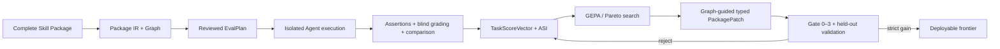

# GEPASE

**Graph-Enhanced Package-Aware Skill Evolution**

[English](README.md) · [简体中文](README_zh.md) · [Latest narrative report](artifacts/runs/f4e-slack-gif-creator-relative-efficiency-v2-report/index.html)

GEPASE is an independent Python Core, CLI, and API for evaluating and evolving complete Agent
Skill packages—not only `SKILL.md`. It treats instructions, references, scripts, assets, metadata,
and their dependency graph as external trainable state while keeping model weights frozen.

Its loop combines real Agent execution, independent grading, GEPA-style reflective/Pareto search,
graph-guided typed `PackagePatch` edits, same-package multi-parent merge, and a strict held-out
Validation Gate. Codex, Claude Code, or another Agent host performs isolated role execution; the
Core remains the source of truth for evidence, candidates, search state, and acceptance.

> **Evidence boundary.** Current effect evidence still covers one pinned public
> `slack-gif-creator`, one Frozen EvalPlan, one Agent host/model configuration, and one bounded
> search. It is not a cross-Skill, cross-model, multi-seed, or generalization claim.


## What is actually validated?

GEPASE deliberately separates three different claims:

| Claim level | Current evidence |
|---|---|
| **Code implemented** | Package IR/Graph, E0/E2/E3 Eval Core, reviewed EvalPlan, typed evidence, six-dimensional scores, the GEPA adapter/per-key Pareto selector, structured Patch, Gate 0–3, lineage/merge, stores, report and deploy CLI are present in one Python package. |
| **Engineering mechanism tested** | Unit, integration, fault, contract, schema, artifact-hash, resume/cache, role-isolation, merge-conflict, secret and release checks cover the Core. R5 independently verifies the sealed upstream runs. |
| **Algorithm effect observed** | Relative-efficiency v2 yields `strict_improvement` and deployable frontier=`2`: rank 1 held-out validation `+0.09920`, relative cost `1.83254`; rank 2 `+0.07906`, relative cost `1.93702`. |

The completed search materialized two generation-1 candidates, two parent-bound generation-2
candidates, and one conditional same-package Merge candidate through the same Controller,
Candidate, Patch, Gate, and Pareto mainline. Two candidates entered the deployable frontier.
Static+observed graph guidance, typed role failures, 0/1/many frontier outcomes, and conditional
same-package Merge are exercised; however, effective edits in this run still concentrate in
`SKILL.md`, so it does not demonstrate successful cross-file optimization.

### One held-out case, real task-native outputs

| no-skill | original Skill | v2 rank 1 | v2 rank 2 |
|---|---|---|---|
|  |  |  |  |

The [latest self-contained Chinese narrative report](artifacts/runs/f4e-slack-gif-creator-relative-efficiency-v2-report/index.html)
organizes no-skill/original/candidate GIFs by task and shows lineage, six-dimensional scores,
quality-cost trade-offs, failure-to-graph-to-Patch-to-Gate traces, Merge, runtime, provenance, and
both deployable archives.

### Independent graph-hardening reproduction

GH-E1 on `codex/graph-hardening` restarted from a fresh no-skill/original reference while retaining
the same pinned Package and frozen EvalPlan. One graph-guided candidate reached train `+0.07083`
with `5/5` wins, but was rejected because held-out `quality_efficiency=-0.15972` crossed the
`-0.05` category floor. The second candidate regressed at train (`-0.16221`). The final frontier
is empty and the outcome is `no_strict_improvement`. This demonstrates honest negative-result
closure, not superiority of graph guidance over another search strategy.

The realized GH-E1 search depth was two seed-rooted generation-1 candidates. Reflection preserved
task-level feedback but created no generation-2 child, and rejected-branch recovery created another
seed-rooted generation-1 branch. GH-E1 therefore demonstrates one bounded GEPA-style
reflection/Pareto mainline run, not realized multi-generation evolution. A future second-generation
contract should remain bounded to two initial branches, at most two refinement/recovery children,
and at most one conditional merge child under `max_candidates=5`.

The [GH-E1 self-contained Chinese report](artifacts/runs/gh-e1-slack-gif-creator-report/final/index.html)
contains 29 hash-verified task-native GIFs, the Package Graph, both patches, lineage, reflections,
conditional merge, six-dimensional scores, and authoritative ActiveSession/HostAttempt usage.

The public Git surface intentionally contains that self-contained report, the safety-reviewed
GH-E0.5/GH-E1/post-GH-E1 stage evidence, frozen configs, Core, and tests. The byte-preserved GH-E1
reference/evolution runs remain local sealed research evidence because they include raw Agent
workspaces and machine-local diagnostics. A clean clone verifies the published report and stage
seals; it does not claim to contain or replay the unpublished raw evolution seal.

## How it works



The active selector graph is strictly a static+observed view supporting failure localization,
mutation scope, blast radius, dependency closure, and merge conflict checks. The sealed GH-P1
semantic-hypothesis experiment remains stalled historical evidence and is no longer generated or
consumed by the active runtime. The mainline supports parent-bound generation-2,
Grader/Comparator/Analyzer typed failures, 0/1/many deployable outcomes, and conditional
same-package Merge; cross-package merge is a hard error. Agent-facing Skills are thin adapters and
never own the candidate pool, scoring policy, or Gate decision.

## Quick start

Requirements: Python 3.11+ and [`uv`](https://docs.astral.sh/uv/).

```bash
uv sync --all-extras --frozen
uv run gepase --version
uv run gepase doctor --format json
```

Run the deterministic offline smoke test—no Agent or API call:

```bash
uv run gepase mock run \
  --config configs/examples/mock.yaml \
  --output artifacts/local/mock-run \
  --format json
uv run gepase artifact verify artifacts/local/mock-run --format json
```

A clean clone can verify the latest published narrative report without the local raw Agent
workspace:

```bash
uv run gepase artifact verify \
  artifacts/runs/f4e-slack-gif-creator-relative-efficiency-v2-report \
  --format json
```

Verify the sealed result and materialize its deployable Package without rerunning R3/R4:

```bash
uv run gepase report verify \
  --config configs/canaries/slack-gif-creator-r5.json \
  --report-dir artifacts/runs/r5-slack-gif-creator-report \
  --format json
uv run gepase report deploy \
  --config configs/canaries/slack-gif-creator-r5.json \
  --report-dir artifacts/runs/r5-slack-gif-creator-report \
  --output artifacts/local/deployed-slack-gif-creator \
  --format json
```

See [Reproduction and release evidence](docs/reproduction.md) for artifact verification, report
rebuild, Eval review, Agent-native execution, resume, optional role-scoped Headless configuration,
and deployment.

## Evaluation contract

Trigger Eval is kept separate from functional quality. Functional cases run `no-skill` and
`original` in isolated contexts; candidate runs may reuse the sealed reference only when the full
EvalPlan, scoring policy, model/host, environment, seed, tool policy, and artifact hashes match.

| Tier | Meaning | Acceptance role |
|---|---|---|
| E0 | Static structure, syntax, reference and safety checks | Preflight only |
| E1 | Optional plan simulation without tool execution | Disabled by default; never sufficient for acceptance |
| E2 | Real Agent execution with task-native output, transcript, observed trace and usage | Required functional evidence |
| E3 | Deterministic assertions over the E2 output | High-confidence evidence channel, not an overall Skill score |

The `TaskScoreVector` keeps `task_correctness`, `output_quality`, `skill_gain`, `reliability`,
`efficiency`, and `package_quality` separate. A deterministic assertion rate of 1.0 is never
presented as overall Skill quality. New `2.0.0` evolution configs default to `relative_v2`, which
compares held-out duration, tool calls, and compatible token telemetry against the original Skill
while keeping artifact size separate; `v1_legacy` remains an explicit option. New `2.0.0` report
configs default to `narrative_v1`, while `classic` remains explicit. Historical `1.0.0` configs
missing these fields retain v1/classic semantics and their prior fingerprints.

## Agent-native and optional Headless roles

Agent-native is the default and does not require an additional API key. The repo-scoped
`.agents/skills/gepase-orchestrator/` adapter dispatches Eval Designer, Executor, Grader,
Comparator, Analyzer, Reflection, and Patch proposal work in isolated contexts.

`configs/examples/headless-roles.yaml` and `schemas/project_config.schema.json` define optional
per-role provider routing. v0.1 validates this provider-neutral interface but does not ship a
second built-in API runtime; a host adapter must implement the same typed work/submission protocol.

```bash
uv run gepase config validate configs/examples/headless-roles.yaml --format json
```

## Repository map

```text
src/gepase/        Python Core, CLI and public API
  package/         Package snapshot, IR, Graph, slices and diffs
  evals/           EvalPlan, role work, evidence, scoring and statistics
  optimizer/       Candidate, GEPA adapter, search, Gate and merge
  mutation/        Typed PackagePatch, validation, apply and rollback
  store/           Artifact, candidate, checkpoint, pool and rejection stores
  reporting/       Read-only sealed-evidence reports
.agents/skills/    Thin Agent-host orchestration adapter
benchmarks/        Public integration fixtures and pinned canary
schemas/           Generated public exchange schemas
artifacts/runs/    Curated R2–R5 evidence and the self-contained GH-E1 report
artifacts/stages/  Public safety-reviewed Stage Gates and completion evidence
tests/             Unit, integration, contract, fault and release tests
```

`skills_test/`, `.env`, `artifacts/local/`, generated `results/`, and the raw GH-E1
reference/evolution runs are ignored. Private Skills, credentials, raw Agent workspaces,
production traces, and local absolute paths must never enter public artifacts.

## Documentation

- [Reproduction guide](docs/reproduction.md)
- [Multi-fidelity evaluation](docs/evaluation.md)
- [Agent-native orchestration](docs/orchestrator.md)
- [Configuration](docs/configuration.md)
- [Artifact contract](docs/artifacts.md)
- [Benchmark v1 scope](docs/benchmark.md)
- [Project state and decision log](state.md)
- [Algorithm learning guide](learning.html)
- [Contributing](CONTRIBUTING.md) · [Security](SECURITY.md)

## Method lineage

GEPASE uses the locally pinned `gepa==0.1.4` implementation as its reflective search skeleton. Its
evaluation design is informed by Anthropic's skill-creator; bounded edits and validation discipline
by SkillOpt; iterative execution history by Darwin-skill; and the frozen-model/external-policy view
by Heuristic Learning. GEPASE's extension is to make the complete Skill Package and its dependency
graph the candidate state, then connect that state to typed evidence, patches, merge, and held-out
Gates. See [learning.html](learning.html) for sources and the exact reuse/extension boundary.

The canary Package is pinned from [`anthropics/skills`](https://github.com/anthropics/skills) at
commit `fa0fa64bdc967915dc8399e803be67759e1e62b8`; its Apache-2.0 attribution and exact tree/blob
hashes are included in `benchmarks/canaries/slack-gif-creator/`.

## License

GEPASE is licensed under [Apache-2.0](LICENSE). Vendored or pinned public fixtures retain their own
license and provenance files.
