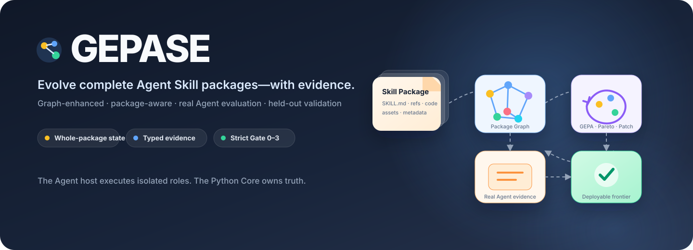
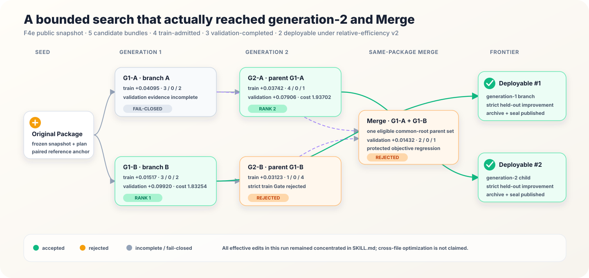
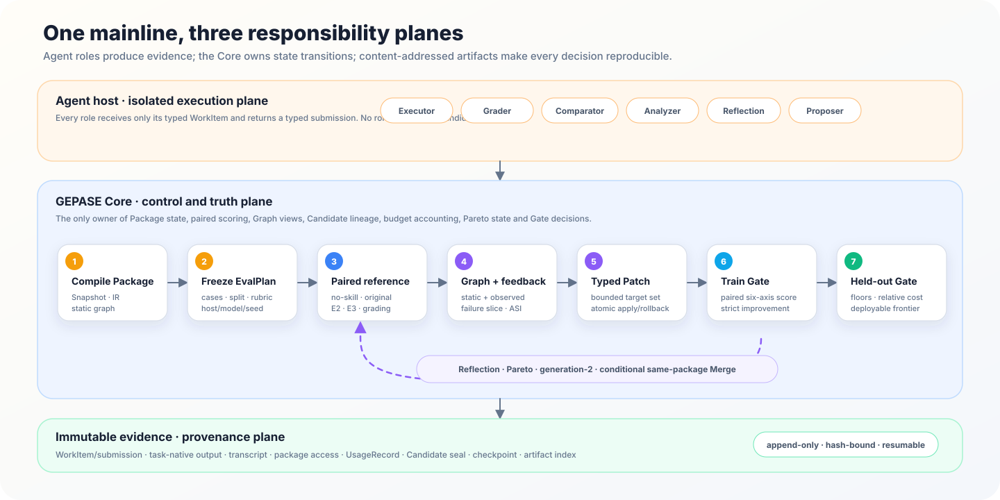

<p align="center">
  
</p>

<p align="center">
  <a href="README_zh.md">简体中文</a> ·
  <a href="README.md">English</a> ·
  <a href="artifacts/runs/f4e-slack-gif-creator-relative-efficiency-v2-report/index.html">中文交互报告</a> ·
  <a href="docs/reproduction.md">复现指南</a> ·
  <a href="learning.html">学习手册</a>
</p>

<p align="center">
  <a href="https://github.com/luckyxinggo/GEPASE/actions/workflows/ci.yml"></a>
  
  
  <a href="LICENSE"></a>
</p>

GEPASE 是一个以证据为先（**evidence-first**）的 Python 框架，用于**评测和进化完整 Agent
Skill Package**。它不把优化对象限制为 Prompt，而是把 `SKILL.md`、references、scripts、
assets、metadata 及其依赖图共同视为冻结模型之外的可训练状态。

真实 Agent 执行、盲化评测、GEPA 式反思/Pareto 搜索、图引导 typed Patch、held-out
validation 与同 Package 条件 Merge，都在同一条可审计主链中完成。

> **架构边界：** GEPASE 不自研另一套通用 Agent Runtime。Codex、Claude Code 或其他 Host
> 负责隔离执行角色；证据、分数、候选、搜索状态、checkpoint 与接受结论始终由 GEPASE Core
> 持有。

## 为什么需要 GEPASE？

| 完整候选状态 | 先有证据，再下结论 | 结构化进化 | Fail-closed 部署 |
|---|---|---|---|
| 对 instructions、references、code、assets、metadata 和依赖关系统一快照、分析与追踪。 | no-skill、original、candidate 使用隔离上下文，保存任务原生输出而不是统一业务假结果。 | 用 static+observed Graph 定位失败，再执行有界、typed `PackagePatch`。 | 只有 held-out 严格提升才能部署；拒绝、证据不完整、lineage、usage 与 hash 全部保留。 |

很多 Skill 工具回答的是“Agent 能不能加载这个 Package”。GEPASE 要回答的是更难的四个
问题：**任务是否真的变好、为什么失败、具体改了什么、这个结果能否安全部署？**

## 一次真实的端到端结果

最新公开运行使用 pinned 的多文件 `slack-gif-creator`、一个 Frozen EvalPlan 和最多五个候选
的有界搜索。generation-1、parent-bound generation-2 与同 Package Merge 全部真实走过同一套
Controller、Candidate、Patch 与 Gate 主链。

| 实际搜索深度 | Gate 漏斗 | Deployable frontier | 最佳 held-out 结果 |
|---|---|---|---|
| 2 个 generation-1 + 2 个 generation-2 + 1 个 Merge | 5 个候选 → 4 个 train-admitted → 3 个 validation-completed | **2 个候选** | validation delta **+0.09920** · relative cost **1.83254** |

第二名的 validation delta 为 `+0.07906`、relative cost 为 `1.93702`；两者均在 3 个 held-out
case 上全胜。本轮实际生效的 Patch 仍集中于 `SKILL.md`，所以**不能据此宣称已经验证跨文件
优化效果**。



### 同一个 held-out 任务的四组真实产物

| no-skill | 原始 Skill | deployable 第一名 | deployable 第二名 |
|---|---|---|---|
|  |  |  |  |

[中文自包含叙事报告](artifacts/runs/f4e-slack-gif-creator-relative-efficiency-v2-report/index.html)
包含 51 个任务原生 GIF，并完整展示搜索谱系、六维评分、质量—成本权衡、
“失败 → Graph → Patch → Gate”、Runtime 总账、provenance 与两个 deployable archive。

## 工程执行主链



1. **编译 Package。** 对完整 Skill 目录建立不可变 snapshot、typed IR、parse coverage 与
   static dependency graph。
2. **冻结评测契约。** 人工审核并哈希绑定 case、fixture、train/validation split、rubric、
   scoring、host/model、seed、timeout 和 tool policy。
3. **建立 paired reference。** no-skill 与 original Skill 使用隔离上下文真实运行；Core ingest
   E2 任务产物、E3 确定性断言、盲化 Grader、Comparator 与 Analyzer 证据。
4. **把失败转成图证据。** 将真实 Package access overlay 到 static graph，形成 observed edge、
   failure slice 和候选 target 排名；未经验证的语义猜测不具备修改授权。
5. **提出有界修改。** Reflection 与 Proposer 产生 typed `PackagePatch`；Core 校验 target scope、
   precondition、dependency closure、impact 与原子 rollback。
6. **物化并评测 Candidate。** Candidate bundle 绑定 Package、parent、Patch、application、Graph、
   workspace、run metadata 与独立 immutable seal。
7. **搜索过程中不抹掉失败。** Train Gate、task-level GEPA feedback、Pareto selection、
   rejected-edit memory、generation-2 和合法 Merge 共用唯一 Controller。
8. **held-out 只验证，不反向改候选。** Gate 3 执行 strict improvement、类别保护 floor 与效率
   约束，通过者才进入 deployable frontier。

## 关键工程设计

- **Typed 边界与角色隔离。** Executor、Independent Grader、Comparator、Analyzer、Reflection
  与 Proposer 只交换通过 schema 校验的 WorkItem/submission；不存在共享隐式对话来决定胜者。
- **Graph 必须真正影响决策。** active selector 只消费经过验证的 static 与 observed layer，用于
  failure localization、mutation scope、blast radius、dependency closure 与 Merge 冲突检查。
- **Assertion 不是综合质量。** `TaskScoreVector` 分开记录 task correctness、output quality、
  skill gain、reliability、efficiency 与 package quality；E3 满分不能冒充 Skill 满分。
- **可恢复性属于正确性。** reservation、HostAttempt、typed role failure、checkpoint、Candidate
  seal 与 artifact index 都是 append-only、hash-bound，可幂等恢复和复算。
- **Package-aware 不等于放开危险修改。** text、code 与 metadata 具有有界 typed edit；binary
  asset 虽进入 snapshot、Graph、evidence 与 Gate，但没有专门 validator 前保持不可变。
- **Merge 被刻意限制。** 只有同一 Package、snapshot、common root 下的兼容分支可合并；
  cross-package Merge 始终是硬错误。

新的 `2.0.0` evolution config 默认使用 `relative_v2` 效率策略，新 report config 默认使用上面
展示的 `narrative_v1` 模板；`v1_legacy` 与 `classic` 仍可显式选择，历史 `1.0.0` config 继续
保持原解释与 fingerprint。

## 快速开始

环境要求：Python 3.11+ 与 [`uv`](https://docs.astral.sh/uv/)。

```bash
uv sync --all-extras --frozen
uv run gepase --version
uv run gepase doctor --format json
```

运行确定性的离线 smoke——不调用 Agent 或 API：

```bash
uv run gepase mock run \
  --config configs/examples/mock.yaml \
  --output artifacts/local/mock-run \
  --format json
uv run gepase artifact verify artifacts/local/mock-run --format json
```

在干净 clone 中验证最新公开报告：

```bash
uv run gepase artifact verify \
  artifacts/runs/f4e-slack-gif-creator-relative-efficiency-v2-report \
  --format json
```

[完整复现指南](docs/reproduction.md)进一步说明 EvalPlan 审核、Agent-native work 的
export/submit/ingest、断点恢复、可选的按角色 Headless 路由、报告复验与 deployable Package 导出。

## 仓库架构

| 路径 | 职责 |
|---|---|
| [`src/gepase/package/`](src/gepase/package/) | Package snapshot、Markdown/Python/shell/config IR、Graph layer、failure slice 与 graph diff |
| [`src/gepase/evals/`](src/gepase/evals/) | EvalPlan、隔离角色 work、E2/E3 evidence、paired scoring、statistics、ledger 与 Runtime |
| [`src/gepase/optimizer/`](src/gepase/optimizer/) | Candidate、GEPA/Pareto、generation-2、strict Gate、recovery 与同 Package Merge |
| [`src/gepase/mutation/`](src/gepase/mutation/) | Typed `PackagePatch`、target scope、影响检查、原子 apply/rollback |
| [`src/gepase/store/`](src/gepase/store/) | Artifact、Candidate、checkpoint、pool、rejection 与 proposal store |
| [`src/gepase/reporting/`](src/gepase/reporting/) | 从 sealed evidence 只读派生报告 |
| [`.agents/skills/gepase-orchestrator/`](.agents/skills/gepase-orchestrator/) | Agent Host 薄适配层，不能成为第二套 Evaluator/Search |
| [`tests/`](tests/) · [`schemas/`](schemas/) | unit/integration/fault/contract 测试与自动导出的交换 schema |

## 证据、状态与结论边界

GEPASE 始终把三层结论分开：

| 结论 | 公开证据 |
|---|---|
| **代码已经实现** | 唯一 Python Package 中具备 Package、Eval、Graph、Candidate、Patch、Controller、Gate、Runtime、Store 与 reporting 主链。 |
| **工程机制通过测试** | 263 个测试，以及 Ruff、Pyright、schema 幂等、安全、license、链接、artifact seal、resume、角色隔离与 fault checks。 |
| **算法效果已经观察到** | 公开 relative-efficiency v2 结果为 `strict_improvement`，deployable frontier 含两个候选。 |

当前效果证据只覆盖**一个公开 Skill、一个 Frozen EvalPlan、一个 Host/模型快照和一次有界
运行**，不能外推为跨 Skill、跨模型、多 seed、graph-vs-random 或 Package-vs-SKILL-only 的
普遍优越性。此前独立 graph-hardening 运行真实收口为 `no_strict_improvement`，其
[封存报告](artifacts/runs/gh-e1-slack-gif-creator-report/final/index.html)继续公开保留，没有隐藏负结果。

raw Agent workspace 与机器本地 research evidence 不进入 Git；干净 clone 可以验证精选 report
与 stage seal，但不声称包含未公开的 raw evolution run。边界详见 [Artifact policy](docs/artifacts.md)、
[Benchmark scope](docs/benchmark.md) 与权威事实源 [state.md](state.md)。

## 文档导航

- [评测模型](docs/evaluation.md) · [Agent-native 编排](docs/orchestrator.md)
- [配置](docs/configuration.md) · [Artifact 契约](docs/artifacts.md)
- [复现](docs/reproduction.md) · [Benchmark 边界](docs/benchmark.md)
- [项目状态](state.md) · [算法学习手册](learning.html)
- [贡献指南](CONTRIBUTING.md) · [安全策略](SECURITY.md)

## 方法来源与 GEPASE 的扩展

GEPASE 使用锁定的 `gepa==0.1.4` 作为反思搜索骨架；评测设计参考 Anthropic
skill-creator；有界修改与验证纪律参考 SkillOpt；进化历史参考 Darwin-skill；冻结模型、更新外部
策略状态的方法论来自 Heuristic Learning。GEPASE 的扩展是把**完整 Package 及其依赖图**作为
候选状态，并把它接入 typed evidence、Patch、Merge 与 held-out acceptance。精确复用与扩展边界见
[learning.html](learning.html)。

公开 canary 来自 [`anthropics/skills`](https://github.com/anthropics/skills)，固定在 commit
`fa0fa64bdc967915dc8399e803be67759e1e62b8`；上游 provenance、Apache-2.0 attribution 与
tree/blob hash 保存在 [`benchmarks/canaries/slack-gif-creator/`](benchmarks/canaries/slack-gif-creator/)。

## License

GEPASE 使用 [Apache-2.0](LICENSE)。Vendored 或 pinned 公开 fixture 保留各自的 license 与
provenance 文件。
