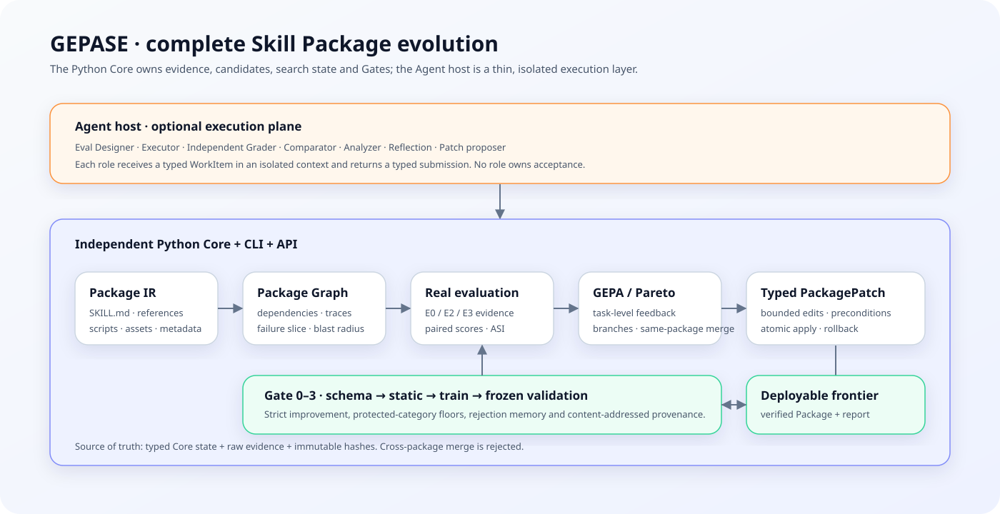
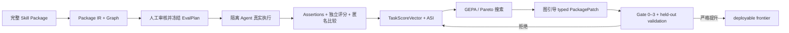

# GEPASE

**Graph-Enhanced Package-Aware Skill Evolution｜图增强、面向完整 Skill Package 的技能进化框架**

[简体中文](README_zh.md) · [English](README.md) · [最新中文叙事报告](artifacts/runs/f4e-slack-gif-creator-relative-efficiency-v2-report/index.html)

GEPASE 是独立的 Python Core、CLI 与 API，用于评测和进化完整 Agent Skill Package，而不只
修改 `SKILL.md`。它把 instructions、references、scripts、assets、metadata 及其依赖图视为
冻结模型之外的可训练状态。

完整闭环由真实 Agent 执行、独立评分、GEPA 式反思/Pareto 搜索、图引导 typed
`PackagePatch`、同 Package 多父合并和严格 held-out Validation Gate 组成。Codex、Claude
Code 或其他 Agent Host 负责隔离执行各角色；证据、候选、搜索状态与接受结论始终属于 Core。

> **证据边界：**当前效果证据仍只来自 pinned 的公开 `slack-gif-creator`、一个 Frozen
> EvalPlan、一个 Agent Host/模型配置和有界搜索，不能外推为跨 Skill、跨模型或多 seed 的
> 普遍性结论。



## 当前究竟验证了什么？

GEPASE 严格区分三类结论：

| 结论层级 | 当前证据 |
|---|---|
| **代码已经实现** | 单一 Python Package 中已经包含 Package IR/Graph、E0/E2/E3 Eval Core、人工审核 EvalPlan、typed evidence、六维评分、GEPA adapter/per-key Pareto 选择、结构化 Patch、Gate 0–3、lineage/merge、stores、report 和 deploy CLI。 |
| **工程机制通过测试** | Core 具有 unit、integration、fault、contract、schema、artifact hash、resume/cache、角色隔离、merge conflict、secret 与 release 检查；R5 可独立重验封存的上游运行。 |
| **算法效果已经观察到** | relative-efficiency v2 结果为 `strict_improvement`，deployable frontier=`2`：第一名 held-out validation `+0.09920`、relative cost `1.83254`；第二名 `+0.07906`、relative cost `1.93702`。 |

当前完整搜索真实完成了两个 generation-1、两个 parent-bound generation-2 和一个条件同
Package Merge candidate。五个候选都沿同一 Controller、Candidate、Patch、Gate 和 Pareto 主链
结算，最终两个进入 deployable frontier。static+observed Package Graph、角色 typed failure、
0/1/多 frontier 与同 Package Merge 均已走通；但本轮实际生效 Patch 仍集中在 `SKILL.md`，不能
据此宣称已经验证跨文件优化效果。

### 同一个 held-out case 的真实任务产物

| no-skill | 原始 Skill | v2 第一名 | v2 第二名 |
|---|---|---|---|
|  |  |  |  |

[最新中文叙事报告](artifacts/runs/f4e-slack-gif-creator-relative-efficiency-v2-report/index.html)
按任务组织 no-skill/original/candidate GIF，对照展示搜索谱系、六维分数、质量—成本关系、
“失败→图定位→Patch→评测→Gate”、Merge、runtime、hash/provenance 和两个 deployable archive。

### 图加固分支的独立复现

`codex/graph-hardening` 上的 GH-E1 使用同一个 pinned Package 与 frozen EvalPlan，但从 fresh
no-skill/original reference 开始建立隔离证据链。两个 graph-guided candidate 中，一个 train
为 `+0.07083`、`5/5` wins，却因 held-out `quality_efficiency=-0.15972` 低于 `-0.05`
category floor 被拒；另一个 train 为 `-0.16221`，直接被拒。最终 frontier 为 0，结果是
`no_strict_improvement`。这证明框架能够保存并报告真实负结果，不证明图引导优于其他搜索策略。

GH-E1 的实际搜索深度只有两个 seed-rooted generation-1 candidate。Reflection 被记录为
task-level feedback，但没有生成 generation-2 child；被拒候选的 recovery 仍从 seed 建立新的
generation-1 branch。因此 GH-E1 证明的是一次有界的 GEPA 式反思/Pareto 主链运行，不是已经
完成多代迭代进化。未来若增加第二代，建议冻结为 `2` 个初始分支、至多 `2` 个
refinement/recovery child 和至多 `1` 个条件 Merge child，继续服从 `max_candidates=5`。

[GH-E1 中文自包含报告](artifacts/runs/gh-e1-slack-gif-creator-report/final/index.html)包含 29 个
hash-verified 任务原生 GIF、Package Graph、两个 Patch、lineage、Reflection、条件 Merge、六维
分数和以 ActiveSessionRuntime/HostAttempt 为权威的完整用量。

公开 Git 只发布这份自包含报告、通过安全审核的 GH-E0.5/GH-E1/post-GH-E1 阶段证据、冻结
配置、Core 与测试。保留原始字节的 GH-E1 reference/evolution run 含 Agent workspace 和本机
诊断，因此继续作为本地 sealed research evidence，不进入 Git。干净 clone 可以验证公开报告与
stage seal，但不声称包含或可重放未发布的完整 raw evolution seal。

## 工作流程



Package Graph 不是装饰：当前 selector 的正式运行视图仅由 static + observed layer 组成，用于
failure localization、mutation scope、blast radius、dependency closure 和 merge conflict
检查。主链支持 parent-bound generation-2、Grader/Comparator/Analyzer typed failure、
0/1/多个 deployable candidate 和条件同 Package Merge；cross-package merge 始终是硬错误。
GH-P1 的 semantic-hypothesis 实验已封存为 stalled 历史证据，不再由 active runtime 生成或
消费。Agent Skill 只是薄适配层，不能保存候选池、评分策略或 Gate 结论。

## 快速开始

环境要求：Python 3.11+ 和 [`uv`](https://docs.astral.sh/uv/)。

```bash
uv sync --all-extras --frozen
uv run gepase --version
uv run gepase doctor --format json
```

运行确定性的离线 smoke，不调用 Agent 或外部 API：

```bash
uv run gepase mock run \
  --config configs/examples/mock.yaml \
  --output artifacts/local/mock-run \
  --format json
uv run gepase artifact verify artifacts/local/mock-run --format json
```

干净 clone 可直接验证最新公开叙事报告，不需要本地 raw Agent workspace：

```bash
uv run gepase artifact verify \
  artifacts/runs/f4e-slack-gif-creator-relative-efficiency-v2-report \
  --format json
```

不重跑 R3/R4，直接重验封存结果并导出 deployable Package：

```bash
uv run gepase report verify \
  --config configs/canaries/slack-gif-creator-r5.json \
  --report-dir artifacts/runs/r5-slack-gif-creator-report \
  --format json
uv run gepase report deploy \
  --config configs/canaries/slack-gif-creator-r5.json \
  --report-dir artifacts/runs/r5-slack-gif-creator-report \
  --output artifacts/local/deployed-slack-gif-creator \
  --format json
```

[复现与发布证据指南](docs/reproduction.md)覆盖 artifact verification、报告重建、Eval review、
Agent-native 执行、resume、可选的按角色 Headless 配置和部署。

## 评测契约

Trigger Eval 与功能质量严格分离。Functional case 的 `no-skill` 和 `original` 在隔离上下文中
执行；candidate 只有在 EvalPlan、scoring policy、host/model、环境、seed、tool policy 和全部
artifact hash 完整一致时，才能复用已经封存的 reference。

| 层级 | 含义 | 对候选接受的作用 |
|---|---|---|
| E0 | 静态结构、语法、引用和安全检查 | 只用于 preflight |
| E1 | 不执行工具的可选计划推演 | 默认关闭，绝不能单独支持 acceptance |
| E2 | Agent 真实执行，保存任务原生输出、transcript、observed trace 和 usage | 必需的功能证据 |
| E3 | 对 E2 产物运行确定性断言 | 高可信证据通道，但不是 Skill 综合分 |

`TaskScoreVector` 分别保留 `task_correctness`、`output_quality`、`skill_gain`、
`reliability`、`efficiency` 和 `package_quality`。确定性 assertion 即使为 1.0，也不会被描述为
Skill 综合质量满分。新 `2.0.0` evolution config 默认使用 `relative_v2`：在 held-out Gate 中
相对 original Skill 比较 duration、tool calls 和兼容的 token telemetry，并保留 artifact size 为
单独指标；`v1_legacy` 只能显式启用。新 `2.0.0` report config 默认使用 `narrative_v1`，旧
`classic` 模板仍可显式选择。旧 `1.0.0` 配置缺少新字段时继续按 v1/classic 解释并保持旧哈希。

## Agent-native 与可选 Headless 角色

Agent-native 是默认模式，不要求额外 API key。仓库级
`.agents/skills/gepase-orchestrator/` 负责把 Eval Designer、Executor、Grader、Comparator、
Analyzer、Reflection 和 Patch proposal 分发到互相隔离的上下文。

`configs/examples/headless-roles.yaml` 与 `schemas/project_config.schema.json` 定义可选的按角色
Provider 路由。v0.1 实现的是经过验证的 provider-neutral 接口，并不内置第二套 API Runtime；
host adapter 仍必须遵守相同 typed WorkItem/submission 协议。

```bash
uv run gepase config validate configs/examples/headless-roles.yaml --format json
```

## 仓库结构

```text
src/gepase/        Python Core、CLI 与公开 API
  package/         Package snapshot、IR、Graph、slice 与 diff
  evals/           EvalPlan、角色工作项、证据、评分与统计
  optimizer/       Candidate、GEPA adapter、搜索、Gate 与 merge
  mutation/        Typed PackagePatch、验证、应用与 rollback
  store/           Artifact、candidate、checkpoint、pool 与 rejection store
  reporting/       基于封存证据的只读报告
.agents/skills/    Agent Host 薄编排适配层
benchmarks/        公开 integration fixture 与 pinned canary
schemas/           自动导出的公开交换 schema
artifacts/runs/    精选的 R2–R5 证据与 GH-E1 自包含报告
artifacts/stages/  通过安全审核的公开阶段 Gate 与完成证据
tests/             unit、integration、contract、fault 与 release tests
```

`skills_test/`、`.env`、`artifacts/local/`、生成的 `results/` 与 GH-E1 raw
reference/evolution run 均被 Git ignore。私有 Skill、凭据、原始 Agent workspace、生产 trace
和本机绝对路径不得进入公开 artifact。

## 文档

- [复现指南](docs/reproduction.md)
- [多保真评测](docs/evaluation.md)
- [Agent-native 编排](docs/orchestrator.md)
- [配置](docs/configuration.md)
- [Artifact 契约](docs/artifacts.md)
- [Benchmark v1 边界](docs/benchmark.md)
- [项目权威状态与 Diff Log](state.md)
- [算法学习手册](learning.html)
- [贡献指南](CONTRIBUTING.md) · [安全策略](SECURITY.md)

## 方法来源与项目扩展

GEPASE 使用本地锁定的 `gepa==0.1.4` 作为反思搜索骨架；评测设计参考 Anthropic
skill-creator；有界修改与验证纪律参考 SkillOpt；进化历史参考 Darwin-skill；冻结模型、更新
外部策略状态的方法论来自 Heuristic Learning。GEPASE 的扩展是把完整 Skill Package 及依赖图
作为候选状态，并把它连接到 typed evidence、Patch、merge 与 held-out Gate。来源与复用边界见
[learning.html](learning.html)。

公开 canary 来自 [`anthropics/skills`](https://github.com/anthropics/skills)，固定在 commit
`fa0fa64bdc967915dc8399e803be67759e1e62b8`；Apache-2.0 attribution、upstream tree 和逐文件
Git blob hash 均保存在 `benchmarks/canaries/slack-gif-creator/`。

## License

GEPASE 使用 [Apache-2.0](LICENSE)。Vendored 或 pinned 的公开 fixture 保留各自的 license 与
provenance 文件。
