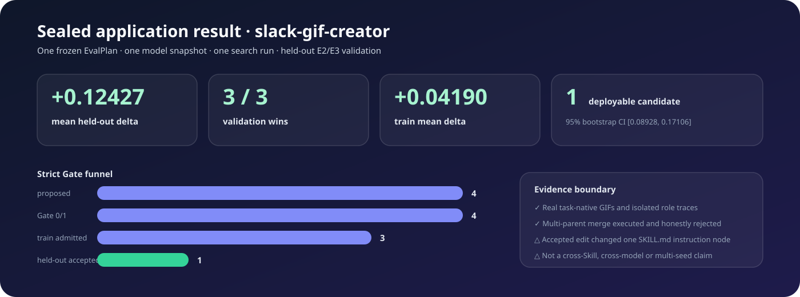
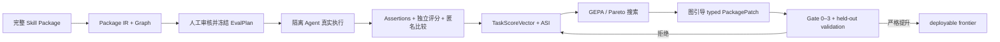

# GEPASE

**Graph-Enhanced Package-Aware Skill Evolution｜图增强、面向完整 Skill Package 的技能进化框架**

[简体中文](README_zh.md) · [English](README.md) · [交互式结果报告](artifacts/runs/r5-slack-gif-creator-report/index.html)

GEPASE 是独立的 Python Core、CLI 与 API，用于评测和进化完整 Agent Skill Package，而不只
修改 `SKILL.md`。它把 instructions、references、scripts、assets、metadata 及其依赖图视为
冻结模型之外的可训练状态。

完整闭环由真实 Agent 执行、独立评分、GEPA 式反思/Pareto 搜索、图引导 typed
`PackagePatch`、同 Package 多父合并和严格 held-out Validation Gate 组成。Codex、Claude
Code 或其他 Agent Host 负责隔离执行各角色；证据、候选、搜索状态与接受结论始终属于 Core。

> **v0.1 证据边界：**当前只在 pinned 的公开 `slack-gif-creator` Package 上封存了一次
> 正向应用结果。它不是跨 Skill、跨模型或多 seed 的普遍性结论，也不证明图引导或完整
> Package 修改始终优于只优化 `SKILL.md`。


## 当前究竟验证了什么？

GEPASE 严格区分三类结论：

| 结论层级 | 当前证据 |
|---|---|
| **代码已经实现** | 单一 Python Package 中已经包含 Package IR/Graph、E0/E2/E3 Eval Core、人工审核 EvalPlan、typed evidence、六维评分、GEPA adapter、结构化 Patch、Gate 0–3、lineage/merge、stores、report 和 deploy CLI。 |
| **工程机制通过测试** | Core 具有 unit、integration、fault、contract、schema、artifact hash、resume/cache、角色隔离、merge conflict、secret 与 release 检查；R5 可独立重验封存的上游运行。 |
| **算法效果已经观察到** | 在一次 frozen `slack-gif-creator` 运行中，deployable candidate 的 train 提升为 `+0.04190`，held-out validation 提升为 `+0.12427`，并在 `3/3` 个 validation case 上获胜。 |



严格 Gate funnel 共处理四个候选：四个通过 schema/static Gate，三个进入 held-out
validation，最终一个进入 deployable frontier。一个 train 阶段看好的候选和一个同 Package
多父 merge child 因 validation 回归被拒绝；一个超时分支作为 typed failure 被保留。被接受的
候选只修改了 `SKILL.md` 中一个有界 instruction node。完整 Package Graph 和 merge 路径都已
实际运行，但本次正向结果没有证明跨文件编辑成功。

### 同一个 held-out case 的三个真实任务产物

| no-skill | 原始 Skill | deployable candidate |
|---|---|---|
|  |  |  |

[中文自包含报告](artifacts/runs/r5-slack-gif-creator-report/index.html)还展示了全部三组 validation
对照、六维评分、Package Graph、候选/merge DAG、Gate funnel、rejected edits、provenance 和
deployable archive。

## 工作流程



Package Graph 不是装饰：它用于 failure localization、mutation scope、blast radius、dependency
closure 和 merge conflict 检查。cross-package merge 是硬错误。Agent Skill 只是薄适配层，
不能保存候选池、评分策略或 Gate 结论。

## 快速开始

环境要求：Python 3.11+ 和 [`uv`](https://docs.astral.sh/uv/)。

```bash
uv sync --all-extras --frozen
uv run gepase --version
uv run gepase doctor --format json
```

运行确定性的离线 smoke，不调用 Agent 或外部 API：

```bash
uv run gepase mock run \
  --config configs/examples/mock.yaml \
  --output artifacts/local/mock-run \
  --format json
uv run gepase artifact verify artifacts/local/mock-run --format json
```

不重跑 R3/R4，直接重验封存结果并导出 deployable Package：

```bash
uv run gepase report verify \
  --config configs/canaries/slack-gif-creator-r5.json \
  --report-dir artifacts/runs/r5-slack-gif-creator-report \
  --format json
uv run gepase report deploy \
  --config configs/canaries/slack-gif-creator-r5.json \
  --report-dir artifacts/runs/r5-slack-gif-creator-report \
  --output artifacts/local/deployed-slack-gif-creator \
  --format json
```

[复现与发布证据指南](docs/reproduction.md)覆盖 artifact verification、报告重建、Eval review、
Agent-native 执行、resume、可选的按角色 Headless 配置和部署。

## 评测契约

Trigger Eval 与功能质量严格分离。Functional case 的 `no-skill` 和 `original` 在隔离上下文中
执行；candidate 只有在 EvalPlan、scoring policy、host/model、环境、seed、tool policy 和全部
artifact hash 完整一致时，才能复用已经封存的 reference。

| 层级 | 含义 | 对候选接受的作用 |
|---|---|---|
| E0 | 静态结构、语法、引用和安全检查 | 只用于 preflight |
| E1 | 不执行工具的可选计划推演 | 默认关闭，绝不能单独支持 acceptance |
| E2 | Agent 真实执行，保存任务原生输出、transcript、observed trace 和 usage | 必需的功能证据 |
| E3 | 对 E2 产物运行确定性断言 | 高可信证据通道，但不是 Skill 综合分 |

`TaskScoreVector` 分别保留 `task_correctness`、`output_quality`、`skill_gain`、
`reliability`、`efficiency` 和 `package_quality`。确定性 assertion 即使为 1.0，也不会被描述为
Skill 综合质量满分。

## Agent-native 与可选 Headless 角色

Agent-native 是默认模式，不要求额外 API key。仓库级
`.agents/skills/gepase-orchestrator/` 负责把 Eval Designer、Executor、Grader、Comparator、
Analyzer、Reflection 和 Patch proposal 分发到互相隔离的上下文。

`configs/examples/headless-roles.yaml` 与 `schemas/project_config.schema.json` 定义可选的按角色
Provider 路由。v0.1 实现的是经过验证的 provider-neutral 接口，并不内置第二套 API Runtime；
host adapter 仍必须遵守相同 typed WorkItem/submission 协议。

```bash
uv run gepase config validate configs/examples/headless-roles.yaml --format json
```

## 仓库结构

```text
src/gepase/        Python Core、CLI 与公开 API
  package/         Package snapshot、IR、Graph、slice 与 diff
  evals/           EvalPlan、角色工作项、证据、评分与统计
  optimizer/       Candidate、GEPA adapter、搜索、Gate 与 merge
  mutation/        Typed PackagePatch、验证、应用与 rollback
  store/           Artifact、candidate、checkpoint、pool 与 rejection store
  reporting/       基于封存证据的只读报告
.agents/skills/    Agent Host 薄编排适配层
benchmarks/        公开 integration fixture 与 pinned canary
schemas/           自动导出的公开交换 schema
artifacts/runs/    精选的 R2–R5 可复现证据
artifacts/stages/  阶段 Gate 与完成证据
tests/             unit、integration、contract、fault 与 release tests
```

`skills_test/`、`.env`、`artifacts/local/` 与生成的 `results/` 均被 Git ignore。私有 Skill、
凭据、生产 trace 和本机绝对路径不得进入公开 artifact。

## 文档

- [复现指南](docs/reproduction.md)
- [多保真评测](docs/evaluation.md)
- [Agent-native 编排](docs/orchestrator.md)
- [配置](docs/configuration.md)
- [Artifact 契约](docs/artifacts.md)
- [Benchmark v1 边界](docs/benchmark.md)
- [项目权威状态与 Diff Log](state.md)
- [算法学习手册](learning.html)
- [贡献指南](CONTRIBUTING.md) · [安全策略](SECURITY.md)

## 方法来源与项目扩展

GEPASE 使用本地锁定的 `gepa==0.1.4` 作为反思搜索骨架；评测设计参考 Anthropic
skill-creator；有界修改与验证纪律参考 SkillOpt；进化历史参考 Darwin-skill；冻结模型、更新
外部策略状态的方法论来自 Heuristic Learning。GEPASE 的扩展是把完整 Skill Package 及依赖图
作为候选状态，并把它连接到 typed evidence、Patch、merge 与 held-out Gate。来源与复用边界见
[learning.html](learning.html)。

公开 canary 来自 [`anthropics/skills`](https://github.com/anthropics/skills)，固定在 commit
`fa0fa64bdc967915dc8399e803be67759e1e62b8`；Apache-2.0 attribution、upstream tree 和逐文件
Git blob hash 均保存在 `benchmarks/canaries/slack-gif-creator/`。

## License

GEPASE 使用 [Apache-2.0](LICENSE)。Vendored 或 pinned 的公开 fixture 保留各自的 license 与
provenance 文件。
