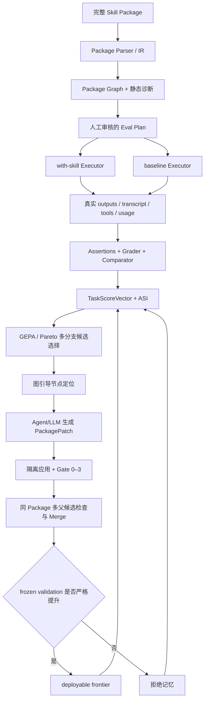
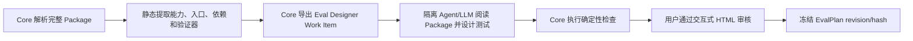

# GEPASE Project State

> 本文件是 GEPASE 的当前事实源（single source of truth），用于同步项目定位、有效架构、阶段状态、执行路线和关键变更。算法学习笔记、逐次施工记录和失效实验细节不在本文件展开。

## 0. 阅读与维护规则

- 本文件只描述**当前仍然有效**的设计与状态；旧结论若与“当前状态”冲突，以当前状态为准。
- 阶段状态：`✅` 已实现且当前证据有效；`🟡` 代码可复用但需重新验收；`⏳` 尚未实现；`⛔` 已撤销或禁止继续使用。
- 每次影响范围、接口、评测、算法、数据或结论的修改，都必须更新“阶段状态”并在文末追加 Diff Log。
- Codex 执行某阶段时，只能实现该阶段明确列出的工作；不得提前实现后续阶段。
- 默认使用 Agent-native 模式；Headless Provider、批量 Agent rollout 或真实外部系统调用只能在配置显式开启且用户授权后使用。Core 记录调用次数、Token、时延和停止条件，但当前版本不建设 API 费用/人民币账单系统。

## 1. 项目定位

### 1.1 一句话介绍

GEPASE（Graph-Enhanced Package-Aware Skill Evolution）是一个面向**完整 Agent Skill Package** 的自动进化框架：它通过多保真 Agent 评测获得反馈，使用 GEPA 式反思进化、Pareto 搜索、图引导的结构化 Patch 和 held-out Gate，优化 `SKILL.md`、references、scripts、assets 及其依赖关系。

> GEPASE evolves complete agent skill packages—not just prompts—through multi-fidelity agent evaluation, graph-guided reflective mutation, Pareto search, and held-out validation gates.

### 1.2 要解决的问题

现有 Skill 通常容易“从无到有”，但难以回答：

1. Skill 是否真的让 Agent 把任务做得更好，而不只是写得更规范？
2. 失败来自指令、参考资料、脚本、资源还是依赖关系？
3. 修改后是否只拟合少量样例，或引入结构退化、成本上升和能力遗忘？
4. 在不训练模型权重的前提下，能否把 Skill Package 当成可解释、可验证的外部可训练状态？

### 1.3 项目性质与最终成功定义

GEPASE 是面向真实使用和 GitHub 开源的**应用型框架**，不是以发表算法论文为目标的实验平台。它的贡献是把 GEPA、skill-creator、SkillOpt、Darwin-skill、Heuristic Learning 与 Package Graph 组合成一条可运行、可审计的完整 Package 进化链，并在此基础上补充 package-aware graph、typed patch、validation gate 和同 Package 多父合并。

当前版本不要求用大规模消融证明 package-aware 必然优于只改 `SKILL.md`，也不要求证明 graph-guided 必然优于 random/round-robin。首个开源版本的成功标准是：

1. 输入一个真实、非简单单文件、许可允许再分发的公开 Skill Package。
2. Agent 在隔离环境中完成真实任务，保存任务原生输出、执行轨迹、Package 访问记录和工具证据。
3. 同一任务存在 no-skill/original/candidate 的隔离配对对照，Executor、Grader、Comparator、Analyzer 和 Proposer 不共享隐式上下文。
4. 评分同时覆盖正确性、输出质量、Skill 增益、稳定性、效率和 Package 质量；确定性断言不得冒充综合质量。
5. 候选修改能从失败证据追溯到 Package Graph 节点和结构化 `PackagePatch`。
6. 搜索主链实际执行同一 Skill、同一 lineage 的多分支与多父 Package Merge；不同 Skill Package 之间禁止合并。
7. 至少一个候选相对父代严格改善，并通过未参与搜索的 frozen validation Gate。
8. 输出中文为主、可解释、可复算的评审页和最终 HTML 报告，能够展示 Package Graph、进化过程、候选 lineage、Patch、Gate 与量化结果。
9. Python Core、CLI、Python API 和薄 Orchestrator 的边界清楚，完整流程可由公开命令复现。

以上条件已由 R2–R5 的封存证据满足，S10 也已完成开源整理与发布 Gate，因此当前仓库达到 v0.1 release-candidate 状态。跨 Skill、跨模型、多 seed、大规模统计和论文式消融属于后续扩展，不是首个版本的完成前置。

### 1.4 项目不是什么

- 不是只修改 Prompt 或单份 `SKILL.md` 的工具。
- 不是依赖 LLM 自评分数的文本润色系统。
- 不是为所有 Skill 重建工具、权限和执行生态的通用 Agent Runtime。
- 不是把推演计划伪装成真实执行的评测框架。
- 不是候选越多越好、允许等分版本入池的遗传算法演示。
- 不是两三个 toy case 或一次成功截图就宣称有效的项目。
- 不是为了凑齐论文实验而强制运行大规模 baseline 矩阵、图消融或跨模型迁移。

## 2. 不可违反的设计原则

1. **完整 Package 可达**：Executor 通过不可变 `skill_ref` 访问完整目录；不得用固定字符数静默截断。
2. **任务原生输出**：PDF 任务产出 PDF，表格任务产出工作簿，代码任务产出代码和测试；框架不得合成统一业务 `result.json`。
3. **证据不冒充**：E1 计划推演不能升级为 E2；E2 必须有 Agent 实际产物、observed trace 和 usage。
4. **对照隔离**：with-skill 与 baseline 使用相同模型、fixture、seed、超时和宿主策略，但上下文相互隔离。
5. **Oracle 隔离**：Executor 看不到 assertions、expected output、rubric、对方输出和预期胜者。
6. **严格改善**：候选至少在一个预注册目标上 `delta > epsilon`，同时保护目标不越界；完全等分直接拒绝。
7. **训练验证隔离**：train 证据只用于搜索；deployable frontier 必须通过 held-out validation；若后续引入 test，它只用于最终一次评测。
8. **单一主链**：评测、候选、Patch、搜索和 Gate 各自只能有一套权威模型；不得另建简化实验旁路。
9. **图必须进入决策**：图算法必须实际影响失败定位、修改范围、blast radius、依赖闭包或 merge 决策；首版不以图消融作为完成前置，若实际调试证明图没有带来可解释用途再简化。
10. **先跑通再诊断 headroom**：首个公开 Skill 不设置独立 headroom qualification 前置阶段；先完成小规模全链运行，若搜索停滞再检查任务 ceiling、失败覆盖、评分区分度或 proposer 能力。
11. **私有数据不出仓**：`skills_test/`、`.env`、凭据、内部日志和业务数据不得进入 Git 或公开产物。
12. **角色上下文隔离**：Executor、Deterministic Grader、Independent Grader、Comparator、Analyzer/ASI、Reflection/Proposer 只通过 typed artifact 交换必要信息，不共享对话历史、候选身份或 oracle。
13. **面向当前主链清理**：不要求先给全仓代码打四类标签；以权威 CLI/API、导入关系、测试和当前路线为依据，直接删除确认未使用、重复、冲突或只服务已撤销方向的实现，并记录删除依据。禁止 `reset`、`clean` 或覆盖 dirty worktree。

## 3. 权威系统架构



其中“Package Graph + 静态诊断 → 人工审核的 Eval Plan”不是纯脚本生成步骤，而是以下可复用的 EvalPlan onboarding 子流程：



Agent/LLM 负责提出语义化测试，Core 负责约束、检查、版本化和复现，用户负责审核高影响判断；不得让同一个上下文无约束地同时出题、执行、判分并宣布结果。该子流程对不同 Skill 复用，但生成的具体 EvalPlan 属于对应 Package。

### 3.1 模块职责

| 模块 | 唯一职责 | 不应承担 |
|---|---|---|
| Package Parser/IR | 解析 metadata、Markdown、references、scripts、assets 和引用关系 | 评估任务质量 |
| Package Graph | 表示静态依赖、读取/执行边、失败切片和变更影响范围 | 为了展示而生成无用途图 |
| Eval Engine | 规划、导出、接收、校验和汇总多保真证据 | 自己制造 Agent 业务产物 |
| Agent Host/Orchestrator | 在隔离工作区执行 Eval、Reflection、Patch proposal | 保存候选池或实验事实源 |
| Grader/Comparator | 基于实际产物独立评分、核验声明和盲比输出 | 参与任务执行或看到候选身份 |
| GEPA/Pareto Engine | 根据 task-level 反馈选择父代、组件和搜索方向 | 用等分候选填充池子 |
| PackagePatch/Materializer | 有界修改完整 Package 并保留来源、diff 和回滚 | 无约束重写整个目录 |
| Merge Engine | 在同一 Package、共同 lineage root 下合并互补候选并处理依赖闭包/冲突 | 合并不同 Skill Package |
| Gate/Stores | 执行结构、行为、安全和部署门控 | 用 train 结果授予部署资格 |

### 3.2 Agent Runtime 边界

GEPASE 是独立 Python Core + CLI + Python API，不是一个 Skill，也不内置完整 Agent Runtime。Codex、Claude Code 或其他宿主 Agent 负责真实执行；仓库内 Orchestrator Skill 只是薄适配层。

- 默认模式是 Agent-native，复用宿主 Agent 的子智能体与工具能力，不强制额外 API key。
- Headless LLM Provider 是可选后端，可以按 Executor、Grader、Comparator、Analyzer、Reflection、Proposer 等角色分别配置模型。
- 无论使用 Agent-native 还是 Headless Provider，各角色都必须创建独立上下文，只通过 WorkItem、ExecutionBundle、GradingBundle、ASI 或 PackagePatch 交换信息。
- Provider provenance、调用次数、token count kind、时延、错误和停止条件需要记录；宿主未提供精确 telemetry 时必须标记 `estimated` 或 `unavailable`，不得冒充 `reported`。API 页面账单和人民币费用不纳入当前 Core。

## 4. 算法来源及在项目中的作用

| 来源 | 借鉴内容 | GEPASE 中的落点 |
|---|---|---|
| GEPA | 反思式 mutation、按 task 保存局部优势、Pareto 候选选择、模块级进化 | 以 Package component 为候选模块，以 TaskScoreVector/ASI 为反馈进行搜索 |
| GEPA system-aware merge | 从多个局部优势候选组合新候选 | 作为主搜索链的必要步骤：只在同 Package、同 source snapshot、共同 lineage root 且贡献互补时执行 package-aware merge，明确拒绝 cross-package merge |
| SkillOpt | 有界修改、验证门控、回滚和拒绝记忆 | typed `PackagePatch`、Gate 0–3、RejectedEditStore |
| Anthropic skill-creator | trigger eval、功能 forward test、真实产物、独立 Grader、with-skill/baseline 对照 | R2–R3 的评测主链与评审页面设计，不复用其优化器作为 GEPASE 主体 |
| Darwin-skill | Agent 驱动的反思—修改—验证闭环与可解释历史 | Orchestrator 工作流和候选 lineage 展示 |
| Heuristic Learning | 把代码、规则、上下文和记忆视为可更新策略状态 | 将 Skill Package 作为外部可训练状态，不更新模型权重 |
| Package Graph | 结构依赖、失败相关切片、影响范围和组件互补性 | target selection、blast radius、dependency closure、merge conflict 与报告解释；首版不强制消融 |

算法学习细节应放在学习文档中；本文件只记录它们怎样约束 GEPASE 实现。

## 5. 评测契约

### 5.1 两类评测

**触发评测**只评估 metadata/description 的选择边界：

- 测试集：人工审核的正例、负例和近边界查询。
- 指标：TP、FP、TN、FN、Precision、Recall、F1、Accuracy、Trigger Rate。
- 结果不得混入功能质量分。

**功能评测**评估 Skill 加载后是否真正把任务做好：

- 每个 case 包含 prompt、输入 fixture、expected output 说明、可验证 expectations、质量 rubric、所需能力和最低证据层级。
- 测试主要由隔离的 Eval Designer Agent/可选 LLM 根据完整 Package 与能力边界起草，再由静态规则检查 fixture、重复、泄漏、可执行性和 rubric 完整性。
- 人工审核是正式运行中的可恢复 checkpoint，不要求在写代码前手工逐条造题：系统先生成中文评审 HTML，用户可以逐条编辑/拒绝高风险与 validation case，也可以批量确认低风险 train case；所有 case 必须有明确 review decision 后才能冻结 EvalPlan。
- 初始 reference 建立时，同一 case 同轮运行 no-skill 与 original；后续 candidate 按 8.5 的完整指纹缓存规则与 frozen reference 形成逐 case 对照，cache miss 时重新建立隔离 reference。

#### EvalPlan 人工审核状态机

```text
package_parsed
  → eval_draft_generated
  → automatic_checks_passed
  → awaiting_review
  → review_imported
  → eval_plan_frozen
  → execution_ready
```

1. Core 生成 `EvalPlanDraft`、fixture 清单、rubric、风险和自动检查结果。
2. `gepase eval review` 生成中文为主、可离线打开的自包含交互式 HTML；页面解释每个字段，展示 Package 摘要、case family、prompt、fixture、expectations、rubric、split、风险与修改意见入口，并支持筛选、编辑、approve、reject、request-regeneration 和导出 `review.json`。这里的“自包含”表示不依赖服务端，不表示页面只能静态阅读。
3. 页面导出或 CLI 接收 `review.json`；reviewer 可 approve、edit、reject、request-regeneration。
4. Core 校验 review、重新运行自动检查，并冻结 `EvalPlan` hash。冻结后修改必须形成新 revision，不得静默覆盖。
5. run 在 `awaiting_review` 状态主动停止并保存 checkpoint；导入 review 后使用同一 run id 恢复，不需要重启整个项目。

### 5.2 证据层级

| 层级 | 含义 | 能否产生真实业务产物 | 能否独立决定部署 |
|---|---|---:|---:|
| E0 | 静态结构、引用、语法、安全检查 | 否 | 否 |
| E1 | Agent 只推演计划，不执行工具；保留但默认关闭 | 否 | 否 |
| E2 | Agent 在受控工作区真正执行任务 | 是 | 否，仍需评分与 Gate |
| E3 | 对 E2 产物运行确定性断言 | 复用 E2 产物 | 可作为高可信证据的一部分 |

首个公开 canary 默认启用 E0/E2/E3，`enable_e1=false`。E1 只在用户显式开启时用于 dry-run、执行计划检查或辅助定位，不能作为候选接受或效果结论。当前主线只选择可以本地真实执行的公开 Skill，不为私有 Skill、生产系统或 mock/stub/replay 预先建设通用接口；这些能力等公开主链跑通后再按真实需求补充。

### 5.3 功能评测数据流

1. Executor 保存 `transcript`、任务原生 `outputs/`、tool trace、usage、timing、artifact hash 和 typed failure。
2. Deterministic Grader 对每个 assertion 输出 PASS/FAIL、证据位置和原因；文件存在不等于内容正确。
3. Independent Grader 根据 rubric 评估正确性、完整性、专业度、可用性和格式，并核验 Executor 的事实声明；无法举证默认不通过。
4. 关键 validation case 使用匿名 A/B Comparator；先比较任务质量，再参考 assertion。
5. Aggregator 从原始证据重算 TaskScoreVector，并把失败转为带 evidence refs 的 ASI。
6. Executor、Grader、Comparator 与 Analyzer 分别运行在独立上下文；任何角色不得读取 sibling output、候选标签或不属于自己输入契约的上游对话。

### 5.4 TaskScoreVector

| 维度 | 说明 |
|---|---|
| `task_correctness` | 内容级确定性断言的加权结果 |
| `output_quality` | 独立 Grader/Comparator 的 rubric 质量 |
| `skill_gain` | with-skill 相对 baseline/original 的 paired delta 与 win/tie/loss |
| `reliability` | mean、std、min、max、失败率和异常值 |
| `efficiency` | 时延、Token、工具调用、错误数和产物体积；当前不计算 API 费用 |
| `package_quality` | 结构、引用闭合、渐进披露、脚本测试、安全和可维护性 |

某个 assertion 子指标可以是 1.0，但不能因此宣称 Skill 综合质量满分。首个 canary 不设置单独的 headroom qualification 或已知 mutant 前置 Gate；先使用冻结 EvalPlan 跑通 no-skill/original/candidate 全链。若搜索停滞或评分接近 ceiling，再启动 headroom/区分度诊断并修订下一版 EvalPlan，不能事后修改已产生结果的 frozen revision。

### 5.5 候选接受规则

- `evolution_pool`：只消费 train evidence。候选至少在一个预注册目标上 `delta > epsilon`，所有硬 Gate 通过，保护目标不越界；等分候选拒绝。
- `deployable_frontier`：必须通过 held-out E2/E3 validation 的最小实际提升阈值。
- 允许预注册“质量统计非劣且时延/Token/工具调用/复杂度严格改善”的 Pareto 通道，但不得事后放宽阈值。
- 首个 canary 以 train 与 frozen validation 完成应用框架验收；test split、跨模型和大规模统计不作为 v0.1 前置。若后续增加 test，它不得参与搜索、反思、候选选择、阈值调整或失败分析。

## 6. Package、图与 Patch 契约

### 6.1 Package 可达性

- `EvalWorkItem` 传递不可变 `skill_ref` 与 PackageSnapshot hash，不传固定长度拼接文本。
- Executor 先读取 `SKILL.md`，再按任务需要访问 references、scripts 和 assets；脚本可直接执行，不要求源码全部进入上下文。
- 每次运行记录 available/read/executed nodes、bytes/tokens loaded、未解析引用和 context overflow。
- 减少无关读取、Token 和时延是优化目标，而不是预先截断 Package。

### 6.2 候选与 lineage

候选最少包含：PackageSnapshot、父代、branch、generation、Patch、来源反馈、评测摘要、状态和完整 provenance。候选历史是 DAG；主搜索过程必须建立多个 mutation branch，并在满足 parent contract 时生成多父 merge child。

### 6.3 图引导修改

修改目标必须能够追溯：

`Task failure → transcript/artifact/assertion → observed/static graph edge → target node → PackagePatch operation`

图选择优先最小失败相关闭包，并对高风险脚本、跨文件影响和 blast radius 加罚。首个版本通过 traceability、dependency closure、conflict detection 和可视化证明图确实参与决策，不要求额外运行 random/round-robin 消融；如果真实开发中图长期不影响任何选择，再在后续版本简化。

### 6.4 PackagePatch

Patch 必须是有类型、可校验、可回滚的操作，例如：

- 修改或移动 Markdown section；
- 添加、更新或删除 reference；
- 更新脚本、测试和依赖声明；
- 修复引用边或拆分过大的 `SKILL.md`；
- 对 assets 做受控变更。

Patch 只能修改允许节点和闭包；应用后必须重新解析 Package、计算 graph diff，并运行 Gate。

### 6.5 同一 Skill 的多父 Package Merge

“多父”是同一个 Skill Package 的多个 `PackageCandidate` 版本，不是多个不同 Skill，也不是简单拼接文件。它是当前优化主链的一部分，不是可选展示能力。

父代集合必须满足：

1. `package_id`、source snapshot 与 lineage root 相同；cross-package parent set 是硬错误。
2. 来自不同 mutation branch，并且各自有可追溯的局部优势、失败覆盖或组件贡献。
3. Gate 0/1 通过，base/precondition 未 stale；不能用无效父代凑数量。
4. 相对最近共同祖先提取 contribution subgraph，并补齐 references/imports/calls/tests/interface 等 dependency closure。
5. 无冲突时 deterministic union；有冲突时只允许 MergeProposer 对 conflict set 返回 typed resolution operations。
6. merge child 记录每个节点的父代来源、冲突决议和完整多父 lineage，并重新通过与普通候选相同的 E2/E3 与 frozen validation Gate。

搜索调度器每轮都要检查 merge eligibility；出现两个及以上满足契约且贡献互补的父代时必须创建并验证 merge child。若当前没有合法 parent set，必须记录 `no_eligible_parent_set` 及原因，而不能退化为跨 Package 合并或跳过审计。

## 7. 当前状态（2026-07-24）

### 7.1 总结

R1 已完成仓库整理与权威 Core 收敛；R2 的公开 canary 与 EvalPlan onboarding 已完成；R3 已使用同一 frozen plan 完成 8 组 no-skill/original paired functional eval；R4 已把 GEPA、Graph、typed PackagePatch、strict Gate、恢复分支与同 Package 多父 Merge 接回唯一 Core 并完成真实运行。R4 共评测 3 个 mutation branch 和 1 个 merge child：4/4 候选覆盖完整 5-case train，3 个 train-admitted 候选覆盖完整 3-case held-out validation；29 个 fresh candidate case 形成 29 个可独立重算的 TaskScoreVector，73 个 Executor/Grader/Comparator 上下文全部隔离，R4 8/8 机器 Gate 通过。

R5 已实现并封存只读的 `CanaryReportBuilder` Python API、`gepase report build/verify` CLI、中文自包含交互报告和六项独立机器 Gate。报告只消费已封存的 R2–R4 evidence，重新校验 19/429/877 个上游 artifact，复制并复验 9 个任务原生 GIF，导出 7 文件 deployable Package；本阶段 Agent/API 调用均为 0，未重跑 R3/R4、未重新搜索候选。6/6 R5 machine Gate、146 tests、Ruff、Pyright、secret/link/license/diff check 均已通过。Codex Browser 安全策略禁止自动打开本地 `file://`，未绕过；用户已在目标路径打开正式报告并确认布局、GIF case、Package Graph 控件和评分下拉正常，R5 完成并解锁 S10。

S10 已完成面向 GitHub 的发布整理。仓库现在提供中英双语 README、按 v0.1 封存证据更新的中文算法/使用学习手册、真实 canary 图像与量化结果、架构/结果 SVG、安装与复现文档、Agent-native 默认路径、按角色可选 Headless 配置契约，以及 `report build/verify/deploy` 闭环。2026-07-24 又新增并按用户反馈扩充本地 `learning-course/` 初学者课程：14 个相互链接的 HTML 页面以同一个 Package/case 的端到端进化为叙事主线，从术语、五类思想来源、Package Graph、EvalPlan、真实 Agent 评测、评分/Gate，进入独立的 GEPA 深入与 Pareto 推导实验室，再回到 GEPASE 搜索适配、PackagePatch、真实 canary、源码使用和面试复习。课程复用 R5 封存 GIF，不改写任何算法证据；当前保留在 dirty worktree 中供用户审核，尚未提交或推送 GitHub。

项目现已在**一个公开 Skill、一个 frozen EvalPlan、一个模型快照和一次搜索运行**上获得真实优化证据：`candidate-04b26dff2bc83b82334bf184` 的 train mean delta 为 `+0.04190`，held-out validation mean delta 为 `+0.12427`，3/3 validation case 均严格胜出且保护阈值通过，已进入 deployable frontier。该结论足以证明当前 canary 上的应用主链有效，但不能外推为跨 Skill、跨模型或统计普遍性。严格 Gate 同时拒绝了 train `+0.07643`、validation `-0.19782` 且发生真实 timeout 的恢复分支，以及 validation 总均值 `+0.05828` 但 `emoji_animation=-0.09144` 越过 category floor 的 merge child。

权威边界已冻结为 `EvalWorkItem → ExecutionBundle → EvaluationRecord/TaskScoreVector → PackageCandidate/PackageGraph → PackagePatch → GateDecision → EvolutionPool/merge contract`。根 Python API 导出每个边界的唯一模型；E1 仍可表示但 CLI 默认关闭且 Gate 2 硬拒绝 E1，费用字段和 `improvement_or_equal` 已移除，固定字符数 Package/component 截断已移除。R1 最终工程 Gate 为 Ruff 通过、Pyright 0 errors、pytest 127 passed、15 个保留 CLI 帮助入口通过、schema 导出幂等、secret/private-path 0 findings、Markdown links/license/diff check 通过。以上只证明清理和工程回归。

首个公开 canary 已固定为 Anthropic `slack-gif-creator` commit `fa0fa64bdc967915dc8399e803be67759e1e62b8`、upstream tree `c61d2f7bb6334b68a6936ad3f41ebfc7cb76fe2a`，七个 Git blob、文件 mode、Apache-2.0 许可和精确依赖均有 manifest/lock 校验，完整七文件 PackageSnapshot hash 为 `ce42d8a…`。R2 frozen plan hash 为 `1893ad9a…`；R3 run 位于 `artifacts/runs/r3-slack-gif-creator-paired/`，429 个文件已封存并通过 hash 校验。R3 没有调用外部 LLM API/Headless Provider，Agent Host 未提供精确 token telemetry，所有角色 token 均明确标记为 `estimated`，不能表述为 provider-reported usage。

### 7.2 阶段状态表

| 阶段 | 状态 | 当前有效结论 |
|---|---:|---|
| S0 工程底座 | ✅ | Python 工程、配置、artifact、secret scan 和基础测试可用 |
| S1 Benchmark 基础设施 | 🟡 | schema、split、fixture、mutation test 可复用；Benchmark v1 只作集成/校准 fixture，不是质量基准 |
| S2 Eval Core | ✅ | EvalWorkItem、ExecutionBundle、ledger、cache/resume、E0–E3 边界和 Agent-native 导出/回收可用 |
| S3 Package IR/Graph | ✅ | 完整 Package 解析、静态图、overlay、reverse slice 和 graph diff 可用 |
| S4 Baseline 框架 | ⛔ | B0–B6、大矩阵、价格估算和独立 evaluator/runner 已在 R1 删除；no-skill/original 统一走 Eval Core |
| S5 GEPA/Candidate Core | ✅ | R4 唯一 Controller 已接入锁定的 `gepa==0.1.4`、TaskScoreVector、ASI、Pareto/current-best snapshot、CandidateStore 与 checkpoint |
| S6 Graph-guided Patch | ✅ | 3 个真实失败驱动 mutation branch 均完成 failure→graph node→typed Patch→隔离 apply/Gate；首版未做 selector 消融 |
| S7 Gate/Rejected Memory | ✅ | 新评分上的 Gate 0–3、严格 train admission、held-out floor、variance 与 rejected memory 已在 4 个候选上重新验收 |
| S7.5 Local-real repair | ⛔ | action-based 评测、readiness 结果和人工 A/B 导出已撤销/删除 |
| S7.6 多分支搜索 | ✅ | 3 个真实 mutation branch、候选级单次 Reflection、恢复分支、lineage 与 Pareto snapshot 已进入唯一主链 |
| S8 Package Merge | ✅ | A+C 的 same-package/same-snapshot/common-root merge child 已 materialize、完成 Gate 0–3 并因 held-out category regression 如实拒绝；cross-package 仍硬禁止 |
| S9 旧主实验 | ⛔ | 第二套 experiments 系统及 0.6/1.0/研究结论已删除并失效 |
| R0 清除旁路 | ✅ | S9、synthetic `selected_action/expected_action/result.json` 路径和失效证据已移除 |
| R1 仓库整理与主链收敛 | ✅ | 定向删除重复/冲突控制器，冻结九个权威模型，127 tests 与全部工程 Gate 通过；未产生效果结论 |
| R2 canary 接入与 Eval 审核 | ✅ | Package/smoke/Designer/check/review/freeze/resume 和用户离线页面交互确认均有 durable artifact；10/10 Gate 通过 |
| R3 真实 paired 执行与评分 | ✅ | 8 pairs/16 real E2+E3、16 blind Grader、6 AB/BA Comparator、8 graph-linked Analyzer、16 可重算向量；8/8 Gate 通过，original mean skill gain `-0.0455` |
| R4 GEPA/Graph/Patch/多父 Merge | ✅ | 4 candidates、29 fresh case、73 隔离评测调用、1 个 deployable candidate；8/8 Gate 和 877-file run seal 通过，墙钟预算 overrun 如实记录 |
| R5 全链 canary 与中文报告 | ✅ | 只读报告主链、20-file run seal、6/6 machine Gate、用户本地视觉/交互确认与 deployable Package 均已封存；未重复搜索 |
| S10 开源发布 | ✅ | 中英双语 README、v0.1 中文学习手册、14 页本地深度学习课程、公开图像/结果、复现与 deploy 流程、role-scoped Headless 配置、精简发行包和 7/7 release Gate 已完成；课程待用户审核且未推送，未发布私有数据 |

### 7.3 已有阶段的实现档案

本节说明“代码为何形成、有效机制是什么、下游怎样消费”。它不是重新认可旧效果：凡依赖旧 action-classification 或 S9 旁路的分数，仍以 7.4 的撤销声明为准。S10 后公开仓库只保留当前主线的 R1–R5/S10 阶段证据和 R2–R5 run；S0–S8 的旧历史 artifact/result 已从发布树移出，其当时机制由本节保留，不能再把旧路径当成可执行事实源。

#### S0：可复现工程与 Artifact 底座

**阶段目的**：先建立开源项目所需的可安装、可复现、安全底座，防止后续 Agent 实验只有散乱脚本和不可核验日志。

**核心实现**：

1. 建立 Python 3.11+、`uv`、src layout、Typer CLI、Pydantic v2、pytest、Ruff 和 Pyright 工程。
2. 建立强类型配置与脱敏 resolved config；配置 hash 不包含明文凭据。
3. 定义 `RunManifest`、`StageReport`、`ArtifactRef` 和预算 schema，并实现原子写、内容 hash 与 artifact index。
4. 实现 `doctor`、`config validate`、`artifact verify` 和 deterministic mock vertical slice。
5. 配置 CI、secret/private-path scan、Markdown link check、wheel/sdist 与本地全新环境安装验证。

**主要产物**：`src/gepase/config/`、`src/gepase/schemas/`、`src/gepase/store/artifacts.py`、`examples/mock_project/`、`artifacts/stages/S0/`。

**阶段关系**：S0 的配置、artifact 和 stage report 是之后所有阶段的事实源。它只证明工程底座可用，不包含任何 Skill 效果结论。

#### S1：私有 Corpus 建档与公开 Benchmark v1

**阶段目的**：把“目录里有几个 Skill”转化为有许可、有任务、有 fixture、有 split、有 oracle 的可评测对象。

**核心实现**：

1. 对 `skills_test/` 中 5 个私有 Skill 做只读、别名化 inventory，记录 source hash、能力多标签、外部依赖、side effect、可用证据层级和降级策略。
2. 独立构造 3 个 Apache-2.0 公开等价 Package：`structured-report-builder`、`tabular-context-builder`、`policy-evidence-evaluator`；私有原件不复制进 Git。
3. 定义 `TaskCase`、`SkillSourceManifest`、`SkillCapabilityManifest` 和 group-aware split；生成每包 50、共 150 个 case，旧 v1 为 90/30/30 train/validation/test。
4. 为任务建立 fixture、deterministic assertions、blind rubric、risk/difficulty/category、provenance 与 license。
5. 对 650 条 assertion 注入 1,300 个已知错误 mutant，并冻结 benchmark/split/rubric/package hash。
6. 使用 E1 与小规模 E2/E3 做 no-skill/original 校准；发现模型 self-score ceiling 后，将它降级为诊断，并使用带 0.85 可靠性上限的 plan-quality proxy。

**当前保留产物**：`benchmarks/`、`schemas/task_case.schema.json`、`docs/benchmark.md`。当时的 `results/calibration/` 与 `artifacts/stages/S1/` 已在 S10 移出公开发布树，不再是当前可执行证据。

**当前边界**：schema、fixture、split 和 mutation-test 基础设施仍可复用；旧任务主要验证脚本输出契约，综合质量 headroom 不足，因此 v1 只能作为 integration/calibration fixture。R2 将围绕 `slack-gif-creator` 生成、审核并冻结新的 canary EvalPlan；不先运行独立 headroom qualification。

#### S2：Agent-native 多保真 Eval Core

**阶段目的**：不自研通用 Agent Runtime，而是建立与宿主无关的工作项、证据和回收协议，让 Codex/Claude 等 Agent 能在外部执行，Core 只维护事实。

**核心实现**：

1. 定义 E0 static、E1 simulated/planned、E2 delegated/observed、E3 executable/assertion 四级证据，并在 schema 层分离 planned 与 observed 字段。
2. 定义 `EvidenceProvider`、`EvalPolicy`、`EvalWorkItem`、`ExecutionBundle`（旧 artifact 中的 `WorkSubmission` 为同类兼容名）、`EvaluationRecord`、usage、trace completeness 与 typed failure。
3. 实现 Static、Simulation、Delegated、Assertion、Artifact、Replay Provider；旧 OpenAI-compatible 全量 E1 校准 backend 因 Package 截断和角色边界不符已在 R1 删除，可选按角色 Headless Provider 留待 R3 按新契约实现。
4. 实现 SQLite ledger、content-addressed artifact、cache、resume、replay、paired comparability 和 `plan → export-work → submit-work → ingest` CLI。
5. 建立 repo-scoped Orchestrator Skill；它只领取工作、隔离子智能体、提交证据，不保存候选或算法状态。
6. 完成三个公开 Skill 的 Agent-native smoke：隔离 worker 产生 E1/E2，Core 派生 E3，并处理 assertion failure、缺失 E3 replay 和 artifact sealing。

**主要产物**：`src/gepase/evals/`、`.agents/skills/gepase-orchestrator/`、`artifacts/runs/s2-agent-native-smoke/`、`artifacts/stages/S2/`。

**阶段关系**：S2 为后续动态图与搜索提供统一证据接口。R3 已把真实 transcript、task-native outputs、package access、角色上下文隔离和 paired isolation 的强制校验接入同一 WorkItem/ledger 主链；R4 直接消费这套已封存证据，不另建 evaluator。

#### S3：完整 Package IR 与异构图

**阶段目的**：让优化对象从一段文本变成可定位、可依赖分析、可做影响评估的完整 Package。

**核心实现**：

1. 安全遍历 Package，生成不可变 snapshot、文件角色、权限、content hash 和 capability 摘要。
2. 将 `SKILL.md`/references 投影为 Markdown section/node；对 Python 做 AST 级函数、类、import、call 和入口分析；对 shell 做命令/文件/env 浅层分析；对 JAR/二进制只记录只读 manifest。
3. 建立稳定 semantic `node_id`，统一表示 contains、references、imports、calls、executes、reads、writes、tests 等静态关系。
4. 将 S2 的 planned/observed trace 作为有 provenance 的动态图 overlay，绝不把 planned edge 当 observed edge。
5. 实现 reverse slice、failure localization、graph diff、blast radius 和 standalone HTML/SVG graph report。
6. 使用带真值的 fault fixture 检验定位与影响范围，而不是只检查图能否画出来。

**主要产物**：`src/gepase/package/`、`src/gepase/reporting/graph_report.py`、`schemas/package_graph.schema.json`、`benchmarks/fault_localization.jsonl`、`artifacts/stages/S3/`。

**阶段关系**：稳定 node identity 被 S5 component map、S6 selector/Patch、S7 validation intensity 和 S8 merge closure 共用。R3 已验证真实 Package read/execute 与 Analyzer target 可回溯到 frozen graph node；R4 又验证 mutation target、failure slice、dependency contribution 与 Merge parent closure 使用同一 node identity。首版未做 selector 消融。

#### S4：公平 Baseline 与多轴预算

**阶段目的（历史）**：在旧主方法之前建立可比较的 B0–B6 方法、统一 evaluator 和硬预算。该阶段的应用价值已被新的单-canary paired 路线取代。

**核心实现**：

1. 注册 no-skill、original、human snapshot、one-shot rewrite、官方 GEPA、SkillOpt-equivalent bounded edit 和 human-in-loop 等 B0–B6 方法，并记录 automation/reproduction level。
2. 建立同时约束 metric call、proposal、LLM、Token、E2/E3、墙钟和历史价格估算的 `BudgetContract/BudgetLedger`。
3. 接入官方 `gepa==0.1.4` 的单模块 baseline，保留 upstream provenance，不以自写同名算法冒充官方实现。
4. 统一 CandidateEvaluator、cache/resume、force rerun、seal、fairness audit 与结果报告。
5. 在三个公开 Skill 上运行 E1 pilot，并保留失败 proposal、预算耗尽和 lineage；随后发现 self-score 口径错误并按 S1 的 frozen proxy 重跑。

**历史产物**：当时的 `results/baselines/v1/` 与 `artifacts/stages/S4/` 已在 S10 移出公开发布树，只在本节保留结论边界。`src/gepase/baselines/`、baseline CLI/config/report/tests 和阶段运行脚本已在 R1 删除；`src/gepase/schemas/budget.py` 只保留非货币的调用、Token 与时间预算轴。

**当前边界**：旧数值是 ceilinged E1 plan-quality，不是功能质量；B0–B6 registry、独立 evaluator/runner、大矩阵和费用账本不再是可执行 Core。R3 通过唯一 `MultiFidelityEvalEngine` 同轮运行 no-skill/original，R4 继续使用锁定的 `gepa==0.1.4`。

#### S5：PackageCandidate、GEPA Step Engine 与搜索状态

**阶段目的**：把官方 GEPA 的反思搜索骨架接到完整 Package，同时支持 Agent-native 的异步执行、恢复和审计。

**核心实现**：

1. 定义不可变 `PackageCandidate/CandidateFile`，记录 parent、operator、generation、source snapshot、文件 hash、权限和 materialization manifest。
2. 由 S3 稳定 node identity 动态生成 instruction/reference/script/routing component map；四类 bundle 只是视图，不限制最小修改粒度。
3. `GEPASEAdapter` 把 Package component 映射到官方 GEPA state/frontier/selector，不在 evaluator 内嵌 Agent Runtime。
4. 曾将 evaluator/proposer 外化为 `EvalWorkItem` 与 `ReflectionWorkItem`，形成阶段专用的 `plan → dispatch → ingest → advance` Step Engine。
5. ASI 组装 candidate before/after、score、planned/observed trace、assertion、artifact、diagnostic、failure slice 和 provenance，并有 token-budget omission 记录。
6. SQLite CandidateStore、checkpoint 和 append-only event log 保存候选 DAG、score matrix、proposal、reflection、frontier 和预算事实。
7. Agent-native pilot 实际完成多轮 candidate E1、reflection 和少量 E2/E3 validation，验证了组件修改、materialization、断点恢复和证据回收机械。

**当前保留**：`src/gepase/optimizer/candidate.py`、`gepa_adapter.py`、`gepa_compat.py`、`asi.py`、`src/gepase/store/candidates.py` 与历史 `artifacts/stages/S5/`。`gepa_step_engine.py`、旧 config、step-engine tests、阶段脚本和根 optimize CLI 已在 R1 删除。

**当前边界**：当时的 E1 提升和 E3=1.0 仍然失效；`improvement_or_equal` 实现已删除。R4 已用 TaskScoreVector、strict admission、官方 GEPA adapter、CandidateStore/checkpoint 和单一 `R4EvolutionController` 建立新状态机；旧 Step Engine 不再是可执行事实源。

#### S6：图引导的有界 PackagePatch

**阶段目的**：让图真正决定修改位置和验证范围，同时限制 LLM 只能提交可验证的结构化变更。

**核心实现**：

1. 实现 random、round-robin、trace-only 和 graph-guided selector，共享同一 SelectionContext 便于公平消融。
2. Graph selector 综合失败覆盖、reverse distance、动态访问、诊断严重度、fan-out 风险、历史收益和探索次数，输出机器可读 feature contribution。
3. 对 minibatch FailureSlice 构建带权 union/closure，在 node/token budget 下保留 failure seed 和高 blast-radius 标记。
4. 定义 `PackagePatch` typed operations、precondition hash、target node/path、evidence refs、benefit/risk；禁止 generic shell/write 操作。
5. Patch applier 在隔离 snapshot 上执行 validate、apply、reparse、diff；任何操作失败则原子回滚，stale parent 被拒绝。
6. StructuredPatchProposer 只能读取有界 ASI/graph slice/allowed ops，并通过 Agent work item 返回 JSON；LLM 不直接写 source package。
7. 计算 affected dependency closure，脚本/API/高 fan-out 修改自动提升后续验证强度。

**主要产物**：`src/gepase/optimizer/selectors.py`、`graph_selector.py`、`failure_union.py`、`src/gepase/mutation/`、`schemas/package_patch.schema.json`、`artifacts/runs/s6-graph-guided-agent-native/`、`artifacts/stages/S6/`。

**当前边界**：旧 proposal viability 仍然失效；R4 的 3 个真实 mutation branch 已证明每个 target 可由新 failure evidence 经 graph slice 定位，并形成 typed Patch、precondition、隔离 apply 和 merge contribution closure。graph-guided 与非图 selector 的消融仍不是首版 Gate。

#### S7：Validation Gate、统计与拒绝记忆

**阶段目的**：把“模型建议看起来合理”转成低成本到高成本、可拒绝、可复评、可追溯的候选状态转换。

**核心实现**：

1. Gate 0 校验 Patch schema、路径、操作权限、base/precondition hash 和 edit budget。
2. Gate 1 在 materialized package 上检查 frontmatter、Markdown/ref、Python syntax、lint/type/unit、安全和依赖。
3. Gate 2 运行 train minibatch 的 parent/candidate paired early screen；E1 只能筛选，不能独立授予部署资格。
4. Gate 3 对 held-out validation 做 paired statistics、minimum evidence tier、category/risk regression floor 和可选效率 Pareto 判断。
5. 定义 proposed、invalid、rejected、inconclusive、accepted 的显式状态及合法转换。
6. 实现 bootstrap、方差复评策略和 `RejectedEditStore`，保存 canonical patch fingerprint、失败证据、节点、delta 和 reason code。
7. Gate report/funnel 直接从 `GateDecision` 生成，早期失败不再触发高保真调用。

**主要产物**：`src/gepase/optimizer/acceptance/`、`src/gepase/evals/statistics.py`、`variance.py`、`src/gepase/store/rejected.py`、`src/gepase/reporting/gates.py`、`artifacts/runs/s7-validation-gated-agent-native/`、`artifacts/stages/S7/`。

**当前边界**：旧 pilot 的 task score 和 accepted 结果仍然失效；R4 已基于新 TaskScoreVector 和预注册阈值重新验收 Gate policy。`inconclusive` 是缺少 held-out 证据时的可继续状态，补齐证据后只能严格转为 accepted/rejected；invalid/rejected 仍是终态。

#### S7.5–S8：历史 readiness、多分支搜索与 Package Merge

**阶段目的**：S7.5 原本用于修复无 headroom/无候选问题；S7.6 建立 same-lineage 多分支候选池和 parent contract；S8 组合互补父代的依赖闭合贡献。

**仍可复用的实现**：

1. candidate lineage、branch/generation、EvolutionPoolStore、Pareto/local frontier 与 selection lock；旧 readiness-based failure clustering/planner 已删除。
2. merge parent contract：同一 Package、同 source snapshot、共同 lineage root、不同 mutation branch、Gate 0/1 通过且贡献互补。
3. 相对最近共同祖先提取 mutation subgraph，并补齐 contains/reference/import/test/interface 形成 dependency closure。
4. ConflictDetector 识别同节点不同内容、路径、接口、删除/修改、frontmatter 和依赖冲突。
5. 无冲突时 deterministic union；有冲突时只允许 MergeProposer 对 conflict set 返回 typed resolution ops。
6. MergeCandidate 记录多父 lineage、节点来源和 contribution map，并必须像普通候选一样重新通过完整 Gate。

**主要代码**：`src/gepase/optimizer/evolution/`、`src/gepase/optimizer/merge/`、`src/gepase/store/evolution_pool.py`、`tests/evolution/`、`tests/optimizer/merge/`。

**撤销部分**：S7.5 的 action-based local-real task/profile/readiness、S7.6 的旧 accepted/held-out evidence、S8 的旧 handoff 和 merge child 仍已删除且不能复用。R4 已用新的 A+C parent set 将 same-package 多父 merge 接回唯一主链，并产生新的 materialization、conflict、lineage 与 Gate 0–3 evidence。

### 7.4 被撤销的结论

- 旧 S7.5/S7.6/S8 的 accepted candidates、held-out 分数、readiness 和 merge child 不再解锁下游。
- 旧 S9 的 `experiment_integrity`、`performance_success`、`multifidelity_success`、`research_success` 等字段不再构成证据。
- 公开 Benchmark v1 的 1.0 只表示固定可执行断言通过，不表示 Skill 综合质量满分。
- 历史 API 花费不能证明算法有效，也不得通过继续扩量来“摊薄”负结果。

## 8. 当前执行路线

### 8.1 依赖关系

```text
R0 清除错误旁路（✅）
  → R1 仓库整理与唯一主链收敛（✅）
  → R2 slack-gif-creator 接入、Eval 生成与审核（✅，10/10 Gate）
  → R3 真实 paired Executor、Grader、Comparator 与 TaskScoreVector（✅，8/8 Gate）
  → R4 GEPA / Graph / PackagePatch / strict Gate / 多父 Merge 主链（✅，8/8 Gate）
  → R5 完整公开 canary 与中文 HTML 报告（✅，6/6 Gate）
  → S10 开源与简历呈现（✅，7/7 Gate）
```

每个阶段完成时必须提供：resolved config、原始证据、机器 Gate、测试结果、usage/时延记录、stage report 和本文件 Diff Log。当前不要求构建 API 账单或人民币成本记录。失败时保持阶段未完成，不得用文字解释代替 Gate。

#### 统一阶段执行协议

1. **读事实源**：开始前读取本节、上游 stage report、输入 schema 和当前 Git/worktree 状态；不得仅根据阶段标题猜实现。
2. **保护 dirty worktree**：不得 `git reset`、`git clean` 或覆盖未知修改；每阶段先保存 `git status --short`、目标文件 diff 和允许删除清单。
3. **冻结范围**：列出本阶段允许修改的模块、禁止提前实现的下游模块、是否允许外部调用以及调用次数/Token/时延停止条件。
4. **先做 preflight**：验证上游 artifact/hash、配置、fixture、Provider/Agent Host 可用性和 source snapshot；前置不满足时阶段保持 blocked/未开始。
5. **按垂直切片实现**：先完成一条可审计 end-to-end path，再扩展覆盖；不得为了制造规模单独复制 candidate/evaluator/search。
6. **运行机器 Gate**：HARD Gate 全部通过才能标完成；REAL/VIABILITY Gate 必须保存真实 Agent/LLM provenance，deterministic mock 只能验证机械契约，不能替代效果证据。
7. **封存证据**：stage report 中每个输出都要存在、可重算 hash，并能回溯输入和命令；失败候选和负结果同样保留。
8. **更新状态**：同步阶段表、当前限制、解锁关系和 Diff Log；若代码已实现但工程机制或效果尚未验收，应继续标 `🟡`。

每阶段的统一目录至少包含：

```text
artifacts/stages/<stage-id>/
  preflight.json
  stage_report.json
  commands.log
  test-results.xml
  artifact-index.json
  evidence/
  external-validation.md   # 仅在确有外部人工/Agent 验证时填写
```

`stage_report.json` 至少记录 stage/status、source tree/commit、resolved config、输入输出 artifact、Gate 结果、Agent/Provider 调用与 usage、known issues、design decisions 和 unlocks。没有真实证据时不得通过手写 `stage_report` 宣称完成。

### 8.2 R1：仓库整理与唯一主链收敛

**完成状态（2026-07-21）**：✅。权威流程、清理依据和机器证据见 `artifacts/stages/R1/`。R1 从 174 个 source Python 文件和 84 个 test Python 文件收敛到 138/55；删除的是旧 baseline/readiness/headless-calibration 与四套阶段控制器，保留算法部件和历史 artifact。最终为 127 tests、Pyright 0 errors、Ruff/CLI/schema/security/docs/diff Gate 全通过。R1 没有运行 `slack-gif-creator`，没有真实优化效果结论。

**目标**：在不破坏 dirty worktree 的前提下，把仓库整理成后续可以继续开发的一套权威 Core；删除确认未使用、重复、冲突或只服务已撤销方向的代码，而不是先对全仓做形式化四分类。

**执行方式**：

1. 记录当前 `git status --short`、源码/测试/schema/config/artifact 规模和已有回归基线；只读确认每项已有修改，不做 reset/clean。
2. 从根 CLI、Python API、`pyproject.toml` 入口、当前 tests 和 R2–R5 所需数据流反向追踪实际导入与调用关系，形成简短 authoritative-flow 图。
3. 冻结唯一模型：`EvalWorkItem/ExecutionBundle`、`PackageCandidate`、`PackagePatch`、Package Graph、TaskScoreVector、GateDecision、EvolutionPool 和 merge contract 各只能有一套。
4. 定向检查并删除：旧 S9/action-label/synthetic-result 残留；重复 Candidate/Evaluator/Search/Report；只服务撤销 readiness、私有 Skill 或生产 mock 的孤立接口；不再使用的大矩阵 baseline/费用统计；与 Agent-native、E1 默认关闭、same-package merge 或任务原生产物冲突的实现。
5. 删除代码时同步删除或更新对应 CLI、schema、config、test、script、artifact 引用和文档；保留仍被 integration test 使用的 Benchmark v1 fixture，不把历史失效结果重新解释为有效。
6. 不创建“以后可能有用”的空接口；后续确实需要时再按真实需求补回。每个删除组只在 stage report 记录“路径、删除原因、引用检查、替代入口”，不对所有文件额外打标签。
7. 运行格式、类型、单元/集成、CLI import、schema、secret/private-path、Markdown links、artifact 引用和 `git diff --check` 回归。

**输出**：

- `authoritative-flow.md/json`：当前唯一数据流和入口；
- `cleanup-manifest.json`：删除/保留的目标路径、依据、替代入口与验证；
- 更新后的 source/test/schema/config/docs；
- R1 stage report、命令日志、测试结果和回归对比。

**硬 Gate**：

- 未执行 reset/clean，未修改 `skills_test/`，未覆盖未知 dirty 文件；
- 可执行代码中旧 S9、`selected_action`、`expected_action`、框架合成业务 `result.json` 和第二套 experiments 主链为 0；
- Candidate、Evaluator、Patch、Gate、Store、Merge 各只有一套权威实现；
- 根 CLI 与 Python API 可导入，保留命令都能显示帮助；
- Ruff、Pyright、pytest、secret/private-path scan、Markdown links 和 diff check 全部通过；
- cleanup manifest 中每个删除项都能由“无引用、重复、冲突或已撤销路线”至少一项证据解释；
- 阶段报告明确区分“删除完成”“工程回归通过”“尚未验证优化效果”。

**解锁**：R2（已解锁）。

### 8.3 R2：`slack-gif-creator` 接入、Eval 生成与人工审核

**完成状态（2026-07-21）**：✅。完整 Package 已 pin/vendoring，真实本地 GIF smoke、通用 EvalPlan onboarding、隔离 Agent Designer、13 项自动检查、中文自包含审核页、26 项 `agent-assisted` 决定、plan freeze 和同 run resume 均已有 durable artifact。in-app browser 自动访问 `file://` 被安全策略阻止后没有绕过；用户本人随后离线打开页面并确认搜索/筛选、case 编辑、批量确认、图查看和导出等既定核心交互正常，确认记录已进入 R2 external validation。10/10 Gate 全部通过。该人工确认只验证审核界面交互，不冒充用户对 26 个 case 做了语义审核。

**目标**：接入一个许可清楚、结构非简单、可完全本地执行并产生真实 GIF 的公开 Skill，建立可恢复的 EvalPlan 生成—审核—冻结流程。

**固定对象**：Anthropic [`slack-gif-creator`](https://github.com/anthropics/skills/tree/main/skills/slack-gif-creator)，来源为 `anthropics/skills`。接入时记录精确 commit、Apache-2.0 许可证、完整 Package hash 和依赖 lock；不得只复制 `SKILL.md`，也不得静默跟随 upstream main 漂移。

**通用性边界**：R2 以 `slack-gif-creator` 作为首个 canary 来实现并验收一套可复用的 EvalPlan onboarding 流程，而不是在 Core 中写死 GIF 领域测试。Eval schema、角色隔离、work item、自动检查、review/freeze/resume、paired execution、评分和 Gate 属于通用基础设施；trigger query、任务 prompt、fixture、expected output、expectations、rubric、case family 和领域 oracle 属于当前 Skill Package 的专属 EvalPlan。以后接入新的 Skill 时，应复用同一基础设施重新执行一次“Package 解析 → Eval draft 生成 → 人工审核 → plan 冻结”，而不是重新开发 evaluator。对于同一 Skill 的候选 A/B/merge child，必须复用同一份 frozen EvalPlan；只有能力边界发生实质变化时才能创建新的 plan revision，且不得覆盖旧实验绑定的 revision。

**自动生成职责**：Core 不依靠纯脚本从语法结构直接猜测完整任务语义。默认 Agent-native 模式下，Core 先确定性解析完整 Package、Package Graph、metadata、可执行入口和已有验证器，再导出带 `skill_ref`、snapshot hash、能力线索和输出 schema 的 typed Eval Designer work item；隔离的 Eval Designer Agent 按渐进披露读取完整 Package，起草 trigger 与 functional cases。可选 Headless Provider 只是在用户显式配置时替代这一角色的模型调用，不改变数据契约。Core 随后使用确定性程序完成 schema、fixture、许可、重复、泄漏、可执行性和弱 assertion 检查，并通过人工 review 冻结结果。因此职责边界是“Agent/LLM 提出语义化测试，Core 约束、校验、版本化和复现，用户审核高影响判断”，而不是让脚本或模型单独决定评测真值。


**执行方式**：

1. 将完整 Package 作为只读 source snapshot 接入 benchmark/canary 目录，解析 `SKILL.md`、`core/easing.py`、`core/frame_composer.py`、`core/gif_builder.py`、`core/validators.py` 与依赖文件，生成 Package Graph 和静态诊断。
2. 在隔离环境安装/验证本地依赖并运行最小技术 smoke：core 可导入、能生成合法 GIF、validator 可读取产物。该 smoke 只证明环境可执行，不是 headroom/effect qualification。
3. Core 导出 Eval Designer work item；隔离的 Eval Designer Agent 读取完整 Package 后生成 trigger set：正例、负例、近边界请求；trigger 指标与 functional score 分开。
4. 同一通用 Eval Designer 协议生成当前 canary 专属的 functional draft，至少覆盖：128×128 emoji 动画、480×480 message GIF、带输入图片的动画、文字可读性、动作/缓动表现、循环/时长/文件体积约束和质量—效率权衡；这些 GIF case 是 R2 的评测实例，不得硬编码进通用 Core。
5. 每个 case 具有 prompt、输入资产、任务原生 expected output 描述、内容/技术 expectations、主观质量 rubric、case family、risk、train/validation split 和 E2/E3 evidence policy。
6. 自动检查 schema、fixture hash、许可、私有路径、重复/近重复、oracle 泄漏、不可执行约束和只检查文件存在的弱 assertion。
7. 生成中文为主、可离线打开的自包含交互式评审 HTML。页面采用克制、整洁、留白充分的技术文档风格，可参考 Anthropic 博客的信息层次但不复制品牌；每个字段提供中文解释和风险提示，支持 case 搜索/筛选、逐项编辑、批量确认低风险 train case、approve/reject/request-regeneration、Package Graph 查看以及导出合法 `review.json`。页面可以使用内嵌 CSS/JavaScript，但不得要求为审核单独部署后端服务。
8. run 进入 `awaiting_review` 后停止；导入 `review.json`，重新校验并冻结 EvalPlan revision/hash，然后从同一 checkpoint 恢复。
9. 本阶段不先运行 original/no-skill/mutant headroom qualification；是否存在 ceiling 由 R5 全链结果决定，停滞后再诊断。

**输出**：pinned PackageSnapshot、license/provenance、Package Graph、EvalPlanDraft、automatic-check report、review HTML、review ledger、frozen EvalPlan 与 resume checkpoint。

**硬 Gate**：

- source commit、Package hash、license 和依赖 provenance 完整；
- 完整 Package 可解析，Python core import 和最小 GIF smoke 通过；
- trigger/functional 评分通道严格分离；
- 每个 functional case 都有任务原生输出说明、内容级 expectations 与 rubric；
- train/validation 不存在同 fixture/近重复泄漏；
- frozen plan 中未决 review decision 为 0，review 修改可回溯；
- Executor view 中 assertions、rubric、expected answer、candidate identity 和 sibling output 为 0；
- review HTML 为中文主界面、字段有解释、具备规定的审核交互、能导出合法 `review.json`，导入后 run 可恢复；在浏览器离线打开时核心交互仍可用；
- Eval Designer 的语义生成与 Core 的确定性校验边界可审计，GIF 领域 prompt、fixture、rubric 和 oracle 未硬编码进通用 Eval Engine；
- 没有为私有 Skill、生产 mock 或通用外部系统新增接口。

**解锁**：R3（已完成）。

**后续阶段实现注意**：R3–R5 应优先复用已有框架代码，避免再次产生平行实现或主链漂移；若已有代码与当前项目定位或阶段要求冲突，以本文件的项目定位和当前阶段为准，可以删除或重构冲突代码后重新补齐，不为保留旧实现继续叠加新的平行路径。

### 8.4 R3：真实 paired Executor、Grader、Comparator 与 TaskScoreVector

**完成状态（2026-07-22）**：✅。R2 frozen plan 的 5 train + 3 validation functional case 已形成 8 组严格配对、16 个真实 E2 GIF 与 16 个内容级 E3 bundle；16 个独立 Grader、6 个 AB/BA Comparator 和 8 个 Analyzer 均在唯一上下文中通过 typed submission 进入 Core。Package access/isolation audit、独立分数重算与 E3 replay 全部有效，8/8 R3 Gate 通过。平均 `skill_gain=-0.045480625`，因此本阶段验证的是评测与反馈工程机制，不是优化效果。

**目标**：让 Agent 在隔离上下文中真正生成 GIF，并用客观约束与独立质量判断形成可审计的任务级反馈。

**执行方式**：

1. 固化 `ExecutionBundle`：transcript、任务原生 `outputs/`、tool trace、Package read/execute trace、usage、timing、artifact hashes 和 typed failure。
2. 同一 case 使用一致的模型/Agent Host、fixture、超时和工具策略，分别运行 no-skill 与 original Skill；每个 variant 使用全新上下文，互不可见。
3. with-skill 只收到 `skill_ref` 并按渐进披露访问完整 Package；记录 available/read/executed nodes 与 loaded bytes/tokens，不做字符数截断。
4. E0 检查 Package，E2 实际生成 GIF，E3 使用 Pillow/imageio 等读取真实产物，验证文件合法性、尺寸、帧数、时长、循环、颜色/体积和 case-specific constraints；E1 默认关闭。
5. Deterministic Grader 逐 assertion 保存证据；Independent Grader 在独立上下文评价 prompt adherence、语义完整性、文字可读性、构图、动画平滑度、专业度和可用性。
6. Comparator 对关键 case 做匿名 A/B 比较与顺序交换 sanity check；不知道哪一边使用 Skill，也看不到 candidate id。
7. Aggregator 生成六维 TaskScoreVector；Analyzer/ASI 只根据 artifact、trace、grader 和 comparator evidence 解释失败，并关联 Package Graph node。
8. Grader、Comparator、Analyzer 可以使用 Agent-native 子智能体或按角色配置的 Headless Provider，但不得共享上下文；所有交换都落为 typed artifact。

**输出**：paired ExecutionBundles、E3 records、GradingBundles、Comparator records、TaskScoreVectors、ASI dataset、package-access/isolation audit。

**硬 Gate**：

- 每个 case 的 no-skill/original 配对除 Skill 可用性外配置一致；
- 成功 E2 有真实 GIF、非空 transcript、observed trace、usage 和 artifact hash；
- 框架生成业务 GIF 或统一业务 `result.json` 的数量为 0；
- E3 的每个 PASS/FAIL 都能定位到产物内容或元数据，不只检查文件名/存在性；
- Executor、Grader、Comparator、Analyzer 的 context/run id 不同，oracle/sibling/candidate identity 泄漏为 0；
- Package read/executed node 可回溯到 Graph；
- TaskScoreVector 可由 raw bundle 独立重算，trigger score 未混入 functional score；
- 报告调用次数、token count kind、时延、工具调用和失败，不要求费用字段；宿主未提供精确 token 时必须标记 `estimated` 或 `unavailable`，不得冒充 `reported`。

**实际输出与边界**：run 已封存 429 个文件，包括 16 ExecutionBundle/E3/Grader/vector、6 Comparator、3 reconciliation、8 Analyzer、ASI dataset、usage、package-access/isolation audit 和 independent score verification。`records/` 中 32 个 ledger canonical records 与 10 个历史 superseded E3 均已明确分类，未分类 orphan 为 0。3 个 validation case 中，loop/pulse 的 AB/BA 一致判定 original 落败，efficiency 的顺序结果不一致并以 comparator margin 0 处理。R3 不产生候选、不应用 Patch、不运行 held-out candidate Gate，也不改变 frozen plan。

**解锁**：R4（已完成）。

### 8.5 R4：GEPA、Graph、PackagePatch、严格 Gate 与多父 Merge 主链

**目标**：把 R3 的真实反馈接回唯一 Core，使 `slack-gif-creator` 在同一候选 DAG 中经历反思、多分支、有界 Patch、严格入池和同 Package 多父合并。

**执行方式**：

1. `MultiFidelityEvalEngine` 是唯一评测入口，`PackageCandidate` 是唯一候选，`PackagePatch` 是唯一修改表示，EvolutionPool/CandidateStore 是唯一搜索事实源。
2. 本地锁定的 `gepa==0.1.4` 提供反思式 mutation、task-level feedback 使用、Pareto/local advantage 与父代选择骨架；GEPASE Adapter 把 TaskScoreVector、ASI 和 Package components 映射给 GEPA。
3. R3 的 no-skill/original 同轮 paired run 负责建立一次不可变 reference anchor。R4 不把缓存冒充新的同轮执行，而是在 `ReferenceEvidenceKey` 完全一致时复用已封存的 reference ExecutionBundle、E3、Grader、TaskScoreVector、ASI 和匿名产物，只实际运行新 candidate 一侧；已评测父代作为后续 child/merge child 的 reference 时遵循同一规则。
4. `ReferenceEvidenceKey` 至少包含 source/reference PackageSnapshot、frozen EvalPlan 与 case/fixture hash、scoring policy、Agent Host/Provider/model snapshot、工具与 runtime/environment fingerprint、seed、timeout 和 host policy，并绑定来源 run seal 与 artifact hash。任一字段或 artifact 校验不一致即为显式 cache miss，必须重新建立隔离 reference；禁止部分命中、跨模型复用或静默降级。
5. Graph selector 使用真实 read/execute/failure edge 定位 node 和最小依赖闭包，proposer 只能基于有界 ASI/graph slice 返回 typed `PackagePatch`，不能直接改 source package。
6. 在 sibling workspace 原子 apply、reparse、graph diff、blast radius 和 rollback；`SKILL.md`、core Python、依赖/metadata 都可在允许范围内修改。
7. Gate 0 检查 Patch/precondition/权限，Gate 1 检查候选 Package 的结构、语法、相关测试和安全。通过后，Gate 2 对 candidate 完整执行 frozen plan 的全部 5 个 train case，以缓存 reference 计算逐 case delta 和 strict train admission；不得按图裁剪 case，也不得用 E0/E1 代替 E2/E3。只有 train 至少一个预注册目标严格改善且保护目标不过界的候选进入 Gate 3。
8. Gate 3 对 candidate 完整执行全部 3 个 frozen validation case；Independent Grader 只评新产物，关键 case 的 AB/BA Comparator 使用新 candidate 与哈希校验后的匿名 reference 产物重新比较，不能复用旧比较结论。Core 基于 fresh candidate evidence 与 frozen reference evidence 重算向量并更新 deployable frontier。
9. Orchestrator 按依赖屏障分阶段调度：同一阶段内相互独立的 Executor 并发，全部完成后 Grader 并发，再进入 Comparator/Reflection；不同角色和 work item 继续使用唯一隔离上下文。`max_concurrency` 由 Agent Host 能力和 frozen RuntimeBudget 配置，不在 Core 中硬编码为某个宿主的固定并发数。
10. R3 已封存的 original Analyzer/ASI 直接作为第一轮 mutation 反馈，不重复分析 unchanged original。每个完成 Gate 2 或 Gate 3 且需要继续搜索或记录拒绝原因的 candidate 至多创建一个候选级 Reflection/Analyzer work item；输入保留每个 task 的原始 delta、E3、Grader/Comparator feedback、Patch、graph diff 和 evidence refs，输出仍逐 task 记录诊断与 graph targets，不能把 task-level feedback 压成单一总分。
11. 搜索至少建立两个不同 mutation branch；每轮运行 merge eligibility check。两个及以上 same-package/same-snapshot/common-root 且贡献互补的父代出现时，必须构建 dependency closure、检测冲突、生成 merge child，并按普通 candidate 重新通过 Gate 0–3；cross-package parent set 必须硬拒绝。
12. Headless Provider 只作为可选角色后端；默认 Agent-native。E1 保留在 schema/CLI 中但配置默认关闭，不得参与 acceptance。R4 preflight 冻结 RuntimeBudget，至少包括 `max_concurrency`、各角色 timeout/有限 repair 次数、proposal/candidate/Agent 调用/Token/墙钟上限和耗尽后的停止语义，不记录人民币费用。

**运行时优化边界**：

- 本阶段只做 reference 缓存、阶段内并发、候选级单次 Reflection 和候选/阶段审计分离，不新增 graph-based case pruning、failure-cluster 调度、动态 evidence tier、按分差跳过预注册 Comparator 或自动切换小模型。
- 缓存证据只进入 Core 的评分、Comparator work item 和 provenance，不得进入 candidate Executor 上下文；candidate 仍必须生成新的任务原生产物、transcript、observed trace、Package access、usage 和 artifact hash。
- 每个 candidate 都运行其 Gate 所规定的完整 split。候选级只运行 Package/patch Gate、相关测试、真实 eval 与 candidate artifact 校验；Ruff、Pyright、全量 pytest、全仓安全/许可检查和完整 stage seal 在 R4 收尾统一运行，不在每个 candidate 后重复执行。
- usage 同时记录端到端墙钟时间、各角色累计 duration、队列等待、调用数、失败/repair、cache hit/miss 与来源 reference；并发缩短墙钟时间不能被表述为减少了累计 Agent 使用量。

**输出**：单一 CLI/API 搜索链、candidate DAG、strict-admission audit、failure→graph→patch trace、branch records、merge eligibility/closure/conflict report、reference-cache audit、phase scheduler/runtime report、候选级 Reflection records、Gate funnel、RejectedEditStore 与 deployable frontier。

**硬 Gate**：

- 候选、评测、搜索、Patch、Gate 和 Store 不存在第二份平行模型；
- reference cache 只有在完整 `ReferenceEvidenceKey` 和 artifact hash 一致时命中；每次 hit/miss、来源 run 和失效原因可审计，cache miss 不得继续使用 stale/partial evidence；
- candidate Executor 看不到 reference artifact、分数、grader、sibling output 或 candidate identity；所有 candidate E2/E3 都来自新的隔离执行；
- 等分 candidate 被拒，只有 strict improvement candidate 能进入 train pool；
- Gate 2 对通过 Gate 0/1 的候选覆盖 5/5 train case，Gate 3 对 train accepted candidate 覆盖 3/3 frozen validation case；没有 graph case pruning、E1 acceptance 或未声明跳过；
- 同一角色阶段的 work item 可并发，但角色依赖屏障、唯一 context/run id 和 oracle/sibling 隔离全部有效；
- 每个需要反思的 evaluated candidate 至多一个候选级 Reflection/Analyzer，且其输出保留逐 task evidence、诊断与 graph target；
- 每个 Patch target 可回溯到真实失败、证据和 Graph node；
- stale/malicious/越界 Patch 原子回滚，source package 与 sibling workspace 不被污染；
- 至少两个真实 mutation branch 进入候选 DAG；
- merge scheduler 每轮有记录，至少一个合法 same-package merge child 在真实 canary 中 materialize 并重新通过 Gate 0–3；它可以被接受或如实拒绝，但不能绕开评测；
- cross-package、不同 source snapshot、无共同 lineage root 和冲突未解决的 merge fixture 全部硬拒绝；
- merge child 的 node provenance、dependency closure、conflict resolution 和多父 lineage 完整；
- rejected candidate 不污染 source、pool 或 deployable frontier；
- RuntimeBudget 在搜索前冻结，超时、repair、cache、Agent 调用、Token 与墙钟停止条件均可审计；候选级检查与阶段收尾的全仓回归没有重复混用；
- `gepa==0.1.4` 与 Agent/Provider provenance 可审计。

**实际输出与边界**：R4 run 位于 `artifacts/runs/r4-slack-gif-creator-evolution/`，并由 `artifacts/stages/R4/stage_report.json` 记录完成事实。R3 anchor 与 7 个 candidate split 共 8 次 cache hit、0 miss；4 个候选共运行 20 个 train case，3 个 admitted candidate 运行 9 个 validation case。28 个成功 E2 均有任务原生 GIF 与 E3，另 1 个 validation executor 达到 600 秒 timeout 后以 typed failure 入账；没有 E1、graph case pruning、框架业务 `result.json` 或跨 Package merge。

部署候选 `candidate-04b26dff2bc83b82334bf184` 的 train/validation mean delta 分别为 `+0.04190/+0.12427`。恢复分支 C 和 merge child 均先通过 train，但分别因 timeout 导致的 protected regression 与 `emoji_animation` category floor 越界在 Gate 3 被拒绝；这两个负结果保留在 rejected memory 和 Gate funnel 中。merge child 使用 A+C 两个 same-package 父代、同 source snapshot/common root、0 unresolved conflict，完成真实 Gate 0–3 后被拒绝，并未绕开验证。

本次 accepted candidate 的实际 edit 位于 `SKILL.md` 的一个有界 instruction node；完整 Package parser、Graph、依赖 contribution/closure、workspace application 和 Merge 均实际参与，但本次结果不证明跨 `references/scripts/assets` 修改本身带来收益，也不证明 package-aware 优于只改 `SKILL.md`。

RuntimeBudget 中 proposal/candidate/Agent-call/token 上限均未超出；总调用为 77、估算 token 为 1,649,370、累计 Agent duration 为 27,449,000 ms。端到端墙钟为 10,311,052 ms，超过冻结的 7,200 秒上限；`exhausted_axes=["wall_clock"]` 与停止原因已封存。Host 未提供 enqueue timestamp，queue wait 明确为 unobserved 而非伪造 0 成本。该 overrun 不改变 held-out 评分，作为当前运行体验问题保留在状态、阶段文档和后续工程计划中；最终结果页只中性展示运行规模，不作醒目预算警示。

**解锁**：R5（已完成）。

### 8.6 R5：完整公开 canary 与中文 HTML 报告

**目标**：不用论文式大矩阵，完整运行一次用户可理解、可复现的 `slack-gif-creator` 进化项目，并获得真实量化提升或明确的停滞诊断。

**执行方式**：

1. 使用 R2 frozen train/validation，不再改变 prompt、fixture、rubric、split 或 Gate 阈值。
2. 汇总 no-skill、original、多分支 candidate、merge candidate 与 validation；`ReferenceEvidenceKey` 命中时复用 R3/R4 已封存证据，失效时才重新运行对应 reference。冻结 proposal 次数、Agent 调用、Token、时延和自动停止条件，不记录人民币费用。
3. 逐条保存 GIF、transcript、package access、grader evidence、匿名比较、ASI、Patch、graph diff、GateDecision 和 rejected reason。
4. 只有相对父代在预注册目标上严格改善且保护目标不退化的 candidate 才可进入 deployable frontier；完全等分不得接受。
5. 生成中文静态 HTML 最终报告，页面信息层次清楚、字段有解释，并至少包含：
   - 原始 Package 结构与交互式 Package Graph；
   - no-skill/original/best candidate 的 GIF 并排播放与逐 case 证据；
   - GEPA/反思/分支/多父 Merge 流程图和 candidate lineage DAG；
   - failure → node → PackagePatch → graph diff → Gate 的可追溯视图；
   - 六维 TaskScoreVector、paired delta、win/tie/loss、均值/方差和回归项；
   - Gate funnel、Rejected Edit、usage/时延和完整 provenance；
   - deployable Package 下载/路径、source commit、EvalPlan hash 与复现命令。
6. 报告样式可借鉴 Anthropic 博客的克制排版和内容层级，但使用 GEPASE 自有中文视觉与组件，不复制其品牌资产。

**成功 Gate**：

- `end_to_end_complete=true`：Package→Eval review→paired execution→grading→GEPA/Graph/Patch→branch/merge→validation→report 全链完成；
- `real_artifacts_verified=true`：所有主结果来自真实 GIF、transcript 和 observed trace；
- `strict_improvement_observed=true`：至少一个 candidate 在 frozen held-out E2/E3 validation 上严格提升且保护目标不过界；
- `merge_path_exercised=true`：真实同 Package 多父 merge child 已生成并经过完整 Gate，结果无论接受或拒绝都如实展示；
- `report_reproducible=true`：HTML 数字能由 raw evidence 重算，链接、hash、CLI 命令和 provenance 完整；
- `release_candidate_ready=true`：以上字段全部为 true，并导出 deployable Package。

**当前实现与证据**：`src/gepase/reporting/canary.py` 是 sealed evidence 到 report payload/manifest/deployable archive 的唯一投影；`src/gepase/reporting/canary_html.py` 只负责依赖无关的中文 HTML 呈现，不能拥有或改变 Candidate、评分与 Gate 状态。`configs/canaries/slack-gif-creator-r5.json` 固定 R2/R3/R4 输入与 deployable candidate，`scripts/run_r5_gates.py` 从 raw evidence 独立复算六项完成条件。正式输出位于 `artifacts/runs/r5-slack-gif-creator-report/`，包含 `index.html`、`report-data.json`、`evidence-manifest.json`、9 个 GIF、7 文件 Package/ZIP 与 20-file artifact seal。

当前 R5-G01–G06 均通过：held-out mean delta 独立复算为 `+0.12426667`、3/3 wins、0 regression；same-package 两父 merge child 已完整执行并如实拒绝；报告校验重建 payload/manifest 并逐项比较复制资产；R5 Agent/Headless 调用均为 0。inline JavaScript 已独立编译检查并修复初始化顺序与换行转义。Codex Browser 对本地 `file://` 的自动导航被宿主安全策略阻断，未使用 localhost/raw CDP/其他浏览器绕过；用户已从目标路径打开正式报告，确认页面布局、3 组 GIF case、Package Graph 版本/细粒度控件和评分 case 下拉正常，证据封存于 `artifacts/stages/R5/evidence/visual-validation.json`。

**停滞处理**：若没有 strict improvement，R5 标记 `stalled` 而不是失败包装或继续扩大矩阵。此时才追加轻量 headroom diagnosis，依次检查 task ceiling/难度、评分区分度、真实失败是否覆盖多个组件、Graph 定位、proposer/Patch 可达性和 Agent variance；诊断后生成新的 EvalPlan revision 或实现修复，再重新运行 R5。不得把诊断结果追写进已经冻结的旧 run。

**解锁**：成功时进入 S10；停滞时只允许针对诊断结论回到 R2/R3/R4 的明确环节。

### 8.7 S10：开源发布与简历呈现

**目标**：把已经真实跑通并具有量化提升的应用框架整理为可公开安装、复现和面试追问的 GitHub 项目。

**执行方式与验收**：

1. 精简 README，清楚区分“代码已实现”“工程机制通过测试”“在 `slack-gif-creator` 上观察到的算法效果”。
2. 提供安装、doctor、Eval review、Agent-native run、可选 Headless role config、resume、report 和 deploy 命令。
3. 发布许可清楚的 canary snapshot、EvalPlan、脱敏 raw evidence、结果 HTML、架构图和最小复现配置；不发布私有 Skill、凭据或本机路径。
4. README/简历只陈述已由 R5 证据支持的结果，不声称普遍优于单文件优化、所有图方法或所有 Skill。
5. 全新环境安装、公开命令、链接、schema、artifact hash、secret scan、license attribution 和复现 smoke 全部通过后，S10 才可标完成。

**完成状态（2026-07-24）**：✅。中英双语 README、架构/结果 SVG、真实 R5 GIF、安装与复现文档、发布边界和 `gepase report deploy` 已落地；可选 Headless 只提供按角色、凭据环境变量引用式配置契约，默认仍是 Agent-native。确认未使用、重复或只服务撤销路径的 5 个零入边 source module 及旧阶段脚本/配置/artifact/result 已从发布树移出；相关测试改为即时 typed fixture，公开 evidence 收敛为 R1–R5/S10 stage 与 R2–R5 run。清理采用仓外可恢复归档，没有 `reset/clean`，没有修改 `skills_test/`。

在原 `learning.html` 字段手册之外，新增 `learning-course/` 零基础课程目录。课程首页提供完整架构图和“一份 Package 完成一次进化”的三幕式学习路线，后续 13 页逐层解释 70+ 中英文术语、五类方法来源、Package IR/Graph、EvalPlan 审核 checkpoint、角色隔离/E0–E3、TaskScoreVector/strict Gate、官方 `gepa==0.1.4` 九步 reflective iteration、`GEPAState`、标准 Pareto 支配与 GEPA per-key champion mapping、GEPASE Adapter、多父 merge、typed PackagePatch、真实 canary、源码/CLI/API 与面试追问。每章顶部固定显示上一环节输入/本章过程/下一环节输出，并让 `loop-sparkles-006` 贯穿建图、出题、执行、评分、搜索、Patch 和 Gate。共享 CSS/JavaScript 提供深浅主题、阅读/课程进度、术语弹窗、搜索、代码复制、交互对照、可调 Pareto 实验、练习题和响应式/打印布局。该课程只读引用 R5 封存证据，不修改候选、分数、deployable Package 或 Runtime。

最终 S10-G01–G07 7/7 通过：Ruff、Pyright、154 tests、32 schema 幂等导出、字段手册和 14 页课程的事实/本地资源/锚点检查、Markdown link、license、生成前后两次 secret/private-path scan、artifact seal、R5 复算、offline mock、report deploy、compact wheel/sdist 和全新离线环境安装全部有效。课程审计额外检查 209KB HTML 内容、页面清单、重复 ID、断链、关键事实、错误 claim、33 个练习选项、52 个面试问答和 44 个流程算法步骤。S10 调用计数保持 Agent 0、Headless/API 0、candidate search 0；它验证学习与发布工程，不新增算法效果结论。完整证据见 `artifacts/stages/S10/`。

## 9. 数据、仓库与隐私边界

### 9.1 `skills_test/`

- 包含用户开发的 5 个真实 Skill，继续保持 Git ignored、只读和不原地修改。
- 不进入 v0.1 的 R1–R5，也不要求当前 Core 为它们保留 mock、生产系统、runtime adapter、task factory 或专用脚本。
- 公开 canary 成功并完成 S10 后，再根据具体 Skill 的真实依赖单独设计本地、fixture、mock、replay 或人工外部验证；不提前建设抽象层。
- 若未来启用，只能使用匿名别名、脱敏聚合和显式用户授权；私有内容不得进入 Git 或公开报告。

### 9.2 公开 Benchmark v1

- 只保留为集成、schema、fixture、断言和 mutation 测试资源。
- 旧 E3 1.0 只证明固定断言满足，不能作为 Skill 综合质量或优化 headroom。
- 不得继续对其 ceilinged case 运行批量 proposal。

### 9.3 LLM 与凭据

- `.env` 仅保存本地 Provider 配置，必须 Git ignored。
- 默认 Agent-native；Headless API 只有在角色配置显式启用并获得用户授权后使用。
- 不同角色使用独立上下文，可以选择相同或不同模型；Core 只记录 Provider/model provenance、调用次数、reported tokens、时延、错误和停止条件。
- 当前不实现 API 费用查询、账单同步或人民币成本 Gate。
- 不在 state、日志、artifact 或最终报告中记录 API key。

### 9.4 关键仓库结构与事实归属

```text
.agents/skills/gepase-orchestrator/  # 薄 Agent-host 接入，不保存算法状态
src/gepase/
  package/                           # Package IR、graph、slice、diff
  evals/                             # WorkItem、Provider、ledger、evidence、statistics
  optimizer/                         # Candidate、GEPA adapter、ASI、selector、Gate、merge
  mutation/                          # PackagePatch、原子 applier、impact
  store/                             # artifact、candidate、pool、rejected memory
  reporting/                         # 从事实数据生成报告
benchmarks/                          # 可公开 Package、TaskCase、fixture、split、rubric
configs/                             # 当前可执行示例与后续 canary 配置
schemas/                             # 对外交换和 artifact schema
tests/                               # unit、integration、fault/mutation/contract fixtures
artifacts/stages/                    # 发布保留的 R1–R5/S10 Gate 与完成证据
artifacts/runs/                      # 发布保留的 R2–R5 运行状态、账本与报告
artifacts/local/                     # Git ignored 的本地临时/fixture 运行目录
skills_test/                         # Git ignored、只读私有 corpus
learning-course/                     # 本地零基础深度课程；14 页 HTML + 共享 CSS/JS
```

事实归属必须保持唯一：Core state 在 `src/gepase` 与 store 中；Agent Skill 只有编排说明；阶段完成事实在 `artifacts/stages`；实验结论来自 raw evidence 的可重算聚合；`state.md` 记录当前解释和演进，不复制所有原始日志。

## 10. 冻结决策与开放问题

### 10.1 已冻结

- 优化对象是完整 Package。
- GEPA/Pareto 是搜索骨架，图算法服务于定位和 merge。
- 评测分 trigger 与 functional 两条轨道。
- E0/E2/E3 是首个 canary 默认路径；E1 保留但默认关闭，不能冒充真实执行或进入 acceptance。
- with-skill/baseline 配对、独立评分和 held-out Gate 是效果结论前提。
- 每个 Skill/EvalPlan/provider-environment 组合先由 R3 式同轮 no-skill/original run 建立 reference anchor；R4 candidate 只有在完整 `ReferenceEvidenceKey` 与 artifact hash 一致时才可复用该 anchor，复用不是新的同轮执行，失配必须显式刷新。
- R4 保留完整 5-train/3-validation Gate，不做动态 case 裁剪；通过阶段内隔离并发、每个 evaluated candidate 至多一次候选级 Reflection，以及候选级检查/阶段级全仓审计分离控制运行时间。
- 业务输出由任务决定，不使用统一 `selected_action` 或框架合成 `result.json`。
- 完整 Package 通过文件系统按需访问，不使用固定字符数截断。
- train pool 和 deployable frontier 严格区分；等分不能入池。
- 默认 Agent-native，不强制额外 API key；Headless Provider 按角色可选且上下文隔离。
- 首个公开 canary 是 pinned `slack-gif-creator` 完整 Package；私有 Skill 与生产 mock 不进入 v0.1 主线。
- 首个 canary 不做独立 headroom qualification；全链停滞后才启动诊断。
- same-package、same-snapshot、common-root 的多父 Package Merge 是主链必要能力；cross-package merge 是硬错误。
- v0.1 是应用框架：不以 graph/random 消融、package-vs-SKILL-only 对比、大规模 seed、跨模型迁移或论文式 S9′ 作为完成前置。
- R1 已完成主链收敛，S10 又按实际导入、CLI、测试和发布边界完成第二次定向清理；没有使用全仓四分类、`reset` 或 `clean`。
- 人工审核位于 EvalPlan 生成后、执行前，以中文 HTML + `review.json` + checkpoint/resume 形式完成；`agent-assisted` 决定必须如实标注，不能冒充用户人工审核。

### 10.2 v0.1 之后按真实使用决定

- GEPA component 粒度以及图选择预算。
- R4 已固定所有评测角色为 `gpt-5.6-sol` 并命中 R3 provider snapshot；后续模型变化必须形成新 reference key，不能跨模型复用。
- R4 已使用 frozen 5-train/3-validation、`minimum_primary_delta=0.005` 与 category/high-risk floors；R5 只呈现并复算，不修改阈值。
- v0.1 之后是否加入 test split、跨模型/Agent Host、第二个公开 Skill、私有 Skill 和生产 mock。

## 11. 当前验证快照

截至 2026-07-24 的 v0.1/S10 完成快照：

- S10 release Gate 7/7；Ruff、Pyright、pytest 154 passed、32 个公开 schema 幂等、Markdown links、license、artifact hash 与 `git diff --check` 全部通过。`learning.html` 与 `learning-course/` 分别通过事实边界、本地资源、内部锚点和禁用旧结论审计；课程为 14 页、209,195 bytes HTML、33 个练习选项、52 个面试问答和 44 个算法流程步骤；生成后 secret/private-path scan 为 0 findings。
- 发布树包含 147 个 source module；静态入边审计仅保留合法入口 `gepase.__main__` 为零入边，5 个确认未使用的旧 module 已移除，测试不再依赖旧 S2/S8 artifact。
- wheel 与 244KB 级精简 sdist 已构建，并在全新离线虚拟环境完成安装、`--version`、根帮助与配置校验；公开 CLI 另通过 offline mock、report verify/deploy smoke。
- 中英 README、架构/结果图、真实 GIF、复现文档、9 个上游公开证据根和发布 claim boundary 已校验；14 页课程只复用现有公开证据并对照本地锁定的 GEPA 0.1.4 接口，S10 未执行 Agent、Headless/API、候选搜索或 R3/R4 重跑。

- Ruff：通过；Pyright：0 errors，0 warnings；pytest：141 passed；secret/private-path scan 6,013 files/0 findings；Markdown links 与 `git diff --check` 通过。
- R3 reference key `426e75b…` 绑定 429 个封存 artifact；R4 root + 7 split cache audit 为 8 hit/0 miss，没有 stale/partial/cross-model reuse。
- Candidate DAG：seed + 3 个 mutation branch + 1 个 same-package merge child；3 个 branch proposal、1 次候选级 Reflection、1 个恢复分支，`gepa==0.1.4` provenance 与 Pareto/current-best snapshot 可审计。
- 真实评测：4×5 train + 3×3 validation = 29 个 fresh candidate E2；28 个成功 GIF/E3、1 个 typed timeout failure，29 个 TaskScoreVector 独立重算一致；E1=0。
- 角色隔离：29 Executor、28 Grader、16 Comparator，共 73 个唯一 context；timeout 自动判负节省 1 Grader 和 2 Comparator，不生成虚构评分。
- Strict Gate：B 在 train `-0.02415` 被拒；A/C/merge 进入 validation。A 为 `+0.12427` 并 accepted；C 为 `-0.19782`、merge 为 `+0.05828` 但 category floor 越界，二者 rejected。
- Merge：父代 A+C 同 package/snapshot/common root，dependency contribution 可追溯、0 unresolved conflict；child 完整跑 Gate 0–3 后拒绝，cross-package parent count=0。
- Usage：77 Agent-native calls、1,649,370 estimated tokens、27,449,000 ms cumulative Agent duration、10,311,052 ms wall clock；仅 wall-clock axis 超过 7,200 秒冻结上限，未记录人民币费用。
- R4 机器 Gate：8/8；run artifact seal 为 877 checked、0 missing、0 mismatch、0 unindexed。`skills_test/` 未修改，公开 canary source snapshot 未污染。
- 本次 deployable edit 只修改一个 `SKILL.md` instruction node；跨文件 Package 修改能力有代码/契约证据，但尚无本 canary 的正向效果样本。
- R5 报告 artifact：20 checked、0 missing/mismatch/unindexed；9 个展示 GIF 与 sealed source hash 一致，deployable ZIP 内 7 个文件与 Candidate manifest 一致。
- R5 机器验证：6/6 Gate；Ruff 通过；Pyright 0 errors/0 warnings；pytest 146 passed；secret/private-path scan 6,046 files/0 findings；Markdown links、license、inline JS syntax 与 `git diff --check` 通过。
- R5 运行边界：只读消费 R2–R4，0 Agent-native call、0 Headless/API call、0 candidate search；R4 10,311,052 ms 墙钟 overrun 保留在状态和阶段文档中，结果页只中性展示实际运行规模。
- 用户已在正式本地报告路径确认页面布局、3 组 GIF case 切换、Package Graph 版本/细粒度控件和评分 case 下拉正常；确认只覆盖视觉与核心交互，不等同于重新评分。

该快照证明代码实现、工程机制与单 canary 算法效果三层均已有证据：当前 GEPASE 能在 frozen validation 上产出一个严格提升候选，同时拒绝 train-only 假阳性和带局部回归的 merge child，并可从 sealed evidence 复算、呈现和导出 deployable Package。它仍不是跨 Skill/模型/seed 的普遍性证明；S10 已完成，当前状态是可提交到 GitHub 的 v0.1 release candidate，而不是已经发布、跨场景验证完毕的成熟产品。

## 12. Diff Log

### 12.1 记录规则

新记录放在最上方，至少说明：日期/标识、修改范围、行为变化、原因、验证、未解决问题。历史过程只保留摘要；详细证据以对应 artifact、stage report 和 Git diff 为准。

### 2026-07-24 · beginner-learning-course-deep-narrative-v2

- 修改范围：在课程 v1 上新增 `06-gepa-deep.html` 与 `06-pareto-lab.html`，将课程扩为 14 页；扩充 `01`–`09` 流程章节、共享 CSS/JavaScript、术语库、S10 课程审计和对应单元断言。没有修改 R2–R5 EvalPlan、Agent evidence、候选、评分、Patch、Gate、deployable Package、Runtime 或私有 `skills_test/`。
- 教学主线：课程首页重排为“定义可学习状态 → Package Graph → EvalPlan → 隔离 Agent 执行 → TaskScoreVector → 官方 GEPA → Pareto → GEPASE Adapter → PackagePatch → held-out Gate → 源码/面试”的三幕流程；所有页面自动显示前一环节输入、本章处理和后一环节输出，并用 `loop-sparkles-006` 持续演示同一对象怎样在章节间传递，避免并列专题式跳转。
- 算法深化：新增官方 `gepa==0.1.4` 的候选/Adapter/EvaluationBatch/`GEPAState` 六对象、九步 reflective mutation、minibatch screening、strict acceptance、full val/cache、frontier 与 common-ancestor merge；新增标准 Pareto 支配推导、`O(n²m)` 教学实现、可拖动四候选实验，以及 GEPA `instance/objective/hybrid/cartesian` champion mapping、coverage pruning 和频次抽样。课程明确 GEPA search `valset` 不自动等同于 GEPASE frozen deployment held-out。
- 参考项目深化：把 skill-creator 的 trigger/functional/Executor/Grader/Comparator/Analyzer 流程、SkillOpt 的 bounded edits/held-out/rejected memory、Darwin 的执行—反思—修改—验证—lineage、Heuristic Learning 的外部可训练状态分别映射到 GEPASE 真实类型；`06-gepa-search` 只讲 Package 适配和边界，不再用一页概念性概括 GEPA/Pareto。
- 流程细节：建图、评测设计、执行、评分、搜索、Patch、canary 和源码章节分别补入一条完整输入—过程—输出证据链、伪代码或真实 artifact 阅读路线；术语表扩充 GEPAEngine、GEPAState、Adapter、EvaluationBatch、Trajectory、Minibatch、Acceptance Criterion、Selection Strategy、Dominance、Frontier Type 和 Champion Mapping。
- 机器验证：课程审计为 14/14 页、209,195 bytes HTML、33 个练习选项、52 个面试问答、44 个 algorithm steps，重复 ID、内部锚点、本地引用、关键事实和禁用错误 claim 均无异常；`node --check`、课程单测和 `git diff --check` 通过。完整 S10 release Gate 保持 7/7、154 tests、Agent/Headless/API/search 调用 0；该更新只增强学习材料，不新增算法效果结论。
- 未解决：课程仍只陈述一个公开 canary 的封存效果；图 selector 的普遍优势、跨 Skill/模型/seed 有效性仍未证明。课程继续保留在 dirty worktree 中供用户按真实学习过程检查，尚未提交或推送 GitHub。

### 2026-07-24 · beginner-learning-course-v1

- 修改范围：新增本地 `learning-course/`，包含课程总览、术语地图和 10 个流程章节共 12 个 HTML 页面，以及共享 `assets/course.css`、`assets/course.js`；没有修改 R2–R5 EvalPlan、Agent evidence、候选、分数、Patch、Gate、deployable Package 或私有 `skills_test/`。
- 教学设计：从完全不了解项目的视角，以“问题—白话类比—输入/过程/输出—代码映射—交互练习—本章面试问答”展开；70+ 英文术语可点击解释和搜索，完整架构图贯通 Core/Host/Eval/GEPA/Graph/Patch/Gate，真实 `slack-gif-creator` 章节直接展示 R5 封存的 no-skill/original/accepted GIF 与候选漏斗。
- 交互与视觉：延续 `learning.html` 与 R5 报告的克制纸张/珊瑚/青绿视觉，提供深浅主题、阅读进度、12 章完成进度、响应式侧栏、术语对话框、筛选/对照、代码复制、练习反馈、折叠面试答案和打印样式；不依赖网络资源即可完成主要学习。
- 事实边界：课程明确区分代码实现、机制测试与算法效果，只陈述一个公开 Skill/一个 EvalPlan/一个模型快照/一次搜索的 `+0.12427` held-out 结果；说明图 selector 尚未证明普遍优于替代方案、accepted edit 只改一个有界 `SKILL.md` 节点、跨 Package merge 禁止、E1 不能 acceptance。
- 机器 Gate：`run_s10_gates.py` 新增 `learning_course_audit` 并接入 S10-G02/G07、release manifest、stage summary 和 metrics；检查 12 页清单、断链/锚点/重复 ID、关键事实、错误 claim、练习与面试覆盖，并新增单元回归。最终 S10-G01–G07 为 7/7，Ruff、Pyright、154 tests、fresh offline install 全部通过；课程为 12 页、27 个练习选项、44 个面试问答，本地资源/锚点/claim 均有效，Gate 内 secret/private-path 为 5,854 files/0 findings，独立全树复检为 5,859 files/0 findings。
- 未解决：课程尚未提交或推送 GitHub，等待用户按真实学习过程检查内容节奏、桌面/移动视觉和交互；用户反馈后再决定是否纳入公开发布面。课程创建没有运行 Agent、Headless/API、候选搜索或 R3/R4，不改变算法效果结论。

### 2026-07-23 · learning-field-guide-v0.1-refresh

- 修改范围：保留原有中文离线单页、固定目录、深浅主题、搜索、复制、Tab、响应式与打印风格，将 `learning.html` 从早期算法学习稿更新为与 v0.1 Core 和 R2–R5 封存证据一致的算法/实践手册；没有修改评测数据、候选、分数、deployable Package 或运行时主链。
- 内容更新：新增“当前实证”“真实 Canary”“项目使用”三大部分；细化 GEPA 的 task-level local advantage、per-key/Pareto 与 deployable Gate 区别，按当前加权和实现解释 Graph-guided selector，使用现行 typed `PackagePatch` 操作/预算字段，并给出 Core 代码目录映射、E0–E3 证据边界、角色隔离、reference cache、Train/Frozen Validation 和三条 CLI 使用路径。
- 实例与交互：直接复用 R5 封存的 no-skill/original/deployable 三个真实 GIF；加入 failure→graph node→bounded Patch→Gate 流程、六维 Validation 均值、4→4→3→1→1 Gate funnel，以及可切换 A/B/D/Merge 的候选实验台，解释 train 假阳性、均值为正但类别 floor 越界和 no-skill 反超 original。所有结论继续限定为一个 Skill、一个 EvalPlan、一个模型快照和一次搜索运行。
- 漂移修正：删除“E0/E1 前筛后才能进 E2/E3”“三 split/三个 seed/三个 Skill 才算真实可用”“v0.1 必须完成图消融”等旧强制表述；明确 E1 默认关闭且不能 acceptance、当前使用 5 train + 3 frozen validation、图已进入决策但未证明优于替代 selector、跨 Skill Package merge 禁止。
- 机器 Gate：`run_s10_gates.py` 新增 `learning_guide_audit`，S10-G02/G07 现在检查关键事实、禁用旧结论、重复 ID、内部锚点与本地资源；新增单元回归。S10-G01–G07 为 7/7，pytest 153 passed，learning guide audit valid，生成后 secret/private-path scan 5,840 files/0 findings，fresh offline install 通过；Agent/Headless/API/candidate search/R3/R4 调用均为 0，算法效果结论不变。
- 视觉边界：HTML/parser、内部锚点、本地 GIF、inline JavaScript 和响应式规则已静态校验；内置 Browser 仍按安全策略拒绝自动导航本地 `file://`，没有绕过，因此最终桌面/移动视觉与交互仍需用户在本地页面做一次外部确认。

### 2026-07-23 · github-ci-generated-evidence-redaction-fix

- 发布状态：使用不含父历史的根提交 `befd814000103e7c23825c06d24423873646bf4e` 首次发布到 `https://github.com/luckyxinggo/GEPASE`；旧本地 `main` 历史、私有 Skill 和过期实验对象没有推送，个人 GitHub remote 独立命名为 `github`。
- CI 发现：首次 GitHub Actions 在 `check_secrets.py` 中发现 S10 `reproduction-smoke.json` 与 `release-manifest.json` 各含一处本机绝对 deploy 路径。原因是 S10 先执行 secret scan、后持久化新生成的 smoke evidence，形成“先检查、后污染”的时序漏洞。
- 修复：`run_s10_gates.py` 新增递归 structured-value 路径脱敏，所有命令返回的持久化 JSON 在写入前将项目根目录和 HOME 替换为占位符；同时把 secret scan 拆为生成前检查与 evidence 写入后的最终检查，S10-G04 只接受后者。新增回归测试防止本机 deploy/HOME 路径再次进入公开证据。
- 验证：S10-G01–G07 重新 7/7 通过；Ruff、Pyright、152 tests、32 schema、生成后 secret/private-path scan 5,840 files/0 findings、封存后独立全树复检 5,845 files/0 findings、artifact seal 和全新离线安装均通过。没有重跑 R3/R4、没有候选搜索，也没有调用 Agent/Headless/API；算法结果不变。

### 2026-07-23 · s10-github-release-candidate-complete

- 清理与边界：依据实际导入、CLI、测试和当前发布路线移除 5 个零入边旧 source module、过期阶段 runner/config，以及不再公开的 S0–S8 旧 artifact/result；测试改用即时 typed graph fixture，merge fixture 改写到 Git ignored 本地目录。没有全仓四分类、`git reset/clean` 或永久删除，原内容暂存于仓库外可恢复目录 `/private/tmp/gepase-s10-archive-20260723/`；`skills_test/` 未修改。
- 发布界面：重写英文 `README.md` 并新增中文 `README_zh.md`，加入双向语言切换、架构/结果 SVG、真实 R5 GIF、量化结果、安装与复现说明；新增 `docs/reproduction.md`，同步安全、贡献、配置和 artifact 文档。所有表述区分代码实现、工程验证和单 canary 效果，不外推 graph/package-aware 普遍优越性。
- Core/CLI：新增先验校验和逐文件复验的 `gepase report deploy`；补充按 Executor/Grader/Comparator/Analyzer/Reflection/Proposer 角色配置的可选 Headless schema/example，但不内置 API Runtime，默认继续 Agent-native。修复根 CLI `--version`，并限制 sdist 只包含发行所需代码、许可和双语 README。
- 机器证据：S10-G01–G07 7/7；147 source modules、32 schema、151 tests、9 个公开上游 evidence roots、secret/private-path 5,833 files/0 findings；Ruff、Pyright、links、license、artifact seal、R5 复算、offline mock、report deploy、compact build 和全新离线安装均通过。完整证据见 `artifacts/stages/S10/`。
- 运行与效果边界：S10 的 Agent/Headless/API/candidate-search/R3-rerun/R4-rerun 均为 0。R4 墙钟 overrun 继续只在 state/stage/raw evidence 中保留，R5 结果页不作醒目标示；算法效果仍仅为一个 Skill、一个 EvalPlan、一个模型快照和一次搜索运行，accepted edit 仍只改动一个有界 `SKILL.md` 节点。

### 2026-07-22 · r5-runtime-presentation-deemphasis

- 修改范围：仅调整 R5 报告呈现与对应验证契约；首页第四项由墙钟预算警示改为 deployable Package 文件数，Runtime 区删除预算警示框和冻结预算卡，改为中性展示实际用时与角色使用量；`limitations_zh` 不再把预算 overrun 渲染到结果页。
- 证据边界：没有删除或改写 R4 runtime evidence。10,311,052 ms 实际墙钟、7,200 秒冻结预算和 `exhausted_axes=[wall_clock]` 继续保留在 R4/R5 stage report、stage summary、`state.md` 与 raw evidence 中，供后续性能优化使用。
- 验证变化：R5 reproducibility Gate 改为检查“运行时间与角色使用量”，reporting test 新增结果页不含“预算超限/冻结预算”断言；重新生成并封存 20-file 报告后更新 R5 stage hash。未重跑 R3/R4、未搜索候选、未调用 Agent/Headless/API，算法分数和 deployable Package 不变。

### 2026-07-22 · r5-sealed-evidence-report-complete

- 修改范围：新增只读 `CanaryReportBuilder`、中文自包含 HTML renderer、`gepase report build/verify`、R5 frozen config、独立 machine Gate 与 reporting tests；同步 README、development/evaluation 文档和 `artifacts/stages/R5/`。没有修改或重跑 R2–R4，没有恢复旧 S9/action label/统一业务 `result.json`，也没有调用 Agent/Headless/API。
- 报告内容：展示原始/deployable Package Graph、3 个 validation case 的 no-skill/original/deployable 共 9 个真实 GIF、GEPA/分支/Merge DAG、failure→node→Patch→graph diff→Gate、六维向量与 paired delta、Gate funnel/rejected edit、运行时间/provenance、deployable Package 和复现命令。source commit/tree/repository/license 与所有复制资产 hash 均保留。
- 机器结论：R5-G01–G06 6/6 通过；报告 20 artifacts 完整；held-out delta `+0.12426667` 与 3/3 wins 独立复算一致；same-package merge 路径实际执行并拒绝；ZIP 7/7 文件匹配；R5 Agent/API 调用为 0。最终报告只中性展示实际运行规模和单 canary/SKILL.md-only accepted edit 边界；R4 墙钟预算超限仅保留在状态、阶段文档与 raw evidence 中。
- 验证：Ruff 通过、Pyright 0 errors/0 warnings、pytest 146 passed、secret/private-path 6,046 files/0 findings、Markdown links/license/diff check/CLI/report verify/artifact seal/inline JS syntax 均通过。静态审查发现并修复评分下拉初始化空引用与 JavaScript 换行转义问题；最终 secret scan 又移除了 visual evidence 中的本机绝对路径。
- 视觉与状态：Codex Browser 安全策略拒绝自动导航本地 `file://`，没有绕过；用户随后在正式路径打开报告并确认页面布局、3 组 GIF case、Package Graph 控件和评分下拉正常。确认已写入 durable visual evidence，R5 完成并解锁 S10；下一阶段不得把单 canary 结果外推为普遍性。

### 2026-07-22 · r4-package-evolution-complete

- 修改范围：在唯一 Core 中实现 R4 `ReferenceEvidenceKey`/cache audit、RuntimeBudget/state、candidate-only frozen planning、Graph-guided Proposal/恢复分支、GEPA snapshot、train/validation strict admission、同 Package多父 merge、candidate Reflection、typed timeout failure、runtime/audit/seal CLI 与 R4 machine Gate；同步 schema、Orchestrator typed role contract、测试和 `artifacts/stages/R4/`。未恢复 `src/gepase/experiments/`、action label、统一业务 `result.json`、E1 acceptance 或跨 Package merge。
- 真实运行：以 R3 original 为 immutable anchor，仅新执行 candidate 一侧；4 个候选完成 20 train case，3 个 train-admitted 候选完成 9 validation case。共 29 Executor、28 Grader、16 Comparator；所有 73 个 context 唯一。1 个 C validation efficiency work 达到冻结 timeout 并以 typed failure 入账，Core 自动生成 comparator loss 而没有虚构 Agent 判断。
- 效果结论：A 分支 train/validation mean delta 为 `+0.04190/+0.12427`，3/3 held-out case 胜出并进入 deployable frontier。C 的 train `+0.07643` 未能泛化，validation `-0.19782` 后拒绝；merge child validation 总均值 `+0.05828`，但 `emoji_animation=-0.09144` 越过 `-0.05` category floor 后拒绝。该结果证明一个公开 canary 上的真实优化，不外推为普遍性。
- Merge/Graph：A+C 具有 same package/snapshot/common root 和互补 contribution，0 unresolved conflict；merge child materialize 后重新执行 Gate 0–3。3 个 mutation branch 的 failure evidence、Graph node、typed Patch、application 与 pre-eval Gate 均可追溯；source package 未原地修改。
- 运行时：R3 artifact 429/429 重验，root + 7 split cache audit 为 8 hit/0 miss；总调用 77、估算 token 1,649,370、累计 Agent duration 27,449,000 ms。实际墙钟 10,311,052 ms 超过冻结 7,200 秒上限，`exhausted_axes=[wall_clock]` 如实保留；Host 不提供 enqueue timestamp，因此 queue wait 标记 unobserved。
- 验证：R4 8/8 machine Gate；Ruff 通过、Pyright 0 errors/0 warnings、pytest 141 passed、secret/private-path 6,013 files/0 findings、Markdown links/diff check 通过；run seal 877 checked/0 missing/0 mismatch/0 unindexed。完成证据见 `artifacts/stages/R4/stage_report.json`。
- 状态边界：R4 完成并解锁 R5。R5 负责中文交互报告、可复算展示和开源 canary 复现，不重复运行 R4 搜索；wall-clock overrun 必须在状态/阶段文档中如实保留并进入后续优化，不能被写成预算内完成，但不要求在最终结果页醒目提示。

### 2026-07-22 · r4-runtime-policy-alignment

- 修改范围：仅更新 `state.md` 的 R4/R5 执行路线、R4 硬 Gate、阶段状态说明和冻结决策；不修改 Core、CLI、schema、test、artifact、R3 sealed run、canary source 或私有 `skills_test/`，R4 仍为 `⏳`，没有提前宣称阶段开始或完成。
- 一致性决策：R3 同轮 no-skill/original paired run 是 reference anchor 的建立过程；R4 candidate evaluation 是在完整 `ReferenceEvidenceKey` 命中时复用 frozen reference、只新执行 candidate 一侧的后续过程。缓存复用不冒充新的同轮 paired run，任一 Package/EvalPlan/fixture/scoring/provider/model/runtime/seed/timeout/host-policy 或 artifact hash 失配都必须显式 cache miss 并刷新 reference。
- 运行策略：保留 Gate 2 的全部 5 个 train case 和 Gate 3 的全部 3 个 validation case，不新增 graph-based case pruning、动态 evidence tier、failure cluster 调度或按分差跳过 Comparator；同一角色阶段内 work item 并发、角色间保留证据屏障和唯一上下文，关键 validation Comparator 对 candidate/reference 重新执行 AB/BA。
- 反思与审计：R3 original Analyzer/ASI 直接作为首轮 mutation 反馈；每个需要继续搜索或记录拒绝原因的 evaluated candidate 至多一次候选级 Reflection/Analyzer，并保留逐 task feedback 与 graph targets。候选级运行 Package/相关测试/eval/artifact Gate，全仓 Ruff/Pyright/pytest/security/license 与 stage seal 只在 R4 收尾运行。
- 预算与证据：R4 preflight 必须冻结并发、timeout、有限 repair、proposal/candidate/Agent 调用/Token/墙钟停止条件；输出 cache audit、scheduler/runtime report，并区分墙钟时间与累计 Agent duration，不建设费用账单。
- 验证边界：本条是 R4 开始前的设计对齐，不是代码实现、工程机制或算法效果证据；只运行 Markdown/内部术语与 `git diff --check -- state.md`，不修改已封存 R3 stage report。R4 仍需按本策略实现机器 Gate、真实 candidate、stage report 和 Diff Log 后才能标完成。

### 2026-07-22 · r3-real-paired-evaluation-complete

- 修改范围：在唯一 `MultiFidelityEvalEngine` 中扩展 frozen functional planning、oracle-free Executor view、真实 `ExecutionBundle`、GIF content oracle、blind Grader、AB/BA Comparator、Analyzer/ASI、Package access/isolation audit、六维评分、独立重算和 CLI；同步公开 schema、canary scoring policy、薄 Orchestrator Skill、README/文档和 R3 stage evidence。没有新增第二套 Candidate/Evaluator/Search，也没有恢复旧 S9/action label/统一业务 `result.json`。
- 真实执行：8 个 frozen functional case 分别在 no-skill/original 的 16 个新 Agent 上下文中实际生成 task-native GIF；16 个独立 Grader、6 个独立 Comparator、8 个独立 Analyzer 均只通过 typed artifact 交换。original 按渐进披露读取/执行完整七文件 Package，所有访问映射到 frozen Package Graph；no-skill access 为 0。
- 评分结果：16 个 TaskScoreVector 独立复算一致，平均 `skill_gain=-0.045480625`，4 case 正、4 case 负；validation 中 loop/pulse 的 AB/BA 一致判 original loss，efficiency 有顺序不一致并按 margin 0。该结果是 original-vs-no-skill 的现状与 headroom 证据，不是优化效果。
- 验证：R3 8/8 Gate 通过；E3 replay 16 sources/0 mismatch；isolation/package access audit 有效；run seal 429 checked/0 missing/0 mismatch/0 unindexed；Ruff、Pyright 0 errors、pytest 134 passed。最终 security/docs/schema/license/diff/Skill validation 与 stage artifact hash 见 `artifacts/stages/R3/`。
- 完成审计：将 G06 补强为同时验证每个任务都有 original failure analysis、target 非空且属于同一 frozen Graph；`verify-functional` 使用独立于生产 `_pair_scores` 的冻结公式从 raw E2/E3/Grader/Comparator/E0 重新构造 16 个向量，避免同一聚合实现自证；replay manifest 改为累积并恢复 10 个历史 superseded E3，G04 对 durable records 执行 canonical/superseded 完整分类、拒绝未解释 orphan。完成日期、input hash 与 source-tree hash 已按北京时间和当前文件重算。
- 使用边界：Executor/Grader/Comparator/Analyzer 共 46 个 Agent-native role run，0 外部 Headless/API 调用、0 role failure；宿主未暴露精确 token，usage 中统一明确标为 `estimated`，没有费用字段。
- 阶段结论：R3 正式完成并解锁 R4。尚未运行 GEPA mutation、候选入池、PackagePatch、strict Gate、多父 Merge 或 held-out candidate validation，项目仍未证明 Skill 已被优化。

### 2026-07-21 · r3-r5-reuse-and-conflict-note

- 修改范围：仅在 R3–R5 路线前补充一条统一实现注意，不新增 reuse map、代码量阈值或额外阶段流程。
- 行为约束：后续优先复用已有框架，避免平行实现和主链漂移；已有代码与当前定位或阶段要求冲突时，允许删除或重构后重新补齐，不通过叠加新路径保留冲突实现。
- 状态边界：R2 仍为完成，R3 仍为 Immediate Next；当前 frozen EvalPlan、阶段 Gate 和效果结论均未改变。
- 验证：仅执行 Markdown links 与 `git diff --check -- state.md`；该文档说明不构成新的工程机制或算法效果验证。

### 2026-07-21 · r2-complete-human-ui-and-source-tree-audit

- 修改范围：完成 R2 离线审核页人工交互证据；新增并强制校验 upstream tree manifest，覆盖精确 commit/tree、七个 Git blob SHA-1 和 executable mode；同步 R2 Gate、stage evidence、README 与本状态文件。
- 人工验证边界：用户离线打开自包含 `review.html`，确认此前列出的搜索/筛选、case 编辑、低风险 train 批量确认、approve/reject/request-regeneration、Package Graph 和 `review.json` 导出交互正常。该确认不被解释为用户逐条语义审核；26 个 case 决定继续标记为 `agent-assisted`。
- 验证：R2 10/10 Gate 通过；Ruff 通过、Pyright 0 errors、pytest 132 passed；schema 连续两次导出 hash 一致；secret/private-path 4,687 files/0 findings；Markdown links、license、diff check、root CLI、Orchestrator Skill quick validation 通过；run artifact 19 checked/0 missing/0 mismatch/0 unindexed。
- 阶段结论：R2 正式完成并解锁 R3。已验证的是公开 canary 接入、真实技术 smoke、EvalPlan 生成/检查/审核/冻结/恢复和离线审核界面；尚未运行 no-skill/original paired functional eval、Independent Grader、Comparator、TaskScoreVector、候选搜索或 held-out validation，因此没有 Skill 优化效果结论。

### 2026-07-21 · r2-canary-evalplan-onboarding-awaiting-human-ui-gate

- 修改范围：完整 vendoring Anthropic `slack-gif-creator` pinned Package，新增 canary provenance/lock/fixtures/config；扩展通用 Package requirements IR；实现 typed Eval Designer、EvalPlan checks、中文 review HTML、review/freeze/resume Core/CLI/Python API/schema；同步薄 Orchestrator Skill、文档、测试和 R2 stage evidence。
- 真实执行：原始 Python core 在隔离依赖中生成并由 upstream validator 验证真实 128×128 GIF；一个隔离 Agent-native Eval Designer 读取 7/7 Package 文件，生成 18 个 Trigger 和 8 个 Functional case，usage/provenance 已封存。
- 审核状态：13/13 自动检查通过；26 个 case 由如实标记的 `agent-assisted` 维护审核逐项决定，Core 重检后冻结 plan `1893ad9a…` 并恢复到 `execution_ready`。该审核不冒充用户人工审核。
- 现场修正：首次 smoke 暴露 `__pycache__` 污染 source snapshot，已通过禁用 bytecode 并复验前后 hash 修复；机器 Gate 又捕获 review export 的 JavaScript 换行转义错误，已修复并增加回归断言；smoke report 绝对路径已改为相对路径，secret/private-path scan 恢复 0 findings。
- 验证：Ruff 通过、Pyright 0 errors、pytest 132 passed；secret/private-path 4,685 files/0 findings；Markdown links、license、diff check、Skill quick validation 通过；run artifact 19 checked/0 missing/0 mismatch/0 unindexed；R2 Gate 9/10。
- 阶段边界：in-app browser 策略拒绝 `file://`，未尝试 localhost/其他浏览器绕过。自包含资源、UI 控件和 JS 语法已有机器证据，但用户离线浏览器核心交互尚未确认，因此 R2 保持 `🟡`、R3 未解锁。
- 效果边界：本阶段没有 no-skill/original paired execution、Independent Grader、Comparator、TaskScoreVector、候选搜索或 held-out improvement；不能声称 Skill 已优化。

### 2026-07-21 · r2-evalplan-generality-and-designer-boundary

- 修改范围：仅澄清 `state.md` 的 R2 设计，不修改 Core、CLI、schema、test、artifact、公开 canary 或私有 Skill；R2 仍为 `⏳`，没有提前实现阶段代码。
- 通用性边界：明确 Eval schema、角色/work item、自动检查、review/freeze/resume、paired execution、评分和 Gate 是跨 Skill 复用的基础设施；prompt、fixture、expectations、rubric 与 oracle 是每个 Skill Package 专属的 EvalPlan 实例。
- 接入语义：每个新 Skill 都需要复用同一 onboarding 流程生成并审核自己的 EvalPlan，但同一 Skill 的所有候选必须共享 frozen revision；能力范围实质变化时只能新增 revision，不能覆盖历史计划。
- 生成职责：默认由隔离的 Agent-native Eval Designer 阅读完整 Package 并提出语义化 trigger/functional draft；可选 Headless Provider 只替换该角色的调用后端；Core 负责确定性解析、约束、检查、版本化和复现，用户负责审核高影响判断。
- 展示变化：在总架构和 R2 中补充 EvalPlan onboarding 子流程图；将 review 页面明确为可离线打开的自包含交互式 HTML，而非只能查看的静态页面，并冻结搜索/筛选、编辑、批量确认、approve/reject/request-regeneration、图查看和 `review.json` 导出能力。
- 修改原因：避免把 R2 的 GIF 专属 case 误解为通用 Core 的硬编码，也避免把“自动生成”误解为纯脚本推导或未经约束的 LLM 自行定标。
- 验证：只执行 Markdown/术语一致性检查与 `git diff --check -- state.md`；该文档澄清不构成 R2 工程机制或算法效果验证。
- 未解决：typed Eval Designer work item 的最终模型名、字段、Agent Host 交互和 optional Headless role config 仍由 R2 实现时冻结并产生 stage evidence。

### 2026-07-21 · r1-authoritative-core-convergence

- 修改范围：保护既有 dirty worktree，不执行 reset/clean；从根 CLI、Python API、导入和测试反向追踪主链，删除旧 B0–B6 baseline/费用矩阵、全量 Headless E1 校准、readiness/headroom 前置系统、手工 export，以及 S5/S7/S7.6/S8 四套阶段控制器和绑定它们的配置/脚本/测试。
- 权威模型：新增并公开 `ExecutionBundle` 与六维 `TaskScoreVector`；`EvalWorkItem`、`PackageCandidate`、`PackageGraph`、`PackagePatch`、`GateDecision`、`EvolutionPoolEntry`、`MergeParentSetSnapshot` 各保持单一定义；`WorkSubmission` 仅为 `ExecutionBundle` 同类兼容别名。
- 行为变化：`gepase eval plan` 默认 tier 从 E1,E2 改为 E2；删除 `improvement_or_equal`；移除固定 Package/component 字符截断；价格字段从 usage/budget/Gate/schema 移除，历史 cost key 只兼容读取后丢弃；cross-package merge hard reject 和 same-package merge 纯契约保留。
- 主链边界：R1 不伪造一个空 optimize CLI；当前唯一可执行入口是 Eval Core 及 Patch/Gate/Merge 组件命令，R4 负责把 GEPA、Graph、Patch、Gate、Pool 和多父 Merge 接成一个状态机。
- 删除规模：source Python 174→138，test Python 84→55，scripts 16→11，configs 10→2；历史 S6–S8 artifact 和 Benchmark integration fixture 保留，私有 `skills_test/` 未触碰。
- 验证：Ruff 通过；Pyright 0 errors；pytest 127 passed；15 个保留 CLI 帮助入口和公共 API 导入通过；11 schema 幂等；secret/private-path 4,652 files/0 findings；Markdown links、license、diff check 通过。证据位于 `artifacts/stages/R1/`。
- 结论边界：R1 证明定向清理、模型唯一性和工程回归通过；没有运行 `slack-gif-creator`，没有证明任何 Skill 优化效果。R2 已解锁并成为 Immediate Next。
- 未解决：R2 canary vendoring/Eval review、R3 角色隔离/六维评分、R4 唯一搜索控制器与真实 merge child、R5 strict held-out improvement/中文报告均未实现。

### 2026-07-21 · application-mainline-and-public-canary-alignment

- 修改范围：仅更新 `state.md`；不修改或删除任何 source、test、schema、config、artifact、私有 Skill 或现有 dirty worktree 文件。
- 项目定位：保留 GEPASE 的完整 Package、GEPA/Pareto、Package Graph、typed PackagePatch、strict held-out Gate 和 Agent-native Core 架构；明确 v0.1 是可开源的应用框架，不以论文式消融、大矩阵、跨模型迁移或 S9′ 作为完成前置。最低效果标准改为在一个非简单公开 Skill 上获得 frozen validation 严格提升并输出可复算中文报告。
- 首个 canary：冻结为 Anthropic `slack-gif-creator` 完整 Package；接入时必须 pin commit、保留 Apache-2.0 attribution、解析/执行全部 Package 组件并生成真实 GIF。当前只完成选型，没有下载、vendoring、生成 case 或运行效果评测。
- Eval 变化：trigger 与 functional 继续分离；Eval Designer 先自动生成并检查 case，再生成中文评审 HTML；run 在 `awaiting_review` checkpoint 暂停，导入 `review.json` 后冻结 EvalPlan hash 并恢复。E0/E2/E3 为默认路径，E1 保留但默认关闭。
- Provider 边界：默认 Agent-native、无需额外 API key；Headless Provider 可以按角色选择不同模型，但 Executor、Grader、Comparator、Analyzer、Reflection/Proposer 必须上下文隔离，只通过 typed artifact 交换。Core 记录调用/Token/时延，不建设费用账单。
- Merge 决策：same-package、same-snapshot、common-lineage-root 的多父 Merge 进入主搜索链，不再作为可选后处理；出现合法互补父代时必须生成并验证 merge child；cross-package merge 明确为硬错误。
- 数据范围：私有 `skills_test/`、生产系统和通用 mock/stub/replay 推迟到 v0.1 公开 canary 成功之后；当前不为它们保留或新增专用接口。
- 路线变化：Immediate Next 从旧 R1 Benchmark 改为 R1 仓库整理与唯一主链收敛；随后依次执行 R2 canary/Eval 审核、R3 paired execution/评分、R4 GEPA/Graph/Patch/多父 Merge、R5 全链 canary/中文报告，成功后直接进入 S10。
- 清理原则：不对全仓先做四类标签；根据权威 CLI/API、导入关系、测试与新路线，定向删除确认未使用、重复、冲突或只服务撤销方向的代码，并用 cleanup manifest 记录依据。禁止 reset/clean 或覆盖 dirty worktree。
- Headroom 决策：不设置预运行 qualification；先跑完整 canary，若 R5 停滞再检查 ceiling、评分区分度、失败覆盖、Graph 定位和 proposer/Patch 可达性。
- 验证：本条完成后只运行 Markdown/内部一致性、旧方向残留扫描和 `git diff --check -- state.md`；代码回归状态不因文档修改而升级，项目仍未证明真实 Skill 优化有效。
- 未解决：R1–R5 均未实现；case 数量、rubric 权重、strict epsilon、分支/merge 调度预算、角色模型和 HTML 技术实现由对应阶段在真实证据下冻结。

### 2026-07-20 · state-balanced-detail-restoration

- 修改范围：扩写 `state.md` 的阶段实现档案、统一执行协议、仓库事实归属和历史 Diff Log；不修改 Python 代码、配置、Benchmark 或实验 artifact。
- 行为变化：S0–S8 重新具备“阶段目的—核心实现—主要产物—上下游关系—当前有效边界”；R1–R5 继续保留逐阶段实现、输出、Gate 和解锁条件；旧 S7.5–S9 仍保持撤销状态。
- 修改原因：上一版从近 3,000 行压缩到 489 行后，虽然当前路线清楚，但丢失了项目为何形成现有模块、各阶段怎样交接以及关键纠偏如何发生的信息，不足以承担过程定位和 Goal 上下文。
- 文档策略：不恢复重复的算法长篇科普、已失效阶段的完整旧 Gate 表和原始实验日志；这些事实分别由学习文档、stage artifact 和 Git 历史承载。
- 验证：文档从过度压缩版 489 行/28.6KB 恢复到 800 行/57.3KB；S0–S7 的 8 份 `stage_report.json` 均存在；Markdown links 与 `git diff --check -- state.md` 通过；阶段状态、当前路线和历史条目标题扫描无缺失。
- 未解决：R1–R5 仍未实现；文档扩写不改变“项目尚未证明真实 Skill 优化有效”的结论。

### 2026-07-20 · state-document-consolidation

- 修改：重构 `state.md`，合并重复的定位、评测、风险和冻结决策；将 S0–S10 逐任务施工史压缩为状态表；将旧 S7.5–S9 规格压缩为撤销结论；保留 R1–R5 的可执行输入、任务、输出、Gate 和依赖。
- 原因：原文件超过 2,800 行，存在重复编号、两个 S8、两个 S9 和重复冻结决策，已经妨碍阅读和 Codex Goal 执行。
- 影响：不修改代码、数据、算法或阶段事实，只改变项目事实源的组织方式。
- 验证：文档由 2,887 行、334,529 字节压缩为约 490 行、约 28.7KB；Markdown links 与 `git diff --check` 通过。
- 未解决：R1–R5 尚未实现，当前仍不能宣称真实 Skill 优化有效。

### 2026-07-20 · s9-withdrawal-and-evaluation-mainline-correction

- 删除 S9 第二套 experiments 系统、CLI、配置、计划锁、测试、脚本、raw/report 和 stage artifacts。
- 删除 action-based local-real evaluator、synthetic `selected_action/expected_action/result.json` ingest 以及依赖它的 S7.5–S8 证据。
- 保留 S2–S7 通用 Core 和不依赖旧 Benchmark 的 branch/Pareto/merge 契约。
- 公开 Benchmark v1 降级为 integration/calibration fixture；旧 S7.5–S9 结论失效。
- 新增 R1–R5 纠偏路线；本次未调用 LLM/API。
- 回归：Ruff、Pyright、151 tests、secret scan、Markdown links 和 diff check 通过。

### 2026-07-17 · s9-forensic-closeout（历史，已撤销）

- 当时修改：为 S9 test-access 日志增加 hash-chain forensic verifier、stage finalizer 和隔离审计，用追加式证据解释旧 plan revision 与 active plan 的关系。
- 当时结论：工程 Gate 曾被封账为完整，但 `performance_success=false`、`research_success=false`；这本来已经说明实验没有得到优化效果。
- 后续复核：forensic 完整性只能说明那套 S9 系统内部记录一致，不能弥补其绕开正式 Core、使用 `selected_action/result.json` 的评测有效性缺陷。
- 当前状态：相关 verifier、S9 stage/raw/report 已在 2026-07-20 删除；本条只解释历史上为何一度出现“S9 完成但研究失败”的状态，不解锁任何阶段。

### 2026-07-17 · s9-main-experiment-negative-result（历史，已撤销）

- 当时修改：建立独立 `src/gepase/experiments/`、15 方法 × 多 seed/track 的计划、预算/test controller、DeepSeek proposer/evaluator/judge、raw ledger、统计和报告。
- 关键问题：为了统一异构 Skill，把任务压成固定 action label；框架合成业务 `result.json`；大量方法只在轻量实验循环中运行，没有真实经过 S2–S8 的 PackageCandidate、PackagePatch、Graph、Gate 和 Merge 主链。
- 成本与结果：产生大量重复 API 调用和约 70 元费用；公开 track 出现 1.0 ceiling，本地 track 常见固定 0.6，最终没有可信性能提升。
- 当前状态：实现、配置、锁文件、测试、raw/report 和结论均已删除；不能恢复旧 S9，也不能在 README/简历引用其数字。

### 2026-07-16 · s7.6-and-s8-evolution-merge

- 修改范围：新增 `src/gepase/optimizer/evolution/`、`optimizer/merge/`、EvolutionPoolStore、branch/lineage/failure cluster、Pareto parent contract、selection lock、dependency closure、conflict detection 和 deterministic/LLM merge。
- 行为变化：候选从单链扩展为同 source/common-root 的多分支 DAG；merge 的最小单位从孤立文本块变为依赖闭合 contribution subgraph；merge child 记录多父来源并重新走 Gate。
- 当时验证：same-lineage、cross-package、stale base、冲突、determinism、closure 和 multi-parent fixture 测试通过，并产生旧 held-out/handoff/merge pilot。
- 后续影响：旧 pilot 依赖 action-based local-real evaluator，accepted candidates 和 merge child 已撤销；通用类型、算法与单元契约保留为 `🟡`，等待 R4/R5 新候选重新验收。

### 2026-07-16 · s7.5-readiness-and-local-real-development（历史，已撤销）

- 修改范围：曾为 5 个私有 Skill 生成 capability-derived scenario、static/scenario/controlled 三形式 profile、readiness repair、候选补充循环和人工外部 A/B bundle。
- 原始动机：解决 S7 没有 deployable candidate、公开 fixture ceiling、异构 Skill 无法都连接真实环境的问题。
- 设计漂移：为了统一执行，把开放任务逐步简化为 `selected_action/expected_action`，再由框架写 `result.json`；这使真实 Skill 行为从证据链中消失。
- 当前状态：task factory、development evaluator、readiness/repaired-loop、运行产物和 79MB 人工 A/B bundle 已删除；私有 `skills_test/` 原始目录未修改。

### 2026-07-16 · s6-s7-graph-patch-and-validation-gate

- 修改范围：新增 graph/random/round-robin/trace selector、failure union、PackagePatch schema/applier/rollback/impact、Agent proposal queue、Gate 0–3、paired statistics、variance policy、CandidateStatus、RejectedEditStore 和 Gate report。
- 行为变化：LLM 不再直接改目录，只能返回带 precondition/evidence 的 typed Patch；候选依次接受结构、静态、train early-screen 和 held-out validation 检查；拒绝编辑进入可查询记忆。
- 当时验证：fault/selector、malicious path、stale parent、atomic rollback、Gate early reject、category regression、high variance、rejected replay 和真实 Agent proposal/pilot 均有阶段证据。
- 当前解释：工程契约和单元能力保留，但旧 score/evidence 不能证明 graph selector 或 Gate 提升了真实 Skill；R3/R4 要用新 ExecutionBundle/TaskScoreVector 重验。

### 2026-07-16 · s5-package-gepa-step-engine

- 修改范围：新增 immutable PackageCandidate、动态 component map、materializer、GEPASEAdapter/ASI、官方 GEPA frontier/selector 接入、ReflectionWorkItem、CandidateStore、checkpoint/event log 和可恢复 optimize CLI。
- 行为变化：Agent-native evaluator/proposer 被外化为 work queue；Core 维护候选 DAG、score matrix、frontier、预算和 lineage；同一状态机支持外部 Agent 与可选 headless provider。
- 当时运行：封存多轮 E1 candidate rollout、8 次 reflection、少量 E2/E3 validation 和 9 个完整 Package 候选，验证了组件修改、恢复和 artifact provenance。
- 已知边界：E1 0.6375→0.85 是 capped plan proxy，E3=1.0 只证明 pilot 可执行；当时 lateral exploration 的 `improvement_or_equal` 不是当前 strict admission。
- 当前解释：Candidate/Step Engine/ASI/store 保留为 `🟡`，等待 R3/R4 接入新评分和严格入池。

### 2026-07-16 · s4-fair-baselines-and-budget

- 修改范围：建立 B0–B6 registry、八轴 BudgetContract/Ledger、官方 GEPA adapter、bounded-edit/human baseline、统一 evaluator/runner/cache/resume、provenance/fairness audit 和报告。
- 现场纠偏：供应商 JSON 形状、candidate pointer、绝对路径和 self-estimated success 口径曾被真实运行暴露；最终废弃 self-score 作为主分，按 S1 frozen proxy 重跑。
- 当时验证：三个公开 Skill 的 15 个 E1 run、预算耗尽 fault、0 test access、官方 GEPA provenance 和 artifact 完整性通过。
- 当前解释：registry、预算和公平执行框架保留；旧 E1 baseline 分数不能回答功能质量，R4/R5 必须共享新 evaluator。

### 2026-07-16 · s3-package-ir-graph

- 修改范围：实现 Package snapshot、Markdown/Python/shell/binary IR、稳定 semantic node、异构静态图、planned/observed overlay、reverse slice、graph diff/blast radius、fault corpus 和 HTML/SVG report。
- 行为变化：instructions、references、scripts、assets、tests 和 Runtime metadata 可以用统一 node identity 贯通 selector、Patch、Gate 与 Merge。
- 当时验证：公开/私有 fixture 解析、固定边审查、动态图 provenance、定位真值和 graph determinism 通过。
- 当前解释：S3 保持 `✅`；新的真实 Executor trace 尚需在 R3/R4 叠加并验证图确实参与定位、依赖闭包与 Merge，首版不再要求图算法消融。

### 2026-07-15 · s1-s2-real-eval-and-benchmark-freeze

- 修改范围：实现 MultiFidelityEvalEngine、E0–E3 Provider、EvalWorkItem/Submission、ledger/cache/replay/paired aggregation、薄 Orchestrator，并完成 Benchmark v1 校准/freeze。
- 真实执行：12 个隔离 Agent worker 对三个公开 Skill 的少量 case 产生 E1/E2，Core 派生 E3；另用 Headless backend 完成 150 case × 两 variant 的 E1 calibration。
- 现场纠偏：坏 JSON pointer、缺失 E3、未索引 Agent 文件、模型 self-score ceiling 和 E1/E3 disagreement 均被记录并修复/降级，而不是包装成成功。
- 当前解释：Eval Core 保留；旧 Benchmark 的 650 assertions/1,300 mutants 只证明固定 oracle 能杀死已知错误，不证明覆盖综合质量。

### 2026-07-15 · s1a-public-benchmark-contract

- 修改范围：对 5 个私有 Skill 做匿名只读 inventory；建立三个许可清楚的公开等价 Package、TaskCase/Capability/Source/Split schema、fixture、rubric、provenance 和 90/30/30 group-aware split。
- 设计决策：Skill 不做互斥业务分类；使用 capability 多标签和 minimum evidence tier 决定评测路径；私有原件保持 Git ignored。
- 当时验证：package/case 数、schema、license、fixture、跨 split leakage、近重复、quick validate、secret/private path 和 source mutation Gate 通过。
- 当前解释：数据契约可复用；R2 需要围绕 `slack-gif-creator` 重新生成并审核任务真实性与质量 rubric，但不把独立 headroom qualification 设为前置。

### 2026-07-15 · s0-reproducible-foundation

- 修改范围：建立 Python Core/CLI、Pydantic 配置、RunManifest/StageReport/ArtifactStore、deterministic mock、doctor/config/artifact 命令、CI/pre-commit 和安全扫描。
- 关键修正：将路径审计扩展到用户主目录绝对路径；命令证据做路径归一化；嵌套 mock 产物纳入顶层 artifact index。
- 当时验证：S0 Gate、Ruff、Pyright、pytest、两次 mock 一致性、secret canary、artifact verify 和全新环境 wheel 安装通过。
- 当前解释：S0 保持 `✅`，它证明可复现工程底座，不证明算法效果。

### 2026-07-15 · agent-native-multifidelity-realignment

- 修改范围：把项目从“选择 Codex/Claude subprocess Runtime 并建设通用 Harness”修正为“独立 Core + 开放 EvidenceProvider + 薄 Agent Orchestrator”。
- 行为变化：普通模式复用宿主 Agent 子智能体和工具；DeepSeek 等 API 只作为可选 Headless Provider；E1/E2/E3 证据能力严格分离。
- 修改原因：避免工程重心被异构工具、账号和沙箱吞噬，同时防止项目退化为一个编排 Skill。
- 影响：S2–S5 改用 external work queue 和 plan/dispatch/ingest/advance；候选池、GEPA、图、Patch、Gate 始终属于 Core。

### 2026-07-15 · local-corpus-and-candidate-alignment

- 修改范围：把 `skills_test/` 冻结为私有、只读、content-hash snapshot corpus；建立 public/local 双轨、capability manifest 和发布隔离。
- 关键决策：取消按 script/reference/tool 各选一个的硬分类；PackageCandidate 使用稳定 node_id 的动态 component map，不被四个粗文本块限制。
- 影响：私有 Skill 用于后期泛化验证，公开主结果只来自许可明确、可复现 Package；parser/selector/Patch/merge 共享同一节点身份。

### 2026-07-15 · runtime-eval-clarification

- 修改范围：区分 Agent Runtime、模型 endpoint、Eval Harness 和 Optimizer；建立本地 `.env`/`.env.example`/`.gitignore` 规则。
- 关键结论：模型 endpoint 不是 Agent Runtime；功能提升必须来自 target Agent 的任务执行，而不是 LLM 阅读 `SKILL.md` 后的静态观感。
- 历史演进：该版本仍曾计划 runtime adapter，随后被 `agent-native-multifidelity-realignment` 取代；保留本条是为了说明边界如何形成。

### 2026-07-15 · goal-executable-roadmap-refactor

- 修改范围：把概述性路线改成 S0–S10 的前置、任务、产物、机器 Gate、stage report 和解锁依赖；引入不能用 mock 冒充真实 LLM/Agent 的规则。
- 修改原因：原路线只能说明“想做什么”，无法让 Codex Goal 按机器证据判定完成。
- 当前影响：统一阶段执行协议继续有效；旧 S7.5–S9 的详细规格已撤销，当前 Goal 只允许按 R1→R5 推进。

### 2026-07-15 · project-bootstrap-docs

- 修改范围：创建 `state.md` 与学习页面，冻结 GEPASE 名称、定位、GEPA + SkillOpt + Package Graph 技术路线、量化目标和开源方向。
- 修改原因：把前期讨论固化为长期事实源，避免实现中范围漂移。
- 当时状态：尚未进入代码实现，没有任何效果结论；之后所有阶段变化均由本 Diff Log 追踪。
