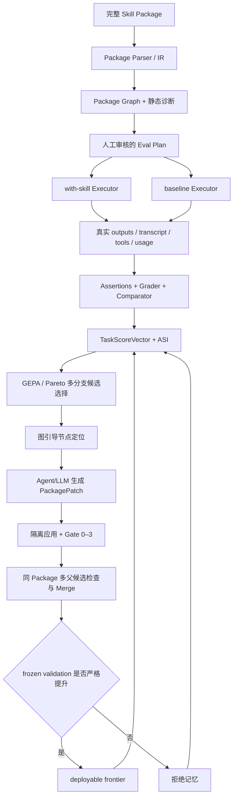
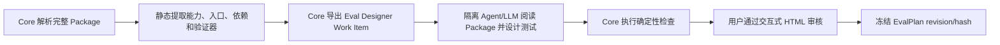

# GEPASE Project State

> 本文件是 GEPASE 的当前事实源（single source of truth），用于同步项目定位、有效架构、阶段状态、执行路线和关键变更。算法学习笔记、逐次施工记录和失效实验细节不在本文件展开。

## 0. 阅读与维护规则

- 本文件只描述**当前仍然有效**的设计与状态；旧结论若与“当前状态”冲突，以当前状态为准。
- 阶段状态：`✅` 已实现且当前证据有效；`🟡` 代码可复用但需重新验收；`⏳` 尚未实现；`⛔` 已撤销或禁止继续使用。
- 每次影响范围、接口、评测、算法、数据或结论的修改，都必须更新“阶段状态”并在文末追加 Diff Log。
- Codex 执行某阶段时，只能实现该阶段明确列出的工作；不得提前实现后续阶段。
- 默认使用 Agent-native 模式；Headless Provider、批量 Agent rollout 或真实外部系统调用只能在配置显式开启且用户授权后使用。Core 记录调用次数、Token、时延和停止条件，但当前版本不建设 API 费用/人民币账单系统。

## 1. 项目定位

### 1.1 一句话介绍

GEPASE（Graph-Enhanced Package-Aware Skill Evolution）是一个面向**完整 Agent Skill Package** 的自动进化框架：它通过多保真 Agent 评测获得反馈，使用 GEPA 式反思进化、Pareto 搜索、图引导的结构化 Patch 和 held-out Gate，联合分析、验证并进化 `SKILL.md`、references、scripts、assets、metadata/runtime 配置及其依赖关系。当前自动修改面覆盖可审计的文本、代码与 metadata；二进制 assets 已进入 PackageSnapshot、图、访问证据和 Gate，但在获得专门的 typed mutation 与验证器之前保持不可变，不能把“完整 Package 可达”误写成“所有文件类型都已可自动改写”。

> GEPASE evolves complete agent skill packages—not just prompts—through multi-fidelity agent evaluation, graph-guided reflective mutation, Pareto search, and held-out validation gates.

### 1.2 要解决的问题

现有 Skill 通常容易“从无到有”，但难以回答：

1. Skill 是否真的让 Agent 把任务做得更好，而不只是写得更规范？
2. 失败来自指令、参考资料、脚本、资源还是依赖关系？
3. 修改后是否只拟合少量样例，或引入结构退化、成本上升和能力遗忘？
4. 在不训练模型权重的前提下，能否把 Skill Package 当成可解释、可验证的外部可训练状态？

### 1.3 项目性质与最终成功定义

GEPASE 是面向真实使用和 GitHub 开源的**应用型框架**，不是以发表算法论文为目标的实验平台。它的贡献是把 GEPA、skill-creator、SkillOpt、Darwin-skill、Heuristic Learning 与 Package Graph 组合成一条可运行、可审计的完整 Package 进化链，并在此基础上补充 package-aware graph、typed patch、validation gate 和同 Package 多父合并。

当前版本不要求用大规模消融证明 package-aware 必然优于只改 `SKILL.md`，也不要求证明 graph-guided 必然优于 random/round-robin。首个开源版本的成功标准是：

1. 输入一个真实、非简单单文件、许可允许再分发的公开 Skill Package。
2. Agent 在隔离环境中完成真实任务，保存任务原生输出、执行轨迹、Package 访问记录和工具证据。
3. 同一任务存在 no-skill/original/candidate 的隔离配对对照，Executor、Grader、Comparator、Analyzer 和 Proposer 不共享隐式上下文。
4. 评分同时覆盖正确性、输出质量、Skill 增益、稳定性、效率和 Package 质量；确定性断言不得冒充综合质量。
5. 候选修改能从失败证据追溯到 Package Graph 节点和结构化 `PackagePatch`。
6. 搜索主链实际执行同一 Skill、同一 lineage 的多分支与多父 Package Merge；不同 Skill Package 之间禁止合并。
7. 至少一个候选相对父代严格改善，并通过未参与搜索的 frozen validation Gate。
8. 输出中文为主、可解释、可复算的评审页和最终 HTML 报告，能够展示 Package Graph、进化过程、候选 lineage、Patch、Gate 与量化结果。
9. Python Core、CLI、Python API 和薄 Orchestrator 的边界清楚，完整流程可由公开命令复现。

以上条件已由 R2–R5 的封存证据满足，S10 也已完成开源整理与发布 Gate，因此当前仓库达到 v0.1 release-candidate 状态。跨 Skill、跨模型、多 seed、大规模统计和论文式消融属于后续扩展，不是首个版本的完成前置。

### 1.4 项目不是什么

- 不是只修改 Prompt 或单份 `SKILL.md` 的工具。
- 不是依赖 LLM 自评分数的文本润色系统。
- 不是为所有 Skill 重建工具、权限和执行生态的通用 Agent Runtime。
- 不是把推演计划伪装成真实执行的评测框架。
- 不是候选越多越好、允许等分版本入池的遗传算法演示。
- 不是两三个 toy case 或一次成功截图就宣称有效的项目。
- 不是为了凑齐论文实验而强制运行大规模 baseline 矩阵、图消融或跨模型迁移。

## 2. 不可违反的设计原则

1. **完整 Package 可达**：Executor 通过不可变 `skill_ref` 访问完整目录；不得用固定字符数静默截断。
2. **任务原生输出**：PDF 任务产出 PDF，表格任务产出工作簿，代码任务产出代码和测试；框架不得合成统一业务 `result.json`。
3. **证据不冒充**：E1 计划推演不能升级为 E2；E2 必须有 Agent 实际产物、observed trace 和 usage。
4. **对照隔离**：with-skill 与 baseline 使用相同模型、fixture、seed、超时和宿主策略，但上下文相互隔离。
5. **Oracle 隔离**：Executor 看不到 assertions、expected output、rubric、对方输出和预期胜者。
6. **严格改善**：候选至少在一个预注册目标上 `delta > epsilon`，同时保护目标不越界；完全等分直接拒绝。
7. **训练验证隔离**：train 证据只用于搜索；deployable frontier 必须通过 held-out validation；若后续引入 test，它只用于最终一次评测。
8. **单一主链**：评测、候选、Patch、搜索和 Gate 各自只能有一套权威模型；不得另建简化实验旁路。
9. **图必须进入决策**：图算法必须实际影响失败定位、修改范围、blast radius、依赖闭包或 merge 决策；首版不以图消融作为完成前置，若实际调试证明图没有带来可解释用途再简化。
10. **先跑通再诊断 headroom**：首个公开 Skill 不设置独立 headroom qualification 前置阶段；先完成小规模全链运行，若搜索停滞再检查任务 ceiling、失败覆盖、评分区分度或 proposer 能力。
11. **私有数据不出仓**：`skills_test/`、`.env`、凭据、内部日志和业务数据不得进入 Git 或公开产物。
12. **角色上下文隔离**：Executor、Deterministic Grader、Independent Grader、Comparator、Analyzer/ASI、Reflection/Proposer 只通过 typed artifact 交换必要信息，不共享对话历史、候选身份或 oracle。
13. **面向当前主链清理**：不要求先给全仓代码打四类标签；以权威 CLI/API、导入关系、测试和当前路线为依据，直接删除确认未使用、重复、冲突或只服务已撤销方向的实现，并记录删除依据。禁止 `reset`、`clean` 或覆盖 dirty worktree。

## 3. 权威系统架构



其中“Package Graph + 静态诊断 → 人工审核的 Eval Plan”不是纯脚本生成步骤，而是以下可复用的 EvalPlan onboarding 子流程：



Agent/LLM 负责提出语义化测试，Core 负责约束、检查、版本化和复现，用户负责审核高影响判断；不得让同一个上下文无约束地同时出题、执行、判分并宣布结果。该子流程对不同 Skill 复用，但生成的具体 EvalPlan 属于对应 Package。

### 3.1 模块职责

| 模块 | 唯一职责 | 不应承担 |
|---|---|---|
| Package Parser/IR | 解析 metadata、Markdown、references、scripts、assets 和引用关系 | 评估任务质量 |
| Package Graph | 表示静态依赖、读取/执行边、失败切片和变更影响范围 | 为了展示而生成无用途图 |
| Eval Engine | 规划、导出、接收、校验和汇总多保真证据 | 自己制造 Agent 业务产物 |
| Agent Host/Orchestrator | 在隔离工作区执行 Eval、Reflection、Patch proposal | 保存候选池或实验事实源 |
| Grader/Comparator | 基于实际产物独立评分、核验声明和盲比输出 | 参与任务执行或看到候选身份 |
| GEPA/Pareto Engine | 根据 task-level 反馈选择父代、组件和搜索方向 | 用等分候选填充池子 |
| PackagePatch/Materializer | 有界修改完整 Package 并保留来源、diff 和回滚 | 无约束重写整个目录 |
| Merge Engine | 在同一 Package、共同 lineage root 下合并互补候选并处理依赖闭包/冲突 | 合并不同 Skill Package |
| Gate/Stores | 执行结构、行为、安全和部署门控 | 用 train 结果授予部署资格 |

### 3.2 Agent Runtime 边界

GEPASE 是独立 Python Core + CLI + Python API，不是一个 Skill，也不内置完整 Agent Runtime。Codex、Claude Code 或其他宿主 Agent 负责真实执行；仓库内 Orchestrator Skill 只是薄适配层。

- 默认模式是 Agent-native，复用宿主 Agent 的子智能体与工具能力，不强制额外 API key。
- Headless LLM Provider 是可选后端，可以按 Executor、Grader、Comparator、Analyzer、Reflection、Proposer 等角色分别配置模型。
- 无论使用 Agent-native 还是 Headless Provider，各角色都必须创建独立上下文，只通过 WorkItem、ExecutionBundle、GradingBundle、ASI 或 PackagePatch 交换信息。
- Provider provenance、调用次数、token count kind、时延、错误和停止条件需要记录；宿主未提供精确 telemetry 时必须标记 `estimated` 或 `unavailable`，不得冒充 `reported`。API 页面账单和人民币费用不纳入当前 Core。

## 4. 算法来源及在项目中的作用

| 来源 | 借鉴内容 | GEPASE 中的落点 |
|---|---|---|
| GEPA | 反思式 mutation、按 task 保存局部优势、Pareto 候选选择、模块级进化 | 以 Package component 为候选模块，以 TaskScoreVector/ASI 为反馈进行搜索 |
| GEPA system-aware merge | 从多个局部优势候选组合新候选 | 作为主搜索链的必要步骤：只在同 Package、同 source snapshot、共同 lineage root 且贡献互补时执行 package-aware merge，明确拒绝 cross-package merge |
| SkillOpt | 有界修改、验证门控、回滚和拒绝记忆 | typed `PackagePatch`、Gate 0–3、RejectedEditStore |
| Anthropic skill-creator | trigger eval、功能 forward test、真实产物、独立 Grader、with-skill/baseline 对照 | R2–R3 的评测主链与评审页面设计，不复用其优化器作为 GEPASE 主体 |
| Darwin-skill | Agent 驱动的反思—修改—验证闭环与可解释历史 | Orchestrator 工作流和候选 lineage 展示 |
| Heuristic Learning | 把代码、规则、上下文和记忆视为可更新策略状态 | 将 Skill Package 作为外部可训练状态，不更新模型权重 |
| Package Graph | 结构依赖、失败相关切片、影响范围和组件互补性 | target selection、blast radius、dependency closure、merge conflict 与报告解释；首版不强制消融 |

算法学习细节应放在学习文档中；本文件只记录它们怎样约束 GEPASE 实现。

## 5. 评测契约

### 5.1 两类评测

**触发评测**只评估 metadata/description 的选择边界：

- 测试集：人工审核的正例、负例和近边界查询。
- 指标：TP、FP、TN、FN、Precision、Recall、F1、Accuracy、Trigger Rate。
- 结果不得混入功能质量分。

**功能评测**评估 Skill 加载后是否真正把任务做好：

- 每个 case 包含 prompt、输入 fixture、expected output 说明、可验证 expectations、质量 rubric、所需能力和最低证据层级。
- 测试主要由隔离的 Eval Designer Agent/可选 LLM 根据完整 Package 与能力边界起草，再由静态规则检查 fixture、重复、泄漏、可执行性和 rubric 完整性。
- 人工审核是正式运行中的可恢复 checkpoint，不要求在写代码前手工逐条造题：系统先生成中文评审 HTML，用户可以逐条编辑/拒绝高风险与 validation case，也可以批量确认低风险 train case；所有 case 必须有明确 review decision 后才能冻结 EvalPlan。
- 初始 reference 建立时，同一 case 同轮运行 no-skill 与 original；后续 candidate 按 8.5 的完整指纹缓存规则与 frozen reference 形成逐 case 对照，cache miss 时重新建立隔离 reference。

#### EvalPlan 人工审核状态机

```text
package_parsed
  → eval_draft_generated
  → automatic_checks_passed
  → awaiting_review
  → review_imported
  → eval_plan_frozen
  → execution_ready
```

1. Core 生成 `EvalPlanDraft`、fixture 清单、rubric、风险和自动检查结果。
2. `gepase eval review` 生成中文为主、可离线打开的自包含交互式 HTML；页面解释每个字段，展示 Package 摘要、case family、prompt、fixture、expectations、rubric、split、风险与修改意见入口，并支持筛选、编辑、approve、reject、request-regeneration 和导出 `review.json`。这里的“自包含”表示不依赖服务端，不表示页面只能静态阅读。
3. 页面导出或 CLI 接收 `review.json`；reviewer 可 approve、edit、reject、request-regeneration。
4. Core 校验 review、重新运行自动检查，并冻结 `EvalPlan` hash。冻结后修改必须形成新 revision，不得静默覆盖。
5. run 在 `awaiting_review` 状态主动停止并保存 checkpoint；导入 review 后使用同一 run id 恢复，不需要重启整个项目。

### 5.2 证据层级

| 层级 | 含义 | 能否产生真实业务产物 | 能否独立决定部署 |
|---|---|---:|---:|
| E0 | 静态结构、引用、语法、安全检查 | 否 | 否 |
| E1 | Agent 只推演计划，不执行工具；保留但默认关闭 | 否 | 否 |
| E2 | Agent 在受控工作区真正执行任务 | 是 | 否，仍需评分与 Gate |
| E3 | 对 E2 产物运行确定性断言 | 复用 E2 产物 | 可作为高可信证据的一部分 |

首个公开 canary 默认启用 E0/E2/E3，`enable_e1=false`。E1 只在用户显式开启时用于 dry-run、执行计划检查或辅助定位，不能作为候选接受或效果结论。当前主线只选择可以本地真实执行的公开 Skill，不为私有 Skill、生产系统或 mock/stub/replay 预先建设通用接口；这些能力等公开主链跑通后再按真实需求补充。

### 5.3 功能评测数据流

1. Executor 保存 `transcript`、任务原生 `outputs/`、tool trace、usage、timing、artifact hash 和 typed failure。
2. Deterministic Grader 对每个 assertion 输出 PASS/FAIL、证据位置和原因；文件存在不等于内容正确。
3. Independent Grader 根据 rubric 评估正确性、完整性、专业度、可用性和格式，并核验 Executor 的事实声明；无法举证默认不通过。
4. 关键 validation case 使用匿名 A/B Comparator；先比较任务质量，再参考 assertion。
5. Aggregator 从原始证据重算 TaskScoreVector，并把失败转为带 evidence refs 的 ASI。
6. Executor、Grader、Comparator 与 Analyzer 分别运行在独立上下文；任何角色不得读取 sibling output、候选标签或不属于自己输入契约的上游对话。

### 5.4 TaskScoreVector

| 维度 | 说明 |
|---|---|
| `task_correctness` | 内容级确定性断言的加权结果 |
| `output_quality` | 独立 Grader/Comparator 的 rubric 质量 |
| `skill_gain` | with-skill 相对 baseline/original 的 paired delta 与 win/tie/loss |
| `reliability` | mean、std、min、max、失败率和异常值 |
| `efficiency` | 时延、Token、工具调用、错误数和产物体积；当前不计算 API 费用 |
| `package_quality` | 结构、引用闭合、渐进披露、脚本测试、安全和可维护性 |

某个 assertion 子指标可以是 1.0，但不能因此宣称 Skill 综合质量满分。首个 canary 不设置单独的 headroom qualification 或已知 mutant 前置 Gate；先使用冻结 EvalPlan 跑通 no-skill/original/candidate 全链。若搜索停滞或评分接近 ceiling，再启动 headroom/区分度诊断并修订下一版 EvalPlan，不能事后修改已产生结果的 frozen revision。

### 5.5 候选接受规则

- `evolution_pool`：只消费 train evidence。候选至少在一个预注册目标上 `delta > epsilon`，所有硬 Gate 通过，保护目标不越界；等分候选拒绝。
- `deployable_frontier`：必须通过 held-out E2/E3 validation 的最小实际提升阈值。
- 允许预注册“质量统计非劣且时延/Token/工具调用/复杂度严格改善”的 Pareto 通道，但不得事后放宽阈值。
- 首个 canary 以 train 与 frozen validation 完成应用框架验收；test split、跨模型和大规模统计不作为 v0.1 前置。若后续增加 test，它不得参与搜索、反思、候选选择、阈值调整或失败分析。

## 6. Package、图与 Patch 契约

### 6.1 Package 可达性

- `EvalWorkItem` 传递不可变 `skill_ref` 与 PackageSnapshot hash，不传固定长度拼接文本。
- Executor 先读取 `SKILL.md`，再按任务需要访问 references、scripts 和 assets；脚本可直接执行，不要求源码全部进入上下文。
- 每次运行记录 available/read/executed nodes、bytes/tokens loaded、未解析引用和 context overflow。
- 减少无关读取、Token 和时延是优化目标，而不是预先截断 Package。

### 6.2 候选与 lineage

候选最少包含：PackageSnapshot、父代、branch、generation、Patch、来源反馈、评测摘要、状态和完整 provenance。候选历史是 DAG；主搜索过程必须建立多个 mutation branch，并在满足 parent contract 时生成多父 merge child。

### 6.3 图引导修改

修改目标必须能够追溯：

`Task failure → transcript/artifact/assertion → observed/static graph edge → target node → PackagePatch operation`

Package Graph 的正式运行证据层是可确定重放的静态结构边与来自真实 Executor/package access 的 observed 边；数据模型仍能只读解析 GH-P1 曾封存的第三类 `semantic_hypothesis` 历史边，但当前没有活跃生成或消费入口。selector 使用的候选图必须明确记录包含了哪些层及其来源；不能因为 parser/schema 能解析历史 overlay，就把没有叠加 observed edge 的静态图宣称为动态图，也不能把历史 semantic edge 带入当前 selector。

图选择优先最小失败相关闭包，并把“失败相关性”和“修改风险”作为两组独立特征。高 fan-out、脚本或跨文件影响可以提高回归风险与后续验证强度，但不得单独取消节点资格或让可执行组件永久失去探索机会。首个版本通过 traceability、dependency closure、conflict detection 和可视化证明图确实参与决策，不要求额外运行 random/round-robin 消融；如果真实开发中图长期不影响任何选择，再在后续版本简化。

### 6.4 PackagePatch

Patch 必须是有类型、可校验、可回滚的操作，例如：

- 修改或移动 Markdown section；
- 添加、更新或删除 reference；
- 更新脚本、测试和依赖声明；
- 修复引用边或拆分过大的 `SKILL.md`；
- 在具有专门 operation、precondition 和内容验证器时对 assets 做受控变更；当前二进制 assets 只读，不属于自动 mutation 面。

Patch 只能修改允许节点和闭包；应用后必须重新解析 Package、计算 graph diff，并运行 Gate。

“一个 Patch 可包含多个相关 target”与“一个 child 有多个候选父代”是两个不同维度：

- **同父代有界多目标 Patch**：从一个 parent 出发，对同一失败假设中因果相关的少量节点做原子修改；默认仍是单目标，只有满足 target-set 契约时才放宽。
- **多父 Package Merge**：把同一 Package/common-root 下已经形成的多个候选父代贡献合成新 child；它不能替代必须原子成立的跨文件修复，因为两个单独无效的“半个修复”可能根本没有资格进入 merge。

因此，Graph Hardening P0 将允许受控的 1–2 target、1–2 file、1–2 operation 修改，但不会开放任意多文件重写；完整限制和 Gate 见 8.8。

### 6.5 同一 Skill 的多父 Package Merge

“多父”是同一个 Skill Package 的多个 `PackageCandidate` 版本，不是多个不同 Skill，也不是简单拼接文件。它是当前优化主链的一部分，不是可选展示能力。

父代集合必须满足：

1. `package_id`、source snapshot 与 lineage root 相同；cross-package parent set 是硬错误。
2. 来自不同 mutation branch，并且各自有可追溯的局部优势、失败覆盖或组件贡献。
3. Gate 0/1 通过，base/precondition 未 stale；不能用无效父代凑数量。
4. 相对最近共同祖先提取 contribution subgraph，并补齐 references/imports/calls/tests/interface 等 dependency closure。
5. 无冲突时 deterministic union；有冲突时只允许 MergeProposer 对 conflict set 返回 typed resolution operations。
6. merge child 记录每个节点的父代来源、冲突决议和完整多父 lineage，并重新通过与普通候选相同的 E2/E3 与 frozen validation Gate。

搜索调度器每轮都要检查 merge eligibility；出现两个及以上满足契约且贡献互补的父代时必须创建并验证 merge child。若当前没有合法 parent set，必须记录 `no_eligible_parent_set` 及原因，而不能退化为跨 Package 合并或跳过审计。

## 7. 当前状态（2026-07-31）

### 7.1 总结

R1 已完成仓库整理与权威 Core 收敛；R2 的公开 canary 与 EvalPlan onboarding 已完成；R3 已使用同一 frozen plan 完成 8 组 no-skill/original paired functional eval；R4 已把 GEPA、Graph、typed PackagePatch、strict Gate、恢复分支与同 Package 多父 Merge 接回唯一 Core 并完成真实运行。R4 共评测 3 个 mutation branch 和 1 个 merge child：4/4 候选覆盖完整 5-case train，3 个 train-admitted 候选覆盖完整 3-case held-out validation；29 个 fresh candidate case 形成 29 个可独立重算的 TaskScoreVector，73 个 Executor/Grader/Comparator 上下文全部隔离，R4 8/8 机器 Gate 通过。

R5 已实现并封存只读的 `CanaryReportBuilder` Python API、`gepase report build/verify` CLI、中文自包含交互报告和六项独立机器 Gate。报告只消费已封存的 R2–R4 evidence，重新校验 19/429/877 个上游 artifact，复制并复验 9 个任务原生 GIF，导出 7 文件 deployable Package；本阶段 Agent/API 调用均为 0，未重跑 R3/R4、未重新搜索候选。6/6 R5 machine Gate、146 tests、Ruff、Pyright、secret/link/license/diff check 均已通过。Codex Browser 安全策略禁止自动打开本地 `file://`，未绕过；用户已在目标路径打开正式报告并确认布局、GIF case、Package Graph 控件和评分下拉正常，R5 完成并解锁 S10。

S10 已完成面向 GitHub 的发布整理。仓库现在提供中英双语 README、按 v0.1 封存证据更新的中文算法/使用学习手册、真实 canary 图像与量化结果、架构/结果 SVG、安装与复现文档、Agent-native 默认路径、按角色可选 Headless 配置契约，以及 `report build/verify/deploy` 闭环。2026-07-24 又新增并按用户反馈扩充 `learning-course/` 初学者课程：14 个相互链接的 HTML 页面以同一个 Package/case 的端到端进化为叙事主线，从术语、五类思想来源、Package Graph、EvalPlan、真实 Agent 评测、评分/Gate，进入独立的 GEPA 深入与 Pareto 推导实验室，再回到 GEPASE 搜索适配、PackagePatch、真实 canary、源码使用和面试复习。课程复用 R5 封存 GIF，不改写任何算法证据；已由提交 `c9ff12f8b` 推送到 `github/main`。

2026-07-28 已从公开发布基线 `github/main=c9ff12f8b` 建立 `codex/graph-hardening` 分支，专门承载 v0.1 之后的图能力加固。本地 `codex/github-release-v0.1` 与该公开基线保持一致；旧开发快照 `main=ea84ea898` 保持不动。GH-P0 已按纯离线契约完成：只读校验并复用 R2 frozen PackageSnapshot、R3 sealed ExecutionBundle/package access/Analyzer-ASI evidence 和 R4 failure slice/selector/proposal artifact，未回写 R2–R5/S10、公开 canary source、deployable Package 或 `skills_test/`。新 Core 将 46 条 parent-train typed access 全部映射成 observed edge，7/7 Package 文件拥有显式 parse status；相同三个 R4 failure slice 的 old/new replay 中，所有可修改 target 获得可审计的 relevance/exploration/risk 分解，1 个 replay 的 top-1 从 `SKILL.md` 转到 `core/validators.py`，top-10 executable 可达数净增 1。TargetSet fixture 又证明默认单目标、同 parent/同 evidence/有 static path 时最多 2-target/2-file/2-operation，并在第一项操作后注入故障时不产生 partial child。GHP0-G00–G08 共 9/9 通过，`offline_value_gate=passed`；Agent/API/Executor/Grader/Comparator/Analyzer/Proposer/Eval/new-candidate/new-effect-score 均为 0。

GH-P1 随后按 fixture-first 契约实施并封存，但阶段结论为 **stalled**。Core 当时在既有 `AnalyzerWorkItem/AnalyzerSubmission`、`PackageGraph` 和 selector 主链中加入七类 typed semantic hypothesis、同 snapshot/节点/内容/evidence/provenance 校验、精确 cache、独立 `semantic_hypothesis` layer 和 consumer allowlist；没有新建 Graph/Evaluator/Search。确定性与对抗 fixture 先通过后，只对 `functional-train-input-badge-003` 启动一次隔离 Analyzer，得到 4 条 Core-accepted 假设。它们只让 5 个精确端点获得不超过 `0.35` 的 selector 贡献，其中 `validate_gif` 从 rank 4→3、Core Workflow instruction 从 11→6、`GIFBuilder.save` 从 159→142；static/observed 图、node set、eligibility、validation intensity、TargetSet、dependency/safety closure、Merge 和 Gate 权限均未改变，因此 `offline_value_gate=passed`。但该唯一 Analyzer 的估算总 token/时长为 `29,500 / 507,000 ms`，超过冻结的 `12,000 / 180,000 ms`，所以 GHP1-G06 失败，最终 7/8 Gate、stage `stalled`，没有解锁 semantic 下游。post-GH-E1 cleanup 已将其 active generator/cache/prompt/selector/slice/Analyzer-overlay 路径退役；只保留解析 sealed GH-P1 所需的嵌入模型、PackageGraph layer 和历史 HTML 兼容。GH-P1 现为 **sealed/stalled/read-only 历史实验**，不是当前 runtime feature。除历史 1 次 Analyzer 外，Headless/API、Executor、Grader、Comparator、Proposer、Eval、新 candidate 和新效果分数全部为 0。GH-P0/P1 都只新增结构与工程证据，不改变 v0.1 的 Skill 效果结论。

用户已于 2026-07-28 明确授权在同一个公开 `slack-gif-creator` 上执行一次**完全独立的图加固后效果复现**。该路线不以 GH-P1 通过为前置，也不消费 semantic hypothesis。GH-E0 已把 GH-P0 验证的 `static + observed` graph view 小范围接入现有唯一 `R4EvolutionController`：旧配置仍复现 static-only 目标，新配置显式启用 parent-bound fresh compile/overlay/cache；initialize/首轮 proposal/recovery 两个入口都经同一 builder 和同一 proposal-scope 组装路径取图。seed-original train 映射 46/46 access、形成 46 observed edge并过滤 11 个 no-skill/held-out work；candidate-parent train fixture 映射 45/45、形成 45 observed edge并硬拒绝 sibling/validation。两个首轮 work 共 4 个 target 的 dynamic contribution 全部非零，并都保存 top-k、Python executable alternative、图 hash/layer/source 和 1–2 target 有界契约。pre-GH-E1 stabilization 又修复了新增默认字段造成的旧 R4 resolved-config 指纹漂移：旧配置现在严格复现 sealed hash `3a224bcb…`，并以独立 access artifact 封存 selector graph cache 的 1 次 miss→1 次 hit，避免把瞬时缓存状态写入不可变 proposal identity。GHE0-G00–G08 9/9、171 tests、Ruff、Pyright、43 schema 幂等与 44-artifact seal 均通过；所有 Agent/评测/Proposer、mutation candidate 和新效果分数为 0。

随后只读 GH-E1 preflight 确认 source/EvalPlan/seals/runtime 正常，并暴露出 create/resume、导出前预算预留、条件 Merge 和多结局报告四类通用收口缺口。GH-E0.5 已将它们收敛到唯一既有主链并完成零 Agent 封存：GHE05-G00–G09 为 10/10，生命周期 fixture 验证 create/open/resume、config/checkpoint/hash binding 与 tamper/terminal fail-closed；跨天 pause fixture 将 `90,000,000 ms` calendar time 分为 `3,600,000 ms` active 与 `86,400,000 ms` paused，resume 不清零且 continuation 幂等；预算 fixture 在完整 batch 导出前阻断超额、写 `budget_limit` checkpoint、记录实际 settlement variance；Merge 对全部 train-admitted parent set 枚举并支持 typed `no_eligible_parent_set`；同一 reporting 子系统已验证 0/1/2 frontier 与 `budget_incomplete`。新 stage 含 69 个 indexed artifact，189 tests、Ruff、Pyright、schema 幂等、安全/link/license/diff 与 protected tree 均通过。

GH-E1 的 fresh paired reference 已终态封存，GHE1-G00–G03 为 4/10。fresh source Package/IR/static graph 与 frozen plan 绑定后，8 个 case 的 16 个 no-skill/original work 形成 16 条 E2、16 条 E3 和 16 个 TaskScoreVector；隔离 Independent Grader 16、Comparator 6（3 个 AB/BA reconciliation）、Analyzer/ASI 8 全部完成，reference run seal 为 485 checked/0 missing/mismatch/unindexed。此前 Executor host 账实差异没有被覆盖：2 个错误派发、1 个损坏 GIF 重执行、2 个 fail-closed Grader submission 和 1 个中断 Analyzer context 均以 6 条 append-only `HostAttemptAccounting` 进入同一 Core runtime；46 个 role settlement + 6 个非 submission context = 52 个真实 Host context、598,505 estimated tokens、4 repairs、6,300,124 active ms、11,720,000 cumulative Agent duration。E1.3 已由唯一既有 Controller 在 seed parent 上 fresh 编译并叠加**仅** original-train typed access：61/61 typed mapping、61 observed edge、0 rejected/weak fallback、474 static + 61 observed + 0 planned + 0 semantic；5 个 accepted unique work 与 11 个 filtered unique work 可审计，no-skill、held-out、sibling/cross-snapshot 均未进入边。E1.4 的两个 graph-guided、2/2/2 bounded Proposer context 原始输出分别缺少必需 `op`、以及 `operation_id` 不符合 `op-[a-zA-Z0-9._-]+`，均以 `submission_validation_failure` typed failure 和原始响应保留，Host 没有归一化、没有构造 Patch。用户授权 repair tranche 后，唯一主链以同一 scope 的两个 valid repair submission 形成两个 PackagePatch/Candidate，并都通过 Gate 0/1。E1.5 对 `candidate-db0b9d19f0ff48b624ea03b6` 规划 5 个 train case、首批导出 3 个；只有 orbit work `work-7bde15e8233bde28fa9c1297` 的 fresh E2/E3 被 Core 接收。status 初次 submission 的 package-access node id 不匹配、readable 初次 submission 的可选 `generation-report.json` 含敏感路径、status 唯一 repair 的可选 `validation.json` 含敏感路径；readable repair 在停止线被中断。四个未接收 Executor context 均以 append-only `HostAttemptAccounting` 进入同一 evolution runtime，未删除 workspace、未归一化 artifact。为使这一失败路径可审计，既有 `ExecutionBundle`/Eval Engine 增加显式 `repair_attempt` identity，且 bound candidate subrun 将未接收 host-attempt 写入唯一 owner runtime；未新建 Runtime/Evaluator/Controller。冻结 `max_repair_attempts_per_work=1` 已禁止 status 的第二次 repair，readable repair 也未获自动续跑；当前 checkpoint `budget-checkpoint-5d23b80b3ea0123c444707dc` 保留两个 unsettled work。evolution runtime 累计为 9 Agent calls、288,000 estimated tokens、1,814,840 active ms、4 proposals、2 candidates、2 repairs；真实 Host context 为 reference 52 + Proposer 4 + E1.5 Executor 5 = 61。fresh original 相对 no-skill 的 8-pair mean skill gain 为 `-0.0360890625`，它只是本轮参考基线，**不是** Candidate、Graph-guided Patch、GEPA 搜索或图加固算法效果。`candidate-train-repair-stall-audit.json` 记录 provisional `budget_incomplete` 停止线，stage seal 为 21 checked/0 missing/mismatch/schema error/unindexed；GHE1-G04–G09 仍 pending，尚无 train Gate、held-out validation、Merge、deployable 或新算法效果结论。下一步必须由用户在不改写当前冻结契约的前提下决定终止方式，或明确授权一个独立的新运行契约；不得自动导出或调用更多 Executor repair work。

按用户停止线完成的 **GH-E1 zero-Agent recovery stabilization** 没有修改、ingest 或推进当前 run，也没有调用任何 Agent/Headless/API 角色。既有 Core 现把 deterministic submission packaging correction、deterministic package-access metadata correction 与真实 Agent re-execution 分开；额外 re-execution 仍要求新的 hash-bound 用户 checkpoint。required-only evidence manifest 保留原始 workspace/hash，任务原生输出、transcript、package-access 与 observed trace 按字节校验；可选诊断可以带 hash/排除原因留在原始 workspace，必需证据含敏感内容则 fail-closed。package-access 只允许在 path 对 frozen `package_node_map` 唯一映射时校验/补全 `node_id`，原值、修正值、mapping hash 与原因 append-only 保存，不能补造访问。repair exhaustion 现在可在既有 Eval Engine/ledger/runtime 中 terminalize 为 typed `partial_artifact`/`invalid_submission`，释放 reservation、复用已记录的 HostAttempt 而不重复增加 call/token/time，并让 candidate pipeline 按预注册失败分继续剩余 train case、跳过无必要的 Grader/Comparator。

对两个 unsettled work 的原始 workspace 做只读审计后，status 可选用其 repair attempt：必需 evidence 完整、optional `validation.json` 因敏感私有路径排除；readable 可选用 initial attempt：必需 evidence 完整、optional `generation-report.json`/`verification.json` 因敏感私有路径排除。两条路径都不修改任务原生输出字节、不伪造 provenance，也不重复结算 Host context；status initial 的两个 `core/gif_builder.py` node id typo 也可由 frozen map 唯一确定性修正，但不是首选源。readable repair 自身缺 transcript/package-access/trace，单独使用时只能 typed `partial_artifact`。恢复专用 GHER-G00–G09 为 10/10，新增 stage 投影后 seal 为 25 checked/0 missing/hash mismatch/schema error/unindexed；定向 23 tests 与全量 203 tests、Ruff、Pyright、61 schemas 幂等、安全/link/license/diff/protected-tree 通过。正式 `machine-gates.json` 仍保持 GHE1 4/10，provisional `budget_incomplete` 不变，**代码已实现、工程恢复机制通过测试，算法效果仍未验证**。建议在用户明确确认后继续当前 evolution run：先且仅先执行两次 deterministic stage + preaccounted ingest，再在导出任何剩余 Executor work 前暂停；当前不需要新 evolution run 或完整 reference rerun。

随后复核发现上述 v1 GHER-G04/G05 是 stage script 中的常量 `True`，旧 10/10 计算结论已由独立的 **recovery correctness v2** 正式取代，旧 25-object seal 仅作为未覆盖的历史记录保留。v2 用当前 source/workspace/HostAttempt 的 typed hash binding、4 类混证 fault injection 和真实 runtime checkpoint freshness fixture 重新计算 GHER-G00–G09，得到 10/10；7-object 独立 seal、全量 205 tests、Ruff、Pyright、63 schemas 幂等及其余工程 Gate 均通过，且 correctness 阶段 reference/evolution tree 不变。

在 v2 全部通过后，用户授权的两项零 Agent 恢复已经沿唯一 Eval Core 实际执行：status 使用 repair source，readable 使用 initial source；required-only staging 未带入 optional diagnostic，两个 reservation 都以 `preaccounted_host_attempts` 和全零 actual usage 结算。candidate train ledger 由 `completed 1 / exported 2 / pending 2 / failed 0` 变为 `completed 3 / exported 0 / pending 2 / failed 0`，records/submissions 为 `6/3`；evolution runtime 仍为 `9 calls / 288,000 estimated tokens / 1,814,840 active ms / 4 proposals / 2 candidates / 2 repairs`，open reservation 为 0。新的 `post_recovery_checkpoint` 为 `budget-checkpoint-6b5e58c6842d19e135394ebf`，state hash `812e6d3c8e6322881444a9151510c39775a37eebef12b2082d80cab716b0d34e` 与持久化 runtime 精确一致，旧 checkpoint 已被判 stale；`recovery-v2-ingest` 10/10、4-object seal 通过。当前已停在新用户 checkpoint，未导出剩余两个 work、未创建新 continuation decision、未运行 train Gate，也未调用 Agent/Headless/API；正式 GHE1 仍为 4/10，算法效果仍未验证。

用户随后以 checkpoint/hash/state/evidence 四重绑定明确批准剩余两个 train Executor 的有界 tranche。现有 ActiveSessionRuntime 写入 `continuation-4653c5a157027fd2c47f7205` 后，将 `work-aadafebefc1e2d501cbe7db4` 与 `work-f4822f29168045273356a3fc` 作为同一原子 batch reserve/export；两个隔离 Agent context 分别生成 `uploaded_badge_lift.gif` 与 `emoji_star_bounce.gif`，且 workspace 只含任务原生 GIF、transcript、observed trace 和 package access。两者最初误用系统 Python 遇到缺失依赖，随后仅在同一已授权 context 内改用仓库现有 `.venv` 完成，错误在 trace 中保留；没有新 Agent context、Agent repair、HostAttempt 或 deterministic evidence correction。唯一 Eval Core 的 `submit-work → ingest` 为两项各形成一条 E2 和一条 E3，deterministic assertions 均为 5/5，但这不等于综合质量分。

candidate train ledger 因此达到 completed 5 / pending 0 / exported 0 / failed 0 / records 10 / submissions 5；仍未创建 blind Grader、TaskScoreVector 或 strict train Gate。ActiveSessionRuntime 权威累计为 11 calls / 354,500 estimated tokens / 2,790,748 active ms / 4 proposals / 2 candidates / 2 repairs，cumulative Agent duration 为 6,211,621ms，open reservation 为 0。本 tranche 相对批准增量实际使用 2 calls / 66,500 estimated tokens / 975,908 active ms / 0 repairs，Token 与 active-time variance 分别为 `+2,500` 与 `+375,908ms`；历史 `evolution-state.json` 的较小 projection 不得覆盖该总账。语义过强的中间 `candidate_train_complete` checkpoint 保留为 stale 历史，最新权威停止点已追加为 `budget-checkpoint-43c2fac4562f4bcf58af0023`（`budget_limit`，SHA256 `ec43aec7…`，state hash `b5ab56b8…`，evidence hash `9a75c768…`）。`executor-tranche-2/` 以 14-object 独立 seal 保存 updated progress；正式 GHE1 保持 4/10，当前 outcome 仍为 `budget_incomplete`，算法效果未验证。

项目现已在**一个公开 Skill、一个 frozen EvalPlan、一个模型快照和一次搜索运行**上获得真实优化证据：`candidate-04b26dff2bc83b82334bf184` 的 train mean delta 为 `+0.04190`，held-out validation mean delta 为 `+0.12427`，3/3 validation case 均严格胜出且保护阈值通过，已进入 deployable frontier。该结论足以证明当前 canary 上的应用主链有效，但不能外推为跨 Skill、跨模型或统计普遍性。严格 Gate 同时拒绝了 train `+0.07643`、validation `-0.19782` 且发生真实 timeout 的恢复分支，以及 validation 总均值 `+0.05828` 但 `emoji_animation=-0.09144` 越过 category floor 的 merge child。

权威边界已冻结为 `EvalWorkItem → ExecutionBundle → EvaluationRecord/TaskScoreVector → PackageCandidate/PackageGraph → PackagePatch → GateDecision → EvolutionPool/merge contract`。根 Python API 导出每个边界的唯一模型；E1 仍可表示但 CLI 默认关闭且 Gate 2 硬拒绝 E1，费用字段和 `improvement_or_equal` 已移除，固定字符数 Package/component 截断已移除。R1 最终工程 Gate 为 Ruff 通过、Pyright 0 errors、pytest 127 passed、15 个保留 CLI 帮助入口通过、schema 导出幂等、secret/private-path 0 findings、Markdown links/license/diff check 通过。以上只证明清理和工程回归。

首个公开 canary 已固定为 Anthropic `slack-gif-creator` commit `fa0fa64bdc967915dc8399e803be67759e1e62b8`、upstream tree `c61d2f7bb6334b68a6936ad3f41ebfc7cb76fe2a`，七个 Git blob、文件 mode、Apache-2.0 许可和精确依赖均有 manifest/lock 校验，完整七文件 PackageSnapshot hash 为 `ce42d8a…`。R2 frozen plan hash 为 `1893ad9a…`；R3 run 位于 `artifacts/runs/r3-slack-gif-creator-paired/`，429 个文件已封存并通过 hash 校验。R3 没有调用外部 LLM API/Headless Provider，Agent Host 未提供精确 token telemetry，所有角色 token 均明确标记为 `estimated`，不能表述为 provider-reported usage。

**GH-E1 当前终态（2026-07-29）**：冻结流程已完整执行并封存，GHE1-G00–G09 为 10/10，`effect_outcome=no_strict_improvement`。两个 graph-guided candidate 均完成 5-case train：`candidate-db0b9d19f0ff48b624ea03b6` 为 `+0.07083`、5 wins/0 ties/0 losses并进入 held-out；`candidate-c36eb3adc54c93e3233d59e0` 为 `-0.16221`、3/0/2，在 train 拒绝。db0b 的 3-case validation 为 `+0.11635`、2/0/1，但 `quality_efficiency=-0.15972` 低于冻结 `-0.05` category floor，因此 Gate 3 拒绝，deployable frontier 为 0。唯一 train-admitted branch 不足两个父代，Merge 正常终态为 typed `no_eligible_parent_set`，未创建假 merge child。Evolution 权威总账为 43 Agent calls、984,100 estimated tokens、9,958,177 active ms、74,693,098 paused ms、18,266,831 cumulative Agent duration、6 repairs、4 proposals、2 candidates；reference/evolution/report root/final/stage seal 分别为 485/579/36/32/88 checked 且全有效。最终中文报告位于 `artifacts/runs/gh-e1-slack-gif-creator-report/final/index.html`，包含 29 个 hash-verified GIF。前述 recovery/blocker/checkpoint 段落均保留为 append-only 历史，不再代表当前状态。

**post-GH-E1 stabilization cleanup（2026-07-30，标识 `post-gh-e1-stabilization-cleanup`）**：本阶段只做零 Agent 的代码收敛、future-contract 修复和 sealed evidence 离线复算，不改写 GH-E1 的 config/EvalPlan/scoring/model/Patch/Gate/candidate/usage/outcome。未来 proposal accounting 现在把独立 mutation intent 与同 scope Agent repair 分开：initial + repair 计 `1 proposal / 2 calls / 1 repair`，而 sealed GH-E1 的 `4 proposals / 2 candidates` 历史账本保持原样。未来 Validation Gate 从 paired TaskScoreVector 唯一复算 `task_score_efficiency=mean(candidate.efficiency-parent.efficiency)`，保存源 vector refs，并显式区别该 axis 与 `quality_efficiency` case category；primary utility 仍只含 correctness/quality，避免重复计数。历史 db0b Gate 仍保留空 secondary 与 `efficiency_regression=0`，不重写结果。

调用链审计确认仍只有一个 `MultiFidelityEvalEngine`、`PackageCandidate`、`PackagePatch`、`R4EvolutionController` 和 `ValidationGatedAcceptance`；R5 compatibility builder 与 multi-outcome builder 由同一个 report CLI 分发且不拥有搜索状态。GH-P1 active semantic 路径已退役；formal selector view 只允许 static + observed。未接入 Controller 的 `BranchRegistry.refine`/本地 frontier/refinement helper 已删除。GH-E1 实际深度如实收敛为两个 seed-rooted generation-1 candidate：Reflection 没有产生 generation-2 child，recovery 也是新的 seed-rooted generation-1 branch；因此只能称为一次 bounded GEPA-style reflection/Pareto run，不能声称已经执行多代迭代。未来第二代建议冻结为 `2 initial + ≤2 refinement/recovery + ≤1 conditional Merge`，继续服从 `max_candidates=5`。

**F.4/F4c/F4d/F4e/POST-F4E-RELEASE 当前状态（2026-07-31）**：F4c 已真实完成 2 个 generation-1、2 个 parent-bound generation-2 和 1 个同 Package Merge child，共 4 proposals/5 candidates；Reference 复用、Candidate 中间封存、generation-2、held-out 和 Merge 均真实走过唯一主链。F4d 随后以零 Agent 修复 validation-incomplete 的 Controller 持久终态，将 repair 用尽的 held-out 证据标为不可评分、不可部署但已处理，不生成假分、假 Grader/Comparator/winner/ASI；F4c 已按冻结 v1 规则正式 COMPLETE，结果为 `no_strict_improvement`、deployable frontier=0，evolution root seal 1280/1280、原始中文报告 seal 54/54。通用 relative-efficiency v2 已在同一评分/Acceptance 主链实现，并只读复用上述 sealed evidence 做事后 policy replay：结果为 `strict_improvement`，deployable frontier 含 2 个候选；这只是同一真实运行证据的零 Agent 策略重算，不是新的预注册 Agent 实验，也不能外推到其他 Skill、模型或 seed。PGEF4D-G00–G06 为 7/7，两套规则、policy hash、Gate、frontier 和报告均独立保存，未覆盖原 F4c evidence。F.4e 已只改既有 reporting 展示投影和 HTML renderer，生成新的通用中文叙事报告；PGEF4E-G00–G05 机器 Gate 为 6/6，用户随后确认视觉与交互没有问题，PGEF4E-G06 已以 append-only review evidence 通过，阶段为 7/7 完成。POST-F4E-RELEASE 又以 schema version 区分历史与未来默认：新 `2.0.0` evolution/report config 默认 `relative_v2`/`narrative_v1`，旧 `1.0.0` 缺省继续解释为 v1/classic 且旧 R4 hash 不变；F4e 报告已发布为新的 56/56 tracked self-contained artifact，release stage 7/7 seal 有效。旧证据和算法结果始终保持不变。

### 7.2 阶段状态表

| 阶段 | 状态 | 当前有效结论 |
|---|---:|---|
| S0 工程底座 | ✅ | Python 工程、配置、artifact、secret scan 和基础测试可用 |
| S1 Benchmark 基础设施 | 🟡 | schema、split、fixture、mutation test 可复用；Benchmark v1 只作集成/校准 fixture，不是质量基准 |
| S2 Eval Core | ✅ | EvalWorkItem、ExecutionBundle、ledger、cache/resume、E0–E3 边界和 Agent-native 导出/回收可用 |
| S3 Package IR/Graph | ✅ | 完整文件注册、显式 parse status、确定性 Markdown/Python/shell/config IR、snapshot-bound typed observed overlay、reverse slice 和 graph diff 可用；历史 R4 未消费动态边，GH-P0 已离线验证修正组件，GH-E0 已完成实时 Controller 接线 |
| S4 Baseline 框架 | ⛔ | B0–B6、大矩阵、价格估算和独立 evaluator/runner 已在 R1 删除；no-skill/original 统一走 Eval Core |
| S5 GEPA/Candidate Core | ✅ | R4 唯一 Controller 已接入锁定的 `gepa==0.1.4`、TaskScoreVector、ASI、Pareto/current-best snapshot、CandidateStore 与 checkpoint |
| S6 Graph-guided Patch | ✅ | R4 的真实分支继续保持 static-only 历史事实；GH-P0 已工程验证 observed feature、相关性/探索/风险分解、risk→validation intensity 和同父代 1–2 target 原子契约，但尚无新的真实候选效果 |
| S7 Gate/Rejected Memory | ✅ | 新评分上的 Gate 0–3、严格 train admission、held-out floor、variance 与 rejected memory 已在 4 个候选上重新验收 |
| S7.5 Local-real repair | ⛔ | action-based 评测、readiness 结果和人工 A/B 导出已撤销/删除 |
| S7.6 多分支搜索 | ✅ | 3 个真实 mutation branch、候选级单次 Reflection、恢复分支、lineage 与 Pareto snapshot 已进入唯一主链 |
| S8 Package Merge | ✅ | A+C 的 same-package/same-snapshot/common-root merge child 已 materialize、完成 Gate 0–3 并因 held-out category regression 如实拒绝；cross-package 仍硬禁止 |
| S9 旧主实验 | ⛔ | 第二套 experiments 系统及 0.6/1.0/研究结论已删除并失效 |
| R0 清除旁路 | ✅ | S9、synthetic `selected_action/expected_action/result.json` 路径和失效证据已移除 |
| R1 仓库整理与主链收敛 | ✅ | 定向删除重复/冲突控制器，冻结九个权威模型，127 tests 与全部工程 Gate 通过；未产生效果结论 |
| R2 canary 接入与 Eval 审核 | ✅ | Package/smoke/Designer/check/review/freeze/resume 和用户离线页面交互确认均有 durable artifact；10/10 Gate 通过 |
| R3 真实 paired 执行与评分 | ✅ | 8 pairs/16 real E2+E3、16 blind Grader、6 AB/BA Comparator、8 graph-linked Analyzer、16 可重算向量；8/8 Gate 通过，original mean skill gain `-0.0455` |
| R4 GEPA/Graph/Patch/多父 Merge | ✅ | 4 candidates、29 fresh case、73 隔离评测调用、1 个 deployable candidate；8/8 Gate 和 877-file run seal 通过，墙钟预算 overrun 如实记录 |
| R5 全链 canary 与中文报告 | ✅ | 只读报告主链、20-file run seal、6/6 machine Gate、用户本地视觉/交互确认与 deployable Package 均已封存；未重复搜索 |
| S10 开源发布 | ✅ | 中英双语 README、v0.1 中文学习手册、14 页深度学习课程、公开图像/结果、复现与 deploy 流程、role-scoped Headless 配置、精简发行包和 7/7 release Gate 已完成并推送 `github/main`；未发布私有数据 |
| POST-F4E-RELEASE 发布收敛 | ✅ | 新 `2.0.0` 默认 relative-v2/narrative，旧 `1.0.0` v1/classic 与哈希兼容；F4e 叙事报告、用户视觉确认和 7/7 release Gate 已安全公开，零 Agent/新效果证据 |
| GH-P0 动态图与有界 Patch 加固 | ✅ | 纯离线 9/9 Gate：46 observed edges、100% file/parse-status coverage、1.0 typed mapping、old/new selector replay、risk/intensity 和 2/2/2 atomic TargetSet 均封存；0 Agent/API/Eval/candidate/effect score |
| GH-P1 受控语义假设层 | ⛔ sealed/stalled/read-only | 历史 7/8 Gate 与单-cluster Analyzer artifact 保持封存；active generator/cache/prompt/selector/slice/overlay 已退役，只保留旧证据解析兼容，不是当前 runtime feature |
| GH-E0 实时图主链接线 | ✅ | 唯一 Controller 的 initialize/首轮/recovery selector 已消费 parent-bound fresh static+observed graph；旧 config 严格保持 sealed hash/static 行为，统一 proposal scope、可审计 cache miss→hit、seed/candidate train 绑定、top-k/脚本备选与 2/2/2 scope 均通过 9/9 Gate；0 Agent/Eval/mutation candidate/effect score |
| GH-E0.5 可暂停运行与多结局收口 | ✅ | 10/10 零 Agent Gate：严格 create/open/resume、active-session 预算 checkpoint/用户续跑决策、条件 Merge、0/1/多 deployable/budget-incomplete 报告、GH-E1 config 与 dry Gate 均封存；69-artifact seal、189 tests、Ruff/Pyright/schema/安全/链接/license/diff/protected tree 通过 |
| GH-E1 图加固后效果复现 | ✅ `no_strict_improvement` | GHE1-G00–G09 10/10。两个 bounded candidate 完整覆盖 5-case train：db0b 为 `+0.07083`、5/5 wins并 train-admitted，c36e 为 `-0.16221` 被拒；db0b held-out 为 `+0.11635`、2/0/1，但 `quality_efficiency=-0.15972` 越过 `-0.05` category floor，最终 frontier=0。无合法多父集合，typed `no_eligible_parent_set`；中文报告与完整负结果已封存。 |
| post-GH-E1 stabilization cleanup | ✅ 零 Agent | 唯一主链收敛、proposal intent/repair 分账、TaskScoreVector efficiency→Gate 显式映射、selector sealed replay、GH-P1 active semantic 退役、真实 GEPA 深度纠偏；独立 stage/machine Gate/seal 记录工程结论，不新增 candidate 或效果分数 |
| POST-GH-E1-FINALIZATION | ✅ F.1–F.3、F4c/F4d/F4e 完成 | PGEF-G00–G05 6/6；F4c 真实完成 4-proposal/5-candidate 搜索、generation-2 与同 Package Merge，并由 F4d 按 v1 零 Agent 收口为 `no_strict_improvement`、frontier=0。relative-efficiency v2 对同一 sealed evidence 的零 Agent replay 为 `strict_improvement`、frontier=2；PGEF4D-G00–G06 7/7。F4e 已完成通用中文叙事投影、lineage/分数/质量—成本/任务 GIF/Graph/Patch 呈现，机器 6/6 与用户视觉验收共同构成 PGEF4E-G00–G06 7/7；算法结论未改变。 |

### 7.3 已有阶段的实现档案

本节说明“代码为何形成、有效机制是什么、下游怎样消费”。它不是重新认可旧效果：凡依赖旧 action-classification 或 S9 旁路的分数，仍以 7.4 的撤销声明为准。S10 后公开仓库只保留当前主线的 R1–R5/S10 阶段证据和 R2–R5 run；S0–S8 的旧历史 artifact/result 已从发布树移出，其当时机制由本节保留，不能再把旧路径当成可执行事实源。

#### S0：可复现工程与 Artifact 底座

**阶段目的**：先建立开源项目所需的可安装、可复现、安全底座，防止后续 Agent 实验只有散乱脚本和不可核验日志。

**核心实现**：

1. 建立 Python 3.11+、`uv`、src layout、Typer CLI、Pydantic v2、pytest、Ruff 和 Pyright 工程。
2. 建立强类型配置与脱敏 resolved config；配置 hash 不包含明文凭据。
3. 定义 `RunManifest`、`StageReport`、`ArtifactRef` 和预算 schema，并实现原子写、内容 hash 与 artifact index。
4. 实现 `doctor`、`config validate`、`artifact verify` 和 deterministic mock vertical slice。
5. 配置 CI、secret/private-path scan、Markdown link check、wheel/sdist 与本地全新环境安装验证。

**主要产物**：`src/gepase/config/`、`src/gepase/schemas/`、`src/gepase/store/artifacts.py`、`examples/mock_project/`、`artifacts/stages/S0/`。

**阶段关系**：S0 的配置、artifact 和 stage report 是之后所有阶段的事实源。它只证明工程底座可用，不包含任何 Skill 效果结论。

#### S1：私有 Corpus 建档与公开 Benchmark v1

**阶段目的**：把“目录里有几个 Skill”转化为有许可、有任务、有 fixture、有 split、有 oracle 的可评测对象。

**核心实现**：

1. 对 `skills_test/` 中 5 个私有 Skill 做只读、别名化 inventory，记录 source hash、能力多标签、外部依赖、side effect、可用证据层级和降级策略。
2. 独立构造 3 个 Apache-2.0 公开等价 Package：`structured-report-builder`、`tabular-context-builder`、`policy-evidence-evaluator`；私有原件不复制进 Git。
3. 定义 `TaskCase`、`SkillSourceManifest`、`SkillCapabilityManifest` 和 group-aware split；生成每包 50、共 150 个 case，旧 v1 为 90/30/30 train/validation/test。
4. 为任务建立 fixture、deterministic assertions、blind rubric、risk/difficulty/category、provenance 与 license。
5. 对 650 条 assertion 注入 1,300 个已知错误 mutant，并冻结 benchmark/split/rubric/package hash。
6. 使用 E1 与小规模 E2/E3 做 no-skill/original 校准；发现模型 self-score ceiling 后，将它降级为诊断，并使用带 0.85 可靠性上限的 plan-quality proxy。

**当前保留产物**：`benchmarks/`、`schemas/task_case.schema.json`、`docs/benchmark.md`。当时的 `results/calibration/` 与 `artifacts/stages/S1/` 已在 S10 移出公开发布树，不再是当前可执行证据。

**当前边界**：schema、fixture、split 和 mutation-test 基础设施仍可复用；旧任务主要验证脚本输出契约，综合质量 headroom 不足，因此 v1 只能作为 integration/calibration fixture。R2 将围绕 `slack-gif-creator` 生成、审核并冻结新的 canary EvalPlan；不先运行独立 headroom qualification。

#### S2：Agent-native 多保真 Eval Core

**阶段目的**：不自研通用 Agent Runtime，而是建立与宿主无关的工作项、证据和回收协议，让 Codex/Claude 等 Agent 能在外部执行，Core 只维护事实。

**核心实现**：

1. 定义 E0 static、E1 simulated/planned、E2 delegated/observed、E3 executable/assertion 四级证据，并在 schema 层分离 planned 与 observed 字段。
2. 定义 `EvidenceProvider`、`EvalPolicy`、`EvalWorkItem`、`ExecutionBundle`（旧 artifact 中的 `WorkSubmission` 为同类兼容名）、`EvaluationRecord`、usage、trace completeness 与 typed failure。
3. 实现 Static、Simulation、Delegated、Assertion、Artifact、Replay Provider；旧 OpenAI-compatible 全量 E1 校准 backend 因 Package 截断和角色边界不符已在 R1 删除，可选按角色 Headless Provider 留待 R3 按新契约实现。
4. 实现 SQLite ledger、content-addressed artifact、cache、resume、replay、paired comparability 和 `plan → export-work → submit-work → ingest` CLI。
5. 建立 repo-scoped Orchestrator Skill；它只领取工作、隔离子智能体、提交证据，不保存候选或算法状态。
6. 完成三个公开 Skill 的 Agent-native smoke：隔离 worker 产生 E1/E2，Core 派生 E3，并处理 assertion failure、缺失 E3 replay 和 artifact sealing。

**主要产物**：`src/gepase/evals/`、`.agents/skills/gepase-orchestrator/`、`artifacts/runs/s2-agent-native-smoke/`、`artifacts/stages/S2/`。

**阶段关系**：S2 为后续动态图与搜索提供统一证据接口。R3 已把真实 transcript、task-native outputs、package access、角色上下文隔离和 paired isolation 的强制校验接入同一 WorkItem/ledger 主链；R4 直接消费这套已封存证据，不另建 evaluator。

#### S3：完整 Package IR 与异构图

**阶段目的**：让优化对象从一段文本变成可定位、可依赖分析、可做影响评估的完整 Package。

**核心实现**：

1. 安全遍历 Package，生成不可变 snapshot、文件角色、权限、content hash 和 capability 摘要。
2. 将 `SKILL.md`/references 投影为 Markdown section/node；对 Python 做 AST 级函数、类、import、call 和入口分析；对 shell 做命令/文件/env 浅层分析；对 JAR/二进制只记录只读 manifest。
3. 建立稳定 semantic `node_id`，统一表示 contains、references、imports、calls、executes、reads、writes、tests 等静态关系。
4. 将 S2 的 planned/observed trace 作为有 provenance 的动态图 overlay，绝不把 planned edge 当 observed edge。
5. 实现 reverse slice、failure localization、graph diff、blast radius 和 standalone HTML/SVG graph report。
6. 使用带真值的 fault fixture 检验定位与影响范围，而不是只检查图能否画出来。

**主要产物**：`src/gepase/package/`、`src/gepase/reporting/graph_report.py`、`schemas/package_graph.schema.json`、`benchmarks/fault_localization.jsonl`、`artifacts/stages/S3/`。

**阶段关系**：稳定 node identity 被 S5 component map、S6 selector/Patch、S7 validation intensity 和 S8 merge closure 共用。R3 已验证真实 Package read/execute 与 Analyzer target 可回溯到 frozen graph node；R4 又验证 mutation target、failure slice、dependency contribution 与 Merge parent closure 使用同一 node identity。首版未做 selector 消融。2026-07-28 的消费链审计确认：S3 的 overlay 类型与构建能力存在，但历史 R4 selector 接收的候选图没有叠加 observed edge；“可构建”与“真实被 selector 使用”此前没有分开验收。GH-P0 已用 snapshot-bound typed overlay 和相同 failure-slice replay 补上该断点，历史 R4 artifact 保持原样。

#### S4：公平 Baseline 与多轴预算

**阶段目的（历史）**：在旧主方法之前建立可比较的 B0–B6 方法、统一 evaluator 和硬预算。该阶段的应用价值已被新的单-canary paired 路线取代。

**核心实现**：

1. 注册 no-skill、original、human snapshot、one-shot rewrite、官方 GEPA、SkillOpt-equivalent bounded edit 和 human-in-loop 等 B0–B6 方法，并记录 automation/reproduction level。
2. 建立同时约束 metric call、proposal、LLM、Token、E2/E3、墙钟和历史价格估算的 `BudgetContract/BudgetLedger`。
3. 接入官方 `gepa==0.1.4` 的单模块 baseline，保留 upstream provenance，不以自写同名算法冒充官方实现。
4. 统一 CandidateEvaluator、cache/resume、force rerun、seal、fairness audit 与结果报告。
5. 在三个公开 Skill 上运行 E1 pilot，并保留失败 proposal、预算耗尽和 lineage；随后发现 self-score 口径错误并按 S1 的 frozen proxy 重跑。

**历史产物**：当时的 `results/baselines/v1/` 与 `artifacts/stages/S4/` 已在 S10 移出公开发布树，只在本节保留结论边界。`src/gepase/baselines/`、baseline CLI/config/report/tests 和阶段运行脚本已在 R1 删除；`src/gepase/schemas/budget.py` 只保留非货币的调用、Token 与时间预算轴。

**当前边界**：旧数值是 ceilinged E1 plan-quality，不是功能质量；B0–B6 registry、独立 evaluator/runner、大矩阵和费用账本不再是可执行 Core。R3 通过唯一 `MultiFidelityEvalEngine` 同轮运行 no-skill/original，R4 继续使用锁定的 `gepa==0.1.4`。

#### S5：PackageCandidate、GEPA Step Engine 与搜索状态

**阶段目的**：把官方 GEPA 的反思搜索骨架接到完整 Package，同时支持 Agent-native 的异步执行、恢复和审计。

**核心实现**：

1. 定义不可变 `PackageCandidate/CandidateFile`，记录 parent、operator、generation、source snapshot、文件 hash、权限和 materialization manifest。
2. 由 S3 稳定 node identity 动态生成 instruction/reference/script/routing component map；四类 bundle 只是视图，不限制最小修改粒度。
3. `GEPASEAdapter` 把 Package component 映射到官方 GEPA state/frontier/selector，不在 evaluator 内嵌 Agent Runtime。
4. 曾将 evaluator/proposer 外化为 `EvalWorkItem` 与 `ReflectionWorkItem`，形成阶段专用的 `plan → dispatch → ingest → advance` Step Engine。
5. ASI 组装 candidate before/after、score、planned/observed trace、assertion、artifact、diagnostic、failure slice 和 provenance，并有 token-budget omission 记录。
6. SQLite CandidateStore、checkpoint 和 append-only event log 保存候选 DAG、score matrix、proposal、reflection、frontier 和预算事实。
7. Agent-native pilot 实际完成多轮 candidate E1、reflection 和少量 E2/E3 validation，验证了组件修改、materialization、断点恢复和证据回收机械。

**当前保留**：`src/gepase/optimizer/candidate.py`、`gepa_adapter.py`、`gepa_compat.py`、`asi.py`、`src/gepase/store/candidates.py` 与历史 `artifacts/stages/S5/`。`gepa_step_engine.py`、旧 config、step-engine tests、阶段脚本和根 optimize CLI 已在 R1 删除。

**当前边界**：当时的 E1 提升和 E3=1.0 仍然失效；`improvement_or_equal` 实现已删除。R4 已用 TaskScoreVector、strict admission、官方 GEPA adapter、CandidateStore/checkpoint 和单一 `R4EvolutionController` 建立新状态机；旧 Step Engine 不再是可执行事实源。

#### S6：图引导的有界 PackagePatch

**阶段目的**：让图真正决定修改位置和验证范围，同时限制 LLM 只能提交可验证的结构化变更。

**核心实现**：

1. 实现 random、round-robin、trace-only 和 graph-guided selector，共享同一 SelectionContext 便于公平消融。
2. Graph selector 综合失败覆盖、reverse distance、动态访问、诊断严重度、fan-out 风险、历史收益和探索次数，输出机器可读 feature contribution。
3. 对 minibatch FailureSlice 构建带权 union/closure，在 node/token budget 下保留 failure seed 和高 blast-radius 标记。
4. 定义 `PackagePatch` typed operations、precondition hash、target node/path、evidence refs、benefit/risk；禁止 generic shell/write 操作。
5. Patch applier 在隔离 snapshot 上执行 validate、apply、reparse、diff；任何操作失败则原子回滚，stale parent 被拒绝。
6. StructuredPatchProposer 只能读取有界 ASI/graph slice/allowed ops，并通过 Agent work item 返回 JSON；LLM 不直接写 source package。
7. 计算 affected dependency closure，脚本/API/高 fan-out 修改自动提升后续验证强度。

**主要产物**：`src/gepase/optimizer/selectors.py`、`graph_selector.py`、`failure_union.py`、`src/gepase/mutation/`、`schemas/package_patch.schema.json`、`artifacts/runs/s6-graph-guided-agent-native/`、`artifacts/stages/S6/`。

**当前边界**：旧 proposal viability 仍然失效；R4 的 3 个真实 mutation branch 已证明每个 target 可由新 failure evidence 经静态 graph slice 定位，并形成 typed Patch、precondition、隔离 apply 和 merge contribution closure。但 R4 候选图的 planned/observed edge 数均为 0，三个 proposal 的 `dynamic_access` 均为 `0.0`，且当时 Controller/配置把 proposer 限定为一个 target、一个文件、一个 operation；因此历史运行不能被改写成动态图或跨组件 mutation 已验证。GH-P0 已离线验证 observed selector 输入和 2/2/2 原子契约；graph-guided 与非图 selector 的效果消融仍不是当前 Gate，新的跨文件效果仍需未来真实 E2/E3 candidate 才能陈述。

#### S7：Validation Gate、统计与拒绝记忆

**阶段目的**：把“模型建议看起来合理”转成低成本到高成本、可拒绝、可复评、可追溯的候选状态转换。

**核心实现**：

1. Gate 0 校验 Patch schema、路径、操作权限、base/precondition hash 和 edit budget。
2. Gate 1 在 materialized package 上检查 frontmatter、Markdown/ref、Python syntax、lint/type/unit、安全和依赖。
3. Gate 2 运行 train minibatch 的 parent/candidate paired early screen；E1 只能筛选，不能独立授予部署资格。
4. Gate 3 对 held-out validation 做 paired statistics、minimum evidence tier、category/risk regression floor 和可选效率 Pareto 判断。
5. 定义 proposed、invalid、rejected、inconclusive、accepted 的显式状态及合法转换。
6. 实现 bootstrap、方差复评策略和 `RejectedEditStore`，保存 canonical patch fingerprint、失败证据、节点、delta 和 reason code。
7. Gate report/funnel 直接从 `GateDecision` 生成，早期失败不再触发高保真调用。

**主要产物**：`src/gepase/optimizer/acceptance/`、`src/gepase/evals/statistics.py`、`variance.py`、`src/gepase/store/rejected.py`、`src/gepase/reporting/gates.py`、`artifacts/runs/s7-validation-gated-agent-native/`、`artifacts/stages/S7/`。

**当前边界**：旧 pilot 的 task score 和 accepted 结果仍然失效；R4 已基于新 TaskScoreVector 和预注册阈值重新验收 Gate policy。`inconclusive` 是缺少 held-out 证据时的可继续状态，补齐证据后只能严格转为 accepted/rejected；invalid/rejected 仍是终态。

#### S7.5–S8：历史 readiness、多分支搜索与 Package Merge

**阶段目的**：S7.5 原本用于修复无 headroom/无候选问题；S7.6 建立 same-lineage 多分支候选池和 parent contract；S8 组合互补父代的依赖闭合贡献。

**仍可复用的实现**：

1. candidate lineage、branch/generation、EvolutionPoolStore、Pareto/local frontier 与 selection lock；旧 readiness-based failure clustering/planner 已删除。
2. merge parent contract：同一 Package、同 source snapshot、共同 lineage root、不同 mutation branch、Gate 0/1 通过且贡献互补。
3. 相对最近共同祖先提取 mutation subgraph，并补齐 contains/reference/import/test/interface 形成 dependency closure。
4. ConflictDetector 识别同节点不同内容、路径、接口、删除/修改、frontmatter 和依赖冲突。
5. 无冲突时 deterministic union；有冲突时只允许 MergeProposer 对 conflict set 返回 typed resolution ops。
6. MergeCandidate 记录多父 lineage、节点来源和 contribution map，并必须像普通候选一样重新通过完整 Gate。

**主要代码**：`src/gepase/optimizer/evolution/`、`src/gepase/optimizer/merge/`、`src/gepase/store/evolution_pool.py`、`tests/evolution/`、`tests/optimizer/merge/`。

**撤销部分**：S7.5 的 action-based local-real task/profile/readiness、S7.6 的旧 accepted/held-out evidence、S8 的旧 handoff 和 merge child 仍已删除且不能复用。R4 已用新的 A+C parent set 将 same-package 多父 merge 接回唯一主链，并产生新的 materialization、conflict、lineage 与 Gate 0–3 evidence。

### 7.4 被撤销的结论

- 旧 S7.5/S7.6/S8 的 accepted candidates、held-out 分数、readiness 和 merge child 不再解锁下游。
- 旧 S9 的 `experiment_integrity`、`performance_success`、`multifidelity_success`、`research_success` 等字段不再构成证据。
- 公开 Benchmark v1 的 1.0 只表示固定可执行断言通过，不表示 Skill 综合质量满分。
- 历史 API 花费不能证明算法有效，也不得通过继续扩量来“摊薄”负结果。

## 8. 当前执行路线

### 8.1 依赖关系

```text
R0 清除错误旁路（✅）
  → R1 仓库整理与唯一主链收敛（✅）
  → R2 slack-gif-creator 接入、Eval 生成与审核（✅，10/10 Gate）
  → R3 真实 paired Executor、Grader、Comparator 与 TaskScoreVector（✅，8/8 Gate）
  → R4 GEPA / Graph / PackagePatch / strict Gate / 多父 Merge 主链（✅，8/8 Gate）
  → R5 完整公开 canary 与中文 HTML 报告（✅，6/6 Gate）
  → S10 开源与简历呈现（✅，7/7 Gate）
  → GH-P0 动态图、结构覆盖与有界 Patch 加固（✅，9/9 Gate，纯离线）
  ├→ GH-P1 受控语义假设层（🟡 stalled，7/8 Gate；不解锁 semantic 下游）
  └→ GH-E0 实时图主链接线（✅，9/9 Gate；只消费 GH-P0 trusted static + observed）
       → GH-E1 图加固后完整效果复现（✅，GHE1 10/10；完整负结果 `no_strict_improvement`、frontier=0、中文报告与 seal 已封存）
       → POST-GH-E1-FINALIZATION（✅ F.1–F.3、F4c/F4d/F4e；PGEF4E 7/7）
```

每个阶段完成时必须提供：resolved config、原始证据、机器 Gate、测试结果、usage/时延记录、stage report 和本文件 Diff Log。当前不要求构建 API 账单或人民币成本记录。失败时保持阶段未完成，不得用文字解释代替 Gate。

#### 统一阶段执行协议

1. **读事实源**：开始前读取本节、上游 stage report、输入 schema 和当前 Git/worktree 状态；不得仅根据阶段标题猜实现。
2. **保护 dirty worktree**：不得 `git reset`、`git clean` 或覆盖未知修改；每阶段先保存 `git status --short`、目标文件 diff 和允许删除清单。
3. **冻结范围**：列出本阶段允许修改的模块、禁止提前实现的下游模块、是否允许外部调用以及调用次数/Token/时延停止条件。
4. **先做 preflight**：验证上游 artifact/hash、配置、fixture、Provider/Agent Host 可用性和 source snapshot；前置不满足时阶段保持 blocked/未开始。
5. **按垂直切片实现**：先完成一条可审计 end-to-end path，再扩展覆盖；不得为了制造规模单独复制 candidate/evaluator/search。
6. **运行机器 Gate**：HARD Gate 全部通过才能标完成；REAL/VIABILITY Gate 必须保存真实 Agent/LLM provenance，deterministic mock 只能验证机械契约，不能替代效果证据。
7. **封存证据**：stage report 中每个输出都要存在、可重算 hash，并能回溯输入和命令；失败候选和负结果同样保留。
8. **更新状态**：同步阶段表、当前限制、解锁关系和 Diff Log；若代码已实现但工程机制或效果尚未验收，应继续标 `🟡`。

每阶段的统一目录至少包含：

```text
artifacts/stages/<stage-id>/
  preflight.json
  stage_report.json
  commands.log
  test-results.xml
  artifact-index.json
  evidence/
  external-validation.md   # 仅在确有外部人工/Agent 验证时填写
```

`stage_report.json` 至少记录 stage/status、source tree/commit、resolved config、输入输出 artifact、Gate 结果、Agent/Provider 调用与 usage、known issues、design decisions 和 unlocks。没有真实证据时不得通过手写 `stage_report` 宣称完成。

### 8.2 R1：仓库整理与唯一主链收敛

**完成状态（2026-07-21）**：✅。权威流程、清理依据和机器证据见 `artifacts/stages/R1/`。R1 从 174 个 source Python 文件和 84 个 test Python 文件收敛到 138/55；删除的是旧 baseline/readiness/headless-calibration 与四套阶段控制器，保留算法部件和历史 artifact。最终为 127 tests、Pyright 0 errors、Ruff/CLI/schema/security/docs/diff Gate 全通过。R1 没有运行 `slack-gif-creator`，没有真实优化效果结论。

**目标**：在不破坏 dirty worktree 的前提下，把仓库整理成后续可以继续开发的一套权威 Core；删除确认未使用、重复、冲突或只服务已撤销方向的代码，而不是先对全仓做形式化四分类。

**执行方式**：

1. 记录当前 `git status --short`、源码/测试/schema/config/artifact 规模和已有回归基线；只读确认每项已有修改，不做 reset/clean。
2. 从根 CLI、Python API、`pyproject.toml` 入口、当前 tests 和 R2–R5 所需数据流反向追踪实际导入与调用关系，形成简短 authoritative-flow 图。
3. 冻结唯一模型：`EvalWorkItem/ExecutionBundle`、`PackageCandidate`、`PackagePatch`、Package Graph、TaskScoreVector、GateDecision、EvolutionPool 和 merge contract 各只能有一套。
4. 定向检查并删除：旧 S9/action-label/synthetic-result 残留；重复 Candidate/Evaluator/Search/Report；只服务撤销 readiness、私有 Skill 或生产 mock 的孤立接口；不再使用的大矩阵 baseline/费用统计；与 Agent-native、E1 默认关闭、same-package merge 或任务原生产物冲突的实现。
5. 删除代码时同步删除或更新对应 CLI、schema、config、test、script、artifact 引用和文档；保留仍被 integration test 使用的 Benchmark v1 fixture，不把历史失效结果重新解释为有效。
6. 不创建“以后可能有用”的空接口；后续确实需要时再按真实需求补回。每个删除组只在 stage report 记录“路径、删除原因、引用检查、替代入口”，不对所有文件额外打标签。
7. 运行格式、类型、单元/集成、CLI import、schema、secret/private-path、Markdown links、artifact 引用和 `git diff --check` 回归。

**输出**：

- `authoritative-flow.md/json`：当前唯一数据流和入口；
- `cleanup-manifest.json`：删除/保留的目标路径、依据、替代入口与验证；
- 更新后的 source/test/schema/config/docs；
- R1 stage report、命令日志、测试结果和回归对比。

**硬 Gate**：

- 未执行 reset/clean，未修改 `skills_test/`，未覆盖未知 dirty 文件；
- 可执行代码中旧 S9、`selected_action`、`expected_action`、框架合成业务 `result.json` 和第二套 experiments 主链为 0；
- Candidate、Evaluator、Patch、Gate、Store、Merge 各只有一套权威实现；
- 根 CLI 与 Python API 可导入，保留命令都能显示帮助；
- Ruff、Pyright、pytest、secret/private-path scan、Markdown links 和 diff check 全部通过；
- cleanup manifest 中每个删除项都能由“无引用、重复、冲突或已撤销路线”至少一项证据解释；
- 阶段报告明确区分“删除完成”“工程回归通过”“尚未验证优化效果”。

**解锁**：R2（已解锁）。

### 8.3 R2：`slack-gif-creator` 接入、Eval 生成与人工审核

**完成状态（2026-07-21）**：✅。完整 Package 已 pin/vendoring，真实本地 GIF smoke、通用 EvalPlan onboarding、隔离 Agent Designer、13 项自动检查、中文自包含审核页、26 项 `agent-assisted` 决定、plan freeze 和同 run resume 均已有 durable artifact。in-app browser 自动访问 `file://` 被安全策略阻止后没有绕过；用户本人随后离线打开页面并确认搜索/筛选、case 编辑、批量确认、图查看和导出等既定核心交互正常，确认记录已进入 R2 external validation。10/10 Gate 全部通过。该人工确认只验证审核界面交互，不冒充用户对 26 个 case 做了语义审核。

**目标**：接入一个许可清楚、结构非简单、可完全本地执行并产生真实 GIF 的公开 Skill，建立可恢复的 EvalPlan 生成—审核—冻结流程。

**固定对象**：Anthropic [`slack-gif-creator`](https://github.com/anthropics/skills/tree/main/skills/slack-gif-creator)，来源为 `anthropics/skills`。接入时记录精确 commit、Apache-2.0 许可证、完整 Package hash 和依赖 lock；不得只复制 `SKILL.md`，也不得静默跟随 upstream main 漂移。

**通用性边界**：R2 以 `slack-gif-creator` 作为首个 canary 来实现并验收一套可复用的 EvalPlan onboarding 流程，而不是在 Core 中写死 GIF 领域测试。Eval schema、角色隔离、work item、自动检查、review/freeze/resume、paired execution、评分和 Gate 属于通用基础设施；trigger query、任务 prompt、fixture、expected output、expectations、rubric、case family 和领域 oracle 属于当前 Skill Package 的专属 EvalPlan。以后接入新的 Skill 时，应复用同一基础设施重新执行一次“Package 解析 → Eval draft 生成 → 人工审核 → plan 冻结”，而不是重新开发 evaluator。对于同一 Skill 的候选 A/B/merge child，必须复用同一份 frozen EvalPlan；只有能力边界发生实质变化时才能创建新的 plan revision，且不得覆盖旧实验绑定的 revision。

**自动生成职责**：Core 不依靠纯脚本从语法结构直接猜测完整任务语义。默认 Agent-native 模式下，Core 先确定性解析完整 Package、Package Graph、metadata、可执行入口和已有验证器，再导出带 `skill_ref`、snapshot hash、能力线索和输出 schema 的 typed Eval Designer work item；隔离的 Eval Designer Agent 按渐进披露读取完整 Package，起草 trigger 与 functional cases。可选 Headless Provider 只是在用户显式配置时替代这一角色的模型调用，不改变数据契约。Core 随后使用确定性程序完成 schema、fixture、许可、重复、泄漏、可执行性和弱 assertion 检查，并通过人工 review 冻结结果。因此职责边界是“Agent/LLM 提出语义化测试，Core 约束、校验、版本化和复现，用户审核高影响判断”，而不是让脚本或模型单独决定评测真值。


**执行方式**：

1. 将完整 Package 作为只读 source snapshot 接入 benchmark/canary 目录，解析 `SKILL.md`、`core/easing.py`、`core/frame_composer.py`、`core/gif_builder.py`、`core/validators.py` 与依赖文件，生成 Package Graph 和静态诊断。
2. 在隔离环境安装/验证本地依赖并运行最小技术 smoke：core 可导入、能生成合法 GIF、validator 可读取产物。该 smoke 只证明环境可执行，不是 headroom/effect qualification。
3. Core 导出 Eval Designer work item；隔离的 Eval Designer Agent 读取完整 Package 后生成 trigger set：正例、负例、近边界请求；trigger 指标与 functional score 分开。
4. 同一通用 Eval Designer 协议生成当前 canary 专属的 functional draft，至少覆盖：128×128 emoji 动画、480×480 message GIF、带输入图片的动画、文字可读性、动作/缓动表现、循环/时长/文件体积约束和质量—效率权衡；这些 GIF case 是 R2 的评测实例，不得硬编码进通用 Core。
5. 每个 case 具有 prompt、输入资产、任务原生 expected output 描述、内容/技术 expectations、主观质量 rubric、case family、risk、train/validation split 和 E2/E3 evidence policy。
6. 自动检查 schema、fixture hash、许可、私有路径、重复/近重复、oracle 泄漏、不可执行约束和只检查文件存在的弱 assertion。
7. 生成中文为主、可离线打开的自包含交互式评审 HTML。页面采用克制、整洁、留白充分的技术文档风格，可参考 Anthropic 博客的信息层次但不复制品牌；每个字段提供中文解释和风险提示，支持 case 搜索/筛选、逐项编辑、批量确认低风险 train case、approve/reject/request-regeneration、Package Graph 查看以及导出合法 `review.json`。页面可以使用内嵌 CSS/JavaScript，但不得要求为审核单独部署后端服务。
8. run 进入 `awaiting_review` 后停止；导入 `review.json`，重新校验并冻结 EvalPlan revision/hash，然后从同一 checkpoint 恢复。
9. 本阶段不先运行 original/no-skill/mutant headroom qualification；是否存在 ceiling 由 R5 全链结果决定，停滞后再诊断。

**输出**：pinned PackageSnapshot、license/provenance、Package Graph、EvalPlanDraft、automatic-check report、review HTML、review ledger、frozen EvalPlan 与 resume checkpoint。

**硬 Gate**：

- source commit、Package hash、license 和依赖 provenance 完整；
- 完整 Package 可解析，Python core import 和最小 GIF smoke 通过；
- trigger/functional 评分通道严格分离；
- 每个 functional case 都有任务原生输出说明、内容级 expectations 与 rubric；
- train/validation 不存在同 fixture/近重复泄漏；
- frozen plan 中未决 review decision 为 0，review 修改可回溯；
- Executor view 中 assertions、rubric、expected answer、candidate identity 和 sibling output 为 0；
- review HTML 为中文主界面、字段有解释、具备规定的审核交互、能导出合法 `review.json`，导入后 run 可恢复；在浏览器离线打开时核心交互仍可用；
- Eval Designer 的语义生成与 Core 的确定性校验边界可审计，GIF 领域 prompt、fixture、rubric 和 oracle 未硬编码进通用 Eval Engine；
- 没有为私有 Skill、生产 mock 或通用外部系统新增接口。

**解锁**：R3（已完成）。

**后续阶段实现注意**：R3–R5 应优先复用已有框架代码，避免再次产生平行实现或主链漂移；若已有代码与当前项目定位或阶段要求冲突，以本文件的项目定位和当前阶段为准，可以删除或重构冲突代码后重新补齐，不为保留旧实现继续叠加新的平行路径。

### 8.4 R3：真实 paired Executor、Grader、Comparator 与 TaskScoreVector

**完成状态（2026-07-22）**：✅。R2 frozen plan 的 5 train + 3 validation functional case 已形成 8 组严格配对、16 个真实 E2 GIF 与 16 个内容级 E3 bundle；16 个独立 Grader、6 个 AB/BA Comparator 和 8 个 Analyzer 均在唯一上下文中通过 typed submission 进入 Core。Package access/isolation audit、独立分数重算与 E3 replay 全部有效，8/8 R3 Gate 通过。平均 `skill_gain=-0.045480625`，因此本阶段验证的是评测与反馈工程机制，不是优化效果。

**目标**：让 Agent 在隔离上下文中真正生成 GIF，并用客观约束与独立质量判断形成可审计的任务级反馈。

**执行方式**：

1. 固化 `ExecutionBundle`：transcript、任务原生 `outputs/`、tool trace、Package read/execute trace、usage、timing、artifact hashes 和 typed failure。
2. 同一 case 使用一致的模型/Agent Host、fixture、超时和工具策略，分别运行 no-skill 与 original Skill；每个 variant 使用全新上下文，互不可见。
3. with-skill 只收到 `skill_ref` 并按渐进披露访问完整 Package；记录 available/read/executed nodes 与 loaded bytes/tokens，不做字符数截断。
4. E0 检查 Package，E2 实际生成 GIF，E3 使用 Pillow/imageio 等读取真实产物，验证文件合法性、尺寸、帧数、时长、循环、颜色/体积和 case-specific constraints；E1 默认关闭。
5. Deterministic Grader 逐 assertion 保存证据；Independent Grader 在独立上下文评价 prompt adherence、语义完整性、文字可读性、构图、动画平滑度、专业度和可用性。
6. Comparator 对关键 case 做匿名 A/B 比较与顺序交换 sanity check；不知道哪一边使用 Skill，也看不到 candidate id。
7. Aggregator 生成六维 TaskScoreVector；Analyzer/ASI 只根据 artifact、trace、grader 和 comparator evidence 解释失败，并关联 Package Graph node。
8. Grader、Comparator、Analyzer 可以使用 Agent-native 子智能体或按角色配置的 Headless Provider，但不得共享上下文；所有交换都落为 typed artifact。

**输出**：paired ExecutionBundles、E3 records、GradingBundles、Comparator records、TaskScoreVectors、ASI dataset、package-access/isolation audit。

**硬 Gate**：

- 每个 case 的 no-skill/original 配对除 Skill 可用性外配置一致；
- 成功 E2 有真实 GIF、非空 transcript、observed trace、usage 和 artifact hash；
- 框架生成业务 GIF 或统一业务 `result.json` 的数量为 0；
- E3 的每个 PASS/FAIL 都能定位到产物内容或元数据，不只检查文件名/存在性；
- Executor、Grader、Comparator、Analyzer 的 context/run id 不同，oracle/sibling/candidate identity 泄漏为 0；
- Package read/executed node 可回溯到 Graph；
- TaskScoreVector 可由 raw bundle 独立重算，trigger score 未混入 functional score；
- 报告调用次数、token count kind、时延、工具调用和失败，不要求费用字段；宿主未提供精确 token 时必须标记 `estimated` 或 `unavailable`，不得冒充 `reported`。

**实际输出与边界**：run 已封存 429 个文件，包括 16 ExecutionBundle/E3/Grader/vector、6 Comparator、3 reconciliation、8 Analyzer、ASI dataset、usage、package-access/isolation audit 和 independent score verification。`records/` 中 32 个 ledger canonical records 与 10 个历史 superseded E3 均已明确分类，未分类 orphan 为 0。3 个 validation case 中，loop/pulse 的 AB/BA 一致判定 original 落败，efficiency 的顺序结果不一致并以 comparator margin 0 处理。R3 不产生候选、不应用 Patch、不运行 held-out candidate Gate，也不改变 frozen plan。

**解锁**：R4（已完成）。

### 8.5 R4：GEPA、Graph、PackagePatch、严格 Gate 与多父 Merge 主链

**目标**：把 R3 的真实反馈接回唯一 Core，使 `slack-gif-creator` 在同一候选 DAG 中经历反思、多分支、有界 Patch、严格入池和同 Package 多父合并。

**执行方式**：

1. `MultiFidelityEvalEngine` 是唯一评测入口，`PackageCandidate` 是唯一候选，`PackagePatch` 是唯一修改表示，EvolutionPool/CandidateStore 是唯一搜索事实源。
2. 本地锁定的 `gepa==0.1.4` 提供反思式 mutation、task-level feedback 使用、Pareto/local advantage 与父代选择骨架；GEPASE Adapter 把 TaskScoreVector、ASI 和 Package components 映射给 GEPA。
3. R3 的 no-skill/original 同轮 paired run 负责建立一次不可变 reference anchor。R4 不把缓存冒充新的同轮执行，而是在 `ReferenceEvidenceKey` 完全一致时复用已封存的 reference ExecutionBundle、E3、Grader、TaskScoreVector、ASI 和匿名产物，只实际运行新 candidate 一侧；已评测父代作为后续 child/merge child 的 reference 时遵循同一规则。
4. `ReferenceEvidenceKey` 至少包含 source/reference PackageSnapshot、frozen EvalPlan 与 case/fixture hash、scoring policy、Agent Host/Provider/model snapshot、工具与 runtime/environment fingerprint、seed、timeout 和 host policy，并绑定来源 run seal 与 artifact hash。任一字段或 artifact 校验不一致即为显式 cache miss，必须重新建立隔离 reference；禁止部分命中、跨模型复用或静默降级。
5. Graph selector 使用真实 read/execute/failure edge 定位 node 和最小依赖闭包，proposer 只能基于有界 ASI/graph slice 返回 typed `PackagePatch`，不能直接改 source package。
6. 在 sibling workspace 原子 apply、reparse、graph diff、blast radius 和 rollback；`SKILL.md`、core Python、依赖/metadata 都可在允许范围内修改。
7. Gate 0 检查 Patch/precondition/权限，Gate 1 检查候选 Package 的结构、语法、相关测试和安全。通过后，Gate 2 对 candidate 完整执行 frozen plan 的全部 5 个 train case，以缓存 reference 计算逐 case delta 和 strict train admission；不得按图裁剪 case，也不得用 E0/E1 代替 E2/E3。只有 train 至少一个预注册目标严格改善且保护目标不过界的候选进入 Gate 3。
8. Gate 3 对 candidate 完整执行全部 3 个 frozen validation case；Independent Grader 只评新产物，关键 case 的 AB/BA Comparator 使用新 candidate 与哈希校验后的匿名 reference 产物重新比较，不能复用旧比较结论。Core 基于 fresh candidate evidence 与 frozen reference evidence 重算向量并更新 deployable frontier。
9. Orchestrator 按依赖屏障分阶段调度：同一阶段内相互独立的 Executor 并发，全部完成后 Grader 并发，再进入 Comparator/Reflection；不同角色和 work item 继续使用唯一隔离上下文。`max_concurrency` 由 Agent Host 能力和 frozen RuntimeBudget 配置，不在 Core 中硬编码为某个宿主的固定并发数。
10. R3 已封存的 original Analyzer/ASI 直接作为第一轮 mutation 反馈，不重复分析 unchanged original。每个完成 Gate 2 或 Gate 3 且需要继续搜索或记录拒绝原因的 candidate 至多创建一个候选级 Reflection/Analyzer work item；输入保留每个 task 的原始 delta、E3、Grader/Comparator feedback、Patch、graph diff 和 evidence refs，输出仍逐 task 记录诊断与 graph targets，不能把 task-level feedback 压成单一总分。
11. 搜索至少建立两个不同 mutation branch；每轮运行 merge eligibility check。两个及以上 same-package/same-snapshot/common-root 且贡献互补的父代出现时，必须构建 dependency closure、检测冲突、生成 merge child，并按普通 candidate 重新通过 Gate 0–3；cross-package parent set 必须硬拒绝。
12. Headless Provider 只作为可选角色后端；默认 Agent-native。E1 保留在 schema/CLI 中但配置默认关闭，不得参与 acceptance。R4 preflight 冻结 RuntimeBudget，至少包括 `max_concurrency`、各角色 timeout/有限 repair 次数、proposal/candidate/Agent 调用/Token/墙钟上限和耗尽后的停止语义，不记录人民币费用。

**运行时优化边界**：

- 本阶段只做 reference 缓存、阶段内并发、候选级单次 Reflection 和候选/阶段审计分离，不新增 graph-based case pruning、failure-cluster 调度、动态 evidence tier、按分差跳过预注册 Comparator 或自动切换小模型。
- 缓存证据只进入 Core 的评分、Comparator work item 和 provenance，不得进入 candidate Executor 上下文；candidate 仍必须生成新的任务原生产物、transcript、observed trace、Package access、usage 和 artifact hash。
- 每个 candidate 都运行其 Gate 所规定的完整 split。候选级只运行 Package/patch Gate、相关测试、真实 eval 与 candidate artifact 校验；Ruff、Pyright、全量 pytest、全仓安全/许可检查和完整 stage seal 在 R4 收尾统一运行，不在每个 candidate 后重复执行。
- usage 同时记录端到端墙钟时间、各角色累计 duration、队列等待、调用数、失败/repair、cache hit/miss 与来源 reference；并发缩短墙钟时间不能被表述为减少了累计 Agent 使用量。

**输出**：单一 CLI/API 搜索链、candidate DAG、strict-admission audit、failure→graph→patch trace、branch records、merge eligibility/closure/conflict report、reference-cache audit、phase scheduler/runtime report、候选级 Reflection records、Gate funnel、RejectedEditStore 与 deployable frontier。

**硬 Gate**：

- 候选、评测、搜索、Patch、Gate 和 Store 不存在第二份平行模型；
- reference cache 只有在完整 `ReferenceEvidenceKey` 和 artifact hash 一致时命中；每次 hit/miss、来源 run 和失效原因可审计，cache miss 不得继续使用 stale/partial evidence；
- candidate Executor 看不到 reference artifact、分数、grader、sibling output 或 candidate identity；所有 candidate E2/E3 都来自新的隔离执行；
- 等分 candidate 被拒，只有 strict improvement candidate 能进入 train pool；
- Gate 2 对通过 Gate 0/1 的候选覆盖 5/5 train case，Gate 3 对 train accepted candidate 覆盖 3/3 frozen validation case；没有 graph case pruning、E1 acceptance 或未声明跳过；
- 同一角色阶段的 work item 可并发，但角色依赖屏障、唯一 context/run id 和 oracle/sibling 隔离全部有效；
- 每个需要反思的 evaluated candidate 至多一个候选级 Reflection/Analyzer，且其输出保留逐 task evidence、诊断与 graph target；
- 每个 Patch target 可回溯到真实失败、证据和 Graph node；
- stale/malicious/越界 Patch 原子回滚，source package 与 sibling workspace 不被污染；
- 至少两个真实 mutation branch 进入候选 DAG；
- merge scheduler 每轮有记录，至少一个合法 same-package merge child 在真实 canary 中 materialize 并重新通过 Gate 0–3；它可以被接受或如实拒绝，但不能绕开评测；
- cross-package、不同 source snapshot、无共同 lineage root 和冲突未解决的 merge fixture 全部硬拒绝；
- merge child 的 node provenance、dependency closure、conflict resolution 和多父 lineage 完整；
- rejected candidate 不污染 source、pool 或 deployable frontier；
- RuntimeBudget 在搜索前冻结，超时、repair、cache、Agent 调用、Token 与墙钟停止条件均可审计；候选级检查与阶段收尾的全仓回归没有重复混用；
- `gepa==0.1.4` 与 Agent/Provider provenance 可审计。

**实际输出与边界**：R4 run 位于 `artifacts/runs/r4-slack-gif-creator-evolution/`，并由 `artifacts/stages/R4/stage_report.json` 记录完成事实。R3 anchor 与 7 个 candidate split 共 8 次 cache hit、0 miss；4 个候选共运行 20 个 train case，3 个 admitted candidate 运行 9 个 validation case。28 个成功 E2 均有任务原生 GIF 与 E3，另 1 个 validation executor 达到 600 秒 timeout 后以 typed failure 入账；没有 E1、graph case pruning、框架业务 `result.json` 或跨 Package merge。

部署候选 `candidate-04b26dff2bc83b82334bf184` 的 train/validation mean delta 分别为 `+0.04190/+0.12427`。恢复分支 C 和 merge child 均先通过 train，但分别因 timeout 导致的 protected regression 与 `emoji_animation` category floor 越界在 Gate 3 被拒绝；这两个负结果保留在 rejected memory 和 Gate funnel 中。merge child 使用 A+C 两个 same-package 父代、同 source snapshot/common root、0 unresolved conflict，完成真实 Gate 0–3 后被拒绝，并未绕开验证。

本次 accepted candidate 的实际 edit 位于 `SKILL.md` 的一个有界 instruction node；完整 Package parser、Graph、依赖 contribution/closure、workspace application 和 Merge 均实际参与，但本次结果不证明跨 `references/scripts/assets` 修改本身带来收益，也不证明 package-aware 优于只改 `SKILL.md`。

RuntimeBudget 中 proposal/candidate/Agent-call/token 上限均未超出；总调用为 77、估算 token 为 1,649,370、累计 Agent duration 为 27,449,000 ms。端到端墙钟为 10,311,052 ms，超过冻结的 7,200 秒上限；`exhausted_axes=["wall_clock"]` 与停止原因已封存。Host 未提供 enqueue timestamp，queue wait 明确为 unobserved 而非伪造 0 成本。该 overrun 不改变 held-out 评分，作为当前运行体验问题保留在状态、阶段文档和后续工程计划中；最终结果页只中性展示运行规模，不作醒目预算警示。

**解锁**：R5（已完成）。

### 8.6 R5：完整公开 canary 与中文 HTML 报告

**目标**：不用论文式大矩阵，完整运行一次用户可理解、可复现的 `slack-gif-creator` 进化项目，并获得真实量化提升或明确的停滞诊断。

**执行方式**：

1. 使用 R2 frozen train/validation，不再改变 prompt、fixture、rubric、split 或 Gate 阈值。
2. 汇总 no-skill、original、多分支 candidate、merge candidate 与 validation；`ReferenceEvidenceKey` 命中时复用 R3/R4 已封存证据，失效时才重新运行对应 reference。冻结 proposal 次数、Agent 调用、Token、时延和自动停止条件，不记录人民币费用。
3. 逐条保存 GIF、transcript、package access、grader evidence、匿名比较、ASI、Patch、graph diff、GateDecision 和 rejected reason。
4. 只有相对父代在预注册目标上严格改善且保护目标不退化的 candidate 才可进入 deployable frontier；完全等分不得接受。
5. 生成中文静态 HTML 最终报告，页面信息层次清楚、字段有解释，并至少包含：
   - 原始 Package 结构与交互式 Package Graph；
   - no-skill/original/best candidate 的 GIF 并排播放与逐 case 证据；
   - GEPA/反思/分支/多父 Merge 流程图和 candidate lineage DAG；
   - failure → node → PackagePatch → graph diff → Gate 的可追溯视图；
   - 六维 TaskScoreVector、paired delta、win/tie/loss、均值/方差和回归项；
   - Gate funnel、Rejected Edit、usage/时延和完整 provenance；
   - deployable Package 下载/路径、source commit、EvalPlan hash 与复现命令。
6. 报告样式可借鉴 Anthropic 博客的克制排版和内容层级，但使用 GEPASE 自有中文视觉与组件，不复制其品牌资产。

**成功 Gate**：

- `end_to_end_complete=true`：Package→Eval review→paired execution→grading→GEPA/Graph/Patch→branch/merge→validation→report 全链完成；
- `real_artifacts_verified=true`：所有主结果来自真实 GIF、transcript 和 observed trace；
- `strict_improvement_observed=true`：至少一个 candidate 在 frozen held-out E2/E3 validation 上严格提升且保护目标不过界；
- `merge_path_exercised=true`：真实同 Package 多父 merge child 已生成并经过完整 Gate，结果无论接受或拒绝都如实展示；
- `report_reproducible=true`：HTML 数字能由 raw evidence 重算，链接、hash、CLI 命令和 provenance 完整；
- `release_candidate_ready=true`：以上字段全部为 true，并导出 deployable Package。

**当前实现与证据**：`src/gepase/reporting/canary.py` 是 sealed evidence 到 report payload/manifest/deployable archive 的唯一投影；`src/gepase/reporting/canary_html.py` 只负责依赖无关的中文 HTML 呈现，不能拥有或改变 Candidate、评分与 Gate 状态。`configs/canaries/slack-gif-creator-r5.json` 固定 R2/R3/R4 输入与 deployable candidate，`scripts/run_r5_gates.py` 从 raw evidence 独立复算六项完成条件。正式输出位于 `artifacts/runs/r5-slack-gif-creator-report/`，包含 `index.html`、`report-data.json`、`evidence-manifest.json`、9 个 GIF、7 文件 Package/ZIP 与 20-file artifact seal。

当前 R5-G01–G06 均通过：held-out mean delta 独立复算为 `+0.12426667`、3/3 wins、0 regression；same-package 两父 merge child 已完整执行并如实拒绝；报告校验重建 payload/manifest 并逐项比较复制资产；R5 Agent/Headless 调用均为 0。inline JavaScript 已独立编译检查并修复初始化顺序与换行转义。Codex Browser 对本地 `file://` 的自动导航被宿主安全策略阻断，未使用 localhost/raw CDP/其他浏览器绕过；用户已从目标路径打开正式报告，确认页面布局、3 组 GIF case、Package Graph 版本/细粒度控件和评分 case 下拉正常，证据封存于 `artifacts/stages/R5/evidence/visual-validation.json`。

**停滞处理**：若没有 strict improvement，R5 标记 `stalled` 而不是失败包装或继续扩大矩阵。此时才追加轻量 headroom diagnosis，依次检查 task ceiling/难度、评分区分度、真实失败是否覆盖多个组件、Graph 定位、proposer/Patch 可达性和 Agent variance；诊断后生成新的 EvalPlan revision 或实现修复，再重新运行 R5。不得把诊断结果追写进已经冻结的旧 run。

**解锁**：成功时进入 S10；停滞时只允许针对诊断结论回到 R2/R3/R4 的明确环节。

### 8.7 S10：开源发布与简历呈现

**目标**：把已经真实跑通并具有量化提升的应用框架整理为可公开安装、复现和面试追问的 GitHub 项目。

**执行方式与验收**：

1. 精简 README，清楚区分“代码已实现”“工程机制通过测试”“在 `slack-gif-creator` 上观察到的算法效果”。
2. 提供安装、doctor、Eval review、Agent-native run、可选 Headless role config、resume、report 和 deploy 命令。
3. 发布许可清楚的 canary snapshot、EvalPlan、脱敏 raw evidence、结果 HTML、架构图和最小复现配置；不发布私有 Skill、凭据或本机路径。
4. README/简历只陈述已由 R5 证据支持的结果，不声称普遍优于单文件优化、所有图方法或所有 Skill。
5. 全新环境安装、公开命令、链接、schema、artifact hash、secret scan、license attribution 和复现 smoke 全部通过后，S10 才可标完成。

**完成状态（2026-07-24）**：✅。中英双语 README、架构/结果 SVG、真实 R5 GIF、安装与复现文档、发布边界和 `gepase report deploy` 已落地；可选 Headless 只提供按角色、凭据环境变量引用式配置契约，默认仍是 Agent-native。确认未使用、重复或只服务撤销路径的 5 个零入边 source module 及旧阶段脚本/配置/artifact/result 已从发布树移出；相关测试改为即时 typed fixture，公开 evidence 收敛为 R1–R5/S10 stage 与 R2–R5 run。清理采用仓外可恢复归档，没有 `reset/clean`，没有修改 `skills_test/`。

在原 `learning.html` 字段手册之外，新增 `learning-course/` 零基础课程目录。课程首页提供完整架构图和“一份 Package 完成一次进化”的三幕式学习路线，后续 13 页逐层解释 70+ 中英文术语、五类方法来源、Package IR/Graph、EvalPlan 审核 checkpoint、角色隔离/E0–E3、TaskScoreVector/strict Gate、官方 `gepa==0.1.4` 九步 reflective iteration、`GEPAState`、标准 Pareto 支配与 GEPA per-key champion mapping、GEPASE Adapter、多父 merge、typed PackagePatch、真实 canary、源码/CLI/API 与面试追问。每章顶部固定显示上一环节输入/本章过程/下一环节输出，并让 `loop-sparkles-006` 贯穿建图、出题、执行、评分、搜索、Patch 和 Gate。共享 CSS/JavaScript 提供深浅主题、阅读/课程进度、术语弹窗、搜索、代码复制、交互对照、可调 Pareto 实验、练习题和响应式/打印布局。该课程只读引用 R5 封存证据，不修改候选、分数、deployable Package 或 Runtime。

最终 S10-G01–G07 7/7 通过：Ruff、Pyright、154 tests、32 schema 幂等导出、字段手册和 14 页课程的事实/本地资源/锚点检查、Markdown link、license、生成前后两次 secret/private-path scan、artifact seal、R5 复算、offline mock、report deploy、compact wheel/sdist 和全新离线环境安装全部有效。课程审计额外检查 209KB HTML 内容、页面清单、重复 ID、断链、关键事实、错误 claim、33 个练习选项、52 个面试问答和 44 个流程算法步骤。S10 调用计数保持 Agent 0、Headless/API 0、candidate search 0；它验证学习与发布工程，不新增算法效果结论。完整证据见 `artifacts/stages/S10/`。

### 8.8 `codex/graph-hardening`：v0.1 之后的图能力加固分支

**分支目标**：在不改写 v0.1 sealed evidence、不扩大为重型 GraphRAG 平台的前提下，修复 Graph “有 overlay 类型但 R4 selector 未消费 observed edge”的实现断点，补足可解释的结构覆盖，并把过严的单目标 mutation 放宽为仍可审计的有界多目标 Patch；随后在同一个公开 Skill 上用 fresh reference 和全新输出目录验证这些变化是否真正进入候选搜索并产生效果。该分支不重新定义 GEPASE，不建立第二套 Candidate/Evaluator/Search，也不以新增图复杂度本身作为成功标准。

**已确认的起点事实**：

1. Package 编译器会为完整目录中的文件建立 file node，但当前深层 IR 主要覆盖 Markdown、Python、shell、依赖文件和 binary manifest；未支持的文本可能只有文件节点，缺少内部结构与跨文件关系。
2. R3 已保存 typed package access、observed trace 和 Analyzer target；S3 也存在 planned/observed overlay 能力，但 R4 selector 使用的候选图中 static edge 为 477、planned/observed edge 均为 0，三个 proposal 的 `dynamic_access` 均为 `0.0`。
3. R4 的 `selector_target_limit=1`，Patch budget 为 1 operation/1 changed file，Controller 与 proposer workspace 还硬性要求恰好一个 target；三个真实 mutation 最终都落在 `SKILL.md`。
4. fan-out 风险进入 selector 是合理的，因为高影响节点更容易引入回归并消耗评测预算；但候选在 sibling workspace 中隔离应用，失败后会被 Gate 拒绝且不覆盖 source，因此 fan-out 不应成为事实上的禁选条件。
5. 同父代多目标 Patch 与同 Package 多父 Merge 不冲突：前者表示一次必须原子成立的因果修复，后者表示多个已有候选父代的贡献合并。Merge 保持主链能力，cross-package merge 继续硬禁止。

**离线优先与调用预算**：

1. GH-P0 是纯离线机制阶段：只复用 R2 PackageSnapshot、R3 ExecutionBundle/package access/Analyzer evidence 和 R4 failure/selection artifact；Agent、Headless API、Executor、Grader、Comparator、Analyzer、Proposer 与新 candidate evaluation 调用数必须全部为 0。
2. P0 在修改前后使用同一 frozen failure slice、同一 scoring/selector config 和同一 sealed evidence 做 graph rebuild 与 selector replay，比较 graph coverage、observed mapping、top-k target、feature contribution、script/component 可达性和 validation-intensity 决策；不得重新生成有利 evidence 或改写旧分数。
3. P0.5 设置 `offline_value_gate`：只有动态图真正进入 selector，且结构覆盖、目标排名/候选可达性或风险解释至少一项出现可审计的实质变化，才讨论进入 P1；若输出与旧 selector 等价或变化只来自权重噪声，先记录停滞并修正/简化 P0，不自动调用 Agent 增加语义边。
4. GH-P1 也不重跑完整 Eval：先用 deterministic/adversarial fixture 验证 schema 和信任边界；通过后最多只对一个公开 failure cluster 调用一次隔离 Analyzer enrichment。P1 不调用 Executor、Grader、Comparator 或 Proposer，不生成候选，不产生新的 Skill 效果分数。
5. 任何新的 PackagePatch candidate、E2/E3 train 或 held-out validation 都属于 P0/P1 机制验收之后的独立效果验证，不能夹带在图重建阶段中。用户现已授权 GH-E0.5/GH-E1：继续沿用既有并发、角色 timeout、有限 repair、reference cache 与完整 train/validation Gate；不新增 `observe_only`、无限预算或费用 Gate。Agent call、estimated Token 和 active wall-clock 额度以 R3/R4 的 sealed usage 为初始参考，达到当前有界 tranche 前停止导出新 work、完成已 ingest 的原子操作并保存 checkpoint，向用户展示已完成证据、剩余 work 和预计增量。只有用户提交 append-only、hash-bound 的 continuation decision 才能进入下一有界 tranche；累计用量不得清零，自动临时加额、事后改写阈值和无界续跑继续禁止。

**分支顺序与停止线**：

```text
v0.1 sealed R3/R4 evidence（只读）
  → GH-P0.0 现状审计与可重放基线
  → GH-P0.1 observed overlay 真正进入 selector
  → GH-P0.2 确定性结构覆盖与显式 parse status
  → GH-P0.3 相关性 / 风险 / 探索解耦
  → GH-P0.4 同父代有界多目标 PackagePatch
  → GH-P0.5 离线 replay、fixture 与机器 Gate
  ├→ GH-P1 受控语义假设层（独立可选，当前 stalled）
  └→ GH-E0 实时图主链接线
       → GH-E0.5 可暂停运行、条件 Merge 与多结局报告准备
            → GH-E1 fresh reference + 分段完整效果复现
```

GH-P0 全部 HARD Gate 通过前，不实现 GH-P1 或 GH-E0。GH-P1 完成前也不把 semantic edge 写入 trusted structural graph；GH-E0.5/GH-E1 明确不消费 semantic hypothesis，因此其授权不是绕过 GHP1-G06，而是沿 GH-P0 trusted graph 的独立效果验证支路。GH-E0 已完成，但 GH-E0.5 HARD Gate 全部通过前仍不得启动 GH-E1 Agent。任何阶段如果发现额外复杂度没有形成可解释的 selector 输入或验证价值，应停在该阶段记录负结论，不继续增加向量库、图数据库或外部服务。

#### GH-P0：动态证据、结构覆盖与有界 Patch

**P0.0｜只读基线审计**

1. 从 R2 frozen PackageSnapshot、R3 sealed ExecutionBundle/package access、R4 failure/selection/proposal artifact 重建审计输入；先逐 hash 校验，不修改原 artifact。
2. 输出 `GraphCoverageAudit`：Package 文件总数、file node 覆盖率、各文件 `deep/shallow/opaque/error` parse status、内部节点/边类型、孤立可修改组件、未解析/歧义符号、observed access 映射率和当前 mutation capability。
3. 保存旧 selector 的 target ranking、feature contribution 和候选图各层 edge count，明确记录 `dynamic_access=0.0` 基线，避免修复后只凭截图判断变化。
4. 本步骤不调用 Agent/LLM、不重新评分、不生成候选；只证明输入事实和当前断点可重放。

**P0.1｜把真实 observed evidence 叠加到候选图**

1. typed `package_access` 中的 path/node id、访问类型、顺序、bytes/tokens 和 execute/read 状态是主要动态证据；显式工具 trace/file-open/execute 记录作为补充。只有缺少 typed access 时才能使用文本匹配 fallback，并必须标记为 weak/heuristic，不能伪装成观测事实。
2. 每条 observed edge 绑定 `task_id`、variant、run/context、PackageSnapshot hash、Provider/Agent Host、trace completeness、source artifact/hash 和时间顺序。node 不存在、snapshot 不同、路径越界或 artifact hash 失配时硬拒绝。
3. proposal 只消费其 parent 在对应 train evidence 上形成的 `static + observed` graph view；no-skill、sibling candidate、held-out validation 和其他 snapshot 的访问边不能泄漏或交叉叠加。
4. selector/ASI/proposal artifact 必须保存 graph layer counts、overlay source refs、mapped/unmapped access 和每个 target 的 dynamic feature contribution。若存在有效 Package access 而 target 的动态特征仍全为 0，Gate 失败。
5. planned edge 继续与 observed edge 分层；Agent 声称“将读取/调用”不能升级为真实 read/execute。

**P0.2｜增强确定性结构图，而不是依赖 LLM 猜完整图**

1. 每个 snapshot 文件都必须有 file node 和显式 parse status；unsupported/opaque 是允许且可见的状态，静默无节点或静默空解析不允许。
2. Python 优先补齐本地 import 解析、alias、qualified call、class/method scope 和歧义候选，避免仅凭全局同名 symbol 连边；无法唯一解析时保留 typed unresolved/ambiguous diagnostic，不强连错误边。
3. Markdown 扩展一般相对路径/anchor 引用；YAML/JSON/TOML 等可审计配置至少建立 key-path、文件引用和入口/metadata 关系；shell 保持保守解析并记录 source/execute/file/env 关系。解析失败不得阻断完整 Package snapshot，但必须进入 coverage audit。
4. 二进制 assets 只建立 manifest、角色、hash、被引用/被读取关系，不在 P0 中做内容语义解析或自动替换。测试、license 和其他非 mutation 文件仍属于图和 blast-radius 证据，不能因为不可修改就从图中消失。
5. 所有新静态关系必须可由相同输入确定性重建；同一 snapshot 重跑的 node/edge id 和 graph hash 必须一致。

**P0.3｜重新校准 selector：相关性决定“值得试什么”，风险决定“需要多强验证”**

1. selector 输出把 failure relevance、observed/structural support、exploration novelty 与 regression risk 分开记录；不再用一个不可解释的总分掩盖节点为何入选或落选。
2. fan-out、脚本/API、跨文件 blast radius 仍进入风险评估，但风险惩罚采用可配置、可审计且有上限的权重，不得改变 eligibility 或作为 hard exclusion。具体数值在 sealed evidence 离线 replay 后冻结，不在计划文档中拍脑袋指定。
3. 风险主要映射到 validation intensity：相关测试范围、静态/安全检查、dependency closure 和必要的完整 split；不能通过“不产生脚本候选”来假装规避风险。
4. 当同一 failure evidence 明确覆盖 executable node 且候选预算允许时，top-k/alternative scope 至少保留一个脚本或其他可执行组件的探索机会；它可以在 Gate 中失败，但必须有机器可读的入选/未入选原因。
5. component exploration 记录每个节点的历史尝试、收益、失败与拒绝原因；探索项不能绕开 causal evidence、allowed operation 或 Gate，也不要求每轮机械轮询所有文件。

**P0.4｜放宽为同父代有界多目标 Patch**

1. 单 target 继续是默认路径。只有一个失败假设同时指向 primary target 与 companion target，且两者之间存在 static/observed 因果路径、共享 evidence refs 和明确的“为何必须一起修改”说明时，才可创建 `TargetSet`。
2. P0 hard limit 为最多 2 targets、2 files、2 operations；Controller/proposer 不再硬编码“恰好一个 target”，而是接收 typed `TargetSet(primary, companions, causal_path, evidence_refs, scope_reason)`。
3. 同一 TargetSet 必须来自同一个 parent PackageCandidate，并作为一个 PackagePatch 原子 apply/reparse/diff/rollback；任一 precondition、operation 或验证失败都回滚整个 Patch，不能留下半个修复。
4. P0 canary mutation 仍禁止任意文件拓扑重写和 binary asset 修改，`max_added_files=max_deleted_files=0`；现有通用 Add/Delete schema 能力不删除，但不在本阶段自动 proposer 中开放。
5. 脚本 target 可以独立形成单目标候选，也可以在因果契约满足时与 instruction/reference/config 组成双目标候选；不能为了“证明改了 Package”强制修改脚本。
6. 多父 Merge 的 parent contract、dependency contribution、冲突检测和完整 Gate 保持不变。两个分别不成立的半修复不能靠 Merge 绕过 train admission；cross-package merge 仍是硬错误。

**P0.5｜离线 replay、测试与阶段证据**

P0 首轮只消费 sealed evidence 和 deterministic fixture，不运行新的 Executor/Grader/Comparator，不产生新的 Skill 效果数字。使用相同 failure slice 对比旧/新 selector ranking，验证修复改变的是证据消费和搜索可达性，而不是事后改分。阶段产物写入 `artifacts/stages/GH-P0/`，至少包含 preflight、coverage audit、overlay mapping、old/new selector replay、risk/intensity report、TargetSet fixture、machine Gate、stage report、artifact index 和本 Diff Log 更新。

**GH-P0 HARD Gate**：

- `GHP0-G00 offline_only`：Agent/Headless/API 与所有评测/提议角色调用均为 0；输入只来自 hash 校验后的 sealed evidence 和 deterministic fixture；
- `GHP0-G01 source_and_artifact_immutable`：v0.1 R2–R5/S10 seal、公开 source snapshot、deployable Package 和 `skills_test/` hash 均未改变；
- `GHP0-G02 graph_coverage_explicit`：snapshot 内 100% 文件有 file node 与 parse status；opaque/error/unresolved 均有显式诊断，无静默丢失；
- `GHP0-G03 observed_overlay_bound`：sealed typed package access 可映射到同 snapshot 节点，跨 snapshot/path/hash mismatch 全部拒绝，planned/observed 不混用；
- `GHP0-G04 selector_consumes_dynamic`：存在有效访问证据时，候选图 observed edge 和对应 target dynamic contribution 非 0，并有 source refs；
- `GHP0-G05 risk_does_not_forbid_exploration`：高 fan-out 只提高风险/验证强度，不取消 eligibility；带 executable failure evidence 的 fixture 能产生可审计的脚本 alternative；
- `GHP0-G06 bounded_target_set_atomic`：默认单目标，双目标仅在同 failure/同 parent/有 static-or-observed causal path 时允许，严格不超过 2/2/2，任一失败完整回滚；
- `GHP0-G07 offline_value_gate`：old/new replay 使用同一输入；至少一项预注册的 coverage/ranking/reachability/risk-explanation 指标发生可解释变化，否则阶段标记 stalled，不自动解锁 P1；
- `GHP0-G08 regression_and_seal`：相关 unit/integration/fault tests、Ruff、Pyright、schema 幂等、安全/路径检查、artifact seal 和 `git diff --check` 全部通过。

**P0 结论边界**：Gate 通过只证明动态图证据真实进入 selector、结构盲区可见、风险策略与多目标 Patch 机械契约有效；离线 ranking 改善或脚本进入候选集不等于 Skill 质量提升。是否产生新的跨文件正向候选，必须在后续经过真实 E2/E3 train 与 frozen validation 才能陈述。

**完成状态（2026-07-28）**：✅，`GHP0-G00`–`GHP0-G08` 9/9 通过，`offline_value_gate=passed`。具体事实如下：

1. R2/R3/R4 输入先通过 artifact index 和内容 hash 校验；R2–R5/S10、公开 canary source、R5 deployable Package 与 `skills_test/` 的前后树 hash 一致。R3 的 8 条 Analyzer/ASI submission 仅作只读 target 可解析性审计，28/28 target node 均存在，没有重新调用 Analyzer。
2. 新图仍以 R2 snapshot hash `ce42d8a…` 为根；7/7 文件都有 file node 和显式 `deep/shallow/opaque/error` 状态，本 canary 为 6 deep + 1 shallow。Python local import/alias/qualified call 与歧义诊断、Markdown 一般相对引用、YAML/JSON/TOML key-path/本地文件引用已进入确定性 parser；binary 继续只做 manifest 且不可修改。
3. 只消费 5 个 parent-train original ExecutionBundle 的 typed `package_access`：46/46 event 映射成功、0 rejected、mapping rate 1.0，形成 46 observed edge；11 个 no-skill/held-out work 在 overlay 前被过滤，planned edge 新增为 0，weak/text fallback 为 0。每条边保存 work/task/variant/context/snapshot/provider/host/model/sequence/bytes/tokens/source artifact/hash。
4. 三个 R4 proposal 使用原封不动的 failure slice/evidence refs 重放。旧策略继续显示 `dynamic_access=0`；新策略有 483 个“target×replay”动态贡献非零，457 个共同 target 的 rank 发生变化，其中 1 个 top-1 从 `SKILL.md` 变为 `core/validators.py`，top-10 executable 数量净增 1。该变化来自 observed evidence 与显式策略，不是新评分或事后修改 failure。
5. selector 分别保存 relevance、exploration、risk 和 capped ranking penalty；三个 replay 共识别 6 个 high-fan-out target，6/6 仍为 eligible、6/6 映射到 full validation。每个 replay 都保留 executable alternative，其中一个真实 replay 把 Python file 排到 top-1。
6. typed `TargetSet(primary, companions, causal_path, evidence_refs, scope_reason)` 已接入 Controller/proposer workspace。单 target 仍是默认；deterministic fixture 的双目标有同 parent、共享 failure evidence 和 static causal path，严格限制为 2 targets/2 files/2 operations、禁止 add/delete/binary mutation。第一项操作后故障注入得到 `invalid`、无 child、无 partial workspace，source hash 不变。
7. `artifacts/stages/GH-P0/` 已封存 preflight、coverage、overlay、old/new replay、comparison、risk/intensity、TargetSet fixture、offline Gate、verification、new graph、machine Gate、test XML、commands、stage report 和 artifact index。定向测试 17 passed、全量 pytest 159 passed、Ruff、Pyright 0 errors、36 schema 两次导出幂等、secret/private-path、Markdown links、license、artifact seal 与 diff check 均通过。
8. GH-P0 自身的调用计数保持 Agent 0、Headless/API 0、Executor 0、Grader 0、Comparator 0、Analyzer 0、Proposer 0、Eval 0、新 candidate 0、新 Skill 效果分数 0。它当时只解锁“可以实施 GH-P1”的前置资格；后续 GH-P1 的独立调用与结论以紧随其后的阶段记录为准，不能回写进 GH-P0。

#### GH-P1：受控语义假设层

**目标**：在确定性结构边和 observed 边之外，补充“两个现有节点在任务语义上可能相关”的弱假设，帮助 Analyzer/selector 发现只靠语法无法表达的 instruction↔reference↔script↔asset/metadata 联系。P1 不是把完整 Package 改造成自动知识图谱，也不让 LLM 生成不可审计的任意实体和关系。

**角色与运行方式**：

1. 复用现有独立 `Analyzer/ASI` 角色，不新增一个拥有共享上下文的“全知图 Agent”。Analyzer 仍只读取当前 task/failure 的 typed evidence、受限 graph slice 和 PackageSnapshot；Executor、Grader、Comparator、Proposer 上下文继续隔离。
2. Analyzer submission 增加可选 `semantic_relation_proposals`；Core 拥有 schema、节点校验、去重、预算、缓存、置信度和消费规则。Agent 只能提议，不能直接修改 trusted graph 或 Package。
3. 默认 Agent-native，不增加强制 API key；Headless Analyzer 仍只是按角色显式配置的可选后端。没有 Analyzer 或语义提议失败时，系统必须能只用 static + observed graph 正常退化运行。
4. 语义生成只针对当前 failure slice、未解析引用、孤立但可达文件及其 bounded neighborhood；不对完整仓库反复全量总结。相同 snapshot/content、failure cluster、prompt/schema/model 的有效结果缓存复用，目标节点内容变化后精确失效。

**有限关系词表**：`relation_type` 只能取以下枚举，不允许 Agent 自造字符串；若后续确需新增，必须更新 schema、解释、消费者和回归测试。

| relation_type | 中文含义 | 典型方向 |
|---|---|---|
| `implements` | 实现某条能力/流程 | instruction/reference → script/function |
| `explains` | 为节点提供背景或操作解释 | reference/section → instruction/component |
| `constrains` | 施加格式、权限、运行或输出约束 | metadata/rule/config → component/output node |
| `consumes` | 语义上消费某输入、模板或资源 | script/instruction → reference/asset/config |
| `produces` | 语义上产生某类任务原生输出 | script/instruction → output/artifact node |
| `validates` | 检查某能力、输出或约束 | test/validator/rubric node → component/output node |
| `conflicts_with` | 两条规则或实现存在潜在冲突 | instruction/config/component ↔ peer node |

这些关系不复制 `imports/calls/references/reads/writes/executes` 等可由 parser/trace 得出的结构事实；能确定解析的关系必须留在 static/observed 层。

**每条语义提议的强制字段**：同一 PackageSnapshot 中已存在的 source/target node id、有限 `relation_type`、支持它的 task/failure/evidence refs、最小 source/target excerpt 或 span hash、简短 rationale、`confidence`、Analyzer work/context/model/prompt/schema provenance 和生成时间。P1 不创建新的可修改 Package node；对只有 file node 的 opaque 文件，可以连接该 file node，但不能虚构内部函数或段落。

**信任与消费边界**：

1. semantic edge 单独存放在 `semantic_hypothesis` layer，并在 CLI/HTML 中使用虚线、颜色和“Agent 假设”标签，与 static/observed 事实区分。
2. Core 拒绝未知 node、cross-package/cross-snapshot、stale content hash、无证据、无 provenance、超过每 work item/每 node pair 上限或枚举外 relation。高 `confidence` 只是模型声明，不自动升级为事实；多个 LLM 重复同一说法也不能自动转成 trusted edge。
3. semantic edge 只能以封顶权重辅助 failure localization、ASI explanation、selector top-k 和探索排序；权重、数量和触发次数进入 resolved config 与 artifact。
4. semantic-only 路径不能单独授权 Delete/Add、扩大双目标 TargetSet、进入 dependency/safety closure、降低 validation intensity、判定 Merge eligibility/冲突已解决或让 candidate 通过任何 Gate。若需要这些高影响动作，必须有 static/observed evidence 或用户明确批准。
5. touched node/content 变化后只失效相关 semantic edge；无关节点缓存可复用。cache key、hit/miss、失效原因和 Agent 调用/时延必须可审计，避免每轮全图重建拖慢运行。

**执行与验收顺序**：只有 GH-P0 `offline_value_gate` 通过才进入本阶段。先用 deterministic/adversarial fixture 验证 schema、信任边界、cache 和 consumer allowlist，再在公开 canary 的一个真实 failure cluster 上最多运行一次有预算上限的隔离 Analyzer enrichment，检查语义提议是否有证据、是否与静态/observed 层清楚区分。该 real viability 只证明 Agent 能按契约提交并被 Core 约束，不要求它产生被接受的 Patch 或新的分数提升；不得在 P1 中重跑 Executor、Grader、Comparator、Proposer 或 candidate E2/E3。

阶段产物写入 `artifacts/stages/GH-P1/`，至少包含 resolved relation schema/config、Analyzer work/submission、accepted/rejected semantic proposals、cache audit、layered graph diff/visual sample、consumer trace、adversarial tests、usage 和 stage report。

**GH-P1 HARD/REAL Gate**：

- `GHP1-G00 preflight_and_scope`：GH-P0/offline value Gate 有效，公开 failure cluster、节点/evidence 邻域、relation/config、唯一 Analyzer 调用和全部禁用角色在调用前冻结；
- `GHP1-G01 bounded_relation_schema`：枚举外关系、未知/stale/cross-snapshot node、缺 evidence/provenance 和超预算提议全部硬拒绝；
- `GHP1-G02 layer_and_trust_isolation`：static、observed、semantic_hypothesis 可独立计数/重放/展示，语义假设不能伪装为事实；
- `GHP1-G03 consumer_allowlist`：semantic-only edge 只影响允许的定位/排序消费者，不能授权危险 Patch、trusted closure、Merge 或 Gate 放行；
- `GHP1-G04 cache_and_invalidation`：相同 key 确定性命中，touched node 精确失效，无关 edge 不全量重建；
- `GHP1-G05 adversarial_containment`：故意错误、高置信和冲突语义边均不能越权扩大 mutation scope 或污染 source；
- `GHP1-G06 agent_native_viability`：最多一个公开 failure cluster、一次隔离 Analyzer enrichment 有完整 provenance、有限上下文、调用/时延记录和 Core accept/reject 结果；Executor/Grader/Comparator/Proposer/candidate-eval 调用均为 0；
- `GHP1-G07 regression_and_seal`：GH-P0 Gate 保持通过，相关测试、Ruff、Pyright、schema、安全检查、artifact seal 与 Diff Log 完整。

**实际执行与阶段结论（2026-07-28）**：🟡 `stalled`，GHP1-G00–G07 为 7/8，只有 G06 因冻结运行预算超限失败；不得据此解锁 GH-P2 或任何依赖 semantic layer 的候选评测。后续 GH-E1 的授权只来自 GH-P0 trusted graph，并明确关闭 semantic hypothesis，不能反向改写本结论。具体事实如下：

1. `SemanticRelationType` 固定为七类，`AnalyzerSubmission.semantic_relation_proposals` 为可选扩展；Core 对同 snapshot 现有节点、content hash、excerpt/span、task/failure、evidence、数量、置信度和完整 role/prompt/schema/config provenance 做逐条校验。非法枚举、unknown/stale/out-of-scope/低置信度和高置信越权 fixture 均被拒绝。
2. accepted edge 只追加到 `semantic_hypothesis` layer，HTML 使用虚线紫色和“Agent 假设”标记。`trusted_graph_view` 仍只有 static + observed；TargetSet 和 Merge dependency closure 显式忽略 semantic-only edge。没有创建节点，也没有修改公开 Package。
3. selector 只对语义边精确命中的可修改 endpoint 增加独立 relevance feature，不向同文件其他节点扩散，不借 semantic path 放大 `inverse_distance`；每个节点额外贡献封顶 `0.35`，risk、eligibility 和 validation intensity 不受语义置信度降级。failure localization 也必须显式 opt-in。
4. deterministic/adversarial fixture 先完成 G00–G05，随后才启动唯一一次 `/root/gh_p1_analyzer`。它只读取一个有界 work item、6 个 sealed evidence ref、7 个 allowed node excerpt 和 prompt/schema；返回 2 条 failure analysis、4 条关系提议，Core 接受 4、拒绝 0。没有第二次 repair 或 Analyzer 调用。
5. 4 条假设分别连接 GIFBuilder file→imageio dependency、Core Workflow instruction→`GIFBuilder.save`、validator example→`validate_gif`、`validate_gif`→`GIFBuilder.save`。它们令 5 个精确 endpoint 获得非零语义贡献：`validate_gif` rank 4→3、Core Workflow instruction 11→6、GIFBuilder file 127→125、`GIFBuilder.save` 159→142；validator example 保持 rank 2 但得分增加。semantic score delta 全部等于独立语义贡献且不超过 `0.35`，因此本阶段的 bounded localization value Gate 通过；它不是 Skill 质量提升。
6. cache key 绑定 snapshot、节点内容、failure cluster、prompt/schema/model/config；真实 submission 展示 miss→put→hit，改变 accepted relation 的 source node 后得到新 key miss，并只失效命中旧 node 的 entry。无 semantic 输入时 static + observed 行为保持不变。
7. 唯一 Analyzer 自报估算 `26,000` input + `3,500` output token、`507,000 ms`，超过预先冻结的 `12,000 token / 180,000 ms`。关系内容和信任隔离仍可审计，但 `agent_native_viability` 不能判通过；阶段按契约标 `stalled`，不追加第二次调用，也不事后提高预算。
8. `artifacts/stages/GH-P1/` 封存 23 个 indexed artifact，包括 preflight/config/schema、work/raw/canonical submission、accepted/rejected、cache、layered graph/diff/HTML、consumer trace、adversarial fixture、usage、machine Gate、测试 XML、verification 和 stage report。全量 pytest 165 passed、Ruff、Pyright 0 errors/0 warnings、41 schema 两次导出幂等、安全/链接/license/diff/artifact seal 均通过；GH-P0 与 R2–R5/S10/source/deployable/`skills_test` hash 不变。

因此必须区分：**代码已经实现**；**schema、信任隔离、cache、受控消费与真实 ingest/replay 的工程机制已经通过测试**；**GH-P1 的冻结运行预算验收没有通过，且没有产生任何新的 Skill 优化效果证据**。下一步若要解除 stalled，必须先由用户审核并重新冻结更现实的 Analyzer context/预算策略，不能自动重试或进入 GH-P2。

#### GH-E0：fresh graph → observed overlay → 唯一 Controller 的实时接线

**目标与必要性**：把 GH-P0 已离线证明的 graph-view 能力接入下一次真实搜索，而不是复制一套新的优化器。只读审计已确认，当前 `R4EvolutionController` 的初始化、首轮 proposal 和 recovery 路径仍有直接调用 `PackageAnalyzer().analyze(...).graph` 的位置；如果现在仅替换 run id 重跑，它们会重新得到 static-only graph，`package_graph_ref`/fresh parent evidence 不会自动变成 selector 输入。因此 GH-E0 是一个小范围但不可跳过的接线阶段。它不改变 Eval、Candidate、GEPA、PackagePatch、Gate、Pool 或 Merge 的定义，也不运行真实候选。

**兼容性与最小修改原则**：

1. 在现有 `R4EvolutionController` 内形成一个权威的 parent-bound selector graph-view 构建入口；初始化分支、recovery/reflection 分支和其他调用 graph selector 的位置都调用该入口，不另建 Controller、GraphStore、Search 或 CLI 旁路。
2. graph view 由 `parent PackageCandidate + parent materialized Package + evidence scope + config` 唯一确定。先使用当前 Package compiler 从 parent Package **重新构建** PackageSnapshot、IR 和 static graph，校验 snapshot/content hash 与 parent 一致，再选择是否叠加 observed evidence；不能把 GH-P0 的 `new-package-graph.json` 直接复制成正式 run 的 graph。
3. seed parent 只允许消费同一 fresh reference run 中 `variant=original`、`split=train` 的 sealed typed package access；已评测 candidate 作为后续 parent 时，只允许消费该 candidate 自己的 train evidence。no-skill、sibling candidate、held-out validation、其他模型/provider 或其他 snapshot 全部在 overlay 前过滤。
4. persisted selector graph、coverage audit 和 overlay audit 按 `(parent_snapshot_hash, parent_content_hash, evidence_scope_hash, graph_policy_hash)` 缓存；键完全一致时可复用，任一 Package/evidence/config 变化必须重建。缓存用于避免重复解析，不允许跨 parent 冒用动态边。
5. proposal work item 保存实际 `selector_graph_ref/hash`、layer counts、overlay refs、mapped/rejected access、每个目标的 feature contribution、top-k 和 executable alternative；有有效 typed access 但 observed edge/dynamic contribution 全为 0 时，Core 在导出 Proposer work 前硬失败。
6. 旧 v0.1 配置和没有 graph-evidence policy 的调用保持原 static 行为；新行为必须由 GH-E1 config 显式选择。R2–R5/S10/GH-P0/P1 sealed artifact 不迁移、不重写，现有 report/deployable 结论不重算。
7. TargetSet 继续由现有 `choose_bounded_target_set` 形成，默认单目标，最多 2 targets/2 files/2 operations；semantic-only edge 不进入 causal path。脚本 alternative 必须在 evidence 支持时进入可审计 scope，但不能为了展示 package-aware 而强制生成无因果依据的脚本 Patch。
8. structural reparse、Patch atomic apply/rollback、Gate 0–3、dependency/safety closure 和 Merge 继续使用各自现有 trusted contracts。GH-E0 只替换“selector 从哪里获得正确的 parent graph view”这一处供应关系，不放宽任何接受阈值或写权限。

**执行步骤**：

1. `E0.0 preflight`：保存 dirty worktree、分支、旧 run/stage/source/deployable/`skills_test` 树 hash；定位 Controller 中所有 graph-selector 调用点并生成 consumption audit。
2. `E0.1 graph-view contract`：扩展现有 typed R4 config/schema，使新 run 能显式声明 static-only 或 snapshot-bound static+observed；缺省值必须向后兼容。
3. `E0.2 fresh rebuild`：对公开 source Package 和 deterministic fixture 从零运行 snapshot→IR→static graph，验证同输入 node/edge/hash 稳定，parse status/coverage 不退化。
4. `E0.3 parent evidence binding`：复用 sealed R3 证据做纯离线接线 fixture，验证 seed-original train 和 candidate-parent train 两类绑定；验证 no-skill/held-out/sibling/cross-snapshot/hash mismatch 均拒绝。
5. `E0.4 Controller consumption`：让 initialize/first proposal/recovery 等现有选择路径消费 persisted graph view；用 spy/artifact assertion 证明 selector 实际收到 observed layer，不能只证明 overlay helper 可单独调用。
6. `E0.5 bounded proposal fixture`：在不调用 Proposer 的前提下，验证 top-k、executable alternative、1–2 target TargetSet、operation allowlist、validation intensity 和失败前停止。
7. `E0.6 regression/seal`：运行 unit/integration/fault、Ruff、Pyright、schema、安全、artifact seal、旧 config compatibility 和 protected-tree diff；通过后才允许创建 GH-E1 run。

**输出**：写入 `artifacts/stages/GH-E0/`，至少包含 `preflight.json`、`controller-graph-consumption-audit.json`、`fresh-graph-rebuild.json`、`parent-evidence-overlay-audit.json`、`selector-integration-replay.json`、`compatibility-audit.json`、`target-set-live-fixture.json`、`machine-gates.json`、`verification.json`、`commands.log`、`test-results.xml`、`stage_report.json` 和 `artifact-index.json`。GH-E0 的 Agent、Headless/API、Executor、Grader、Comparator、Analyzer、Proposer、Eval、新 candidate 和新效果分数都必须为 0。

**GH-E0 HARD Gate**：

- `GHE0-G00 preflight_and_immutability`：分支/dirty 状态、允许修改范围和 protected hashes 已封存；旧 run/stage/source/deployable/`skills_test` 前后不变；
- `GHE0-G01 backward_compatible_single_mainline`：旧 config 无新字段仍复现 static 行为和原 sealed resolved-config hash；只有一个 Controller/selector/Candidate/Evaluator/Patch/Gate 主链，无第二套系统；
- `GHE0-G02 fresh_graph_rebuild_deterministic`：从 parent Package 重新构建 snapshot/IR/static graph，snapshot/content 匹配，node/edge/hash 可确定重放，coverage/parse status 不低于 GH-P0 契约；
- `GHE0-G03 parent_observed_binding`：只接受同 parent、同 snapshot、同 provider/runtime key、train evidence；合法 typed access 映射非 0，越界输入全部硬拒绝；
- `GHE0-G04 controller_really_consumes_layered_graph`：initialize、首轮 proposal、recovery/reflection selector 路径实际读取 persisted static+observed graph；work item 中 layer/feature/source ref 完整，不能退回 `dynamic_access=0`；
- `GHE0-G05 bounded_scope_and_executable_opportunity`：top-k 与脚本 alternative 可审计，TargetSet 不超过 2/2/2，semantic edge 不授权 scope，operation 与 node kind 一致；
- `GHE0-G06 no_eval_or_effect_claim`：全部 Agent/评测/提议调用为 0，没有 candidate、TaskScoreVector 或效果声明；
- `GHE0-G07 regression_and_fault_containment`：旧 static config、原 R4 fixture、overlay mismatch、cache invalidation、持久化 miss→hit 审计、atomic rollback、Merge/cross-package 边界测试均通过；
- `GHE0-G08 verification_and_seal`：相关及全量测试、Ruff、Pyright、schema 幂等、安全/路径/license/link/diff、artifact index/seal 全部通过。

**实际执行与阶段结论（2026-07-28）**：✅，GHE0-G00–G08 9/9 通过，GH-E1 的工程前置已解锁，但本阶段没有产生任何新 Skill 效果结论。

1. `R4EvolutionConfig` 新增缺省 `mode=static` 的 typed `SelectorGraphPolicy`；旧 `configs/canaries/slack-gif-creator-r4.json` 不添加字段即可复现相同两项 task→target 映射，不创建 selector-graph artifact，并严格保持 sealed resolved-config hash `3a224bcb9f3887b6af9974915b51407be7d757535b71b18913af70ebcc757572`。新 `configs/graph-hardening/slack-gif-creator-gh-e0.json` 才显式启用 `static_observed`、关闭 semantic hypothesis并使用既有 2/2/2 Patch 边界。
2. 现有 `R4EvolutionController` 内新增唯一 `build_selector_graph_view` 入口。它把 cache key 绑定到 parent source snapshot、当前 content hash、sealed evidence scope 和 graph policy；cache miss 时从 parent materialized Package fresh 重建 snapshot/IR/static graph，cache hit 前仍重新核对 Package snapshot、evidence seal 和全部缓存 artifact hash。首次选择与 recovery 入口共同复用 `_select_proposal_scope`，failure slice、ranking、TargetSet、observed 要求和 operation scope 只组装一次；其余 `PackageAnalyzer` 调用继续只承担 Gate/reparse/candidate/merge structural graph 职责。selector cache 的瞬时 hit/miss 不写入 immutable proposal identity，而以独立 access artifact 持久化；正式 fixture 得到 1 miss→1 hit。
3. seed fixture 只消费 sealed R3 `original + train`：46/46 typed access 映射、0 rejected、46 observed edge，11 个 no-skill/held-out work 在 overlay 前过滤，planned/semantic edge 均为 0。candidate-parent fixture 使用 `candidate-2dad7a…` 自己的 train run：45/45 映射、45 observed edge；fresh graph snapshot 等于该 parent 的 content hash，sibling candidate、validation split、provider/runtime、graph/snapshot/hash mismatch 均由 Core 或 fault test 硬拒绝。
4. 两个 initialize work item 与一个 recovery fixture 都保存真实 selector graph ref/hash、static/snapshot/IR/coverage/overlay refs、layer counts、accepted/filtered work、mapped/rejected event、完整 feature contribution、top-k 和 executable alternative。首轮共选择 4 个 target，4/4 的 `dynamic_access > 0`；`easing-orbit` 的 Python alternative 为 `core/easing.py`，`input-badge` 的 top target 和 executable alternative 均为 `core/validators.py`。
5. live TargetSet 两项 work 均保持最多 2 targets/2 files/2 operations，causal path 只允许 static/observed；脚本获得探索机会但没有被强制修改。Patch atomic apply/rollback、Gate 0–3、Merge/cross-package 和 semantic-no-authority 契约均未放宽。
6. `artifacts/stages/GH-E0/` 已封存 preflight、Controller consumption audit、fresh rebuild、parent overlay、selector integration replay、compatibility、selector cache audit、live TargetSet、machine Gate、verification、命令、171-test JUnit、stage report、可重放 Controller fixture 和 artifact index；44 个 indexed artifact 校验有效且无 unindexed file。Ruff、Pyright 0 errors/0 warnings、43 个 schema 两次导出幂等、secret/private-path、Markdown links、license 和 diff check 全部通过，R2–R5/S10/GH-P0/P1/source/deployable/`skills_test` 前后树 hash 不变。
7. 调用计数为 Agent 0、Headless/API 0、Executor 0、Grader 0、Comparator 0、Analyzer 0、Proposer 0、Eval 0、mutation candidate 0、新 TaskScoreVector/效果分数 0。fixture 只构建未修改的 seed descriptor 和 proposal work，不执行 proposer、不应用 Patch、不评测候选。因此必须表述为：**代码已经实现；工程机制通过测试；算法效果尚未新增验证**。

**停止条件与结论边界**：任一调用点仍绕过 graph-view builder、fresh parent evidence 没有形成 observed contribution、旧 static config 行为漂移或 protected tree 变化时，GH-E0 标 `stalled/blocked`，不得进入 GH-E0.5 或启动 GH-E1。全部 Gate 通过只能证明实时主链接线完成并解锁 GH-E0.5，不能证明新的图策略提升了 Skill。

#### GH-E0.5：可暂停运行、条件 Merge 与多结局报告准备

**目标与必要性**：在第一次 GH-E1 Agent 调用前，把旧 R4/R5 为“单次连续运行且恰好产生一个 deployable candidate”定制的收口逻辑推广为可跨窗口、可暂停、可由用户审核后续跑的通用主链。该阶段只扩展既有 Eval Engine、`R4EvolutionController`、RuntimeBudget/checkpoint、Merge contract 和 reporting 子系统，不新建第二套 Runtime、Controller、Candidate、Evaluator、Search、Merge 或报告实验系统。GH-E0.5 的 Agent、Headless/API、Executor、Grader、Comparator、Analyzer、Reflection、Proposer、Eval、新 candidate 和新效果分数必须全部为 0。

**只读审计确认的缺口**：

1. `MultiFidelityEvalEngine` 与 `R4EvolutionController` 构造时都会 `mkdir(exist_ok=True)`；Controller 发现已有 state 后直接返回，尚未以显式 create/open/resume mode 验证 config hash、typed checkpoint 和关键 artifact。普通 status/ingest 必须能打开已有 run，因此修复应落在现有生命周期入口，不能粗暴地让所有 constructor 对已存在目录报错。
2. proposal/candidate 数量有局部即时检查，但 candidate Eval 的 Agent call、estimated Token 和 duration 主要在 `complete()` 汇总；wall-clock 又从 `resolved-config.json` mtime 计算到最终完成。当前实现既不能在导出下一批 work 前统一阻断，也会把用户跨天暂停计入运行预算。
3. 旧 R4 `build_merge()` 在不足两个 train-admitted branch、无 compatible parent set 或有冲突时抛错，只把 `branches[:2]` 交给 parent-set enumeration；`audit()` 和 `complete()` 又无条件要求 merge child。这只复现了历史 A+C 场景，不符合“有合法互补集合才必须 Merge；没有则 typed ineligible”的通用契约。
4. 旧 `CanaryReportBuilder` 要求恰好一个 accepted/deployable entry，并无条件读取 selected candidate、通过的 held-out Gate 和 deployable archive。它不能呈现零个 deployable、多个 deployable 或预算未完成；这与 GH-E1 预注册的真实结果空间不一致。

**E0.5.0｜只读 preflight 与兼容基线**：

1. 重新校验 `codex/graph-hardening`、GH-E0 9/9、旧 R4 config resolved hash `3a224bcb…`、R5 report seal、R2–R5/S10/GH-P0/P1/source/deployable/`skills_test` tree hash。
2. 保存当前 create/resume、budget accounting、Merge 和 report 的源码消费审计；确认仍只有一个 Eval Engine、Controller、Candidate、Patch、Gate、Merge contract 和 reporting 子系统。
3. 使用 deterministic fixture，不创建任何 `artifacts/runs/gh-e1-*` 正式目录；本阶段可以生成三份 GH-E1 config 和 Gate dry-run fixture，但正式 run 必须留给 GH-E1 E1.0 fail-closed 创建。

**E0.5.1｜严格 create/open/resume 生命周期**：

1. 现有入口显式区分 `create_new`、`open_existing` 和 `resume`。`create_new` 要求目标目录预先不存在；`open_existing` 要求 typed run metadata/ledger；`resume` 额外要求 run id、resolved config/hash、checkpoint、candidate/ledger state 和关键 artifact hash 一致。
2. 空目录、半初始化目录、不同 config、stale checkpoint、缺失 ledger/index、已完成 run 的错误 resume 和跨 run submission 全部 fail-closed；不能因目录存在就静默创建缺失状态或复用旧 evidence。
3. 重复 create 不覆盖，重复 resume 幂等；已成功 ingest 的 work 不重跑，`in_progress/interrupted` work 继续使用现有 ledger repair/resume 契约。

**E0.5.2｜active session、预算预留与用户决策 checkpoint**：

1. Runtime 同时记录 `calendar_elapsed_ms`、`active_wall_clock_ms`、`paused_ms` 和 `cumulative_agent_duration_ms`。active wall-clock 只累计显式 active session；用户审核、跨窗口等待和机器休眠期间保持 paused，不得因为第二天恢复就自动耗尽额度。
2. 每次导出新 Agent work batch 前，Core 使用“已 ingest 用量 + 已导出未回收的 reservation + 下一 batch 上界”检查 Agent calls、estimated Token、active wall-clock、proposal、candidate 和 repair。若下一 batch 不能完整落在当前 tranche 内，不导出半批；已导出的原子 batch 可以完成并 ingest，任何不可避免的小幅 reservation 偏差必须如实记录。
3. 初始阈值以 sealed 历史使用量为依据，而不是随意压低：R3 reference 为 46 calls、约 `744,770` estimated tokens、`9,406,011 ms` cumulative Agent duration；R4 evolution 为 77 calls、`1,649,370` estimated tokens、`10,311,052 ms` 实际 wall-clock。GH-E0.5 默认准备 reference tranche `50 calls / 850,000 estimated tokens / 10,800,000 active ms`，evolution tranche沿用 `max_proposals=4`、`max_candidates=5` 并使用 `80 calls / 2,000,000 estimated tokens / 10,800,000 active ms`。这些是触发人工 checkpoint 的有界额度，不是保证会全部用完，也不是全项目无限上限。
4. 即使未触发额度，以下 barrier 也默认暂停并生成 checkpoint：fresh Package compile 后；16 个 reference Executor E2/E3 后；Grader/Comparator/Analyzer 与 reference seal 后；proposal/TargetSet/Patch scope 后；每个 candidate 完成 5-case train 后；每个 train-admitted candidate 完成 3-case validation 后；Merge eligibility/child 后；最终报告前。
5. checkpoint 至少保存 run/config/evidence hash、active/paused/cumulative usage、已完成/进行中/未导出的 work、candidate/Gate/frontier/失败摘要、下一 batch 的 calls/Token/active-time 估计和继续风险；同时生成整洁的中文只读审核页。页面只呈现 Core 事实，不能直接改写 state。
6. 用户通过 append-only `BudgetContinuationDecision` 选择：`continue`（批准下一有界 tranche）、`stop_and_report`（以当前证据生成 `budget_incomplete/user_stopped` 报告）或 `abort_before_effect_claim`（保留证据但不形成效果结论）。decision 必须绑定 checkpoint/config/evidence hash、批准的增量额度、用户身份/时间/意见和前一 decision hash；旧 decision 不覆盖，累计用量不清零。
7. continuation 是显式用户治理，不是自动临时加额：不得修改 frozen EvalPlan、scoring、model/provider、Patch/acceptance threshold、已完成分数或历史 usage；不得一次批准无限 calls/Token/时间。费用账单仍不进入 Core。

**E0.5.3｜保持既有运行时间优化，不改变公平性**：

1. 保留同一阶段内上下文隔离的 Executor、Grader、Comparator、Analyzer 并发和 barrier；`max_concurrency=3` 保持默认值。并发只缩短 active wall-clock，不能写成减少累计 Agent 使用量。
2. fresh GH-E1 reference 完成后，candidate 继续在完整 `ReferenceEvidenceKey`/artifact hash 命中时只运行 candidate 一侧；任一 Package/EvalPlan/scoring/provider/model/runtime/seed/timeout/host-policy 失配仍为 cache miss。禁止把旧 R3 当成 fresh reference，禁止 partial/stale cache。
3. 保留候选级至多一次 Reflection、有限 repair、完整 5-train/3-validation 和候选级检查/阶段级全仓回归分离；不新增 graph case pruning、共享角色上下文、低保真 acceptance 或减少 held-out coverage 的“提速”。

**E0.5.4｜条件 Merge 的 typed 终态**：

1. Merge scheduler 对全部 train-admitted branch 做 train-only parent-set enumeration，不能只看前两个候选；同 Package、同 source/snapshot、同 lineage root、不同 branch、非祖先关系、Gate 0/1/train floor、互补 contribution、dependency closure 和冲突规则保持不变。
2. 若存在一个或多个合法 parent set，必须按预注册排序选择、构建并完整评测 merge child；不能因为普通候选已提升就跳过，也不能读取 held-out 分数来育种。
3. 若没有合法集合，写入 typed `MergeOutcome(status=no_eligible_parent_set)`，包含所有 considered/rejected set、原因计数和 cross-package count；这是一种正常可完成状态，不创建伪父代、不拼接无效半修复。
4. `audit()`/`complete()` 只接受两类成功收口：`materialized_and_evaluated`，或有完整 enumeration evidence 的 `no_eligible_parent_set`。合法集合存在却未构建、Merge child 未完成 validation、cross-package parent 或只检查部分父代仍为失败。

**E0.5.5｜零、一个和多个 deployable 的统一报告**：

1. 同一个 reporting 子系统支持 `strict_improvement`、`no_strict_improvement` 和 `budget_incomplete`；旧 R5 config 默认继续走 legacy strict-success 路径，原 20-file report、数字、GIF 和 deployable archive 不漂移。
2. 完整搜索后 deployable frontier 为 0 时，报告仍展示 reference、所有候选/Patch/图路径、train/validation、Gate funnel、rejected memory、Merge、usage 和 provenance，并明确“本轮无可部署候选”；不能因负结果拒绝生成报告。
3. frontier 为 1 时展示并导出该 candidate；frontier 大于 1 时必须展示全部 deployable candidate、各自 lineage/Patch/六维/held-out/Gate 和独立 Package archive。不得为适配旧模板丢弃其他有效结果；若需要“推荐候选”，只能使用预注册、确定性的 display policy，并同时保留完整 frontier。
4. `budget_incomplete` 或用户选择停止时，报告展示已完成证据、未完成/未导出 work、预算 checkpoint、continuation decisions 和当前候选状态。已完整通过 held-out 的 candidate 可以标记为 provisional verified entry，但只要预注册搜索仍未收口，就不得把整个 run 写成完整效果结论或最终 deployable frontier。
5. HTML 对 deployable 区域做条件渲染：0 个显示无部署包说明，1 个显示单包，多于 1 个显示 frontier/包列表；任何场景都保留中文过程报告、图、分数、失败、runtime 和 provenance。

**E0.5.6｜GH-E1 config、pre-Agent Gate 与回归封存**：

1. 生成并校验 GH-E1 reference/evolution/report 三份 config，显式绑定 lifecycle mode、active-session budget policy、checkpoint/continuation schema、conditional Merge 和 report outcome/frontier policy；不创建正式 GH-E1 run。
2. 预先实现 GHE1-G00–G09 的 machine-check 入口和 deterministic dry fixture，确保后续 Gate 直接读取唯一 Core artifact，不靠人工文字判断；正式 Gate 只有消费 GH-E1 raw evidence 后才能通过。
3. 运行 lifecycle/resume、budget reservation/pause、conditional Merge、0/1/多 deployable/budget-incomplete report、旧 R4/R5 compatibility、unit/integration/fault、Ruff、Pyright、schema、安全/link/license/diff/artifact seal 和 protected-tree audit。

**输出**：写入 `artifacts/stages/GH-E0.5/`，至少包含 `preflight.json`、`runtime-lifecycle-audit.json`、`active-session-fixture.json`、`budget-policy.json`、`budget-reservation-fixture.json`、`checkpoint-review-fixture.html`、`continuation-decision-fixture.json`、`merge-outcome-fixture.json`、`report-outcome-fixture.json`、`gh-e1-config-audit.json`、`gh-e1-gate-dry-run.json`、`machine-gates.json`、`verification.json`、`commands.log`、`test-results.xml`、`stage_report.json` 和 `artifact-index.json`。fixture 不得包含私有路径、凭据或伪造 Agent submission。

**GH-E0.5 HARD Gate**：

- `GHE05-G00 preflight_and_immutability`：分支、旧 seals、旧 R4 config hash、R5 report 和 protected hashes 已复验且前后不变；正式 GH-E1 run 目录仍不存在；
- `GHE05-G01 single_mainline_and_lifecycle`：只有一个 Eval/Controller/Runtime/Candidate/Report 主链；create/open/resume fail-closed、config/checkpoint/hash 绑定和幂等通过；
- `GHE05-G02 active_clock_and_pause_resume`：active/paused/calendar/cumulative 时间分离，跨天 pause 不消耗 active tranche，resume 不清零用量且重复操作幂等；
- `GHE05-G03 budget_reservation_and_user_control`：calls/Token/active-time/in-flight reservation 在 export 前检查；达到 tranche 自动 checkpoint，未有合法 user decision 不再导出，bounded continuation 可审计；
- `GHE05-G04 runtime_efficiency_preserved`：并发、角色隔离、reference cache、有限 Reflection/repair、5/3 全覆盖和阶段 barrier 保持；没有 case pruning、共享上下文或 stale cache；
- `GHE05-G05 conditional_merge_outcome`：全部 train-admitted branch 被枚举；合法 set 必须 materialize/evaluate，无合法 set typed 完成，cross-package/跳过合法 set/只取前两项均由 fault test 拒绝；
- `GHE05-G06 multi_outcome_multi_frontier_report`：0/1/多 deployable 与 budget-incomplete 均生成可验证中文报告；多 frontier entry 不丢失，零 entry 不伪造 archive，旧 R5 输出兼容；
- `GHE05-G07 gh_e1_configs_and_gate_dry_run`：三份 config/schema 与 GHE1-G00–G09 dry wiring 完整，正式 run 未创建且 dry fixture 不能冒充真实 Gate；
- `GHE05-G08 no_agent_or_effect_claim`：全部 Agent/API/Eval/Proposer/candidate/effect-score 为 0，只能声明预运行工程机制；
- `GHE05-G09 regression_verification_and_seal`：相关与全量测试、Ruff、Pyright、schema 幂等、安全/path/link/license/diff、artifact index/seal 和 Diff Log 全部通过。

**阶段判定与停止线**：10/10 HARD Gate 全部通过时，GH-E0.5 才可标完成并解锁 GH-E1 E1.0；任一生命周期可覆盖旧目录、pause 会消耗 active budget、预算可以无审核续跑、合法 Merge 被跳过、无合法 Merge 不能收口、报告仍要求恰好一个 deployable、旧 R4/R5 漂移或 protected tree 变化时均标 `stalled`。本阶段完成仍只表示**代码实现和工程机制通过测试**，不产生新的 Skill 优化效果。

**当前状态（2026-07-28）**：✅，E0.5.0–E0.5.6 已在唯一既有主链实现并封存于 `artifacts/stages/GH-E0.5/`；GHE05-G00–G09 为 10/10，69 个 indexed artifact 的 seal 有效。create/open/resume、active/paused clock、export 前 reservation、hash-bound continuation、条件 Merge、0/1/多 frontier/budget-incomplete 报告、GH-E1 config/dry Gate 与全仓回归均已验证。正式 GH-E1 目录仍未创建；所有 Agent、Headless/API、Executor、Grader、Comparator、Analyzer、Reflection、Proposer、Eval、新 candidate 和新效果分数均为 0。本阶段只表示**代码已经实现、工程机制通过测试**，不表示算法效果已经验证。

#### GH-E1：同一公开 Skill 的独立完整效果复现

**目标**：使用相同 pinned `slack-gif-creator`、相同人工审核后的 frozen EvalPlan、相同 scoring/acceptance policy 和相同 Agent-native provider/model 约束，建立一套与 v0.1 完全隔离的新 reference→graph→GEPA/Patch→Gate→Merge→report 证据链，真实回答 GH-P0 图加固进入主链后是否产生更好的候选，以及非 `SKILL.md` Package 组件是否真正被选择、修改并泛化。它是应用效果复现，不是 graph-vs-random 论文消融。

**独立目录与禁止覆盖**：

```text
configs/graph-hardening/slack-gif-creator-gh-e1-reference.yaml
configs/graph-hardening/slack-gif-creator-gh-e1-evolution.json
configs/graph-hardening/slack-gif-creator-gh-e1-report.json
artifacts/runs/gh-e1-slack-gif-creator-reference/
artifacts/runs/gh-e1-slack-gif-creator-evolution/
artifacts/runs/gh-e1-slack-gif-creator-report/
artifacts/stages/GH-E1/
```

所有新命令在目标目录已存在时默认 fail-closed；resume 只能通过该 run 的 typed state/checkpoint 显式进入，不能把“目录存在”当成覆盖许可。以下目录及其 artifact index/tree hash 始终只读：R2 EvalPlan run、R3 paired run、R4 evolution run、R5 report、S10、GH-P0、GH-P1、公开 canary source、R5 deployable Package 和 `skills_test/`。

**输入冻结与预算决定**：

1. 复用 R2 frozen EvalPlan hash `1893ad9a…`、原 fixture/rubric/split 和现有 scoring policy；不重新调用 Eval Designer、不修改 case、不重新人工定标。Trigger 与 Functional 仍分轨，Trigger 结果不混入功能分。
2. reference 继续使用 Agent-native `codex / gpt-5.6-sol`、seed 42、E0/E2/E3、每 work fresh context、`timeout_seconds=600`、scoring 中 `duration_budget_ms=600000`、`token_budget=32000`、`tool_call_budget=32` 和 `artifact_size_budget_bytes=1500000`；Headless 保持关闭。
3. evolution 保留 R4 的 `max_concurrency=3`，proposal/executor/grader/comparator/reflection timeout `600/600/420/300/600` 秒、`max_repair_attempts_per_work=1`、`max_proposals=4`、`max_candidates=5`、`max_agent_calls=80` 和 `max_estimated_tokens=2,000,000`。旧 `7,200` 秒 calendar-style 上限由 GH-E0.5 改为以历史 R4 `10,311,052 ms` 为参考的 `10,800,000 active ms` 初始 evolution tranche；跨窗口 pause 不计 active time，历史 overrun 仍保留且不回写。
4. reference 初始 tranche 为 `50 calls / 850,000 estimated tokens / 10,800,000 active ms`，evolution 初始 tranche 为 `80 calls / 2,000,000 estimated tokens / 10,800,000 active ms`。每个预注册 barrier 或任一 tranche 即将耗尽时先停止导出、保存 checkpoint并生成中文审核页；用户可提交 hash-bound `continue` 决定批准下一有界 tranche，或选择 `stop_and_report/abort_before_effect_claim`。continuation 不重置累计预算、不改变 frozen EvalPlan/scoring/model/Patch/Gate，不允许自动、无限或事后隐式放宽，也不建设人民币费用 Gate。
5. GH-P0 的 mutation scope 不是 RuntimeBudget 变化：新 evolution config 显式使用 `selector_target_limit=2`、`max_operations=2`、`max_changed_files=2`，仍为 `max_added_files=max_deleted_files=0`、允许 bounded script edit、禁止任意文件拓扑和 binary mutation。train/validation strict threshold、category/high-risk/secondary floors 保持 R4 原值。
6. GH-P1 semantic enrichment 在本轮关闭；selector graph 只有 fresh static + fresh observed。这样 GH-E1 的结论不受 stalled semantic stage 混杂，且 GHP1-G06 不会被绕过。

**完整执行流程**：

1. `E1.0 preflight`：检查 GH-E0 9/9、provider/host、磁盘、依赖、目标目录不存在、旧 artifact seals 和 source commit/tree/license；保存全树保护 hash 和新 run ids。
2. `E1.1 fresh Package compile`：从公开 source Package 重新运行 PackageSnapshot→IR→static graph→coverage/diagnostics，写入新 reference run；source snapshot 必须仍为 `ce42d8a…`，graph 使用当前 compiler 重新生成，不能复制 R2/GH-P0 graph 文件。相同 static graph ref/node map进入本轮 Executor work item。
3. `E1.2 fresh paired reference`：对 frozen plan 的 5 train + 3 validation 全部同轮隔离运行 no-skill/original，生成 16 个 fresh E2/E3；随后按 barrier 顺序运行 blind Independent Grader、关键 case AB/BA Comparator 和独立 Analyzer/ASI，形成新的完整 TaskScoreVector/reference key/artifact seal。任何旧 R3 ExecutionBundle/分数都不能作为本轮 fresh 角色调用冒充。
4. `E1.3 fresh observed graph`：只从新 reference 的 original-train typed package access 构建 seed selector graph，封存 mapping/coverage/layer audit；no-skill 与 validation access 必须过滤。若 fresh original 没有完整 typed package access，先修复 evidence 而不是退回文本猜测。
5. `E1.4 graph-guided branches`：沿用唯一 GEPA/Controller 和当前有限搜索预算，从 fresh Analyzer/ASI failure 中创建多分支。普通 relevance top target、最高 evidence-supported executable alternative 和合法双目标 TargetSet 都必须在 branch-plan 中可审计；不强制脚本入选，但若脚本未入选必须保存排名、证据和原因。Proposer 只见各自 bounded work item。
6. `E1.5 Patch/Gate/train`：每个 valid proposal 形成 typed PackagePatch，在 sibling workspace 原子 apply/reparse/diff/rollback；通过 Gate 0/1 后运行完整 5-case train。严格 improvement/floor 规则保持不变，等分或回归候选拒绝并进入 memory；不能按 graph slice 裁剪 Eval case。
7. `E1.6 reflection/recovery/Pareto`：按现有最多一次 candidate Reflection 和 recovery 契约保存 task-level feedback、parent graph/evidence、rejected reason、GEPA state、Pareto/current-best 和 checkpoint；不能为了得到脚本候选增加预算外 repair 或共享上下文。
8. `E1.7 validation/Merge`：所有 train-admitted candidate 完整运行 3-case frozen validation；对全部 train-admitted branch 枚举 parent set。出现两个以上 same-package/same-snapshot/common-root 且贡献互补父代时，按现有 closure/conflict contract 构建 merge child并重新走 Gate 0–3；没有合法 parent set 时输出包含 considered/rejected set 与原因的 typed `no_eligible_parent_set`，而不是拼接两个无效半修复；cross-package parent 继续硬拒绝。
9. `E1.8 result/report`：从新 sealed reference/evolution evidence 生成新的中文自包含报告，至少展示 fresh no-skill/original/candidates、Package Graph layer、top-k/executable opportunity、TargetSet/Patch paths、lineage/条件 Merge、六维分数、strict Gate、真实 GIF、active/paused/cumulative usage、budget checkpoints、continuation decisions 和 provenance。报告必须覆盖零、一个或多个 deployable frontier entry 以及 `budget_incomplete`；多个 entry 全部保留并分别导出 Package，零 entry 明确报告负结果，不能因旧模板要求恰好一个候选而失败。旧 R5 只作为明确标注的历史背景，不进入本轮 primary paired delta。
10. `E1.9 seal/compare`：复算所有数字和 hash，验证新 deployable（若存在）与 candidate manifest 一致；对旧 protected roots 做前后 hash audit，生成新 stage report/Diff Log。无 strict improvement 时仍完整保存负结果，不能换题、改阈值或覆盖旧成功报告。

**GH-E1 HARD/REAL Gate**：

- `GHE1-G00 isolated_preflight`：GH-E0.5 10/10 完成，GH-E1 config 已冻结，新 run/stage/report 路径唯一且预先不存在，旧 sealed roots 和 source 均只读；
- `GHE1-G01 fresh_package_and_frozen_eval_contract`：Package 从 source 重新构建且 snapshot/commit/tree/license 正确；EvalPlan/scoring/split/threshold 与 v0.1 一致，没有重新出题或泄漏 oracle；
- `GHE1-G02 fresh_paired_reference`：8 个 case 的 16 个 no-skill/original E2/E3、blind Grader、预注册 Comparator、Analyzer/ASI、隔离 context、TaskScoreVector 和 artifact seal 完整；
- `GHE1-G03 live_observed_selector_graph`：本轮 original-train typed access 的映射率/layer/source refs 可审计，Controller proposal 实际具有非零 observed/dynamic feature；no-skill/held-out/sibling/cross-snapshot 泄漏为 0；
- `GHE1-G04 package_aware_search_reachability`：每个 branch 的 full ranking、top-k、executable alternative、selected TargetSet/Patch path 和未入选原因完整；至少证明非 `SKILL.md` 节点真实进入可选 scope，但不强制无证据脚本 Patch；
- `GHE1-G05 bounded_candidates_and_train_gate`：所有 candidate 来自唯一 PackageCandidate/PackagePatch 主链，scope 不超过 2/2/2，atomic apply/rollback 和 Gate 0/1 有效，所有被评测候选完整覆盖 5 train；
- `GHE1-G06 held_out_and_merge`：train-admitted candidate 完整覆盖 3 validation；全部潜在父代都进入 enumeration，合法多父集合必须构建并完整验证 merge child，无合法集合时 typed `no_eligible_parent_set` 完整，cross-package 为 0；
- `GHE1-G07 effect_outcome_honest`：fresh candidate 相对 fresh original 的 strict improvement、wins/ties/losses、保护 floor 和六维 delta 可重算；结果明确标记 `strict_improvement`、`no_strict_improvement` 或 `budget_incomplete`，0/1/多 deployable frontier 数量与 status 一致，不得用旧 R5 分数填补；
- `GHE1-G08 report_reproducible`：零、一个、多个 deployable 和 budget-incomplete 中文报告的数字、GIF、graph、Patch、Gate、lineage、Merge、active/pause/runtime、checkpoint/decision 和 provenance 可从本轮 raw evidence 重建，历史/本轮对照标签清楚；
- `GHE1-G09 regression_immutability_and_seal`：相关与全量测试、Ruff、Pyright、schema、安全/link/license/diff、run/stage seal 全部通过，旧 protected tree hash 逐项不变。

**阶段判定**：协议完整运行、全部工程/证据 Gate 通过时，GH-E1 可以完成并报告独立效果结果；`effect_outcome=strict_improvement` 时 deployable frontier 可以包含一个或多个全部通过 held-out floors 的候选，不要求人为压缩成唯一结果。搜索完整但 frontier 为 0 时标记 `no_strict_improvement` 并生成可复现负结果；用户停止或有预注册 work 未执行时标 `budget_incomplete/stalled` 并生成过程报告，已验证条目只作 provisional evidence，不得把部分搜索写成完整效果。任何 outcome 都不得修改 frozen plan 或用旧分数填补，也不能证明跨 Skill、跨模型或 graph 相对其他 selector 的普遍优越性。

**E1.5 recovery 前停止线（历史，2026-07-29）**：GH-E0 与 GH-E0.5 已完成。GH-E1 当时为 `🟡 paused (E1.5 executor repair contract exhausted)`，GHE1-G00–G03 为 4/10；本段保留 recovery 前的 1 completed / 2 unsettled、旧 checkpoint 与 HostAttempt accounting 事实，当前状态以本节后方的 v2 与实际恢复状态为准。fresh reference 重新构建 source PackageSnapshot/IR/static graph 并绑定 frozen plan，完成 16 个 paired Executor E2、16 个 deterministic E3、16 个 TaskScoreVector、16 个隔离 Grader、6 个预注册 Comparator（3 个 reconciliation）与 8 个隔离 Analyzer/ASI；reference run lifecycle/runtime 均为 `complete`，artifact seal 为 485 checked/0 missing/mismatch/unindexed。此前 19 个 Executor Host context 的账实差异保留为历史审计，并由唯一 Core runtime 的 6 条 append-only `HostAttemptAccounting` 扩展为完整事实：46 个已 settlement role context 加 6 个非 submission host context，累计 52 calls / 598,505 estimated tokens / 4 repairs / 6,300,124 active ms。E1.3 的 seed evolution run以 fresh original-train 的 61 条 typed access 全部映射成 61 observed edge（0 rejected/weak fallback），图层为 474 static + 61 observed + 0 planned + 0 semantic；准确过滤 11 个 no-skill/held-out work，两个 graph-guided 2/2/2 Proposal scope 的 selected target 都具有正 `dynamic_access`。两条 bounded repair Proposal 均已 strict ingest、原子 apply，形成 `candidate-db0b9d19f0ff48b624ea03b6` 与 `candidate-c36eb3adc54c93e3233d59e0`，Gate 0/1 均通过。E1.5 启动前者完整 5-case train 的首批 3 个 Executor work：当时只有 orbit `work-7bde15e8233bde28fa9c1297` 形成 Core-accepted E2 与 deterministic E3；status/readable 的失败与中断 context 均通过唯一 owner evolution runtime 的 append-only `HostAttemptAccounting` 保留，没有删除 workspace、Host 归一化、自动扩大 repair、第二套账本或 evaluator。旧 checkpoint `budget-checkpoint-5d23b80b3ea0123c444707dc`、`candidate-train-repair-stall-audit.json` 和 21-object stage seal 继续作为 recovery 前的 append-only 历史证据，不能再用于 current continuation。

在不触碰 current run 的 zero-Agent stabilization 中，新增能力只进入既有 Core：repair 类型拆分、required-only evidence manifest/staging、frozen-map 唯一 metadata correction、preaccounted ingest 与 repair-exhaustion typed terminalization。只读审计选定 status repair 和 readable initial 作为可恢复源；两者都能保留任务原生输出字节与既有 Host provenance。readable repair 单独不可恢复，若无更早完整 source 应写 `partial_artifact`。恢复 GHER-G00–G09 为 10/10、stage seal 为 25-object；全量 203 tests 与工程 Gate 通过，current reference/evolution/runtime/workspace hash 均未变化。正式 GHE1 仍为 4/10，算法效果仍未验证。下一步只建议在用户确认后对这两个 work 做 deterministic staging + preaccounted ingest，并在任何新 Executor export 前再次暂停；不要求新建 evolution run 或完整重跑 reference。

**GH-E1 recovery correctness stabilization v2 契约（2026-07-29）**：复核发现旧 `scripts/run_gh_e1_recovery_stabilization.py` 将 `GHER-G04` 与 `GHER-G05` 直接写成常量 `True`，因此上段所述旧 GHER 10/10 不能继续作为这两项的可信计算证据。旧 25-object seal 仍是不可覆盖的历史 artifact，只证明当时封存内容未被篡改；v2 必须写入独立的 `artifacts/stages/GH-E1/recovery-v2-correctness/`，通过下列机器计算 Gate 后才能恢复 GHER 完成状态：

- `GHER-G00 immutable_scope`：reference/evolution/raw workspace 与旧 GH-E1 stage artifact 在 correctness Gate 前后 hash 不变，0 Agent/Headless/API call；
- `GHER-G01 repair_type_split`：deterministic packaging、deterministic metadata 与真实 Agent re-execution 类型分离，冻结单次 re-execution 上限未提高；
- `GHER-G02 required_only_packaging`：status repair 与 readable initial 的必需 evidence 完整、optional diagnosis 只记录 hash/排除原因，任务原生输出字节不修改；
- `GHER-G03 frozen_map_metadata_correction`：Package access path 原值保留，只有 frozen `package_node_map` 唯一精确映射才能校验/补全 node id，不能补造 access；
- `GHER-G04 attempt_workspace_host_binding`：source submission、其 `artifact_root` 与所选 raw workspace、`attempt_kind/repair_attempt`、`host_task_id/context_id`、全部 `HostAttemptAccounting` hash、run/work/task 必须形成一个 typed、可复核的精确绑定；任一 cross-run、cross-work、cross-task、cross-workspace、initial/repair 或 host/context 混合均 fail-closed；
- `GHER-G05 post_recovery_checkpoint_freshness`：每次 deterministic recovered ingest 都把 work 加入 runtime 的 uncheckpointed recovery set；两次 ingest 后必须写新的 `post_recovery_checkpoint`，其 evidence hash 覆盖 recovery audit、ledger snapshot、runtime pre-checkpoint state、reservation settlement 与 work summary，且 checkpoint `state_hash` 精确等于当前持久化 runtime state hash；旧 checkpoint 或其 continuation decision 必须因 stale state/ID 被拒绝，新 checkpoint 前不得 export/continue；
- `GHER-G06 typed_terminalization_continuity`：不可恢复 work 可幂等 terminalize 为 `partial_artifact`/`invalid_submission`，不重复结算已有 HostAttempt，且 remaining candidate case 仍可沿原 pipeline 继续；
- `GHER-G07 reference_reuse_strictness`：fresh reference 只有在完整 frozen `ReferenceEvidenceKey`、terminal lifecycle 与 artifact seal 都 strict hit 时可复用；
- `GHER-G08 regression_verification`：定向/全量 pytest、Ruff、Pyright、schema 幂等、安全、Markdown link、license、diff 与 protected-tree 检查通过；
- `GHER-G09 independent_v2_seal`：v2 stage report、machine Gate、verification、artifact index/seal append-only 完整，并显式保留“正式 GHE1 4/10、算法效果未验证”的边界。

v2 correctness 尚未通过前禁止实际 staging/ingest。只有 GHER-G00–G09 全部由真实字段与 fault test 计算通过后，才允许在 current candidate train subrun 中依次选择 status repair 与 readable initial 做两次零 Agent required-only staging + preaccounted ingest；随后必须立即生成新的 post-recovery checkpoint 并再次停止，不得导出剩余 work、创建 continuation decision、运行 train Gate 或启动任何 Agent 角色。

**v2 与实际恢复状态（2026-07-29）**：上述顺序已完成。`artifacts/stages/GH-E1/recovery-v2-correctness/` 的 computed GHER-G00–G09 为 10/10，7-object seal 有效，旧 25-object index/hash 未变；随后两次 deterministic staging + preaccounted ingest 已完成，`artifacts/stages/GH-E1/recovery-v2-ingest/` 的 GHERI-G00–G09 为 10/10、4-object seal 有效。candidate train 当前为 completed 3、pending 2、exported/failed 0，runtime usage 仍为 9 calls / 288,000 estimated tokens / 1,814,840 active ms / 4 proposals / 2 candidates / 2 repairs。fresh checkpoint `budget-checkpoint-6b5e58c6842d19e135394ebf` 的 evidence hash 为 `d9fc37e0abb30a4176b8b5f46262fc60d30d9f70aebd719f452da5a8436cab22`，state hash 为 `812e6d3c8e6322881444a9151510c39775a37eebef12b2082d80cab716b0d34e`；旧 `budget-checkpoint-5d23b80b3ea0123c444707dc` 被 freshness audit 判为非 latest。下一批仍是两个 pending Executor work `work-aadafebefc1e2d501cbe7db4`、`work-f4822f29168045273356a3fc`，预估 2 calls / 64,000 tokens / 600,000 active ms / 2 repairs；它们尚未 export。当前必须等待新的、绑定 fresh checkpoint 的用户 continuation decision；正式 GHE1 保持 4/10，尚无 train Gate 或算法效果结论。

**剩余 train Executor tranche 状态（2026-07-29）**：用户已用 `budget-checkpoint-6b5e58c6842d19e135394ebf` 及其 checkpoint/state/evidence hash 明确授权 2 calls / 64,000 estimated tokens / 600,000 active ms / 0 proposals / 0 candidates / 最多 2 repairs。Core 以 append-only `continuation-4653c5a157027fd2c47f7205` 应用授权，并将两个目标 work 作为 reservation `reservation-21cd2e063453d92d7b27f3f4` 的原子 batch 导出。两个隔离 Executor 均 terminal `completed`：badge work 的 E2/E3 为 `record-cd0c37894c51f2b886f82101` / `record-aace5c7d0d3b3e016bc951c0`，star-bounce work 为 `record-6dce66180dfbe331263abe27` / `record-9ef15261a5b425ac0aebf97d`；各自 deterministic assertion 为 5/5，Agent repair 为 0。candidate ledger 现在 completed 5 / pending/exported/failed 0 / records 10 / submissions 5，但 blind Grader、TaskScoreVector 与 strict train Gate 尚未开始，因此 GHE1-G04/G05 都不能通过。

本 tranche 实际为 2 calls / 66,500 estimated tokens / 975,908 ActiveSession ms / 0 repairs，相对批准增量有 `+2,500 tokens` 与 `+375,908ms` variance；这两个数字包含从 fresh checkpoint continuation 到最新暂停之间的 export、并发 Executor、Core submit/ingest 与 checkpoint 活跃时间，必须保留。首次 `budget-checkpoint-376e332e803c57f44f49c1a1` 使用了语义过强的 `candidate_train_complete` barrier，已通过 append-only supersession 保留为 stale/non-latest；当前权威 checkpoint 是 `budget-checkpoint-43c2fac4562f4bcf58af0023`，barrier=`budget_limit`、SHA256=`ec43aec73a25339832f3b444c38844d8cda7cbf7841a88a3622ecb3903c605ba`、state hash=`b5ab56b8b9b42adb78ae99be54ae852a35081ea9bdcf5c4d2404e46c823c304a`、evidence hash=`9a75c76840f44be59037cbaa88ca881e4d85d1b0d8f8fe52e106c861015cb312`。runtime 为 `awaiting_continuation`、open reservation 0；下一可能批次仅是 5 个 Independent Grader，冻结估算 5 calls / 60,000 tokens / 840,000 active ms / 最多 5 repairs。当前 train split 的 comparator/analyzer work 都为 0：comparator case 只预注册在 validation，CandidateEvalPipeline 不为 train 另建 Analyzer。未经新的用户 checkpoint 不得导出任何后续角色。

**GH-E1 有界持续授权当前停止线（2026-07-29）**：用户对剩余冻结流程的持续授权已通过三条 append-only decision 分段执行。第一候选 `candidate-db0b9d19f0ff48b624ea03b6` 的 5 个 blind Grader 全部完成，5 个 TaskScoreVector 独立复算一致；strict train Gate 为 mean paired delta `+0.07082999999999995`、5 wins/0 ties/0 losses、loss fraction 0、保护 floor 通过，因此正式 train-admitted，但尚未进入 held-out。第二候选 `candidate-c36eb3adc54c93e3233d59e0` 的 5 个 train Executor 已全部终态：4 completed、readable 1 typed `task_failure`；readable 与 badge 分别只使用一次冻结 repair，单 case failure 没有停止其他 case。成功 case的 blind Grader 已完成 orbit `0.947`、star `0.8735`、status `0.9045`，readable failure 按契约不调用 Grader。

第二候选 badge Grader `grader-work-81f28e928175a8830734a7e1` 的初始 context 与唯一 repair 都在冻结 `420000 ms` 内没有 submission；两次 context 已分别写入 `HostAttemptAccounting`，没有构造 0 分 Grader、没有启动第二次 repair。此处暴露的是现有 Core 缺口：repair-exhaustion terminalization 只覆盖 Eval/Executor ledger work，尚不能把 Independent Grader role work typed fail、释放 role reservation并让 candidate scoring消费预注册失败分。继续会要求伪造 `IndependentGraderSubmission`、超过 per-work repair，或修改 Core，因此命中用户预注册的真实停止条件。最新 checkpoint 为 `budget-checkpoint-9bea990345503764a50da55a`，SHA256 `ce2d4694832524b3379323cda5f0884d745687a159685565471ccddbbf35d4b3`、state hash `80aeb6df7ed118c5198552c9df0c960e27902541f74db492aa46110d0834fb69`、evidence hash `a0efd229642574430b856416afc9f41360e8c034cbbe0e1d6c567c49a361c86c`；runtime 为 28 calls / 717,300 estimated tokens / 7,168,476 active ms / 12,609,696 cumulative Agent duration / 5 repairs，保留一个 unsettled Grader reservation。`continuous-run-blocker/` 的 4-object seal 有效，GHE1 仍真实保持 4/10，outcome 只能是 provisional `budget_incomplete`；candidate-c36e Gate、Reflection/Pareto、validation、Merge、final report 和算法效果结论均未开始。

**GH-E1 最终执行状态（2026-07-29）**：用户对 `grader-work-81f28e928175a8830734a7e1` 授权的一次额外、全新隔离 Grader context 成功返回并通过 Core 校验；该 badge case 没有被伪造为 0 分，也没有重跑 Executor/reference/其他 Grader。随后按持续授权完成第二候选 train finalize、两个候选各一次 Reflection/Pareto、db0b 的完整 held-out validation、条件 Merge、结果编译和报告。所有自动续跑 decision 均 append-only 绑定各自 fresh checkpoint，并使用冻结授权说明；没有改 EvalPlan、scoring、model/provider、seed、Patch、Gate threshold、split、proposal/candidate 上限或 merge contract。

两个候选的正式结果为：db0b train `+0.07082999999999995`、5/0/0、floor 通过；validation `+0.11635333333333327`、2/0/1，但 `quality_efficiency=-0.15972000000000008` 越过 `-0.05` category floor，因 `protected_objective_regression` 被 Gate 3 拒绝。c36e train `-0.16220500000000004`、3/0/2，其中 readable 为真实 Executor typed `task_failure` 并按预注册 task-failure 分进入向量；其成功 Executor 的 Grader 均完成，最终因 `minibatch_regression` 被 Gate 2 拒绝。只有 db0b train-admitted，parent-set enumeration 因 `insufficient_parents:1` 写 typed `no_eligible_parent_set`；cross-package count=0，未创建 merge child。Gate funnel 为 proposed 2 / train-admitted 1 / validation-completed 1 / deployable 0；搜索完整且无 pending work，所以正式结果是 `no_strict_improvement`，不是 `budget_incomplete`。

最终 runtime 以 `ActiveSessionRuntime + ReservationSettlement + HostAttemptAccounting` 为唯一权威总账：43 Agent calls、984,100 estimated tokens、9,958,177 active ms、74,693,098 paused ms、18,266,831 cumulative Agent duration、6 repairs、4 proposals、2 candidates；37 个 accepted role settlement、8 条 HostAttempt 与 2 个 candidate internal accounting 精确 reconciliation。旧 `evolution-state.json` 较小 projection 只保留作历史对照，最终 `evolution-state.json` 与 `scheduler/runtime-report.json` 已写入权威累计值。报告 compiler 兼容 live typed `paired_delta`，并在不覆盖首次报告尝试的前提下，把最终 29 个任务原生 GIF、474 static + 61 observed graph、完整 top-k/TargetSet/Patch/lineage/Reflection/Merge 证据写入 `artifacts/runs/gh-e1-slack-gif-creator-report/final/`。

代码层同时完成两项运行中发现的最小通用修复：Package loader 忽略执行副产物 `__pycache__`/`.pyc`，避免候选重编译把 Agent 缓存误当 Package 内容；failed validation plan shell 只能在精确空初始化状态下由既有 lifecycle 恢复，其他状态继续 fail-closed。最终全量 pytest 210 passed、Ruff、Pyright、compileall 和 63 schemas 双次导出幂等通过；reference/evolution/report root/final/stage seals 为 485/579/36/32/88 且均 0 missing/mismatch/schema error/unindexed，旧 protected trees 全部逐项不变。29 个 accepted E2 的 138 个 Core-accepted artifact 通过安全扫描且 0 finding；全 raw workspace 的 6 条 private-path finding 只位于 4 个 hash-preserved、未进入 accepted submission 的 optional diagnostics，原字节未修改并由 quarantine audit 显式记录。GHE1-G00–G09 为 10/10。

三层结论必须分开：① **代码已经实现**：单一既有主链已覆盖 recovery、完整候选评测、Reflection/Pareto、held-out、条件 Merge、权威 runtime reconciliation 与多结局报告；② **工程机制通过测试**：210 tests 与全部工程/密封 Gate 通过；③ **算法效果已经验证为本次可复算负结果**：在一个 pinned 公开 Skill、一个 frozen EvalPlan、一个模型/Agent Host 配置和一次 GH-E1 搜索运行上没有 deployable candidate。该负结果不能外推为跨 Skill 普遍失败，也不能证明 graph-guided 相对 random 或 SKILL-only 的优劣。

**明确不纳入当前分支**：

- 不引入 `DeusData/codebase-memory-mcp`，也不依赖外部 MCP 才能建图或运行 selector；
- 不建设通用 GraphRAG、向量数据库、社区发现、全仓实体抽取或后台 watcher；
- 不让 LLM 替代 Python/Markdown/config parser，不用 semantic edge 掩盖静态解析缺陷；
- 不恢复旧 S9、action label、统一业务 `result.json`、第二套实验系统或 cross-package Merge；
- 不把 P0/P1 的结构/机制 Gate 表述成新的算法效果。只有未来真实候选通过预注册 E2/E3 与 held-out strict Gate，才能更新效果结论。

**分支进入远程 review 前的条件**：GH-P0/P1/E0/E0.5/E1 各自已有独立 stage report 和 machine Gate；`POST-GH-E1-FINALIZATION` 的 F.1–F.3/PGEF-G00–G05 也已完成，并保持 v0.1/GH-E1 sealed evidence 不变、public schema/既有 CLI/Python API 为单一事实源。GH-P1 继续是独立的 7/8 `stalled` 历史语义支路；GH-E0 已用 trusted static+observed graph 完成 9/9 接线 Gate，不能借此把 GH-P1 改写为通过。GH-E1 的正式结果仍是 `no_strict_improvement`。现在由用户 review 再决定 commit/push/PR 与 F.4；codebase-memory-mcp、第二公开 Skill、跨模型和重型语义检索继续保持待决，不作为本轮收敛内容。

#### POST-GH-E1-FINALIZATION：远程同步前的最小收敛

**目标**：在把 `codex/graph-hardening` 推送为可 review 的远程分支之前，只针对 post-GH-E1 复核暴露的三个通用缺口做最后一次最小修复：角色级失败闭环、selector 精确归因和真正可消费的有界 generation-2。前三步使用现有 Core、sealed evidence 和确定性 fixture 连续执行，不需要每步再次向用户申请启动许可；任一 HARD Gate 失败、需要修改 frozen 评分/历史 evidence、需要外部调用或出现超出本节范围的架构选择时必须停止。第四步真实重跑只记录为待决策项，不能由前三步自动触发。

**事实纠正与边界**：当前 Core 已支持 Executor/EvalWork repair exhaustion 的 typed terminalization，也能在 Executor 已失败时跳过无意义的 Grader/Comparator；它**尚未**完整支持 Independent Grader、Comparator、Analyzer 自身在 initial + allowed repair 全部失败后的统一 terminalization、reservation 幂等结算和下游继续。GH-E1 最终通过用户额外授权的新隔离 Grader context 收口，不能据此宣称 role-level typed failure 已实现。`POST-GH-E1-CLEANUP` 的 sealed artifact 保持只读，本阶段只能新增 append-only correction/audit，不得覆盖历史报告。

**保护范围**：不得修改 R2–R5、S10、GH-P0/P1/E0/E0.5/E1 与 `POST-GH-E1-CLEANUP` 的 sealed evidence，不得改写 GH-E1 的 `no_strict_improvement`、config、EvalPlan、TaskScoreVector、GateDecision、usage 或原始 workspace；公开 canary source、R5 deployable Package 和 `skills_test/` 继续只读。不得恢复 GH-P1 active semantic 路径、旧 S9、第二套 Runtime/Evaluator/Candidate/Graph/Search/报告系统、cross-package Merge、GraphRAG 或外部 MCP。F.1–F.3 的 Agent、Headless API、Executor、Grader、Comparator、Analyzer、Reflection、Proposer 调用必须全部为 0，也不得创建正式 run、真实 PackageCandidate 或新的 Skill 效果分数。

**F.1 角色级 typed failure 闭环**：

1. 在既有 `FunctionalEvalCoordinator`、candidate pipeline、`ActiveSessionRuntime`、reservation/settlement 和 ledger 上增加一个共享的 role-attempt terminalization 契约；至少覆盖 `independent_grader`、`comparator`、`analyzer`，不得为每种角色复制一套 ledger/runtime。
2. terminal record 必须绑定 run、task/work、role、initial/repair attempt、Host context、evidence hash、失败种类与 source refs；initial + 冻结允许的 repair 用尽后，reservation 只结算一次，重复 terminalize 幂等，已有 HostAttempt 的 call/token/time 不重复计费，后续独立 work 可以继续导出和 ingest。
3. 不得伪造正常 role submission、rubric score、A/B winner 或 ASI。若 frozen scoring policy 已预注册 role-failure penalty，则按该 policy 消费并保存来源；否则 affected case 标记为 `evidence_incomplete/inconclusive`。held-out 缺少 required Grader/Comparator evidence 时不得进入 deployable frontier；Analyzer 失败不改变已有分数，也不能凭空生成 failure localization 或 Patch seed。
4. 用 fault tests 覆盖 initial failure、唯一 repair failure/timeout、部分 artifact、open reservation、preaccounted HostAttempt、重复 terminalize、跨 work/context 混用、后续 case 继续和 resume；同时补一份 append-only audit，纠正旧 cleanup 对“Grader typed terminalization”的过强表述。

**F.1 验收**：三个角色都能在不新增 Agent 调用的 fixture 中从 unsettled 原子进入 typed terminal；runtime/ledger/reservation 算术一致且可复算；没有 fake submission/score/winner/ASI；train 的其余 case 不因单个 role failure 全局中断，held-out 也不能绕过 evidence completeness；重复执行不改变 terminal state 或 usage。

**F.2 selector 精确归因与候选去重**：

1. 只读复用 GH-E1 sealed failure/diagnostic、static + observed graph、top-k 和 Proposal scope，先做 old/new selector replay；本步不先调全局权重，不引入语义边或新的 LLM 判断。
2. failure/diagnostic/observed evidence 优先归因到精确 node；只有缺少精确 binding 时才允许 path/file 级 fallback，并使用显式、有界的距离衰减。相同 evidence 不得在同一路径的多个祖先/后代节点上无界重复累加。
3. TargetSet 以真实可修改 locus 去重，避免同一 `SKILL.md` 的多个结构节点占满 2-target scope。保留 relevance、risk、exploration 解耦：fan-out/risk 决定验证强度和 blast-radius 要求，不构成事实禁选；脚本/reference 只有存在因果 evidence、图可达且满足 Patch/Gate 契约时才获得多样化探索机会，不强制凑出非 `SKILL.md` Patch。
4. 在完全相同的 sealed evidence/failure slice 上输出 coverage、exact-vs-fallback attribution、old/new ranking、locus dedupe、executable/reference reachability 和 risk-decision diff；不生成 proposal/candidate，也不把排名变化写成效果提升。

**F.2 验收**：replay 确定且可复算；精确 node evidence 不再被同 path 多 locus 重复放大；2-target scope 不被同一 patch locus 重复占位；有证据的 executable/reference 节点保持 eligible 并能获得可解释的探索入口；risk 只改变 validation intensity/closure，不使高 fan-out 节点自动失去资格。若新旧 replay 没有带来可解释的 attribution、ranking、reachability、locus diversity 或 risk-decision 变化，F.2 必须标 `stalled` 并停止后续实现，不得为了完成阶段调参制造差异。

**F.3 有界 generation-2 主链接线**：

1. 只扩展现有 `R4EvolutionController`、GEPA/Pareto state、Reflection artifact、CandidateStore 和 checkpoint；不得恢复 cleanup 已删除且没有主链消费者的 helper stack。实现应让 train-only Reflection/ASI 和 Pareto parent selection 真正形成下一代 proposal work，而不是只保存一份未消费的反思文本。
2. 冻结搜索上界继续为 `2 initial + ≤2 refinement/recovery + ≤1 conditional Merge = max_candidates 5`。新的 mutation intent 才增加 proposal count；同 scope schema/artifact repair 只增加 Agent call/repair，不冒充新 proposal或新一代。initial candidate 为 generation 1；只有从符合当前 evolution-pool/Pareto 资格的已评测父代产生的新 mutation 才是 generation 2，并显式保存 parent id、generation、branch、feedback refs、graph refs 和 rejected-edit memory refs。
3. generation-2 只能消费 train evidence，禁止读取 held-out validation/test、deployable status 或 sibling 隐式上下文；selector graph 必须绑定对应 parent snapshot 及其允许的 train observed evidence。没有合格父代时 typed 结束 refinement，不得制造 child；Merge 仍是同 Package、同 snapshot、共同 lineage root 的独立条件步骤，不要求每次运行强制发生。
4. 本阶段只用 deterministic fixture 验证规划、lineage、预算和 checkpoint，不调用 Reflection/Proposer/Executor 等 Agent，也不 materialize 正式 candidate。测试至少覆盖 generation increment、父子绑定、无合格父代、候选上限、proposal/repair 分账、validation leakage、cross-package/cross-snapshot、重复 resume 与条件 Merge 兼容。

**F.3 验收**：fixture 中至少一条合法 train-admitted/Pareto parent 能稳定规划一个 generation-2 proposal work；无合格父代路径 typed 收口；`max_candidates=5`、proposal accounting、lineage、snapshot 和 train-only isolation 全部 fail-closed；重复 checkpoint/resume 不重复创建 work；GH-E1 历史两个 generation-1 candidate、4 proposals/2 candidates 和最终 Gate 不被追溯改写。

**F.4 新真实运行（历史启动条件；已于 2026-07-30 获用户授权）**：F.1–F.3 完成后先提交代码、工程 Gate、离线 replay 和审计结果供用户 review，不自动创建真实运行。用户随后选择继续使用同一 pinned `slack-gif-creator`，并在新的隔离 run/stage/report 目录中启动 F4/F4b/F4c；只有 environment/model/EvalPlan/scoring/provider/source 与完整 `ReferenceEvidenceKey` 完全一致时才复用 sealed reference。selector/gen2 契约、候选上限、category/secondary floors、variance 与 role-failure policy 在各次真实运行首次调用前冻结，历史运行不因中途结果不理想而覆盖或改写。以下 F4、F4b、F4c 段落记录实际启动、修复、恢复和当前停止点。

**F.4 独立真实重跑启动状态（2026-07-30）**：用户已明确授权在新分支 `codex/f4-full-rerun` 上，从 `github/main=c41328e53` 使用同一 pinned `slack-gif-creator` 和同一 frozen EvalPlan/scoring/model/seed/timeout/Gate 口径执行一次 fresh 全流程。preflight 已通过，运行根目录冻结为 `artifacts/local/f4-c41328e5-slack-gif-creator/`，创建前确认不存在；三份新配置、run ID、reference/evolution/report/stage 路径全部位于该 Git-ignored 根目录，旧 R2–R5、GH-E1、公开 source、deployable Package 与 `skills_test/` 保持只读。Reference 硬上限为 70 calls / 850,000 estimated tokens / 9,000,000 active ms；Evolution 为 120 calls / 3,000,000 estimated tokens / 27,000,000 active ms，proposal/candidate/per-work repair 仍为 4/5/1。当前只完成配置冻结与零 Agent preflight，尚未创建 formal run、执行 Eval、生成 Candidate/Patch 或产生新效果结论；后续只能沿唯一 Core 主链连续运行到 `strict_improvement`、`no_strict_improvement` 或 `budget_incomplete`。

**F.4 真实阻塞（2026-07-30，`budget_incomplete`）**：fresh Package 已编译并原子导出 16 个 no-skill/original Executor work；前三个初始 context 的 typed trace/Package-access metadata 不合法，原 workspace 与 HostAttempt 追加式保留后，各使用冻结上限内唯一一次隔离 repair，并成功 ingest 为 3 个 completed E2 + 3 个 derived E3 record。由于 `token_count_kind=unavailable` 时现有 Core 仍按 required artifact 字节确定性估算 submission output tokens，其中 readable repair 的 3.47MB GIF 单次计入 869,285 estimated tokens；三个 repair submission 共 994,172，再加三个初始失败 HostAttempt 的 96,000，权威 Runtime 累计达到 1,090,172，超过 Reference 冻结硬上限 850,000。Runtime 已在 `budget-checkpoint-d7b08ebe52348aa9a56ee3df` / evidence `ab234170…` fail-closed 为 `awaiting_continuation`；当前 3/16 completed、13 unsettled、0 Grader、0 evolution、0 Candidate/Patch/效果分。另有两个 typed/readable workspace 和一个 Core oracle 报 `broken data stream` 的 workspace 保持原字节未 ingest，实际观察到 9 个 Agent context，其中 6 个已 settlement/preaccount，3 个待结算，完整审计位于本地 `stage/budget-limit-blocker.json`。按用户冻结契约，达到硬预算即停止；未创建放宽预算的 continuation decision，也未修改 Core、scoring 或 Gate，因此本轮尚无可判定的真实算法效果或 deployable frontier。

**F.4b 计量修复与新运行 preflight（2026-07-30）**：旧 `f4-c41328e5-*` run、checkpoint、Runtime 和 blocker audit 保持只读且 hash 不变，没有直接续跑。唯一 Eval/Runtime/Scoring 主链已做最小通用修复：`build_submission` 不再把 task-native artifact bytes 换算为 token；telemetry unavailable 时 submission 保留 0/0 + `unavailable`，ActiveSessionRuntime 以冻结 reservation per-work share 保守结算；Functional TaskScoreVector 只有在配对双方共享 available telemetry 口径时才消费 token 轴，否则双方共同排除，artifact size 仍只进入原 artifact-size 轴。3.5MB binary、unknown settlement 与 paired efficiency 定向测试通过；全量 pytest 229 passed，Ruff、Pyright 0 errors/0 warnings、diff check 通过。此前不存在的 `artifacts/local/f4b-c41328e5-slack-gif-creator/` 已完成配置冻结与零 Agent preflight，评测/搜索口径仍为同一 Package/plan/model/seed/scoring/Gate 和 4 proposals/5 candidates/1 repair；紧急熔断线为 Reference 120 calls/4,000,000 conservative tokens/30,000,000 active ms、Evolution 240/10,000,000/60,000,000，尚未创建 formal f4b run、Candidate/Patch 或效果分。

**F.4b provenance 真实阻塞（2026-07-30）**：fresh reference 已按唯一 Core 原子导出 16 个 Executor work，其中 14 个完成 E2/E3、0 typed failure；一个 original work 的首次 Package-read telemetry 不合法，原始 submission 与 HostAttempt 保留后使用唯一一次隔离 repair 成功，二进制 artifact 从未换算 token。随后主控审计发现 frozen reference config 与旧 GH-E1/F4 均明确记录 `model=gpt-5.6-sol`，但这 14 个已 ingest `ExecutionBundle` 的 Host CLI metadata 被误写为 `model=gpt-5`。Agent contexts 本身沿用当前隔离 Host，差异是 provenance 标签；然而 ledger/evidence append-only，不能静默覆盖，且效果运行期间禁止修改 Core 或冻结契约，因此按用户定义的 config/evidence drift 立即停止。最后两个已启动 Executor 被中断、没有 submit/ingest，并以两个 `HostAttemptAccounting` 追加记账；当前 Runtime 为 17 calls / 544,000 conservative tokens / 1 repair，14 completed、2 exported/unsettled，0 Grader/Comparator/Analyzer、0 evolution、0 Candidate/Patch/效果分。完整审计保存在本地 `artifacts/local/f4b-c41328e5-slack-gif-creator/stage/model-provenance-drift-blocker.json`；本运行既不能判定算法效果，也不能产生 deployable frontier，恢复前需要用户决定是否保留本次为 provenance-invalid 并使用另一个全新 `f4b-*` 根目录从头重跑。

**F.4b generation-2 主链真实阻塞（2026-07-30）**：用户确认前 14 个 reference Executor 的实际模型为 `gpt-5.6-sol` 后，append-only model-provenance correction audit 通过；reference 随后 fresh 完成并 seal，Evolution 真实评测两个 generation-1 candidate。第一候选 train mean delta `+0.00075`、Gate 拒绝；第二候选 train mean delta `+0.05458`、3 wins/2 losses、严格 train Gate 通过，Reflection/GEPA/Pareto 与 candidate-train static+observed selector 均完成，selector 映射 5/5 work、48 observed edges，且 generation-2 plan 明确 `held_out/sibling=false`。真实 generation-2 Proposer 已输出一条 1-operation train-only refinement，但现有 planner work 的 `causal_contract.required=true` 且缺少 builder 必需的 `causal_targets`，同时 `r4-apply-proposals` 仅实现最初 seed-rooted generation-1 apply，没有 parent-bound generation-2 materialization；因此 Core 在 submission build 前 fail-closed，未创建 submission/candidate。blocker 发现前已原子导出的第二候选 3 个 held-out Executor 均完成 E2/E3 ingest，此后没有导出 Grader/Comparator/Analyzer。Evolution Runtime 已在 `budget-checkpoint-afb2fe2552501d9c0b64ed1a` 停为 `awaiting_continuation`：28 calls、696,000 conservative tokens、5,860,785 active ms、2 proposals/2 candidates/0 repairs，generation-2 proposal reservation 保持 open；完整 audit 为本地 `stage/generation2-mainline-blocker.json`。另因 Host 的非 fail-fast 命令批次在 builder 失败后误调用 `r4-apply-proposals`，evolution 根下两个未封存 application/pre-eval projection 被改写为 invalid；candidate-scoped application、Candidate、Package workspace、train score/admission 和 sealed train evidence 未变，本轮没有自动覆盖恢复。当前尚未达到 `strict_improvement`、`no_strict_improvement` 或正式 `budget_incomplete` 效果终态，也没有 deployable frontier；继续前需要独立修复 generation-2 causal/materialization 契约，并由用户决定 projection 的确定性修复或新建 evolution run。

**Generation-2 修复启动契约（2026-07-30，零 Agent）**：本轮只在现有唯一 `R4EvolutionController`/`PatchProposalStore`/`CandidateStore`/`BranchRegistry`/Gate/Runtime 主链内补齐三处通用契约：planner 为 generation-2 work 生成与 initial/recovery 同构的 `causal_targets`；新增严格 parent-bound 的 generation-2 apply，使 Patch 只作用于 work 绑定的 generation-1 materialized Package，并一致写入 child `parent_ids`、`generation`、branch `candidate_chain`、Gate 0/1、CandidateStore、预算和 checkpoint；把 `apply_proposals` 限定为正确 phase 下的 seed-rooted initial work，错误 phase/work type 在任何 projection 写入前 fail-closed。确定性测试必须覆盖完整 `plan → raw proposal → typed submission → ingest → apply → generation-2 Candidate`，以及错误 parent、stale hash、cross-package/snapshot、重复 apply、validation leakage 和 candidate cap。本次修复不调用 Agent/API、不继续旧 F4b、不修复其 projection、不改 frozen EvalPlan/scoring/Gate，也不新建 Runtime/Controller/Search；旧 F4b reference/evolution/blocker 全部保持原字节，修复验收后只允许严格复用 sealed Reference 并创建全新 evolution 路径。

**Generation-2 主链修复完成（2026-07-30）**：唯一 `R4EvolutionController` 现在让 initial/recovery/generation-2 共用同一 causal-target 投影；generation-2 work 显式冻结 `planned_from_phase`、train-only refs 和 parent/branch/generation binding。新增的 `apply_generation2_refinement` 只接受其 immutable plan 的一个 completed typed submission，先校验 phase、exact generation-1 parent、Package/snapshot/content hash、branch head、materialized parent workspace、parent graph、causality、held-out leakage 和 merge-reserved candidate cap，再调用现有 `apply_package_patch`/Gate 0/1/CandidateStore/ActiveSessionRuntime；成功 child 固定为单父 `generation=2`，branch chain 和 checkpoint 同步推进，重复 apply 返回同一 durable outcome且不重复计 candidate。正式薄入口为 `gepase optimizer r4-apply-generation2`。原 `apply_proposals` 现在只在 `proposal` phase、尚无 branch projection 时，按 `branch-plan` 精确消费 initial seed-rooted low-score work（含其有界 repair），错误 phase/work/binding 在 causality或 application projection 写入前 fail-closed。确定性完整链及全部负向保护为 16 passed；全量 pytest 237 passed，Ruff、Pyright 0 errors/0 warnings、61 schema 双次导出 hash `9204de05…` 幂等、Markdown link、license 与 diff check 通过。sealed F4b Reference verify 为 453 checked/0 missing/mismatch/schema error/unindexed；旧 blocker 绑定的 config、plan、work、raw proposal、HostAttempt、checkpoint 和两份 authoritative candidate application 共 8 个 hash 全部逐项不变。旧 F4b evolution 继续作为 `core_contract_gap + projection incident` 的只读 blocker/debug evidence，绝不修补或续跑；本修复只证明**代码已经实现、工程机制通过确定性测试**，尚未新增算法效果验证。下一步只可在严格 ReferenceEvidenceKey/source/plan/scoring/host-model/provider/seed/environment 复核通过后复用该 sealed Reference，并创建此前不存在的新 evolution/config/stage/report 路径。

**F.4c fresh evolution 真实阻塞（2026-07-30，`typed_core_blocked`）**：generation-2 修复验收后创建了此前不存在的 `artifacts/local/f4c-c41328e5-slack-gif-creator/`，严格复用已复验 453/453 的 sealed F4b Reference，不复用旧 F4b Candidate/evolution evidence。两个 generation-1 Candidate 均完成 fresh 5-case Executor；第一候选又完成 5 个 blind Grader、六维复算与 strict train Gate，mean paired delta `+0.04095`、3 wins/2 losses、保护 floor 满足，已 train-admitted 但尚未进入 held-out validation。第二候选完成 5 Executor + 5 blind Grader、0 typed failure/0 repair；其中 4 个 Executor 保存真实 estimated token telemetry，而 sealed original/no-skill Reference 对应来源全部为 `unavailable`。现有 `CandidateFunctionalCoordinator._score_task` 把 paired token basis 实现为 availability 必须完全相等，故在完整 TaskScoreVector 生成前以 `candidate/reference TaskScoreVector efficiency token basis is inconsistent` fail-closed；这不能用 task typed failure 把 Core 评测口径问题归因给成功 Candidate，也不能通过改写已 ingest telemetry 收口。Runtime 已停在 fresh `budget-checkpoint-c715eec9de8fa139003ae817`：22 calls、611,750 estimated tokens、3,867,295 active ms、2 proposals/2 candidates/1 repair、0 open reservation。失败前写出的唯一一条未封存 orbit TaskScoreVector 原字节保留但不进入 Gate；第二候选无完整 paired score/Gate，Reflection、generation-2、validation、Merge 与最终效果报告均未启动。完整追加审计为本地 `stage/blockers/paired-efficiency-token-basis-core-blocker.json`。继续前需要用户单独 review 一个最小通用修复：仅当 candidate/original/no-skill 三方都有兼容 token telemetry 时消费 token 轴，否则配对双方共同排除 token 轴且 artifact-size 仍只计算一次；在此之前不得启动新 Agent 或把本轮写成 strict/no-strict improvement。

**F.4c paired-efficiency common-basis 修复与零 Agent replay（2026-07-31）**：此前 artifact-bytes 修复已经禁止把 GIF/二进制字节伪造成 token，并在 telemetry unavailable 时让 Runtime 使用冻结 reservation 保守结算；本次 blocker 暴露的是其后一层 paired scoring 兼容性缺口——现有 Candidate path 只比较 availability 布尔值，Reference path 也没有拒绝 `estimated/reported` 混合 basis。现已在唯一 `FunctionalEvalCoordinator` 增加共享 common-basis 判定，并由 reference/candidate/独立复算主链共同调用：只有 candidate、original、no-skill 三方 token_count_kind 完全相同且非 `unavailable` 时才加入 token 轴；任一方 unavailable 或 measurement kind 不同，则三方共同排除 token 轴。duration、tool calls、task-native artifact size 三轴保持原公式，artifact size 仍只进入一次；scoring 权重、token budget、TaskScoreVector schema、EvalPlan、Gate、已 ingest UsageRecord 与 Runtime accounting 全部未改写。生产代码只修改 `src/gepase/evals/functional_pipeline.py`、`candidate_pipeline.py`，测试只扩展现有 `tests/evals/test_r3_functional.py`。新增 unavailable/estimated 双向、三方 estimated/reported 同类、reported/estimated 不兼容和 binary size 不重复计算覆盖；定向 14 passed、全量 242 passed、Ruff、Pyright 0 errors/0 warnings、schema 多次导出 hash `8e37e3c…` 幂等、diff check 通过。零 Agent replay 中 sealed F4b Reference 453/453 继续有效；Candidate 1 五个 vector、paired-scores、`+0.04095`、3/0/2 和 train-admission hash 全部逐字节不变；Candidate 2 既有 orbit partial vector 仍为 `c4c51ae…`，5 E2 + 5 E3 + 5 Grader 已生成完整 5 vectors并独立复算通过，train mean delta 为 `+0.01517`、3 wins/2 losses。replay 产物位于本地 `stage/common-basis-repair/`。这证明**代码已经实现且工程机制通过测试/离线复验**；Candidate 2 Gate、generation-2、validation、Merge 与最终算法效果仍需从 fresh hash-bound checkpoint 继续真实运行。

**F.4c generation-2 parent-graph seal 真实阻塞（2026-07-31，`typed_core_blocked`）**：common-basis replay Gate 通过后，Candidate 2 strict train Gate 正常通过（mean delta `+0.01517`、3 wins/2 losses、保护 floor 满足）；随后两个已 train-admitted generation-1 Candidate 分别完成一次隔离 Reflection，唯一 Controller ingest 后 GEPA snapshot 一致，Pareto/current-best 均为 Candidate 1。为 generation-2 消费 candidate-train observed access 前，两个 train 子运行已通过现有 `eval seal-run` 封存并复验为 113/113、110/110；但其 frozen `run-metadata.package_graph_ref` 指向 active evolution 根的 `candidates/<id>/graph.json`，而 evolution 根的正式 `r4-seal` 只允许在完整终态执行。`overlay_package_access` 因此无法在任何当前 ancestor artifact index 中证明该 parent graph 已 seal/hash-bound，两个 `r4-plan-generation2` 调用都以 `referenced PackageGraph is not sealed or hash-matched` fail-closed，未创建 generation-2 plan/work/submission/Candidate。不得手写 ancestor index、改写已封存 metadata、复制 graph 换 ref 或绕过 seal 校验；这需要在现有 Controller/ArtifactStore 主链补一个通用、append-only 的中间 graph binding/seal 契约及确定性测试。Runtime 已停在 fresh `budget-checkpoint-9f68af65b0871fb9f160b6cd`（SHA-256 `0a0ddd08…`、state `8e95a54e…`、evidence `c38d3d69…`），权威 usage 为 24 calls / 611,750 conservative estimated tokens / 4,363,050 active ms / 2 proposals / 2 candidates / 1 repair、0 open reservation；blocker audit 位于本地 `stage/blockers/generation2-parent-graph-seal-core-blocker.json`。本轮已真实验证两个 generation-1 train Gate 和 Reflection/GEPA，但 generation-2 materialization、held-out validation、Merge、最终算法效果与 deployable frontier 仍未验证；按用户定义的真实 Core gap 停止，不启动 Proposer 或后续 Agent。

**F.4c Candidate 级中间封存修复与零 Agent replay（2026-07-31）**：根因确认不是父代 graph 内容损坏，而是 active evolution 只有终态 `r4-seal`，generation-2 又必须在终态前验证父 Candidate graph，缺少 materialized Candidate bundle 的 immutable binding。现只扩展既有 `ArtifactStore`、`R4EvolutionController` 和 graph overlay：所有正式 Candidate materialization 路径共用同一 helper，在封存前交叉校验 Candidate/Application/Patch/Graph/workspace 的 Package、source snapshot、content hash、parent、generation、lineage 与 fresh workspace graph；随后为 Candidate 目录追加独立 `candidate-bundle-seal.json` 和正式 artifact index，至少绑定 `candidate.json`、`application.json`、`patch.json`、`graph.json`。overlay 必须经 `ArtifactStore.verify` 得到 0 missing/0 mismatch/0 schema error/0 unindexed；历史 terminal `r4-seal` 仍作为兼容 fallback，active 未封存根与手写 index 均不能通过。generation-1、generation-2、recovery、conditional Merge 四条 materialization 路径复用该 helper，没有新增 Store/Graph/Runtime/Controller/schema 或阶段旁路。定向 generation-2 21 passed，optimizer/package/store 60 passed，全量 pytest 247 passed；Ruff、Pyright 0 errors/0 warnings、schema 双次导出 hash `9204de05…` 幂等、diff check 通过。对现有两个 generation-1 Candidate 仅 append-only backfill：Candidate 1 seal/index 为 `d5e50853…`/`fb8f1fc4…`，Candidate 2 为 `72a99061…`/`e12f2e0a…`，各 5 checked 且四个原 payload hash、sealed train metadata、Reference 453/453 与 checkpoint 原字节均不变。零 Agent replay 中 Candidate 1/2 分别映射 52/43 个 accepted access、0 rejected，生成 45/43 条 observed edge；selector graph hash 为 `1344fe27…`/`0ae87c61…`，generation-2 plan work 为 `proposal-work-db718a0f294604c689f4b5b2`/`proposal-work-0c948686467d16f9315a41d1`，均绑定 exact parent、train-only、held-out/sibling=false。GEPA/Pareto/current-best、Runtime 24 calls/611,750 tokens/4,363,050 ms、2 proposals/2 candidates/1 repair 和 checkpoint hash 全部不变，replay 前后没有 proposal/candidate accounting、Agent/API 或新效果分。以上证明**代码已经实现且工程机制通过确定性测试/离线复验**；generation-2 Agent execution、child train Gate、held-out validation、Merge 与 F4c 最终算法效果仍待从原 fresh checkpoint 继续验证。

**F.4c 全搜索推进后的 validation incomplete Controller 阻塞（2026-07-31，`typed_core_blocked`）**：Candidate 级封存 Gate 通过后从原 checkpoint 合法恢复，唯一 Controller 完成 2 个 generation-2 Proposer/materialization、全部 5-case train、合格分支的 3-case held-out validation、Pareto/Reflection 与一个合法 same-package/common-root Merge child；搜索预算最终为 4 proposals/5 candidates。两个 generation-1 train 分别为 `+0.04095`（3/0/2）与 `+0.01517`（3/0/2）；generation-2 子代分别为 `+0.03742`（4/0/1，train admitted）与 `+0.03123`（1/0/4，train rejected）；Merge child train 为 `+0.029275`（3/0/2）。已完整收口的 held-out 分支均未通过严格 Gate：generation-1 Candidate 2 为 `+0.09920`（3/0/0），但 secondary efficiency `-0.293446`；generation-2 Candidate 1 为 `+0.07906`（3/0/0），但 secondary efficiency `-0.215280`；Merge child 为 `+0.01432`（2/0/1），且 emoji category `-0.06768`、secondary efficiency `-0.121560`。因此当前观察到的 deployable frontier 为 0，效果方向是 `no_strict_improvement`。

第一代 Candidate 1 的三个 validation Executor 均成功，但 pulse Independent Grader 和 efficiency Comparator 各自在 initial + 唯一 repair 后仍为 invalid submission；现有 role terminalization 正确保存两条 `evidence_incomplete`，没有伪造 submission/score/winner/ASI，其余 candidate 与 Merge 继续完成。对应 candidate validation 子运行已封存为 78 checked、0 missing/hash mismatch/schema error/unindexed，`candidate-run-summary` 明确 `evidence_complete=false`、`gate_eligible=false`。新的 Core 缺口是 `R4EvolutionController` 不能把该 typed validation incomplete 投影为持久的 fail-closed candidate resolution：`verify-functional` 正确抛出 `RoleEvidenceIncompleteError`，`r4-finalize-validation` 不能补齐冻结的 3 个 TaskScoreVector，`r4-complete` 最终因 missing admitted candidate 拒绝完成。不得手改 state、删除 admitted candidate、生成假分或弱化 Gate，因此本 run 不能合法产生 COMPLETE root seal/最终报告，也不能把观察到的负结果冒充正式封存终态。

现已在 `before_final_report` barrier 写 fresh checkpoint `budget-checkpoint-53cbd34c70a2dffac2bc74ea`（file SHA-256 `5ad421d4…`、state `777b144b…`、evidence `58516bbf…`），Runtime 为 `awaiting_continuation`、0 open reservation；权威总账为 117 Agent calls / 2,139,750 conservative estimated tokens / 14,930,596 active ms / 15 repairs / 4 proposals / 5 candidates。Reference 453/453 与四个 validation 子运行 78/89/90/88 均复验有效。完整 blocker audit 位于本地 `stage/blockers/validation-incomplete-controller-terminalization-core-blocker.json`（SHA-256 `5b776a48…`）。最终工程复核中，正式 CI 命令先暴露 common-basis 测试使用 `SimpleNamespace` 时缺少强类型声明；仅在现有测试内增加 `EvaluationRecord`/`EvalWorkItem` cast 与 token-kind Literal 后，定向 8 passed、全量 247 passed、Ruff clean、`uv run pyright src tests scripts` 0 errors/0 warnings、schema 双次 hash `9204de05…` 幂等、diff check 通过，生产 Core 与所有 evidence 均未改变。三层边界是：Candidate intermediate seal 与此前修复的**代码已经实现**；确定性测试、静态检查和实际 role terminalization/分支继续证明**工程机制已验证到 Controller finalization 边界**；F4c 已真实执行完整搜索预算并观察到 frontier=0，但因新的 Controller terminalization 缺口，**正式算法终态仍为 `typed_core_blocked`，不是已封存的 `no_strict_improvement`**。

**F.4d｜F4c 原规则收口、相对效率 v2 与零 Agent 报告重算（完成，PGEF4D-G00～G06 7/7）**

**目标**：不重跑 Reference、Executor、Grader、Comparator、Analyzer、Reflection 或 Proposer，不创建新 PackageCandidate/PackagePatch，也不覆盖 F4c 当前 evidence。先把已经完成的搜索按当时冻结的 v1 评分规则合法收口并生成原始报告；再在同一套 Core/Validation/Reporting 主链中引入通用、版本化的“相对原始 Skill 资源效率”策略，最后对 sealed F4c evidence 做零 Agent 离线重算并生成一份使用新版通用模板的正式中文报告。新版报告不是为 `slack-gif-creator` 特制的“新旧规则对比页”，也不能把事后校准冒充成 F4c 首次运行前已预注册的规则。

**F.4d.1｜先按原规则完成 F4c 终态与原始报告**：

1. 在既有 role-attempt terminalization、candidate pipeline 和 `R4EvolutionController` 中增加最小的 validation-incomplete 持久终态。它表示“required held-out role evidence 用尽 repair 后仍不完整，因此该候选已处理但不可评分、不可部署”，不能把它写入 `evaluated_candidate_ids` 冒充完整 Gate，也不能生成 0 分、假 Grader、假 Comparator、假 winner 或假 ASI。
2. `complete()` 必须区分“完整 GateDecision 已解决”和“typed validation-incomplete 已 fail-closed 解决”；只要所有 train-admitted candidate 都属于其中之一、Merge/预算/未结 work 已合法收口，Controller 才能进入 COMPLETE。重复 terminalize/finalize/complete 必须幂等，usage、HostAttempt、reservation 和 candidate accounting 不得变化。
3. 从 `budget-checkpoint-53cbd34c70a2dffac2bc74ea` 仅做零 Agent 恢复与 Core finalization，按原 v1 config/policy 得到正式 `no_strict_improvement`、COMPLETE evolution root seal、原始 policy hash 和原始多结局中文报告。该报告写入此前不存在的新目录；F4c blocker、checkpoint、原 GateDecision、TaskScoreVector、Candidate/Package workspace 和所有 sealed 子运行保持原字节。

**F.4d.2｜冻结通用的相对效率 v2 契约**：

1. v2 不再用 `mean(candidate TaskScoreVector.efficiency - original TaskScoreVector.efficiency) < -0.01` 作为几乎零容忍的资源效率硬拒绝，也不再同时通过 `maximum_efficiency_regression` 做第二次重复拒绝。旧 v1 config、GateDecision 和 `TaskScoreVector.efficiency` 保持兼容、只读；v2 在现有评分/acceptance 模块中增加一份 typed、带 policy hash 的 `RelativeEfficiencyEvidence`，不得另建第二套 Evaluator、Gate 或 Search。
2. 每个 held-out task 只把 Candidate 与其 `ReferenceEvidenceKey` 精确绑定的 **original Skill** 同 task 执行相比。对可比轴定义原始成本比 `r(task, axis) = candidate_cost / original_cost`：默认核心资源轴为 `duration_ms` 与 `tool_calls`；Token 只有在双方 measurement kind 相同且都不是 `unavailable` 时加入。任务原生产物大小继续在报告中展示，但默认不作为通用资源成本硬轴；只有 EvalPlan/scoring policy 显式声明其为该任务的资源约束时才可纳入。
3. 原始成本为 0、measurement kind 不一致或 telemetry 缺失的轴必须双边排除并写明原因，不能除零、估造 token 或用 artifact bytes 代替。每个轴先对完整 held-out case 的可比 ratio 取中位数，降低单次 Agent 时延波动；再对可用轴做等权平均，得到 `relative_cost_ratio`。所用轴、逐 task ratio、轴级中位数、排除原因和 reference/candidate evidence refs 全部可复算。
4. 将比值映射到与其他维度一致的 `[0,1]` 区间：`relative_efficiency_score = 1 / (1 + relative_cost_ratio)`。因此 original Skill 基准 `ratio=1` 对应 `score=0.5`，候选成本为原来的 `0.5×/2×` 时分别对应约 `0.667/0.333`；越省资源分数越高，但不会因为轻微、自然的运行波动直接失去部署资格。
5. 唯一资源效率硬拒绝改为版本化、配置可见且进入 hash 的 `max_relative_cost_ratio`，首版默认 `2.0`：只有在 comparable evidence 足够且稳健聚合后的候选成本达到或超过 original 的约 2 倍时，才以 `extreme_relative_cost_regression` 拒绝。timeout、任务失败、任务专属资源上限等已有硬约束保持独立；`quality_efficiency` 仍是 EvalPlan 的内容/质量类别保护，不能与运行资源效率混为一项。
6. 若可比证据不足，效率状态为 `unavailable/inconclusive`，不伪造分数，也不单独触发极端成本拒绝；报告必须说明缺失。该候选仍必须通过 correctness、quality、category、risk、reliability、evidence completeness 和 strict held-out improvement 等原有 Gate，未知效率不能帮助其通过任何质量门槛。

**F.4d.3｜多个 deployable 的排名与零 Agent policy replay**：

1. deployable 资格仍先由结构安全、完整 held-out 证据、strict primary improvement、category/high-risk floor 与极端相对成本线决定；效率不再以任意 `-0.01` raw delta 淘汰普通质量提升。
2. 若产生多个 deployable，保留完整 frontier，不强行压缩成唯一 winner。通用展示顺序使用 `(validation primary delta, relative_efficiency_score)` 的 Pareto 分层：质量不差且效率更高、或效率不差且质量更高的候选优先；同层再按 primary delta 降序、相对效率降序、candidate id 稳定排序。缺少可比效率的候选不参与效率支配，标记为 unknown 并排在同质量层有完整效率证据的候选之后。排序规则与阈值全部进入 policy hash，不写当前 Skill/candidate/case id。
3. 原规则 run COMPLETE/seal 后，只读加载同一个 F4c source Package、Frozen EvalPlan、ReferenceEvidenceKey、E2/E3、UsageRecord、TaskScoreVector、Grader/Comparator、Candidate/Patch/lineage/Merge 和原始 Gate evidence，写入独立的 v2 policy-replay root。禁止 Agent/API 调用、重新执行任务、修改 Candidate、补造 evidence 或覆盖原 v1 state/Gate/report。
4. replay 对每个 candidate 重新导出 typed relative-efficiency evidence、v2 GateDecision、frontier、Pareto rank、outcome input、policy/config hash 和完整 provenance。validation-incomplete Candidate 继续 fail-closed；train-rejected Candidate 不能因新效率规则复活；仍违反 `quality_efficiency` 或其他 category/risk floor 的 Candidate 继续拒绝。不得预先硬编码“哪些候选应通过”，实际 frontier 由 sealed evidence 与 v2 policy 复算决定。

**F.4d.4｜更新通用报告模板并生成新版报告**：

1. 只扩展现有 `EvolutionOutcomeReportInput`、`EvolutionOutcomeReportBuilder` 与通用 outcome HTML renderer；不修改只服务旧 R5 compatibility 的历史结果，也不新增 run-specific report script。模板需适配 0/1/多 deployable 和 v1/v2 policy provenance。
2. 新版报告以中文解释 original Skill 基准、Candidate 原始资源用量、逐轴相对比、被排除轴及原因、`relative_cost_ratio`、`relative_efficiency_score`、2 倍极端退化线、Pareto 层/稳定排名，并保留六维质量、真实 GIF、Graph/TargetSet/Patch/lineage/Merge、role failure、runtime 和全部 hash。主视图以 v2 相对效率作为资源效率结论；历史 `TaskScoreVector.efficiency` 只能在明细中明确标为“v1 绝对预算诊断”，不得悄悄改名或与 v2 分数混算。界面不制作“旧规则 vs 新规则”专用对比模块；v1 原始报告只作为不可覆盖的 provenance 保留。
3. 新报告必须显式写出：执行证据来自 F4c sealed run，效率 v2 是运行完成后由用户确认的通用 policy calibration，本次报告为零 Agent policy replay，不是一次新的独立 Agent 运行。待用户 review 通过后，未来发布展示可以指向 v2 报告，但原始 v1 outcome/report 不删除、不改名、不回写。

**输出与停止线**：使用 F4c 顶层本地 root 下、但位于 sealed evolution run 之外的此前不存在目录（例如 `stage/post-run-relative-efficiency-v2/` 与独立 report 目录）保存 `validation-incomplete-resolution.json`、v1 finalization audit/original report、`relative-efficiency-policy-v2.json`、逐候选 `relative-efficiency-evidence/*.json`、v2 Gate/frontier/ranking/outcome input、replay audit、通用新版报告、machine Gate、artifact index/seal 和 stage report。若 v1 不能在零 Agent 下合法 COMPLETE、F4c evidence/hash 不完整、v2 必须修改原始 TaskScoreVector/UsageRecord 才能计算、或 replay 需要新 Agent/新 Candidate，则立即停止；不得通过降低质量/category/risk Gate 或手工指定 frontier 来获得展示结果。

**PGEF4D Machine Gate**：

- `PGEF4D-G00 immutable_preflight`：分支/worktree、F4c blocker/checkpoint、Reference 453/453、Candidate/validation seals、config/policy/evidence hashes 与全部受保护历史根已记录且前后不变；
- `PGEF4D-G01 validation_incomplete_terminalization`：typed incomplete resolution、单次 accounting、幂等、无 fake score/winner/ASI、其他候选继续和 COMPLETE 条件均通过 fault/integration test；
- `PGEF4D-G02 original_policy_complete_and_report`：F4c 在 v1 规则下零 Agent 正式收口为可复算 outcome、root seal 和原始多结局报告，观察值与已有 evidence 一致；
- `PGEF4D-G03 relative_efficiency_contract`：ratio、`1/(1+r)` 映射、`0.5×/1×/2×` 样例、缺失/零分母/measurement mismatch、约 2 倍极端线、Skill 无关性和 v1 compatibility 全部通过；
- `PGEF4D-G04 offline_replay_and_ranking`：Agent/API/新 Eval/新 Candidate/Patch 为 0，所有 v2 decision 只引用 sealed evidence；0/1/多 frontier、Pareto 分层、unknown efficiency 与稳定排序可复算；
- `PGEF4D-G05 generic_report_reproducible`：新版通用模板覆盖相对效率解释、全部 Candidate/前沿/图/Patch/真实产物/失败/provenance，0/1/多结果均可渲染，不包含当前 Skill/candidate/case 的逻辑硬编码，也不生成专用新旧对比页；
- `PGEF4D-G06 regression_security_and_seal`：相关/全量 pytest、Ruff、Pyright、schema 双次导出、安全/private-path、Markdown link、license、diff、artifact verify/seal 和 protected-tree audit 全部通过。

**F.4d 完成状态（2026-07-31）**：F4d 已按 F.4d.1→F.4d.4 连续完成，PGEF4D-G00–G06 为 7/7。最小 Core 修复在既有 candidate pipeline、Runtime 与 `R4EvolutionController` 中加入 typed validation-incomplete resolution：该 candidate 不进入 `evaluated_candidate_ids` 或 deployable frontier，重复 terminalize/finalize/complete 幂等，且不改变 usage、HostAttempt、reservation、proposal/candidate accounting。由 fresh checkpoint 做零 Agent finalization 后，F4c 按冻结 v1 policy 正式进入 COMPLETE，权威结果为 `no_strict_improvement`、frontier=0；evolution root 1280/1280 和原始中文报告 54/54 均通过 seal verify。权威总账为 117 Agent calls / 2,139,750 conservative estimated tokens / 14,937,096 active ms / 15 repairs / 4 proposals / 5 candidates / 0 open reservation；F4d finalization 相对原运行新增 0 Agent/API/Eval/Candidate/Patch。

relative-efficiency v2 只扩展现有 scoring/Acceptance/reporting 主链：duration/tool calls 始终按 Candidate 与精确绑定 original 的同 task 原始用量比较；token 仅在 measurement kind 相同且三方可用时纳入；零分母、缺失或 basis 不兼容时双边排除；artifact size 默认仅展示，不重复进入资源成本。逐轴 held-out ratio 先取中位数、再等权聚合，使用 `1/(1+r)` 映射并以 policy-hashed `max_relative_cost_ratio=2.0` 作为极端成本线；旧 TaskScoreVector、UsageRecord、v1 Gate/config/hash 均未改写。只读 replay 的 policy hash 为 `0c025201…`，结果为 `strict_improvement`、frontier=2：`candidate-5e0d9d99c64bc48aec7ff44c` 的 validation delta 为 `+0.09920`、relative cost `1.83254`、score `0.35304`、Pareto/display rank 1；`candidate-2e8e3a558badfda8648a46cc` 为 `+0.07906`、`1.93702`、`0.34048`、rank 2。validation-incomplete 分支继续 fail-closed，train-rejected 分支未复活，Merge child 仍因 `protected_objective_regression` 拒绝；三个 validation task 的 token 均为 unavailable，因此共同排除 token 轴。

阶段产物位于本地 `artifacts/local/f4c-c41328e5-slack-gif-creator/stage/post-run-relative-efficiency-v2/`，stage/replay-final/v1 report/v2 report seal 分别为 82/82、34/34、54/54、56/56；F4b Reference 保持 453/453。全量 pytest 256 passed，Ruff clean，Pyright 0 errors/0 warnings，65 schemas 双次导出 hash `30b18b47…` 幂等，Markdown link、license、diff、tracked-only secret 与 F4d scope private-path 检查通过；已知 6 条旧 GH-E1 raw optional diagnostic private-path finding 保持原样且不属于 F4d accepted evidence。protected-tree 复核期间发现 3 个未索引 macOS `.DS_Store`，已在不删除、不改写 sealed artifact 的前提下移动到可恢复本地 quarantine 并记录原路径/hash，随后受保护树恢复为 preflight hash。以上证明**代码已经实现、工程机制通过测试和 sealed-evidence 离线复验**；v2 效果结论是**同一 F4c 真实 Agent evidence 的 post-run policy replay**，本阶段没有新增 Agent 实验或跨 Skill 效果验证。

**阶段结论边界**：G00–G02 通过后，只能说 F4c 已按原规则完整收口；G03–G06 通过后，可以说相对效率 v2 代码与工程机制通过，并且 F4c sealed evidence 在新 policy 下得到一套可复算的 deployable/ranking 结果。因为 v2 是 F4c 运行后校准且没有新 Agent 证据，必须称为“同一真实运行证据的策略重算结果”，不能包装成新的预注册复现实验或跨 Skill 普遍效果。

**F.4e｜通用中文报告叙事与可视化重构（完成；PGEF4E-G00～G06 7/7）**

**问题与目标**：F4d 的 v2 报告已经在证据完整性、0/1/多 deployable、相对效率和 seal 上通过工程 Gate，但当前 `render_outcome_report` 仍把 Candidate、relative-efficiency、`process_evidence`、runtime 与 provenance 主要渲染为大块 `<pre>` JSON；51 个真实 GIF 也以平铺卡片展示。它适合机器审计，不足以让首次接触 GEPASE 的使用者回答“优化如何发生、每个候选是什么、为什么入选或淘汰、改了 Package 哪里、分数如何变化”。F.4e 只重构既有通用 outcome report 的展示投影和 HTML 呈现，复用旧 R5/`learning.html` 的纸张、珊瑚、青绿视觉语言；不得修改 Eval、TaskScoreVector、relative-efficiency policy、Acceptance/Gate、GEPA/Pareto、Graph、Patch、Candidate、Runtime 或已封存效果结论。

**保护与执行边界**：

1. F4c evolution 1280/1280、F4b Reference 453/453、F4d stage/replay、原 v1 报告和现有 v2 报告全部只读；不得覆盖、删除、改名或回写。新版报告写入此前不存在的新目录，并明确引用同一套 sealed F4c/F4d evidence。
2. Agent、Headless API、Executor、Grader、Comparator、Analyzer、Reflection、Proposer、真实 Eval、新 Proposal、新 Candidate、新 Patch 和新效果分必须全部为 0；本阶段不能改变 `strict_improvement`、frontier=2、候选排名或任何 GateDecision。
3. 只扩展现有 `EvolutionOutcomeReportInput`/builder、`report-data.json` 展示投影和通用 outcome HTML renderer；不得新增第二套报告系统、F4c 专用脚本、前端服务或当前 Skill/candidate/case ID 的逻辑硬编码。旧 R5 compatibility renderer 保持可用。
4. 页面离线自包含，不依赖 CDN、远程字体、前端框架或网络服务。图表优先使用原生 HTML/CSS/SVG 和少量本地 JavaScript；底层 JSON、hash 和路径继续保留，但只能放入默认折叠的“证据与复现”区或独立下载文件，不再占据主叙事。

**F.4e.1｜建立通用的人类可读展示投影**：

1. 由 Python builder 从 typed Candidate、parent IDs、Patch、Graph refs、Gate、score vectors、relative-efficiency、lineage 和 process evidence 派生展示字段；浏览器端不得重新决定分数、Pareto 排名、Gate 或 deployable 资格。
2. 为候选生成稳定、Skill 无关的中文别名，例如“第一代 A”“第二代 A”“合并候选”，同时保留完整 Candidate ID 供复制和审计；展示 generation、父代、普通/恢复/refinement/Merge 类型、修改文件、操作数、train/validation 增量、胜负、相对成本、排名、最终状态与中文原因。
3. 将内部 reason code 映射为简短中文解释，并保留原 code 作为技术详情。缺失 generation、分数、效率、Graph 或 role evidence 时显示明确的“不可用/证据不完整”状态，不用 `null`、空表或猜测值掩盖。
4. 展示投影须支持任意 Package、任务数、候选数和父子结构；0/1/多 frontier、`budget_incomplete`、train rejected、validation rejected、validation incomplete、Merge 不可用及 unknown efficiency 都必须有稳定空状态和降级呈现。

**F.4e.2｜按项目流程重建中文叙事页面**：

1. 首屏只回答最终结论与边界：outcome、候选漏斗、deployable 数、首选候选、validation 提升、相对成本、是否为零 Agent replay，以及“代码实现/工程机制/算法效果”三层区分。完整 hash 和长 ID 不进入首屏。
2. 增加可交互的搜索流程与 Candidate lineage：按“原始 Skill 与 Reference → 失败分析/图定位 → generation-1 → train Gate → Reflection/Pareto → generation-2 → conditional Merge → held-out Gate → frontier/ranking”呈现。节点以颜色区分 deployable、rejected、evidence incomplete 和 parent/current-best，并可跳转到对应 Candidate 详情。
3. 候选总览同时提供漏斗、可读表格和图形化比较；至少展示 train/validation delta 与胜/平/负、六维分数对照、质量提升—相对成本散点图、`1.0×` original 基准和 `2.0×` 极端成本线。被排除的 token 等轴及原因必须用中文说明，不得只显示公式或原始 JSON。
4. 当前 F4c 数据应由同一通用逻辑自然呈现为：5 proposed、4 train-admitted、3 validation-completed、1 validation-evidence-incomplete、2 deployable；第一代、第二代和 Merge 的真实父子关系及拒绝原因可追踪。测试不得硬编码这些值作为模板逻辑，只可把它们作为 sealed fixture 的期望输出。

**F.4e.3｜任务产物、Package Graph 与 Patch 因果链**：

1. 真实产物按 task 分组而不是按 artifact 平铺；默认优先展示 held-out validation 和 deployable 候选，以“no-skill / original / 所选 Candidate”并排或标签切换比较。train evidence 默认折叠，支持 split、Candidate 和状态筛选；GIF 使用延迟加载，失败或 incomplete evidence 显式标记，不能混入 accepted 产物。
2. 每个 task 对照组展示任务摘要、确定性 assertion、独立评分、匿名比较、主要优缺点和资源用量；具体值必须来自报告已绑定的 typed evidence。原始文件路径与 SHA-256 放入折叠证据区。
3. 每个 Candidate 以“失败表现 → Analyzer/Reflection 判断 → Graph 定位节点 → TargetSet/Patch → 预期收益与风险 → train/validation 结果 → Gate 决定”呈现可检查因果链。Patch 主视图先给文件、操作和前后含义摘要，完整 diff/typed JSON 再折叠展开。
4. Package 区必须区分“完整 Package 已进入 snapshot/graph/访问分析”“selector 实际考虑的组件”和“最终真正修改的文件”。Graph 以小型可读切片展示 static/observed、failure/target/modified 节点和路径；没有足够图证据时显示解释性空状态。当前运行若最终只修改 `SKILL.md`，必须诚实显示，不因 GEPASE 的 package-aware 定位而暗示其他文件已经发生有效修改。

**F.4e.4｜证据下钻、样式与可访问性**：

1. 使用中文固定/响应式导航组织“结果概览、优化过程、候选与排名、任务产物、Package Graph、Patch、评分与效率、Gate/失败、运行与复现”；提供候选与任务筛选、折叠技术详情、术语解释和适配窄屏/打印的样式。
2. 延续旧 R5 与学习页面克制的纸张/珊瑚/青绿视觉，不追求重型仪表盘。图例、坐标轴、单位、`Δ`、Pareto、frontier、held-out、Gate、relative cost 等术语必须给出中文解释。
3. Runtime 只中性展示实际角色调用和资源规模，不在结果页突出墙钟预算；完整 provenance、policy/config hash、artifact refs、raw JSON、复现命令和 Package 下载集中放在末尾的可折叠技术区。
4. 所有核心结论在无 JavaScript时仍可阅读；交互只负责筛选、切换和展开。颜色不能成为唯一状态编码，页面应具备键盘可操作、可读对比度、图片替代文本与清晰 focus 状态。

**F.4e 输出与停止线**：在 F4c 本地 root 的 sealed run 之外创建新的通用可读报告目录，并在 F4d stage 下追加 `report-readability-audit.json`、`report-view-model-audit.json`、`machine-gates-report-ux.json`、artifact index/seal 与阶段补充报告；旧报告目录和 F4d 82/82 seal 不得改写。若实现需要修改评分/Gate/候选、补造缺失证据、硬编码 F4c ID，或必须启动 Agent 才能生成摘要，应立即停止。机器 Gate 全部通过后停在用户本地视觉确认点；在用户确认首屏、流程、图表、GIF 对照、Graph/Patch 和移动端交互前，F.4e 不得标记完成。

**PGEF4E Machine Gate 与人工验收**：

- `PGEF4E-G00 immutable_zero_agent_preflight`：分支/worktree、F4c/F4d/Reference 与两份旧报告 seal 复验，受保护 hash 前后不变；Agent/API/Eval/Proposal/Candidate/Patch/effect score 增量均为 0；
- `PGEF4E-G01 generic_presentation_projection`：候选别名、generation/parent/type、中文状态/原因、Patch/Graph/score/efficiency 投影确定且 fail-closed，0/1/多 frontier 与缺失字段 fixture 通过；
- `PGEF4E-G02 narrative_lineage_and_scores`：搜索流程、lineage、漏斗、train/validation、六维分数、胜负、质量—成本图和 Gate 决策都能从 typed evidence 独立复核，浏览器端不重新计算算法结论；
- `PGEF4E-G03 task_native_comparison_and_causal_chain`：真实产物按 task/variant/Candidate 分组，held-out 默认优先，Graph/TargetSet/Patch/因果链与修改范围可追踪，失败和 incomplete 不混入 accepted evidence；
- `PGEF4E-G04 generic_outcomes_and_no_hardcoding`：至少覆盖 complete 0/1/多 deployable、budget incomplete、validation incomplete、unknown efficiency、无 GIF/Graph/Patch 的通用 fixture；生产模板不含 Skill、candidate、case ID 硬编码；
- `PGEF4E-G05 regression_security_and_seal`：相关与全量 pytest、Ruff、Pyright、schema 幂等、HTML 结构/链接/可访问性、license、diff、安全、artifact verify/seal 和旧报告兼容全部通过；
- `PGEF4E-G06 user_visual_review`：机器 Gate 后由用户在本地页面确认中文叙事、视觉层级、交互、GIF 对照和图表可读性。确认前状态为 `awaiting_user_visual_review`；确认后才能更新为完成，不需要再次运行 Agent。

**F.4e 完成状态（2026-07-31）**：PGEF4E-G00–G05 机器 Gate 为 6/6，阶段曾严格停在 `awaiting_user_visual_review`；用户随后明确确认页面没有问题，append-only `user-visual-review.json` 将该确认绑定到最终报告及 pre-review stage index，PGEF4E-G06 现已通过，阶段为 7/7 COMPLETE。原 `machine-gates-report-ux.json` 和 `stage-report.json` 保持原字节，最终状态只由新增 `machine-gates-report-ux-final.json` 与 `stage-report-final.json` 收口。F4e 当时通过显式 `presentation_mode=narrative_v1` 启用新 renderer、缺省仍为 classic；后续 POST-F4E-RELEASE 已用 config schema version 将未来 `2.0.0` 缺省切换为 narrative，同时保持历史 `1.0.0` classic 语义。Python builder 从 typed Candidate/lineage/Patch/Graph/Gate/score/relative-efficiency/process evidence 派生稳定中文别名、候选状态、任务分组、质量—成本坐标和可检查因果链，浏览器端只做筛选，不重算 Gate、排名或 frontier。新版 HTML 使用离线 HTML/CSS/SVG 与少量本地 JavaScript，包含结果首屏、漏斗与前二候选、搜索流程和谱系、train/validation/六维/胜平负/质量—成本图、按任务组织的 51 个真实 GIF 对照、Graph/Patch 因果链，以及默认折叠的 JSON/hash/path/复现证据；缺失、incomplete、unknown、0/1/多 frontier、无 GIF/Graph/Patch 均有通用 fail-closed/空状态测试，生产代码不含当前 Skill、Candidate 或 case ID 硬编码。

最终报告位于 `artifacts/local/f4c-c41328e5-slack-gif-creator/reports/f4c-relative-efficiency-v2-readable-final-sealed/`，artifact verify 为 56/56，index SHA-256 为 `842210ab…`；生成过程中的先行 append-only 报告目录也保留且为 56/56。为保持 F4d 原 stage 82/82 seal 不变，F4e 补充 stage 作为同级新目录写入 `stage/post-run-report-readability-v1/`；pre-review 7/7 index SHA-256 `95c6fb7e…` 被 user review 精确引用，追加 G06/final Gate 后当前 seal 为 10/10、index SHA-256 `0da9aad7…`。F4c evolution、F4b Reference、F4d stage、旧 v1、旧 v2 的 seal 分别保持 1280/1280、453/453、82/82、54/54、56/56，preflight/after index hash 完全一致；outcome、frontier=2、候选内容/排名、Gate 和 117 calls / 2,139,750 tokens / 14,937,096 ms / 15 repairs / 4 proposals / 5 candidates 权威账务均未改变。

验证结果为 reporting 定向 12 passed、全量 pytest 260 passed、Ruff clean、Pyright 0 errors/0 warnings、65 schemas 双次导出 hash `caf68070…` 幂等，Markdown link、license、`git diff --check`、tracked-only secret scan（2340 files/0 findings）、最终报告范围 scan（57 files/0 findings）、离线/HTML 结构/可访问性与全部 seal 检查通过；用户视觉与交互验收亦已完成。以上证明**代码已经实现，工程机制通过确定性测试、sealed-evidence 只读复验和用户视觉验收**；F4e 新增算法效果验证为 0，v1 `no_strict_improvement` 与 v2 零 Agent replay `strict_improvement`/frontier=2 的既有结论边界保持不变。

**POST-F4E-RELEASE 发布收敛（2026-07-31，完成；PF4ER-G00～G06 7/7）**：本次只在现有 Core/Acceptance/reporting 主链上调整未来默认并整理公开表面。`R4EvolutionConfig` 与 `EvolutionOutcomeReportConfig` 新增 `2.0.0` 版本语义：新 evolution config 未显式指定时解析为 `efficiency_policy_mode=relative_v2` 并冻结完整 `RelativeEfficiencyPolicy`；新 report config 未指定时解析为 `presentation_mode=narrative_v1`。新运行的 held-out validation 直接调用既有 relative policy/evidence 与 `ValidationGatedAcceptance`，policy version/hash/`max_relative_cost_ratio` 进入 resolved config、config hash、checkpoint policy provenance 和 outcome provenance；显式 `v1_legacy`/`classic` 仍可用。历史 `1.0.0` 缺字段继续按 v1/classic 解释，旧 R4 config hash `3a224bcb…`、旧 report/config/evidence 原字节均未改变。

公开报告位于 `artifacts/runs/f4e-slack-gif-creator-relative-efficiency-v2-report/`，与用户确认的本地 F4e final report byte-equal，artifact verify 56/56、index SHA-256 `842210ab…`、总大小 12,614,943 bytes；包含 51 个任务原生 GIF 与 2 个带 LICENSE 的 deployable archive。README 首页现在以 v2 `strict_improvement`/frontier=2 为主要展示：第一名 validation `+0.09920`、relative cost `1.83254`，第二名 `+0.07906`、`1.93702`，并使用同一 held-out task 的 no-skill/original/第一名/第二名 GIF。文档明确本轮实际有效 Patch 仍集中于 `SKILL.md`，没有跨文件效果证明。公开 release stage 位于 `artifacts/stages/POST-F4E-RELEASE/`，7/7 artifact seal、index SHA-256 `509b82f4…`，绑定 F4e Machine Gate、用户视觉确认、源/公开 report hash、通用性审计和零 Agent 边界；raw F4b/F4c/evolution/Agent workspace 仍只在 ignored local evidence 中。

通用性审计确认 relative-efficiency、generation-2、role terminalization、static+observed graph、Candidate intermediate seal 与 narrative report 都位于唯一既有 Core；这些 feature 文件没有当前 Skill、candidate 或 case ID 硬编码，也没有第二套 Runtime/Evaluator/Controller/Search/report。旧 `src/gepase/reporting/canary.py` 仍保留显式 R5 compatibility 命令，但不属于新 multi-outcome 主链。最终验证为定向 21 passed、全量 pytest 263 passed、Ruff clean、Pyright 0 errors/0 warnings、65 schemas 双次导出 hash `823a4688…` 幂等、Markdown links、license、secret/private-path 2407 files/0 findings、wheel/sdist build、`git diff --check`、新旧 artifact seal 和 protected hashes全部通过。以上证明**代码已经实现、工程机制通过测试与只读复验**；本阶段 Agent/API/Eval/Proposal/Candidate/Patch/新效果分均为 0，当前 v2 结果仍只是已有 sealed F4c 真实执行证据的策略重算。

**阶段产物与 Machine Gate**：F.1–F.3 共用 `artifacts/stages/POST-GH-E1-FINALIZATION/`，至少生成 `preflight.json`、`role-terminalization-audit.json`、`selector-attribution-replay.json`、`generation2-fixture-audit.json`、`machine-gates.json`、`verification.json`、`artifact-index.json` 和 `stage_report.json`。不为每一步创建新的阶段控制器或平行实验目录。

- `PGEF-G00 preflight_single_mainline_and_immutability`：分支/worktree、唯一主链、上游 seals 与 protected tree 复验通过，历史 evidence/hash/outcome 前后不变；
- `PGEF-G01 role_terminalization_and_accounting`：Grader/Comparator/Analyzer 的 initial+repair exhaustion、typed terminal、单次 settlement、HostAttempt 对账、幂等与继续执行通过；
- `PGEF-G02 role_failure_semantics`：无 fake submission/score/winner/ASI，预注册 penalty 或 incomplete/inconclusive 行为以及 held-out fail-closed 全部通过；
- `PGEF-G03 selector_exact_attribution_offline_value`：相同 sealed evidence 上的 exact/fallback、bounded decay、locus dedupe、reachability 和 risk/intensity replay 可解释且确定；
- `PGEF-G04 bounded_generation2_mainline`：唯一 Controller 中 generation-2 parent/lineage/train-only/预算/checkpoint/conditional-Merge 契约通过；
- `PGEF-G05 regression_zero_agent_and_seal`：相关与全量测试、Ruff、Pyright、schema 幂等、安全/link/license/diff、artifact seal 和 Diff Log 全部通过，Agent/API/正式 candidate/效果分为 0。

**连续执行与阶段判定（F.1–F.3 原契约）**：新窗口可在 F.1 HARD Gate 通过后直接进入 F.2，并在 F.2 offline value Gate 通过后直接进入 F.3，无需在正常阶段边界重复请求用户确认；遇到真实阻塞或任何 HARD Gate 失败则停在可恢复 checkpoint。PGEF-G00–G05 全部通过后，只能标记“代码已经实现、工程机制通过测试和 sealed evidence 离线复验”。该契约完成时 F.4 尚为 `waiting_user_decision`；用户随后已经另行授权，当前执行状态和下一步以 F.4/F4b/F4c/F.4d 段落为准。

**F.1–F.3 完成状态（2026-07-30）**：F.1–F.3 已按上述边界连续完成，`artifacts/stages/POST-GH-E1-FINALIZATION/` 的 PGEF-G00–G05 为 6/6。F.1 在现有 `FunctionalEvalCoordinator`、`ActiveSessionRuntime`、reservation/settlement 和 candidate pipeline 上统一覆盖 Grader/Comparator/Analyzer initial+repair exhaustion；无预注册 role penalty 时分别收口为 `evidence_incomplete` 或 `analysis_unavailable`，不生成 fake submission/score/winner/ASI，preaccounted HostAttempt 不重复计费。F.2 在两个 sealed GH-E1 初始 proposal scope 上完成 exact-first/bounded path fallback replay；历史 file+instruction 的重叠 locus 被去重，两个 scope 都可在存在因果 evidence 时让 Python file 进入第二 target，高 fan-out node 仍 eligible 并升级 validation intensity。F.3 只扩展唯一 `R4EvolutionController`，确定性 fixture 从已 train-admitted 的 generation-1/Pareto parent 稳定规划 generation-2 proposal work，同时保持 train-only、parent snapshot、proposal/candidate 上限、cross-package/cross-snapshot、幂等 resume 和 conditional Merge 边界；没有调用 Reflection/Proposer 等 Agent，也没有 materialize 正式 candidate。全量 pytest 219 passed，Ruff、Pyright、compileall、61 schema 双次导出、安全、Markdown link、license、diff、protected tree、GH-E1 10/10 和全部 artifact seal 通过。以上仅证明代码与工程机制以及 sealed evidence 离线价值，**没有新增算法效果验证**。当时 F.4 尚为 `waiting_user_decision`；后续已授权并以 F4c/F.4d 当前段落取代该等待状态。

**后续小范围修正（2026-07-30）**：唯一 `R4EvolutionController` 不再假设 train/validation 为 5/3，而是从每个 candidate split 的 frozen `run-metadata.json.selected_case_ids` 读取正数任务集合，并校验 frozen plan/split 归属以及 paired/GEPA/generation-2 task ID 的完整、唯一和无混入；2-train/1-validation 与 2-case generation-2 fixture 已通过。pre-rerun 复核又将该 metadata 严格绑定到当前 Controller 配置的 `frozen_plan_ref`：两者必须解析到同一个项目内文件，metadata hash 必须等于 Controller FrozenEvalPlan 的 `plan_hash`，selected cases 必须精确覆盖该 plan 的完整 split，不能遗漏、额外、重复、跨 split 或替换为另一个自洽 plan；测试现在使用真正只含 2 train/1 validation 的 FrozenEvalPlan，而非截断原 metadata。现有 role terminalization 通过正式 `gepase eval terminalize-role-attempts` 薄入口开放，Grader 失败 case 标为 `evidence_incomplete`，Comparator/Analyzer 跳过该 case、其他 case 继续，最终 Gate 仍 fail-closed；现有 generation-2 planner 通过 `gepase optimizer r4-plan-generation2` 薄入口开放且保持幂等、零 proposal/candidate accounting、零 validation read、零 Agent 和零 materialization。本次不新建 stage artifact，不改写既有 POST-GH-E1-FINALIZATION seal；最新全量 pytest 226 passed，Ruff check、Pyright、61 schema 双次导出幂等与 diff check 通过。没有 Agent/API、真实 Eval、正式 Candidate/Patch 或新效果分；当时仍等待 F.4 决策，后续真实运行事实以 F4/F4b/F4c 段落为准。

## 9. 数据、仓库与隐私边界

### 9.1 `skills_test/`

- 包含用户开发的 5 个真实 Skill，继续保持 Git ignored、只读和不原地修改。
- 不进入 v0.1 的 R1–R5，也不要求当前 Core 为它们保留 mock、生产系统、runtime adapter、task factory 或专用脚本。
- 公开 canary 成功并完成 S10 后，再根据具体 Skill 的真实依赖单独设计本地、fixture、mock、replay 或人工外部验证；不提前建设抽象层。
- 若未来启用，只能使用匿名别名、脱敏聚合和显式用户授权；私有内容不得进入 Git 或公开报告。

### 9.2 公开 Benchmark v1

- 只保留为集成、schema、fixture、断言和 mutation 测试资源。
- 旧 E3 1.0 只证明固定断言满足，不能作为 Skill 综合质量或优化 headroom。
- 不得继续对其 ceilinged case 运行批量 proposal。

### 9.3 LLM 与凭据

- `.env` 仅保存本地 Provider 配置，必须 Git ignored。
- 默认 Agent-native；Headless API 只有在角色配置显式启用并获得用户授权后使用。
- 不同角色使用独立上下文，可以选择相同或不同模型；Core 只记录 Provider/model provenance、调用次数、reported tokens、时延、错误和停止条件。
- 当前不实现 API 费用查询、账单同步或人民币成本 Gate。
- 不在 state、日志、artifact 或最终报告中记录 API key。

### 9.4 关键仓库结构与事实归属

```text
.agents/skills/gepase-orchestrator/  # 薄 Agent-host 接入，不保存算法状态
src/gepase/
  package/                           # Package IR、graph、slice、diff
  evals/                             # WorkItem、Provider、ledger、evidence、statistics
  optimizer/                         # Candidate、GEPA adapter、ASI、selector、Gate、merge
  mutation/                          # PackagePatch、原子 applier、impact
  store/                             # artifact、candidate、pool、rejected memory
  reporting/                         # 从事实数据生成报告
benchmarks/                          # 可公开 Package、TaskCase、fixture、split、rubric
configs/                             # 当前可执行示例与后续 canary 配置
schemas/                             # 对外交换和 artifact schema
tests/                               # unit、integration、fault/mutation/contract fixtures
artifacts/stages/                    # 发布保留的 R1–R5/S10 与安全审核阶段证据
artifacts/runs/                      # 发布保留的 R2–R5 证据和 GH-E1 自包含报告
artifacts/local/                     # Git ignored 的本地临时/fixture 运行目录
artifacts/runs/gh-e1-slack-gif-creator-{reference,evolution}/
                                    # Git ignored、本地 sealed raw research evidence
skills_test/                         # Git ignored、只读私有 corpus
learning-course/                     # 本地零基础深度课程；14 页 HTML + 共享 CSS/JS
```

事实归属必须保持唯一：Core state 在 `src/gepase` 与 store 中；Agent Skill 只有编排说明；阶段完成事实在 `artifacts/stages`；实验结论来自 raw evidence 的可重算聚合；`state.md` 记录当前解释和演进，不复制所有原始日志。GH-E1 的 485/579-object reference/evolution run 保持本地 append-only/sealed，不进入 Git；公开仓库只发布自包含中文报告、通过安全扫描的 GH-E0.5/GH-E1/post-GH-E1 stage、冻结 config、Core 与自包含测试。干净 clone 只承诺验证这些公开 report/stage seals，不声称包含或可重放未发布的完整 raw evolution seal。

## 10. 冻结决策与开放问题

### 10.1 已冻结

- 优化对象是完整 Package。
- GEPA/Pareto 是搜索骨架，图算法服务于定位和 merge。
- 评测分 trigger 与 functional 两条轨道。
- E0/E2/E3 是首个 canary 默认路径；E1 保留但默认关闭，不能冒充真实执行或进入 acceptance。
- with-skill/baseline 配对、独立评分和 held-out Gate 是效果结论前提。
- 每个 Skill/EvalPlan/provider-environment 组合先由 R3 式同轮 no-skill/original run 建立 reference anchor；R4 candidate 只有在完整 `ReferenceEvidenceKey` 与 artifact hash 一致时才可复用该 anchor，复用不是新的同轮执行，失配必须显式刷新。
- R4 保留完整 5-train/3-validation Gate，不做动态 case 裁剪；通过阶段内隔离并发、每个 evaluated candidate 至多一次候选级 Reflection，以及候选级检查/阶段级全仓审计分离控制运行时间。
- 业务输出由任务决定，不使用统一 `selected_action` 或框架合成 `result.json`。
- 完整 Package 通过文件系统按需访问，不使用固定字符数截断。
- train pool 和 deployable frontier 严格区分；等分不能入池。
- 默认 Agent-native，不强制额外 API key；Headless Provider 按角色可选且上下文隔离。
- 首个公开 canary 是 pinned `slack-gif-creator` 完整 Package；私有 Skill 与生产 mock 不进入 v0.1 主线。
- 首个 canary 不做独立 headroom qualification；全链停滞后才启动诊断。
- same-package、same-snapshot、common-root 的多父 Package Merge 是主链必要能力；cross-package merge 是硬错误。
- 同父代有界多目标 Patch 与多父 Merge 是不同机制：GH-P0 默认单目标，只在同一失败假设、同 parent 且有 static/observed 因果路径时允许最多 2 targets/2 files/2 operations；Merge 不能用来拼接两个单独不成立的半修复。
- 当前 Graph selector 的 formal runtime view 只消费 static + observed layer；PackageGraph 继续只读解析 sealed GH-P1 的 `semantic_hypothesis` layer，但 semantic-only edge 不进入 selector、slice、Patch、closure、Merge 或 Gate。R4 未叠加 observed edge 的历史事实保持原样，GH-P0/GH-P1 artifact 不回写。
- fan-out/脚本/跨文件影响属于风险与验证强度信号，不是节点资格硬过滤；相关性、风险和探索贡献必须分别可审计。
- GH-P1 历史实验当时只允许 Analyzer 提议有限枚举、同 snapshot、带 evidence/provenance 的语义假设边；semantic-only 路径从未被允许授权危险 Patch、trusted closure、Merge 或 Gate 放行。当前该生成/消费路径已退役。
- GH-E0 已只在现有 Controller 内建立一个 parent-bound selector graph-view 入口和一个共享 proposal-scope 组装入口；旧 config 缺省保持 static 行为及 sealed resolved-config hash，新 effect run 才显式启用 fresh static + same-parent train observed。selector cache access 独立持久化，Eval、Candidate、GEPA、Patch、Gate、Pool 和 Merge 没有复制。
- GH-E1 复用同一 frozen EvalPlan/scoring/threshold，但必须 fresh 运行 no-skill/original reference 和 candidate E2/E3；正式 graph 从 source Package 重新构建后叠加本轮 evidence，不能复制 GH-P0 graph 冒充新运行。
- GH-E0.5 必须先把 create/open/resume、active-session clock、export 前预算 reservation、用户 continuation checkpoint、条件 Merge 和多结局/多 frontier 报告接入现有唯一主链；10/10 Gate 通过前 GH-E1 不启动 Agent。
- GH-E1 所有 reference/evolution/report/stage 输出使用新的 fail-closed 路径，旧 R2–R5/S10/GH-P0/P1/source/deployable/`skills_test` 始终只读并做前后 hash 审计。
- GH-E1 沿用现有并发、角色 timeout、有限 repair、proposal/candidate 上限和完整 Gate，并以 R3/R4 sealed usage 冻结首个 calls/estimated-Token/active-wall tranche。达到 barrier/额度即 checkpoint并等待用户 append-only continuation decision；用户可以批准下一有界 tranche，但累计 usage 不清零、不能无限或自动加额、不能修改 Eval/scoring/model/Patch/Gate。`selector_target_limit=2` 与 Patch 2/2/2 是 GH-P0 mutation scope，不是取消运行预算。
- Merge 是条件强制：合法互补 parent set 存在时必须构建并完整评测；不存在时 typed `no_eligible_parent_set` 是正常终态。报告必须覆盖 0/1/多 deployable 与 `budget_incomplete`，不能把恰好一个 deployable 当成报告前置。
- GH-E1 全程关闭 semantic hypothesis，只验证 GH-P0 trusted static + observed 路径；post-GH-E1 cleanup 已退役 active semantic generator/consumer/cache/prompt，GH-P1 保持 sealed/stalled/read-only 历史状态且不能被旁路改写。
- mutation proposal 预算按独立 intent/scope 或新 Patch 计数；同 scope Agent repair 只增加 Agent call、Token、duration 与 repair，不再重复消费 proposal slot。该 future contract 不回写 GH-E1 已封存的 4-proposal usage。
- 历史 v1 Validation Gate 从 paired `TaskScoreVector.efficiency` 复算 `task_score_efficiency`，并用 `secondary_regression_floor=-0.01` 与 `maximum_efficiency_regression` 形成资源效率硬保护；F4c 必须先按该冻结规则原样收口，旧 config/GateDecision 不回写。后续主链采用版本化 relative-efficiency v2：Candidate 与精确绑定的 original Skill 按可比 duration/tool-call/compatible-token 原始用量计算相对成本比，以 `1/(1+r)` 映射到 `[0,1]`，普通差异用于多 deployable 的 Pareto 排名，只有配置可见且进入 policy hash 的约 `2.0×` 极端相对成本线才硬拒绝。`quality_efficiency` 继续是任务内容/质量类别，不与资源效率合并；TaskScoreVector v1 字段保持兼容。
- GH-E1 实际只有两个 seed-rooted generation-1 candidate；Reflection 仅形成反馈，没有生成 generation-2 child，recovery 也不是 in-branch refinement。当前不得将该运行描述为已实现多代迭代 GEPA；未来 second-generation contract 应继续受 `2 initial + ≤2 refinement/recovery + ≤1 Merge = max_candidates 5` 约束。
- 当前不引入 `codebase-memory-mcp`、全量 GraphRAG、向量数据库或后台全仓图重建；默认主链不得依赖外部 MCP 才能工作。
- v0.1 是应用框架：不以 graph/random 消融、package-vs-SKILL-only 对比、大规模 seed、跨模型迁移或论文式 S9′ 作为完成前置。
- R1 已完成主链收敛，S10 又按实际导入、CLI、测试和发布边界完成第二次定向清理；没有使用全仓四分类、`reset` 或 `clean`。
- 人工审核位于 EvalPlan 生成后、执行前，以中文 HTML + `review.json` + checkpoint/resume 形式完成；`agent-assisted` 决定必须如实标注，不能冒充用户人工审核。

### 10.2 GH-P0/P1/E0/E0.5/E1 之后按真实使用决定

- `POST-GH-E1-FINALIZATION` 的 F.1–F.3 已用零 Agent 完成角色级 typed failure、selector 精确归因和有界 generation-2 工程收敛；F.4/F4b/F4c 已实际运行，F4d 又在不调用 Agent、不开新 Eval/Candidate/Patch 的前提下完成 v1 原规则终态化、relative-efficiency v2、sealed-evidence policy replay 和通用多结局报告。F4e 已完成既有 reporting 投影与 HTML renderer 的通用中文叙事/可视化重构，PGEF4E-G00–G05 machine 6/6 与用户视觉验收 G06 共同形成 7/7。后续是否将 post-run v2 policy 作为新实验的预注册规则、是否跨 Skill/模型/seed 复验，由用户另行决定；不得把本次 replay 冒充新的独立 Agent 实验。
- 是否在真实双目标候选有效后将 Patch 上限扩大到 3 个以上 target/file/operation；在此之前保持 2/2/2 hard limit。
- GH-P1 单 cluster 的历史 artifact 显示过有限定位价值（5 个精确 endpoint、最大额外贡献 0.35），但唯一 Analyzer 超过冻结 token/timeout，active 实现现已退役。若未来重启该方向，必须作为新的用户审核阶段重新论证 evidence/context/预算和最小实现，不能自动恢复旧 generator/cache 或扩大 relation enum。
- GH-E1 每个初始/续跑 tranche 的额度以当前 checkpoint 和 sealed usage 冻结；达到额度后用户可选择继续下一有界 tranche或停止并生成报告。后续是否调整默认 tranche 大小，应依据本轮 active/cumulative runtime 与 checkpoint 频率决定；不引入 `observe_only`、自动无限续跑或通过修改 config/hash 隐藏历史额度。
- 是否接受 GH-P1 作为 sealed/stalled/read-only 历史负结论并把 `codex/graph-hardening` 分支合并到 PR，由用户在 cleanup review 后决定；若未来重启 semantic 方向，应另立新阶段，不能通过恢复已退役路径来“解除”旧 Gate。GH-E1 本身不依赖 semantic layer。
- 第二公开 Skill 是否暴露新的 parser、component 粒度或图选择预算问题；先按 coverage audit 和失败证据决定，不预建通用知识图谱平台。
- R4 已固定所有评测角色为 `gpt-5.6-sol` 并命中 R3 provider snapshot；后续模型变化必须形成新 reference key，不能跨模型复用。
- R4 已使用 frozen 5-train/3-validation、`minimum_primary_delta=0.005` 与 category/high-risk floors；R5 只呈现并复算，不修改阈值。
- v0.1 之后是否加入 test split、跨模型/Agent Host、第二个公开 Skill、私有 Skill 和生产 mock。

## 11. 当前验证快照

截至 2026-07-31，v0.1/S10 与 GH-E1 封存结果保持不变。GH-P0 是纯离线图工程验证；GH-P1 是 sealed/stalled/read-only 历史语义假设实验；GH-E0 把 GH-P0 trusted static + observed graph 接入唯一 Controller；GH-E0.5 提供零 Agent runtime/merge/report 收口。v0.1 的正向单-canary Skill 效果仍来自 R4/R5；GH-E1 的独立 fresh 链最终是 frontier=0 的 `no_strict_improvement`。`POST-GH-E1-FINALIZATION` F.1–F.3 已完成零 Agent 工程收敛；F4c 又真实完成 4-proposal/5-candidate、generation-2 和 Merge 搜索。F4d 已把唯一 validation-incomplete 分支持久终态化，并使 F4c 按冻结 v1 规则正式 COMPLETE 为 `no_strict_improvement`、frontier=0；随后对同一 sealed evidence 的 relative-efficiency v2 零 Agent replay 得到 `strict_improvement`、frontier=2。F4e 只重构通用 reporting 展示层，机器 Gate 6/6 与用户视觉验收共同形成 PGEF4E-G00–G06 7/7；没有改变上述实验口径或效果结论。v1 是原实验口径的正式结果；v2 是运行完成后的通用 policy calibration/replay，不是新预注册 Agent 实验。GH-E1 raw reference/evolution 与 F4c raw evidence 都保持本地 Git ignored；后续公开面只允许纳入通过安全扫描和 seal 的通用 Core/config/schema/tests/stage/report，不发布私有 raw workspace。

**GH-P0 快照**：9/9 machine Gate；R2–R5/S10 和受保护 Package 前后 hash 一致；7/7 显式 file/parse status；46/46 parent-train typed access 映射为 observed edge；old/new replay 有 1 次 top-1 转为 Python、top-10 executable 净增 1、6/6 high-fan-out target 保持 eligible 并要求 full validation；TargetSet 2/2/2 fault injection 无 partial child。定向测试 17 passed、全量 pytest 159 passed、Ruff、Pyright、36 schema 幂等、安全/链接/license/diff/seal 全部通过。所有 Agent/API/评测/提议/候选/效果调用为 0。

**GH-P1 历史快照**：7/8 machine Gate、stage outcome `stalled`。G00–G05 fixture-first 与 G07 全量回归/immutability 通过；唯一 G06 因实际 `29,500 estimated tokens / 507,000 ms` 超过冻结 `12,000 / 180,000 ms` 失败。一次隔离 Analyzer 提出并由当时 Core 接受 4 条 semantic hypothesis，static/observed/node set 不变；5 个精确 endpoint 获得 `≤0.35` 的独立 selector contribution，bounded localization value Gate 通过。该阶段 artifact/seal 原样保留用于历史复核；active generator/cache/prompt/selector/slice/Analyzer overlay 已在 post-GH-E1 cleanup 退役，只保留嵌入 model/schema 与 graph/report 的只读兼容，不解锁 semantic 下游。

**post-GH-E1 cleanup 快照**：PGEC-G00–G09 10/10。清理前 `src+scripts` 为 46,288 Python LOC，四个历史阶段脚本共约 4,777 行；清理后为 39,820 LOC，净减 6,468 行，GH-E1 verifier 收敛为 90 行只读薄投影，共享 Gate/seal helper 为 189 行。sealed selector replay 精确复现 orbit `SKILL.md≈7.90 / core/easing.py rank120≈3.0623` 与 status `SKILL.md≈7.8956 / core/validators.py rank122≈3.3956`；两个 executable alternative 的 capped risk penalty 都只有 `0.00441176`，差距主要来自 failure coverage、diagnostic severity 与 inverse distance。当前实现仍存在同 path coverage/severity 扩散、node-id→path fallback、同一 `SKILL.md` 多 locus 占满 2-target scope、executable alternative 只审计不提升为 edit scope等可解释限制；没有证据支持调权，因此只记录 exact-node/bounded-decay、locus dedupe、risk→validation 和 diverse executable/reference exploration 建议。两轮全量 pytest 均为 209 passed，Ruff、Pyright 0 errors/0 warnings、compileall、59 schema 双次导出幂等、Markdown link、license、diff、protected tree、GH-E1 10/10 与五个 seal 均通过；cleanup stage 12-object seal 为 12 checked/0 missing/mismatch/schema error/unindexed。安全扫描仅复现 GH-E1 已封存且未进入 accepted required evidence 的 6 条 raw optional diagnostic private-path finding，没有 secret/key finding。

**GH-E0/E0.5/E1 recovery 前快照（历史）**：GH-E0 已以 0 Agent 的离线 Gate 验证现有 Controller 的 initialize/首轮/recovery selector 均消费 parent-bound fresh static + observed graph，同时保持旧 config static 行为与 sealed hash `3a224bcb…`。首次与 recovery 复用同一 proposal-scope 组装入口，selector graph cache 形成 1 miss→1 hit 的独立持久化审计。GHE0 9/9；seed/candidate parent 分别形成 46/45 observed edge；首轮 4/4 selected target 的 dynamic contribution 非零；44 个 indexed artifact、171 tests、Ruff、Pyright、43 schema、安全/链接/license/diff/seal 通过。GH-E0.5 已在唯一主链完成 10/10 零 Agent lifecycle/budget/conditional-Merge/multi-outcome Gate。GH-E1 的 fresh source Package/IR/static graph 和完整 paired reference 已实际运行并 sealed：G00–G02 通过，Core 接受 16 E2/16 E3、16 TaskScoreVector、16 Grader、6 Comparator、8 Analyzer/ASI，reference 485-object seal 有效。Host 侧账实差异由唯一 ActiveSessionRuntime 的 6 条 `HostAttemptAccounting` 明确补账，46 settled role context + 6 非 submission context = 52 calls、598,505 estimated tokens、4 repairs；未伪造 submission 或第二账本。G03 又以 61 条 fresh original-train typed access 构造唯一 474 static + 61 observed graph。E1.4 repair submission 已形成两个 2/2/2 Patch/Candidate，且均通过 Gate 0/1；recovery 前的 E1.5 候选 train 首批只有 orbit work 形成 1 条 Core-accepted fresh E2 与 1 条 deterministic E3，旧 checkpoint `budget-checkpoint-5d23b80b3ea0123c444707dc` 留下两项 unsettled work。该 checkpoint 与 21-object stage seal 继续作为历史证据，current 状态由下方 recovery v2 快照取代。fresh original-vs-no-skill mean 为 `-0.0360890625`，只能解释为 baseline；目前仍没有完整 train Gate、validation、Merge、deployable 或图加固算法效果结论。

**GH-E1 recovery stabilization 快照**：Core 已区分 deterministic packaging、deterministic metadata 与 Agent re-execution；required-only manifest 对必需证据逐字节校验、对可选诊断记录原 hash 和排除原因，且必需证据含敏感内容时 fail-closed；frozen `package_node_map` 仅允许 path 唯一命中时修正 `node_id`。repair exhaustion 可写 typed failure、将 ledger 从 unsettled 结算为 failed、仅释放既有 reservation而不重复 HostAttempt call/token/time，并继续剩余 candidate train case且跳过不必要的 Grader/Comparator。旧 recovery stage 的 25-object seal 保留，但其 GHER-G04/G05 因脚本使用常量 `True` 而不再作为可信计算结论。

**GH-E1 recovery correctness v2 与实际 ingest 快照**：v2 以 attempt/workspace/source/HostAttempt/run-work-task typed hash binding、cross-workspace/attempt/host/cross-work fault injection 和 post-recovery checkpoint freshness fixture 重算 GHER-G00–G09，10/10 通过；correctness stage 为 7 checked、0 missing/mismatch/unindexed。status repair 与 readable initial 随后完成 required-only、preaccounted、零 Agent ingest，任务原生输出字节未变、optional diagnostics 未进入 staging、两个 settlement actual usage 全零；ingest stage GHERI-G00–G09 为 10/10，4 checked、0 missing/mismatch/unindexed。candidate ledger 当前 completed 3 / pending 2 / exported 0 / failed 0 / records 6 / submissions 3，runtime 累计保持 9 calls / 288,000 tokens / 1,814,840 active ms / 4 proposals / 2 candidates / 2 repairs。fresh checkpoint `budget-checkpoint-6b5e58c6842d19e135394ebf` 的 current state hash 为 `812e6d3c8e6322881444a9151510c39775a37eebef12b2082d80cab716b0d34e`，旧 checkpoint stale，fresh checkpoint 尚无 continuation decision；剩余两个 pending work 未导出。全量 205 tests、Ruff、Pyright、63 schema、安全/link/license/diff/protected-tree 均通过；reference 仍可 strict reuse，正式 GHE1 仍为 4/10，provisional `budget_incomplete` 与“算法效果未验证”均未改变。

**GH-E1 candidate train Executor 完成快照**：两个剩余 work 已作为同一原子 reservation 在独立 Agent context 中 fresh 执行，分别形成 badge/star-bounce 原生 GIF、transcript、observed trace 和精确 package access；Core 接收的新增 E2/E3 为 2/2，两个 E3 均为 5/5 deterministic assertions。该断言结果只证明预注册内容/元数据检查通过，不是综合质量或 Skill 效果。candidate ledger 为 completed 5 / pending/exported/failed 0 / records 10 / submissions 5，Agent repair/HostAttempt 均新增 0；runtime 权威累计为 11 calls / 354,500 estimated tokens / 2,790,748 active ms / 4 proposals / 2 candidates / 2 repairs。本 tranche 实际增量比批准上限多 2,500 estimated tokens 与 375,908 active ms，已在 `budget_limit` checkpoint `budget-checkpoint-43c2fac4562f4bcf58af0023` 原样暂停；`executor-tranche-2/` 最终 seal 为 14 checked / 0 missing / 0 mismatch / 0 schema error / 0 unindexed。全量 pytest 205 passed、Ruff、Pyright、63 schema 幂等、Markdown link、license、diff、protected-tree 和本 tranche required evidence/private-path scan 通过；全 dirty tree 的 4 个既有 private-path finding 仍只位于要求保留且未提交的旧 raw optional diagnostics。正式 GHE1 仍为 4/10，outcome=`budget_incomplete`，算法效果未验证。

**GH-E1 最终快照**：GHE1-G00–G09 10/10。reference 8 case 的 16 paired E2/E3、16 Grader、6 Comparator、8 Analyzer/ASI 与 16 TaskScoreVector 完整，fresh original-vs-no-skill mean 为 `-0.0360890625`。selector graph 为 474 static + 61 observed + 0 planned + 0 semantic，61/61 original-train typed access 映射且过滤 no-skill/validation/sibling/cross-snapshot。两个 2/2/2 bounded Patch/Candidate 均通过 Gate 0/1；db0b train `+0.07083`、5/0/0 后进入 validation，c36e train `-0.16221`、3/0/2 后拒绝。db0b validation `+0.11635`、2/0/1，但 `quality_efficiency=-0.15972` 触发 category floor，最终 frontier=0。Merge 为 typed `no_eligible_parent_set`；报告 final 含 29 个 hash-verified GIF、2 Patch、2 Reflection 和完整过程证据。权威 evolution usage 为 43 calls / 984,100 estimated tokens / 9,958,177 active ms / 74,693,098 paused ms / 18,266,831 cumulative Agent duration / 6 repairs / 4 proposals / 2 candidates。全量 pytest 210 passed、Ruff、Pyright、compileall、63 schema 幂等通过；reference/evolution/report root/final/stage seals 为 485/579/36/32/88，protected tree 不变；accepted required evidence 安全扫描 0 finding，4 个原始 optional diagnostics 的 6 条 private path 只作 hash-preserved quarantine。正式结果为 `no_strict_improvement`，不是 `budget_incomplete`。

**v0.1/S10 快照**：

- S10 release Gate 7/7；Ruff、Pyright、pytest 154 passed、32 个公开 schema 幂等、Markdown links、license、artifact hash 与 `git diff --check` 全部通过。`learning.html` 与 `learning-course/` 分别通过事实边界、本地资源、内部锚点和禁用旧结论审计；课程为 14 页、209,195 bytes HTML、33 个练习选项、52 个面试问答和 44 个算法流程步骤；生成后 secret/private-path scan 为 0 findings。
- 发布树包含 147 个 source module；静态入边审计仅保留合法入口 `gepase.__main__` 为零入边，5 个确认未使用的旧 module 已移除，测试不再依赖旧 S2/S8 artifact。
- wheel 与 244KB 级精简 sdist 已构建，并在全新离线虚拟环境完成安装、`--version`、根帮助与配置校验；公开 CLI 另通过 offline mock、report verify/deploy smoke。
- 中英 README、架构/结果图、真实 GIF、复现文档、9 个上游公开证据根和发布 claim boundary 已校验；14 页课程只复用现有公开证据并对照本地锁定的 GEPA 0.1.4 接口，S10 未执行 Agent、Headless/API、候选搜索或 R3/R4 重跑。

- Ruff：通过；Pyright：0 errors，0 warnings；pytest：141 passed；secret/private-path scan 6,013 files/0 findings；Markdown links 与 `git diff --check` 通过。
- R3 reference key `426e75b…` 绑定 429 个封存 artifact；R4 root + 7 split cache audit 为 8 hit/0 miss，没有 stale/partial/cross-model reuse。
- Candidate DAG：seed + 3 个 mutation branch + 1 个 same-package merge child；3 个 branch proposal、1 次候选级 Reflection、1 个恢复分支，`gepa==0.1.4` provenance 与 Pareto/current-best snapshot 可审计。
- 真实评测：4×5 train + 3×3 validation = 29 个 fresh candidate E2；28 个成功 GIF/E3、1 个 typed timeout failure，29 个 TaskScoreVector 独立重算一致；E1=0。
- 角色隔离：29 Executor、28 Grader、16 Comparator，共 73 个唯一 context；timeout 自动判负节省 1 Grader 和 2 Comparator，不生成虚构评分。
- Strict Gate：B 在 train `-0.02415` 被拒；A/C/merge 进入 validation。A 为 `+0.12427` 并 accepted；C 为 `-0.19782`、merge 为 `+0.05828` 但 category floor 越界，二者 rejected。
- Merge：父代 A+C 同 package/snapshot/common root，dependency contribution 可追溯、0 unresolved conflict；child 完整跑 Gate 0–3 后拒绝，cross-package parent count=0。
- Usage：77 Agent-native calls、1,649,370 estimated tokens、27,449,000 ms cumulative Agent duration、10,311,052 ms wall clock；仅 wall-clock axis 超过 7,200 秒冻结上限，未记录人民币费用。
- R4 机器 Gate：8/8；run artifact seal 为 877 checked、0 missing、0 mismatch、0 unindexed。`skills_test/` 未修改，公开 canary source snapshot 未污染。
- 本次 deployable edit 只修改一个 `SKILL.md` instruction node；跨文件 Package 修改能力有代码/契约证据，但尚无本 canary 的正向效果样本。
- R5 报告 artifact：20 checked、0 missing/mismatch/unindexed；9 个展示 GIF 与 sealed source hash 一致，deployable ZIP 内 7 个文件与 Candidate manifest 一致。
- R5 机器验证：6/6 Gate；Ruff 通过；Pyright 0 errors/0 warnings；pytest 146 passed；secret/private-path scan 6,046 files/0 findings；Markdown links、license、inline JS syntax 与 `git diff --check` 通过。
- R5 运行边界：只读消费 R2–R4，0 Agent-native call、0 Headless/API call、0 candidate search；R4 10,311,052 ms 墙钟 overrun 保留在状态和阶段文档中，结果页只中性展示实际运行规模。
- 用户已在正式本地报告路径确认页面布局、3 组 GIF case 切换、Package Graph 版本/细粒度控件和评分 case 下拉正常；确认只覆盖视觉与核心交互，不等同于重新评分。

三层快照合起来证明：v0.1 已有“代码实现—工程机制—单 canary 正向效果”三层证据；GH-P0 证明 typed observed evidence、显式 coverage、风险/探索解耦和 bounded TargetSet 的工程主链有效；GH-P1 又证明有限语义假设可以在不获得高影响权限的前提下改变若干真实 failure target 的 selector 排名；GH-E1 则证明相同 pinned canary 上的图加固 fresh 主链能完整运行并如实保存 `no_strict_improvement`。F4c 在冻结 v1 下同样正式收口为 `no_strict_improvement`，F4d v2 的 frontier=2 只代表同一真实 evidence 的事后策略重算。POST-F4E-RELEASE 已将 relative-v2 冻结为未来 `2.0.0` 新运行的默认预注册效率策略，同时以 `v1_legacy` 和 schema-version-aware parsing 保留历史语义。上述证据不能合并成跨 Skill/模型/seed 的普遍性证明，也没有 graph-vs-random 或 Package-vs-SKILL-only 消融；是否重启 semantic 方向仍需用户另行决定。

## 12. Diff Log

### 12.1 记录规则

新记录放在最上方，至少说明：日期/标识、修改范围、行为变化、原因、验证、未解决问题。历史过程只保留摘要；详细证据以对应 artifact、stage report 和 Git diff 为准。

### 2026-07-31 · post-f4e-release-defaults-and-publication

- 默认行为：在唯一 `R4EvolutionConfig → R4EvolutionController → RelativeEfficiencyPolicy/Evidence → ValidationGatedAcceptance` 主链中增加 schema-version-aware 默认。新 `2.0.0` evolution config 缺省为 `relative_v2`，策略 version/hash/axes/`max_relative_cost_ratio` 进入 resolved config、config fingerprint、runtime checkpoint policy provenance 与 outcome provenance；新 `2.0.0` report config 缺省为 `narrative_v1`。`v1_legacy` 与 `classic` 可显式选择，没有复制 scoring、Gate、replay 或 renderer。
- 历史兼容：旧 `1.0.0` 缺少新字段时仍解析为 v1/classic，旧 R4 sealed config hash `3a224bcb…` 保持不变；旧 config、GateDecision、report 和 protected evidence 没有改写。通用示例 `configs/examples/r4-evolution-v2.json` 与 `evolution-report-v2.json` 不含当前 Skill 名称；测试覆盖未来默认、显式 legacy/classic、历史缺省和 hash 保持。
- 通用性与代码范围：relative-efficiency、parent-bound generation-2、role terminalization、static+observed graph、Candidate intermediate seal 和 narrative report 继续归属既有 Core；feature 文件扫描没有当前 Skill、candidate/case ID 硬编码，也没有第二套 Runtime/Evaluator/Controller/Search/report。旧 R5 `canary.py` 中的专用兼容命令保留但不进入通用 multi-outcome 主链。
- 公开表面：将用户已验收、seal 为 `842210ab…` 的 F4e 中文叙事报告 byte-equal 发布到 `artifacts/runs/f4e-slack-gif-creator-relative-efficiency-v2-report/`，56/56、12,614,943 bytes，含 51 个 GIF 和 2 个 deployable Package archive。README 中英首页改为 v2 `strict_improvement`/frontier=2、第一名 `+0.09920`/`1.83254`、第二名 `+0.07906`/`1.93702`，并展示同一 held-out task 的四组真实 GIF；明确有效 Patch 仍集中于 `SKILL.md`。README、reproduction、artifacts、configuration 文档同步默认、隐私与 clean-clone verify 边界。
- release artifact：新增 `artifacts/stages/POST-F4E-RELEASE/`，PF4ER-G00–G06 为 7/7，seal 7/7、index SHA-256 `509b82f4…`；其中只发布 source hash binding、通用性审计、publication manifest、Machine Gate、stage report 和用户视觉确认，不发布 raw F4b Reference、F4c evolution 或 Agent workspace。
- 验证：定向 21 passed、全量 pytest 263 passed、Ruff clean、Pyright 0 errors/0 warnings、65 schemas 双次导出 hash `823a4688…`、Markdown links、license、secret/private-path 2407 files/0 findings、sdist/wheel build、`git diff --check`、公开报告/stage seal、F4b/F4c/F4d/旧 v1/v2 protected hashes全部通过。**代码已经实现，工程机制通过测试和 sealed-evidence 只读复验**；本阶段 Agent/API/Executor/Grader/Comparator/Analyzer/Reflection/Proposer、真实 Eval、Proposal、Candidate、Patch、新效果分均为 0。当前 v2 `strict_improvement` 仍是已有 sealed F4c evidence 的零 Agent policy replay，不是新增 Agent 效果实验。本轮未 commit、push 或创建 PR。

### 2026-07-31 · f4e-user-visual-review-complete

- 人工验收：用户在检查 F4e 最终本地页面后明确回复“可以的，我觉得没问题”，因此 PGEF4E-G06 `user_visual_review` 通过；确认范围对应中文叙事/视觉层级、搜索与 lineage、评分图表、任务 GIF、Graph/Patch 因果链和页面交互，不代表重新评分或新增算法实验。
- append-only 收口：原 6/7 `machine-gates-report-ux.json`、`stage-report.json` 和 pre-review stage index 均保持原字节；新增 `user-visual-review.json`、`machine-gates-report-ux-final.json`、`stage-report-final.json`，将用户确认精确绑定到 report index `842210ab…` 和 pre-review stage index `95c6fb7e…`。F4e final Gate 为 7/7，stage 当前 seal 10/10、index SHA-256 `0da9aad7…`，0 missing/hash mismatch/schema error/unindexed。
- 最终边界：F4e 状态由 `awaiting_user_visual_review` 更新为 COMPLETE。代码实现和机器验证结论不变；本次只追加用户 review evidence 和项目状态，没有 Agent/API、新 Eval/Proposal/Candidate/Patch/效果分，没有改写 F4c/F4d/Reference、旧 v1/v2 报告或最终 F4e 报告，也没有 commit、push 或 PR。

### 2026-07-31 · f4e-generic-readable-report-awaiting-visual-review

- 修改范围：仅扩展既有 `src/gepase/reporting/outcome.py` 的通用展示投影、`src/gepase/reporting/canary_html.py` 的 outcome renderer、现有 report config schema 与 reporting 测试；`presentation_mode=narrative_v1` 为显式 opt-in，默认 `classic` 保持旧报告兼容。没有修改 Eval、scoring、Gate、GEPA、Graph、Patch、Candidate、Runtime，没有新增报告系统、阶段脚本或前端服务。
- 展示行为：Python builder 从 typed evidence 确定性派生 Skill 无关的候选中文别名、generation/parent/operator/status/reason、Patch/Graph binding、train/validation/W-T-L/六维、相对效率和质量—成本坐标；renderer 用离线 HTML/CSS/SVG 呈现首屏结论与边界、搜索流程/lineage、候选与 Gate、按任务分组的 no-skill/original/Candidate GIF、failure→Graph→Patch→评测→Gate 因果链。51 张图片均有 `alt` 与 lazy loading，原始 JSON/hash/path 只放在默认折叠的“证据与复现”区；浏览器 JavaScript 只筛选，不重新决定 Gate、Pareto、排名或 frontier。
- 新产物：最终待审报告位于 `reports/f4c-relative-efficiency-v2-readable-final-sealed/`，seal 56/56、index SHA-256 `842210ab…`；先行 append-only 报告保留为 56/56。F4e stage 位于 `stage/post-run-report-readability-v1/`，seal 7/7、index SHA-256 `95c6fb7e…`；它使用新的同级目录，避免向已封存的 F4d stage 82/82 追加文件。F4c evolution、F4b Reference、F4d stage、旧 v1、旧 v2 的 seal/index hash 均保持 1280/453/82/54/56 checked 且前后一致。
- 验证：PGEF4E-G00–G05 为 6/6；reporting 定向 12 passed、全量 pytest 260 passed、Ruff clean、Pyright 0 errors/0 warnings、65 schema 双次导出 hash `caf68070…` 幂等，Markdown link、license、diff、tracked-only secret、最终报告范围安全、HTML 离线/结构/可访问性、旧报告兼容与 artifact seal 全部通过。通用 fixture 覆盖 0/1/多 frontier、budget/validation incomplete、unknown efficiency 和缺失 GIF/Graph/Patch；生产代码无当前 Skill、Candidate 或 case ID 硬编码。
- 状态与边界：阶段现为 `awaiting_user_visual_review`；PGEF4E-G06 明确保持 pending，未自行宣告完成。代码已经实现，工程机制通过确定性测试和 sealed-evidence 只读复验；Agent/API/Eval/Proposal/Candidate/Patch/新效果分增量全部为 0，F4c v1 `no_strict_improvement` 和 F4d v2 零 Agent replay `strict_improvement`/frontier=2 均未改变。本轮没有 commit、push 或 PR。

### 2026-07-31 · f4e-generic-readable-report-redesign-plan

- 文档范围：本次只更新 `state.md`，将 F4d 之后的下一步冻结为 `F.4e｜通用中文报告叙事与可视化重构`；没有修改 reporting/Core/schema/test、没有生成新报告或 artifact、没有调用 Agent/API，也没有改写 F4c/F4d/Reference、v1/v2 报告、Gate、frontier、排名或任何效果证据。
- 问题判断：只读复核确认现有 v2 `report-data.json` 已含 5 个 Candidate、2 个 deployable、51 个真实 GIF，以及 lineage、Graph binding、5 个 Patch、3 个 Reflection、Merge、六维评分和相对效率；不可读的主因是通用 renderer 把 Candidate 明细、效率、process evidence、runtime/provenance 直接渲染为大块 JSON，并平铺产物、暴露长内部 ID，属于 reporting presentation 缺口而非实验数据缺失。
- 冻结方案：F4e 只扩展既有 `EvolutionOutcomeReportInput`/builder/report-data 展示投影与通用 outcome HTML renderer，复用旧 R5/学习页面视觉；建立候选中文别名、搜索/lineage 流程、漏斗、六维和质量—成本图、按 task 的 no-skill/original/Candidate GIF 对照、failure→Graph→TargetSet/Patch→Gate 因果链，以及默认折叠的证据/JSON/provenance 区。必须支持任意 Skill、任务数、候选数和 0/1/多 frontier/budget-incomplete/incomplete/unknown 状态，不得写 F4c 或当前 ID 硬编码。
- 执行与验收：F4e 全程零 Agent、零 Eval/Proposal/Candidate/Patch/新分数，旧 sealed 报告和证据只读，新版输出到此前不存在目录。PGEF4E-G00–G05 覆盖 immutable preflight、通用展示投影、叙事/lineage/评分、任务产物/因果链、通用结局/no-hardcoding 与回归/安全/seal；机器 Gate 后必须停在 `awaiting_user_visual_review`，只有用户确认中文层级、图表、GIF、Graph/Patch 和交互后才通过 G06 并完成阶段。

### 2026-07-31 · f4d-relative-efficiency-v2-zero-agent-finalization-complete

- v1 原规则收口：在既有 candidate pipeline、Runtime 与唯一 `R4EvolutionController` 中加入 typed `validation_incomplete` candidate resolution。required held-out role evidence 在 repair 用尽后可持久标记为“已处理但不可评分/不可部署”，不进入 `evaluated_candidate_ids`，不生成假 TaskScoreVector/Grader/Comparator/winner/ASI；重复 terminalize/finalize/complete 幂等且不改变 usage、HostAttempt、reservation、proposal/candidate accounting。从原 fresh checkpoint 零 Agent 恢复后，F4c 正式 COMPLETE 为 `no_strict_improvement`、frontier=0，evolution root seal 1280/1280，原始 v1 中文报告 seal 54/54。
- relative-efficiency v2：只扩展现有 acceptance/scoring/reporting 主链，新增 policy-hashed 的相对效率 policy/evidence/ranking typed model 与 schema。Candidate 只同其 `ReferenceEvidenceKey` 精确绑定的 original Skill 比较；duration/tool calls 默认可比，token 仅在相同且非 unavailable measurement kind 时纳入，零分母/缺失/basis mismatch 双边排除，artifact size 默认 report-only。逐轴 held-out ratio 中位数再等权聚合，`1/(1+r)` 映射到 `[0,1]`，默认极端成本线为 `2.0×`；旧 TaskScoreVector、UsageRecord、v1 config/Gate/hash 均保持原字节。
- 零 Agent replay 与报告：新的正式 replay 只读消费 sealed F4c/F4b Reference evidence，未增加 Agent/API/Eval/Candidate/Patch。v2 outcome 为 `strict_improvement`、frontier=2：`candidate-5e0d9d99c64bc48aec7ff44c` 以 validation `+0.09920`、relative cost `1.83254`、score `0.35304` 排名 1；`candidate-2e8e3a558badfda8648a46cc` 以 `+0.07906`、`1.93702`、`0.34048` 排名 2。validation-incomplete 继续 fail-closed，train-rejected 未复活，Merge child 仍因 `protected_objective_regression` 拒绝。通用 multi-outcome 模板现支持 v1/v2、0/1/多 frontier、逐轴相对成本/排除理由/Pareto rank，并明确 v1 绝对效率只作历史诊断；v2 中文报告 seal 56/56。
- 验证与 artifact：PGEF4D-G00–G06 为 7/7；F4d stage/replay-final/v1 report/v2 report/F4c evolution/F4b Reference 分别为 82/82、34/34、54/54、56/56、1280/1280、453/453，0 missing/hash mismatch/schema error/unindexed。全量 pytest 256 passed，Ruff clean，Pyright 0 errors/0 warnings，65 schemas 双次导出 hash `30b18b47…` 幂等，Markdown link、license、diff、tracked-only secret、F4d scope private-path 与 protected-tree audit 通过。复核期间新出现的 3 个未索引 `.DS_Store` 已移动至可恢复本地 quarantine 并保存原路径/hash，未删除或改写 sealed evidence；6 条旧 GH-E1 raw optional diagnostic private-path finding 保持既有隔离状态。
- 结论边界：**代码已经实现，工程机制通过确定性测试和 sealed-evidence 离线复验**。F4c 原 v1 正式实验结果仍是 `no_strict_improvement`；v2 的 `strict_improvement`/frontier=2 是同一 F4c 真实 Agent evidence 的 post-run policy replay，没有新增 Agent 实验，不能冒充预注册复现实验或跨 Skill/模型/seed 的普遍效果。本轮没有 commit、push 或 PR。

### 2026-07-31 · f4c-relative-efficiency-v2-and-report-replay-plan

- 文档范围：只更新 `state.md`，将 `POST-GH-E1-FINALIZATION` 的当前状态从过期的 `F.4 waiting_user_decision` 修正为 F4c 已完成真实 4-proposal/5-candidate 搜索、但因 validation-incomplete Controller terminalization 缺口停在 `typed_core_blocked`；没有修改 Core、schema、config、测试、Candidate、TaskScoreVector、GateDecision、sealed evidence 或报告，没有调用 Agent/API，也没有 commit/push/PR。
- 执行顺序：新增 F.4d，冻结为四步连续路径：①在不伪造评分/角色证据的前提下持久化 validation-incomplete 并按原 v1 规则完成 F4c/root seal/原始报告；②在现有评分与 acceptance 主链增加版本化 relative-efficiency v2；③对同一 sealed F4c evidence 做零 Agent policy replay、frontier 与排名重算；④扩展通用 multi-outcome 报告模板并生成新版中文报告。任何步骤都不得覆盖 v1 state/Gate/report 或重新执行 Agent。
- 效率策略：v2 使用 Candidate/original 同 task 的可比 duration、tool calls 和同 measurement-kind token 原始用量，先按 held-out task 取轴级中位数、再对可用轴等权汇总为 `relative_cost_ratio`，并用 `1/(1+r)` 得到 `[0,1]` 的 `relative_efficiency_score`；original `1×` 基准为 `0.5`。普通效率差异进入多 deployable 的质量—效率 Pareto 分层与确定性展示排序，只有 policy/config 中显式、可哈希的默认 `max_relative_cost_ratio=2.0` 极端退化线才硬拒绝；`quality_efficiency` category 与任务/timeout等既有硬约束保持独立。
- 通用性与报告：缺失、measurement mismatch、零分母必须双边排除并标记 unavailable，不伪造 token 或用 GIF bytes 代替；产物大小默认只展示，除非 EvalPlan 显式声明为资源轴。新版只扩展既有 outcome report input/builder/renderer，支持 0/1/多 frontier、逐轴相对成本、归一化效率分、Pareto rank 和 policy provenance；不写 `slack-gif-creator`、candidate/case ID 硬编码，也不制作本轮专用“旧规则 vs 新规则”页面。
- 验收与边界：PGEF4D-G00–G06 覆盖 immutable preflight、typed terminalization、v1 COMPLETE/report、relative-efficiency 数学/缺失/Skill-independent fixtures、零 Agent replay/ranking、通用报告、全量回归/安全/seal。F4d 完成后可以报告“同一真实运行证据在 v2 policy 下的可复算部署与排名结果”，但必须披露 v2 是运行后校准，不能冒充新的预注册 Agent 复现实验或跨 Skill 普遍效果。当前本条只同步计划，F4c 仍为 `typed_core_blocked`，F4d 代码/Gate/report 均尚未执行。

### 2026-07-31 · f4c-full-search-validation-incomplete-controller-core-blocked

- 真实运行范围：从 Candidate-bundle seal replay checkpoint 连续完成两个 generation-2 分支、全部 train Gate、三个可完整评分分支的 held-out Gate、Reflection/Pareto 和合法 same-package Merge。最终搜索计数为 4 proposals / 5 candidates；Reference 未重跑，旧 F4/F4b/GH-E1 与所有已 ingest evidence 均未覆盖。正式 Candidate lineage 为 2 个 generation-1、各 1 个 parent-bound generation-2、以及 generation-1 双父 Merge child。
- 候选结果：generation-1 C1/C2 train 为 `+0.04095`（3/0/2）/`+0.01517`（3/0/2）；generation-2 C1-child/C2-child 为 `+0.03742`（4/0/1，admitted）/`+0.03123`（1/0/4，rejected）；Merge train `+0.029275`（3/0/2）。C2、C1-child、Merge held-out 分别为 `+0.09920`（3/0/0）、`+0.07906`（3/0/0）、`+0.01432`（2/0/1），但都因冻结的 secondary/category protection 拒绝；当前 deployable frontier=0。
- role failure 与 HARD blocker：C1 validation 的 pulse Grader 与 efficiency Comparator 各在唯一 repair 后 typed terminalize 为 `evidence_incomplete`，无 fake submission/score/winner/ASI，其他 work/candidate 正常继续；但 Controller 没有把 validation-incomplete admitted candidate 投影成 durable fail-closed resolution 的语义。Eval verify、validation finalize、最终 complete 依次在 required evidence/task set 上拒绝，不能手改 state 或把 role failure 归因为 Candidate 0 分。该缺口使整个 active evolution 无法进入 COMPLETE、生成最终 report/root seal。
- 可恢复状态与验证：fresh blocker checkpoint 为 `budget-checkpoint-53cbd34c70a2dffac2bc74ea`，SHA-256 `5ad421d4…`、state `777b144b…`、evidence `58516bbf…`，Runtime awaiting continuation、0 open reservation；权威总账 117 calls / 2,139,750 conservative tokens / 14,930,596 active ms / 15 repairs。F4b Reference 453/453，C1/C2/C1-child/Merge validation seals 78/89/90/88 全部 0 missing/mismatch/schema/unindexed。append-only audit 为本地 `stage/blockers/validation-incomplete-controller-terminalization-core-blocker.json`，SHA-256 `5b776a48…`。
- 最终工程复核：正式 `uv run pyright src tests scripts` 暴露此前 common-basis tests 的 27 个 `SimpleNamespace` fixture 类型错误；只在现有 `tests/evals/test_r3_functional.py` 增加显式 `EvaluationRecord`/`EvalWorkItem` cast 和 token-kind Literal，不触碰生产 Core、Runtime 或 evidence。修正后定向 8 passed、全量 pytest 247 passed、Ruff clean、Pyright 0 errors/0 warnings、schema 连续三次 hash `9204de05…`、`git diff --check` 通过。
- 三层结论：Candidate intermediate seal 等**代码已经实现**；此前 247 tests、Ruff/Pyright/schema/diff 和本轮实际 typed role failure/继续执行证明**工程主链已验证到 Controller finalization 边界**；本轮真实搜索观察到 0 deployable、方向为 no strict improvement，但正式 F4c 结果只能标 `typed_core_blocked`，尚无 COMPLETE evolution seal 或最终中文报告。没有 commit、push、PR。

### 2026-07-31 · f4c-candidate-bundle-intermediate-seal-repair

- 根因与最小修复：active evolution 的 root seal 仅在 COMPLETE 后合法，而 generation-2 在此前就要验证 parent graph；缺口是 Candidate 级 immutable intermediate seal，不是 graph 内容损坏。现有 `ArtifactStore` 增加 append-only existing-file indexing、完整 verify 与 Candidate bundle verifier；唯一 `R4EvolutionController` 统一封存 generation-1/generation-2/recovery/Merge materialization；`overlay_package_access` 只接受正式 Candidate seal 或兼容的 terminal ancestor seal，缺 seal、tamper、wrong snapshot/content 和 unindexed file 全部 fail-closed。没有新增 Store、Graph、Runtime、Controller、schema、CLI 或实验系统。
- 交叉绑定与兼容性：封存前验证 stored Candidate/Application/Patch/Graph 与 workspace fresh compile/graph 一致，并校验 package/source snapshot/content hash、base/parent、generation、lineage、branch（存在时）和 graph diff；seal 至少绑定四个 immutable payload。terminal `r4-seal` 保持兼容，active evolution root 仍不能被提前整体封存。
- 确定性验收：active-run integration 不 monkeypatch selector view；合法 Candidate seal 可在 COMPLETE 前规划 generation-2，missing seal、graph tamper、wrong snapshot/content、unindexed file 与错误 lineage 均拒绝，重复 materialization/terminal seal 兼容通过。定向 21/60 passed、全量 pytest 247 passed，Ruff、Pyright 0/0、schema 双次 hash `9204de05…`、`git diff --check` 均通过。
- append-only backfill：Candidate 1 seal/index `d5e50853…`/`fb8f1fc4…`，Candidate 2 `72a99061…`/`e12f2e0a…`；各 5 checked、0 missing/mismatch/schema/unindexed，原 `candidate/application/patch/graph` 字节、两个 train seal、F4b Reference 453/453 和 source checkpoint hash 均未变化。
- 零 Agent replay：C1/C2 分别接受 52/43 条 Package-access、0 rejected，构成 45/43 observed edges；selector graph `1344fe27…`/`0ae87c61…`，计划 `proposal-work-db718a0f294604c689f4b5b2`/`proposal-work-0c948686467d16f9315a41d1` 均 exact-parent、train-only、无 validation/sibling leakage。GEPA/Pareto/current-best 和权威 usage/accounting 前后不变，0 Agent/API、0 proposal/candidate accounting、0 新效果分。代码与工程机制已经验证；F4c 算法终态仍未验证，下一步只允许从 `budget-checkpoint-9f68af65b0871fb9f160b6cd` 合法恢复。

### 2026-07-31 · f4c-generation2-parent-graph-seal-core-blocked

- 继续结果：paired-efficiency replay 后 Candidate 2 strict train Gate passed（`+0.01517`、3/0/2）；两个 train-admitted generation-1 Candidate 各完成一次全新隔离 Reflection，typed submission 均经唯一 Controller 的 evidence/node 白名单校验与 Runtime settlement，GEPA official state consistent，Pareto/current-best 均为 Candidate 1。Reflection 后没有启动 Proposer、Executor、Grader、validation 或 Merge。
- HARD blocker：两个 Candidate train 子运行先通过正式 `eval seal-run`，分别 113/113 与 110/110 valid；但它们的 frozen graph ref 指向尚处 active 状态的 evolution 根。generation-2 selector 要求 referenced parent PackageGraph 在 local/ancestor artifact index 中 hash-bound，而 `r4-seal` 又只接受 terminal `complete` run，导致 active generation-2 阶段不存在合法 seal source。两次 planner 均在 work/proposal/candidate 写入前 fail-closed。手工构造 index、改 sealed metadata、复制 graph 或放松 overlay 校验均被禁止。
- 停止与可恢复性：fresh checkpoint 为 `budget-checkpoint-9f68af65b0871fb9f160b6cd`，SHA-256 `0a0ddd08…`、state `8e95a54e…`、evidence `c38d3d69…`；Runtime `awaiting_continuation`、0 open reservation，权威 usage 24 calls / 611,750 conservative tokens / 4,363,050 active ms / 2 proposals / 2 candidates / 1 repair。完整 append-only audit 为本地 `stage/blockers/generation2-parent-graph-seal-core-blocker.json`。
- 三层结论：common-basis **代码已经实现且工程机制通过测试/离线复验**；本轮又新增两个 generation-1 train Gate 和 Reflection/GEPA 的真实运行证据；但 generation-2、held-out validation、Merge 和最终效果没有完成，算法终态仍为 incomplete，deployable frontier 为空。继续前需要最小通用 intermediate graph binding/seal 修复及 deterministic regression；没有 commit/push/PR。

### 2026-07-31 · f4c-paired-efficiency-common-basis-repair

- 根因与最小修复：旧 binary metering 修复正确移除了 artifact-bytes→token，但 Candidate scorer 后续把三方 telemetry compatibility 错写成 candidate availability 与 Reference availability 布尔等值，且 reference pair 没有约束 `estimated/reported` 同类。现由唯一 `FunctionalEvalCoordinator._common_token_count_kind` 统一决定 basis：三方同 kind 且 available 才计 token，否则共同排除 token；Candidate 子类与 reference/independent verification 复用同一实现，不新增 Scoring/Evaluator/旁路。
- 不变契约：duration、tool calls、artifact size 继续进入 efficiency，artifact size 只计算一次；原始 `reported/estimated/unavailable` provenance、Runtime reservation/settlement、token budget、TaskScoreVector schema、scoring 权重、EvalPlan、Gate 和所有已 ingest UsageRecord 均未改写。生产代码只涉及 `functional_pipeline.py`、`candidate_pipeline.py`，另扩展一个既有测试文件和本状态文档。
- 确定性验收：reference unavailable + candidate estimated、reference estimated + candidate unavailable、三方 estimated/reported 同类 available、measurement kind 不兼容、binary size 不重复计算均覆盖；定向 14 passed、全量 242 passed、Ruff、Pyright 0/0、schema 连续导出 hash `8e37e3c…` 幂等、diff check 通过。
- 零 Agent replay：F4b Reference seal 453/453；Candidate 1 五 vectors、paired-scores、train-admission 与 `+0.04095`/3-0-2 全部 byte-identical；Candidate 2 orbit partial vector hash `c4c51ae…` 未变，existing 5 E2/5 E3/5 Grader 成功完成 5 vectors和 independent verification，mean delta `+0.01517`、3 wins/2 losses。修复/replay Agent/API 调用为 0。**代码已实现，工程机制已验证；最终算法效果和 deployable frontier 尚未验证。**

### 2026-07-30 · f4c-paired-efficiency-token-basis-core-blocked

- fresh 运行进度：F4c 使用 exact ReferenceEvidenceKey 复用 sealed F4b Reference（复验 453 checked、0 missing/mismatch/schema/unindexed），fresh materialize 两个 generation-1 Candidate。候选 `candidate-b3e51cfb5898b3161e50bca9` 完成 5 Executor + 5 Grader 和六维独立复算，train delta `+0.04095`、3 wins/2 losses、strict Gate passed；`candidate-5e0d9d99c64bc48aec7ff44c` 完成 5 Executor + 5 Grader，0 role failure、0 repair，但尚未形成完整 TaskScoreVector 或 Gate。
- HARD blocker：第二候选 4 个 successful Executor 的真实 telemetry 为 `estimated`，sealed original/no-skill Reference 的 token telemetry 全为 `unavailable`；现有 scorer 对两侧 availability 不一致直接抛错，而不是在共同不可比时对配对双方排除 token 轴。Executor 与 Grader 均成功，现有 typed role/task failure 不能合法收口该评测 Core 缺口；不得把 Candidate 写成 0 分、改写 submission/ledger 或伪造 Reference telemetry。
- 停止与完整性：Runtime 追加 checkpoint `budget-checkpoint-c715eec9de8fa139003ae817`，SHA-256 `0ad6fde5…`、state hash `96c60103…`、evidence hash `3c16a07a…`，权威 usage 为 22 calls / 611,750 estimated tokens / 3,867,295 active ms / 2 proposals / 2 candidates / 1 repair，0 open reservation。失败前写出的单条 orbit partial vector（SHA-256 `c4c51ae2…`）保留为未封存 projection，不删除、不计 Gate；blocker 后没有新 Agent、Reflection、generation-2、validation、Merge 或报告效果编译。
- 结论边界：本轮 generation-2 **代码已经实现**且此前已通过 16 个确定性主链测试与 237 个全量测试；F4c 又真实验证了两个 generation-1 的 Executor/Grader 主链以及第一候选 train Gate，但**尚未验证 generation-2 真实 materialization 或最终算法效果**，也没有 deployable frontier。需要用户 review 最小 paired-efficiency common-basis 修复后，才能从 fresh hash-bound checkpoint 继续；旧 F4b blocker/evidence、sealed Reference、F4/GH-E1 与 Git 历史均未改写，没有 commit/push/PR。

### 2026-07-30 · f4b-generation2-mainline-repair

- 根因与单一主链修复：generation-2 planner 原先只写 `causal_contract.required=true` 而漏写 `causal_targets`，且正式 apply 只有 seed-rooted generation-1 路径。现已在唯一 `R4EvolutionController` 内复用 initial/recovery 的 causal-target 组装逻辑，并增加严格绑定 immutable generation-2 plan、generation-1 parent workspace、parent graph、branch head 和 train-only evidence 的 apply；它继续调用现有 PackagePatch applier、Gate 0/1、CandidateStore、ActiveSessionRuntime 和 checkpoint，不新增 Runtime/Controller/Evaluator/Search。成功 child 的 `parent_ids=(exact_parent,)`、`generation=2`，branch `operator_history/candidate_chain/head` 同步推进，重复调用幂等且不重复计 candidate。
- Incident 防护：`apply_proposals` 现在只在 `proposal` phase 且尚无 branch projection 时，按 `branch-plan` 精确消费 initial seed-rooted low-score work或其有界 repair；generation-2、recovery、stale binding 和错误 phase 均在任何 causality/application/pre-eval projection 写入前 fail-closed。新增薄 CLI `gepase optimizer r4-apply-generation2` 仅委托同一 Controller。
- 确定性验收：完整 `plan → raw proposal → typed submission → ingest → parent-bound apply → generation-2 Candidate`、CLI 与重复 apply，以及错误 parent、stale hash、cross-package/snapshot、validation leakage、candidate cap 和旧 apply phase incident 共 16 tests 通过；全量 pytest 237 passed，Ruff、Pyright 0 errors/0 warnings、61 schema 双次导出 hash `9204de05…` 幂等、Markdown link、license 和 diff check 通过。
- 保护与结论：修复期间 Agent/API/真实 Eval/正式 Candidate/Patch/新效果分均为 0。F4b Reference seal 为 453 checked/0 missing/mismatch/schema error/unindexed；旧 blocker 绑定的 config/plan/work/raw proposal/HostAttempt/checkpoint/two candidate applications 共 8 个 SHA-256 全部不变。旧 F4b evolution、未封存 projection incident、Candidate/Package workspace、评分与 checkpoint 保持只读，不能混入新 run 的 Candidate pool。**代码已经实现；工程机制通过确定性测试；真实算法效果尚未新增验证。**

### 2026-07-30 · f4b-generation2-mainline-blocked

- 真实效果链进度：F4b reference 已 fresh 完成并 seal；两个 generation-1 candidate 完成 5-case train。候选一 `+0.00075` 被 strict train Gate 拒绝，候选二 `+0.05458`、3 wins/2 losses 通过 train Gate；候选二 Reflection、GEPA/Pareto、candidate-train observed graph（5/5 accepted works、48 observed edges）和 train-only generation-2 planning 均真实执行。blocker 前已导出的候选二 3-case held-out Executor batch已全部 ingest 为 3 E2 + 3 E3，但尚未盲评，不能形成 validation Gate 或 deployable 结论。
- HARD blocker：`proposal-work-18817fed697cc917ff14845e` 声明 causal contract 必需却缺少 `causal_targets`，现有 submission builder 因此 fail-closed；现有 `r4-apply-proposals` 也只处理 seed-rooted generation-1 初始分支，没有 generation-2 parent-bound Candidate materialization。raw Proposer 输出、work、plan、Reflection、HostAttempt 和所有 hash 已追加保留，不补造 submission、不改已导出 work、不修改运行中 Core。
- 停止与账务：Evolution checkpoint 为 `budget-checkpoint-afb2fe2552501d9c0b64ed1a`，SHA-256 `0651726b…`、state hash `c2050644…`、evidence hash `ba462aaf…`；Runtime 为 awaiting-continuation，28 calls、696,000 conservative tokens、5,860,785 active ms、2 proposals/2 candidates/0 repairs，并保留 generation-2 proposal open reservation。发现 blocker 后没有导出新的 Grader/Comparator/Analyzer。
- 完整性事件：一次 Host 非 fail-fast 命令批次在 builder 失败后仍执行 apply，未创建新候选，但改写了 evolution 根下两个未封存 application/pre-eval projection；candidate-scoped applied application、Candidate、Package workspace、train score/admission 和 sealed train artifact 未变。`stage/generation2-mainline-blocker.json` 明确列出受影响 projection、权威副本、machine checks 与未自动修复边界。当前 run 不可在不修改 Core/不做用户决策的前提下继续，尚无正式效果终态或 deployable frontier；没有 commit/push/PR。

### 2026-07-30 · f4b-reference-model-provenance-drift-blocked

- fresh reference 进度：新 F4b run 使用修复后的 unavailable-token 主链完成 14/16 个 Executor E2/E3，0 typed failure；一个 Package-read metadata 初始 failure 以唯一一次隔离 repair 收口。3.47MB GIF 的 submission token 保持 0/`unavailable`，Runtime 使用冻结 32k per-work reservation share，证明旧 artifact-bytes→token 故障未复现。
- HARD blocker：冻结 config 与旧 GH-E1/F4 的模型标识是 `gpt-5.6-sol`，但主控在 14 个已 ingest submission 中把 provenance `model` 字段错写成 `gpt-5`。Core 当前没有在 ingest 时绑定这两个字段；由于 ledger 与 evidence append-only，不能就地改写，也不能在效果运行中修改 Core 后继续。本轮按 frozen config/evidence drift 停止，没有导出任何 Grader 或进入 evolution。
- 停止与账务：最后两个已启动 Executor 已中断且未 submit/ingest，以 `host-attempt-b5b9dd…`、`host-attempt-b83e84…` 追加记账。权威 Runtime 为 17 calls、544,000 conservative estimated tokens、1,783,310 active ms、2,417,583 cumulative Agent duration、1 repair；14 completed、2 exported/unsettled。blocker audit 绑定 run metadata `5bfae072…`、runtime `579888d6…`、ledger snapshot `10d30e8f…` 与 checkpoint `770a299e…`。
- 结论边界：旧 F4、GH-E1 seals、公开 source、scoring、Gate、Patch 和 Candidate 上限未修改；F4b 没有新 Candidate/Patch/效果分或 deployable frontier。继续需要用户决定是否将本次标记为 provenance-invalid 并授权在另一个此前不存在的 `f4b-*` 根目录完整重跑；不建议把 `gpt-5` 事后解释为 `gpt-5.6-sol` 的等价标签。

### 2026-07-30 · f4b-metering-fix-and-preflight

- 通用计量修复：在现有 `build_submission`、`ActiveSessionRuntime.settle` 和 Functional/Candidate scoring 主链内移除 artifact-bytes→token 换算。`unavailable` submission 保留 0 token；Runtime direct settlement 使用冻结 reservation per-work estimate，settlement variance 可复算；pair 两侧仅在共享 available telemetry basis 时纳入 token efficiency，否则共同排除，binary size 只由既有 artifact-size 指标评价。没有新增 module/schema/Runtime/Evaluator/Scoring 系统，也未修改评分权重、Gate、GEPA、Graph、Patch 或候选上限。
- 验证：新增 3.5MB GIF、unknown reservation settlement 和 unavailable paired efficiency 回归；定向 17 passed、全量 pytest 229 passed，Ruff、Pyright 0 errors/0 warnings、`git diff --check` 通过。公开 Package 下 Agent 遗留的 3 个 ignored `.pyc` 已按原 hash 移到 `artifacts/local/f4-generated-cache-quarantine-20260730/`，不是 sealed evidence，upstream file-set 随后恢复通过。
- f4b 隔离：旧 F4 checkpoint/runtime/blocker SHA-256 仍分别为 `fffecd11…`、`7ede89c3…`、`b9b9dfae…`，没有 continuation、覆盖或删除。全新 Git-ignored root `artifacts/local/f4b-c41328e5-slack-gif-creator/` 的 reference/evolution/report config 已冻结，紧急熔断预算为 120/4M/30M 与 240/10M/60M；preflight 时 Agent/API/Eval/Candidate/Patch/效果分为 0，后续继续使用唯一 Core 和隔离角色上下文。

### 2026-07-30 · f4-full-rerun-reference-budget-incomplete

- fresh 进度：在隔离本地 root 编译 7-file Package、生成 380-node/474-edge static graph，并原子 reserve/export 16 个 paired Executor work。前三个初始 Agent context 因 typed evidence metadata 不合法而保留为 HostAttempt，各自一次 fresh repair 成功后由唯一 Eval Core ingest，形成 3 个 completed E2 与 3 个 derived E3；没有启动 Grader、observed-graph evolution、Proposer、Candidate、Gate、validation、Merge 或报告效果编译。
- 硬预算停止：三个 repair submission 在 token telemetry 不可得时按 required artifact bytes 估算为 994,172 tokens，连同初始失败 HostAttempt 的 96,000 后，ActiveSessionRuntime 使用量为 6 settled/preaccounted calls、1,090,172 estimated tokens、1,027,359 active ms、3 repairs；这已经超过冻结 Reference 850,000 token 硬上限。fresh `budget_limit` checkpoint 为 `budget-checkpoint-d7b08ebe52348aa9a56ee3df`，checkpoint SHA-256 `fffecd11…`、state hash `7ede89c3…`、evidence hash `ab234170…`，Runtime 保持 `awaiting_continuation` 和 13-work open reservation。
- 未结算证据与边界：第二 tranche 已实际产生 3 个额外隔离 Host context；229b/4d 的 typed evidence 与 GIF 可读但未 ingest，46de 的 submission 被 Core oracle 以 `broken data stream` 拒绝且未启动 repair。三份 workspace 均保持不可变，故实际观察 call 为 9、Runtime 已结算或预记账为 6、待结算为 3；本地 `stage/budget-limit-blocker.json` 保存 hashes 和逐 work 状态。当前结果只能标记 `budget_incomplete`，没有算法效果结论或 deployable frontier；继续需要用户明确改变冻结 Reference 硬预算。Core/schema/scoring/Gate/旧 seal 均未修改，没有 commit/push/PR。

### 2026-07-30 · f4-full-rerun-preflight

- 启动与隔离：从 `github/main=c41328e53` 创建本地 `codex/f4-full-rerun`，没有修改本地旧 `main`，没有 commit/push/PR。目标根 `artifacts/local/f4-c41328e5-slack-gif-creator/` 在 preflight 前不存在；新 reference/evolution/report config 与 stage preflight 全部位于该 Git-ignored 根目录，formal run 目录尚未创建。
- 冻结口径：继续使用 `slack-gif-creator` source commit `fa0fa64…`、Package snapshot `ce42d8a…`、Frozen EvalPlan `1893ad9a…` 的 5 train/3 validation、原 scoring/rubric/Gate、`codex/gpt-5.6-sol`、seed 42、600 秒 timeout、static+observed graph、2/2/2 Patch、4 proposals/5 candidates、最多 2 个 generation-1、2 个 generation-2 和 1 个条件同 Package Merge；semantic hypothesis 与 Headless 均关闭。
- 验证与边界：doctor、tracked-only secret scan、旧 GH-E1 reference/evolution 485/579 seals 和 POST-FINALIZATION 7-object seal 全通过，protected tree/hash 已写入 `stage/preflight.json`；Reference/Evolution 硬预算分别冻结为 70/850k/9,000,000 ms 与 120/3,000k/27,000,000 ms。此时 Agent/API/真实 Eval/正式 Candidate/Patch/新效果分均为 0；只有后续 fresh evidence 完整收口后才能更新算法效果结论。

### 2026-07-30 · graph-hardening-public-release-surface

- 公开/本地证据边界：`.gitignore` 精确排除 GH-E1 raw reference/evolution 两个 run；目录及其 485/579-object seal 原字节保留在本地，没有删除、移动或覆盖。Git 公开面只包含自包含 GH-E1 中文报告、GH-E0.5/GH-E1/POST cleanup/finalization 安全阶段证据、冻结 config、Core 与测试。公开 report root/final 和四个 stage seal 分别为 36/32/69/88/12/7 checked，均为 0 missing/hash mismatch/schema error/unindexed；逐目录 secret/private-path 扫描均 0 finding。
- clean-clone 测试契约：`test_role_terminalization.py` 与 `test_generation2_planning.py` 不再读取本地 raw run。前者在临时目录以最小 typed coordinator fixture 验证 Grader terminalization 后 affected case `evidence_incomplete`、Comparator/Analyzer 跳过该 case、另一个 case 继续以及 Gate task 集合 fail-closed；后者确定性生成 Package、generation-1 parent、lineage、train admission/reflection/pool 和真正的 2-train/1-validation FrozenEvalPlan，保留 generation-2 train-only、幂等、预算、alternate/missing-plan 拒绝与 CLI store 语义。生产代码没有为发布整理新增旁路或 Skill/case 硬编码。
- 文档与验证：中英 README、artifact/reproduction 文档和本状态文件明确 clean clone 只承诺验证公开 report/stage seals，不再声称包含未发布的完整 raw evolution seal；GH-E1 `no_strict_improvement` 与 F.4 `waiting_user_decision` 保持不变。定向 15 tests、全量 pytest 226 passed，Ruff、Pyright 0 errors/0 warnings、61 schema 双次导出树 hash `f13f8983263b3330435c08f22821d290edceb3b3b3cc97d7144fc91bba879b7f` 幂等、Markdown link、license 与 `git diff --check` 通过。没有 Agent/API/真实 Eval/正式 Candidate/Patch/新效果分，也没有修改 GitHub main。

### 2026-07-30 · pre-rerun-controller-evalplan-binding-fix

- 契约修正：仅修改唯一 `R4EvolutionController._candidate_split_task_ids()`，将 candidate `run-metadata.json` 从“与其自述 plan 自洽”收紧为“与当前 Controller 配置 plan 精确绑定”。metadata/config 的 `frozen_plan_ref` 必须解析到同一个项目内文件，metadata `frozen_plan_hash` 必须匹配该 Controller FrozenEvalPlan，`selected_case_ids` 必须精确等于对应 train/validation 完整 split；遗漏、额外、重复、跨 split 和替换成另一个有效 plan 均 fail-closed。case 数保持动态，生产代码没有 Skill/case ID 或 5/3 硬编码。
- Fixture 与负向测试：generation-2 通用性测试现在确定性生成一个结构有效、内容寻址且真正只含 2 train/1 validation 的 FrozenEvalPlan fixture，并让临时 Controller config、candidate metadata、admission/reflection projection 共同绑定该 plan，不再截断原 5-case metadata。新增“遗漏冻结 case”和“metadata 指向另一个有效 FrozenEvalPlan”两个最小负向测试。
- 验证与边界：定向 15 passed、全量 pytest 226 passed，Ruff check 与触及文件 format check 通过，Pyright 0 errors/0 warnings，`git diff --check` 通过；GH-E1 reference/evolution/report 与 POST-GH-E1-FINALIZATION seals 复验有效。本次生产代码只触及 `src/gepase/optimizer/evolution_controller.py`，另修改两个既有相关测试文件和本状态文件；没有新增 Runtime/Store/Evaluator/Controller/schema/CLI/stage script/artifact 阶段，没有启动 F.4，没有 Agent/API/真实 Eval/Candidate/Patch/新效果分，也没有 commit/push/PR。

### 2026-07-30 · post-gh-e1-finalization-small-core-fix

- Core split 通用化：移除唯一 `R4EvolutionController` 对 5 个 train、3 个 validation、`5/3 frozen splits`、generation-2 五条 feedback 和 GEPA `len(rows) == 5` 的固定假设。candidate train/validation 均以各自 frozen `run-metadata.json.selected_case_ids` 为准，并校验 frozen plan hash、split 归属、正数集合、重复、缺失和意外 task ID；通用 Core 未写入当前 Skill、case 前缀或固定任务数量。
- Role failure 与 CLI：新增薄命令 `gepase eval terminalize-role-attempts`，只解析 `RoleAttemptTerminalization` 后调用现有 `functional_coordinator().terminalize_role_attempts(...)`。Grader terminalization 后 affected task 为 `evidence_incomplete`，不生成 fake score/submission/winner/ASI；Comparator/Analyzer 跳过该 task，其他 task 继续，candidate summary 保持 `gate_eligible=false`，Controller 因 paired task 集合不完整而 fail-closed。
- Generation-2 CLI：新增薄命令 `gepase optimizer r4-plan-generation2`，只调用现有 `R4EvolutionController.plan_generation2_refinement(...)`。两次调用返回同一 existing `PatchProposalStore` work，不增加 proposal/candidate accounting，不读 validation，不调用 Agent，也不 materialize Candidate。
- 验证与边界：新增非 5/3、两 case role failure continuation、Analyzer skip、两个 CLI 委托/幂等测试；定向 13 passed、全量 pytest 224 passed，Ruff check、触及文件 format check、Pyright 0 errors/0 warnings、61 个 public schema 双次导出 hash `c6f2e1c1106d37989544afc91ea6b2cfd07862e92e53e8bdcc9d39db6d5739d4` 幂等、`git diff --check` 通过。本次仅修改现有 Controller/Eval pipeline/两个 CLI、少量测试与一段编排文档，不新建 stage artifact，不启动 F.4，不调用 Agent/API/真实 Eval，不产生 Candidate/Patch/新效果分，也未 commit/push/PR；sealed evidence 和 GH-E1 `no_strict_improvement` 结论不变。

### 2026-07-30 · post-gh-e1-finalization-f1-f3

- F.1 角色失败闭环：在唯一 `FunctionalEvalCoordinator`/candidate pipeline 与 `ActiveSessionRuntime` reservation/settlement 上新增共享 `RoleAttemptTerminalization`，覆盖 Independent Grader、Comparator、Analyzer 的 initial + 冻结 repair exhaustion。记录绑定 run/task/work/role、隔离 Host context、HostAttempt hash、失败类型和 source refs；preaccounted usage 只结算一次，重复 terminalize 幂等。当前评分策略没有 role-failure penalty，因此 Grader/Comparator 缺失标为 `evidence_incomplete` 并使 Gate fail-closed，Analyzer 标为 `analysis_unavailable` 且不改变分数或生成 ASI；没有 fake submission/score/winner。该 append-only 审计纠正旧 cleanup 对 Grader typed terminalization 的过强概括，不覆盖 cleanup seal。
- F.2 selector 离线价值：在完全相同的两个 sealed GH-E1 初始 proposal failure slice/static+observed graph 上，将 failure/diagnostic/observed evidence 改为 exact-node 优先；仅在缺少精确 binding 时使用显式 `0.25` path fallback，动态 access/diagnostic fallback 只取一个最强 source，不做同 path 求和放大。TargetSet 以重叠 span/file 为真实 mutation locus 去重并继续扫描 graph-connected ranked targets；orbit 的历史 file+instruction 重叠 scope 被去重，两个历史 `SKILL.md` scope 均可收敛为跨文件、locus-diverse scope，其中 status case 的 `core/validators.py` 从历史审计备选进入第二 target。risk 仍只改变 capped penalty、dependency closure 和 validation intensity，高 fan-out target 保持 eligible；该变化是离线 reachability/归因变化，不是效果提升。
- F.3 有界 generation-2：只扩展现有 `R4EvolutionController`、EvolutionPool/Pareto、Reflection、CandidateStore、rejected memory 和 selector graph 主链；新规划只接受同 Package/snapshot、已完整 train-admitted 的 generation-1 parent，并把五个 train feedback、parent graph 和 rejected refs 投影为 generation-2 `PatchProposalWorkItem`。上界保持 `2 initial + ≤2 refinement/recovery + ≤1 conditional Merge = max_candidates 5`；规划阶段不计 proposal、不创建 candidate、不读取 held-out/sibling/deployable，no parent/budget exhaustion typed 收口，重复调用不重复创建 work。cross-package/cross-snapshot、validation leakage、proposal/repair 分账、candidate cap、resume 和 Merge 兼容均有 deterministic fault test。
- 工程验收：`artifacts/stages/POST-GH-E1-FINALIZATION/` 封存 PGEF-G00–G05 6/6、role correction audit、selector attribution replay、generation-2 fixture 和 verification。定向 15 passed、全量 pytest 219 passed，Ruff、Pyright 0 errors/0 warnings、compileall、61 个 public schema 双次导出幂等、Markdown link、license、`git diff --check`、安全/隔离、protected tree、GH-E1 10/10 和 artifact seals 全通过。F.1–F.3 的 Agent/API/真实 Eval/正式 candidate/新效果分均为 0；GH-E1 历史仍是 `no_strict_improvement`，代码已经实现且工程机制通过测试/离线复验，但没有新增算法效果验证。
- 未决事项：F.4 继续为 `waiting_user_decision`；本阶段没有创建新 run/config、commit、push 或 PR。是否重跑相同 pinned Skill、改用第二公开 Skill或暂不重跑，以及何时远程同步，均由用户在本次 review 后单独决定。

### 2026-07-30 · post-gh-e1-finalization-plan

- 文档范围：新增 `POST-GH-E1-FINALIZATION` 作为 `codex/graph-hardening` 远程同步前的唯一下一阶段，明确 F.1 角色级 typed failure、F.2 selector 精确归因、F.3 有界 generation-2 可连续零 Agent 执行；F.4 新真实运行保持 `waiting_user_decision`。本次只修改 `state.md`，没有修改代码、schema、config、sealed artifact 或历史效果结论，也没有调用 Agent/API、创建 candidate 或运行 Eval。
- 事实纠正：源码复核表明当前只具备 Executor/EvalWork typed terminalization，以及 Executor 已失败时跳过后续角色；Independent Grader、Comparator、Analyzer 自身 repair exhaustion 的 typed terminalization/settlement 尚未完整实现。GH-E1 最终依赖用户额外授权的新隔离 Grader context 收口，因此旧 cleanup Diff Log 中“Executor/Grader typed terminalization”的概括被修正；sealed cleanup artifact 不覆盖，后续由 F.1 追加 correction audit。
- 执行与验收：F.1–F.3 复用唯一 Eval/Runtime/Controller/Graph/Candidate/Patch/Gate 主链和 sealed GH-E1 evidence，以 PGEF-G00–G05 验证 role failure accounting、无伪造下游证据、exact/fallback attribution、locus 去重、risk/intensity 解耦、generation-2 lineage/train-only/预算/checkpoint 和全仓回归。任一 HARD Gate 失败即停止；全部通过也只表示代码与工程机制收敛，不产生新的算法效果结论。
- 未决事项：是否重跑相同公开 Skill、选择第二公开 Skill、暂不重跑，以及何时 commit/push/PR，均在 F.1–F.3 review 后由用户另行决定。

### 2026-07-30 · post-gh-e1-stabilization-cleanup

- 范围与保护：本阶段严格为零 Agent 的 post-GH-E1 stabilization/cleanup，只读取 sealed GH-E1 evidence 并运行本地测试；没有调用 Executor、Grader、Comparator、Analyzer、Reflection、Proposer 或 Headless API，没有生成 Candidate/Patch/效果分数，也没有改写 frozen EvalPlan、scoring、model、GateDecision、`no_strict_improvement` outcome、受保护 source/deployable/`skills_test` 或 R2–R5/S10/GH-P0/P1/E0/E0.5/E1 artifact。分支仍为 `codex/graph-hardening`、HEAD `7fa0a110b`，未 commit/push/PR。
- 单一主链与代码收敛：离线 source audit 确认 `MultiFidelityEvalEngine`、`PackageCandidate`、`PackagePatch`、`R4EvolutionController`、`ValidationGatedAcceptance` 各只有一个定义；R5 compatibility builder 与 multi-outcome builder 只由同一个 report CLI 分发，不拥有第二套搜索状态。保留 strict lifecycle、ActiveSession/checkpoint/continuation、HostAttempt、reservation/settlement、required-only recovery、Executor/EvalWork typed terminalization、Executor 已失败时跳过无意义后续角色、conditional Merge 与 multi-outcome report；Independent Grader/Comparator/Analyzer 自身的 role-level repair-exhaustion terminalization 当时尚未完整实现。删除 GH-P1 active semantic engine/cache/prompt/standalone schema/test/gate、三个不属于复现契约的一次性 historical stage builder、未消费的 refinement/local-frontier helper，并把重复 editable-target 与 Gate/seal 投影收敛到既有 helper。`src+scripts` 从 46,288 降至 39,820 Python LOC，净减 6,468 行。
- future accounting 修复：proposal 预算现在只统计新的 mutation intent；同 scope repair 只增加 Agent call/token/duration/repair。确定性测试证明 initial + repair 精确结算为 `1 proposal / 2 calls / 1 repair`，`max_candidates=5` 不变；sealed GH-E1 的历史 `4 proposals / 2 candidates` 总账不回写。
- future Gate 接线修复：唯一 future path 现在从 `PairedScore` 显式引用的 parent/candidate TaskScoreVector 复算 `task_score_efficiency=mean(candidate.efficiency-parent.efficiency)` 并保留全部 vector refs。parent 与 candidate 是独立执行 pair，不能错误要求共享 `pair_id`；可信绑定来自 typed PairedScore refs，并继续校验 task、variant、scoring policy 与重复引用。primary 只含 correctness/quality，六维 efficiency axis 与 `quality_efficiency` category 明确分离，避免双重计权；正向、回归、缺失、未知 objective 与 category-floor-before-variance 均有测试。GH-E1 历史 Gate 仍保留空 secondary 和 `efficiency_regression=0`。
- selector、semantic 与 GEPA 诚实性：sealed replay 精确复现 orbit/status 的 top ranking 和 executable rank；risk penalty 约 `0.00441176`，不是 executable 落后的主因，未改权重。formal selector 只消费 static + observed；GH-P1 保持 sealed/stalled/read-only，仅留旧 Analyzer model、PackageGraph layer 和 HTML 的最小解析兼容。GH-E1 实际只有两个 seed-rooted generation-1 candidate，Reflection 未创建 generation-2，recovery 也是 seed-rooted generation-1；当前只称 bounded GEPA-style reflection/Pareto run。未来建议仍为 2 initial + 最多 2 refinement/recovery + 条件 Merge，总候选不超过 5，本阶段没有实现 gen2。
- 验收与结论：`artifacts/stages/POST-GH-E1-CLEANUP/` 的 PGEC-G00–G09 为 10/10，12-object seal 为 12 checked/0 missing/mismatch/schema error/unindexed；两轮全量 pytest 各 209 passed，Ruff、Pyright 0 errors/0 warnings、compileall、59 schema 双次导出 hash `e7905263…` 幂等、Markdown link、license、diff、protected tree、GHE1 10/10 与 reference/evolution/report root/report final/stage seal 全过。安全扫描只复现 6 条已隔离在 raw optional diagnostics 的 private path，accepted required evidence finding 为 0。**代码已经清理和修复；工程机制通过测试与 sealed evidence 离线复验；没有新增 Agent 运行，也没有新增算法效果验证。**

### 2026-07-29 · gh-e1-complete-no-strict-improvement

- 执行终态：用户对 `grader-work-81f28e928175a8830734a7e1` 明确授权的额外一次隔离 Independent Grader 成功，正常 ingest 后完成 c36e train finalize；没有伪造 0 分、重跑 Executor/reference/其他 Grader或改变冻结评分。持续授权随后完成两个候选各一次 Reflection/Pareto、db0b 三个 held-out case 的 Executor/Grader/AB-BA Comparator、Gate 3、条件 Merge、结果编译和报告。所有 continuation decision 均 append-only 绑定 fresh checkpoint，未修改 EvalPlan/scoring/model/seed/Patch/Gate/split/budget上限。
- 候选、Gate 与 Merge：db0b train `+0.07083`、5/0/0、floor 通过；held-out `+0.11635`、2/0/1，但 `quality_efficiency=-0.15972 < -0.05`，因 `protected_objective_regression` 被拒。c36e train `-0.16221`、3/0/2，因 `minibatch_regression` 被拒；readable 的 Executor `task_failure` 按预注册 task-failure policy 进入向量，不把 Grader timeout 归因给 candidate。只有一个 train-admitted parent，Merge 写 typed `no_eligible_parent_set` / `insufficient_parents:1`，cross-package=0。Gate funnel 为 2 proposed / 1 train-admitted / 1 validation-completed / 0 deployable，正式 outcome=`no_strict_improvement`。
- runtime 与报告：最终权威总账来自 `ActiveSessionRuntime + ReservationSettlement + HostAttemptAccounting`，为 43 Agent calls、984,100 estimated tokens、9,958,177 active ms、74,693,098 paused ms、18,266,831 cumulative Agent duration、6 repairs、4 proposals、2 candidates；37 settlements + 8 HostAttempt + 2 candidate internal accounting 精确 reconciliation。报告 compiler 修复 live `paired_delta` 字段兼容，并通过同一 reporting 子系统在 append-only `report/final/` 封存 29 个任务原生 GIF、474 static + 61 observed graph、2 个 Patch/Reflection、lineage、Merge、六维分数和 provenance；frontier=0 与 Core 一致。
- 最小 Core 修复：evolution complete 时 fail-closed reconciliation 权威 usage，Package loader 忽略 `__pycache__`/`.pyc` 执行副产物，failed validation plan shell 只允许精确空初始化恢复；报告 evidence gallery/process evidence 复用现有模型和 builder。没有新增 Runtime/Evaluator/Candidate/Graph/Search/报告系统，也没有覆盖任何历史 artifact。
- 验证与边界：GHE1-G00–G09 10/10；全量 pytest 210 passed、Ruff、Pyright 0 errors/0 warnings、compileall、63 schemas 双次导出幂等、Markdown link/license/diff 和 protected tree 通过。accepted required evidence 安全扫描为 29 E2 / 138 artifacts / 0 finding；full raw workspace 的 6 条 private-path finding 仅位于 4 个 hash-preserved optional diagnostics，全部未进入 accepted submission并由 quarantine audit 保留。reference/evolution/report root/final/stage seal 为 485/579/36/32/88 checked，均 0 missing/mismatch/schema error/unindexed。代码已经实现、工程机制通过测试、算法效果验证为一个 pinned Skill/EvalPlan/model/run 上的可复算负结果；不证明跨 Skill 普遍性或 graph 相对 random/SKILL-only 的优劣。未 commit、push、PR 或修改 GitHub main。

### 2026-07-29 · gh-e1-continuous-run-grader-terminalization-blocker

- 持续授权与第一候选：从 `budget-checkpoint-43c2fac4562f4bcf58af0023` 开始，以 append-only、hash/evidence-bound decision 完成第一候选 5 个 blind Independent Grader。现有 Candidate Functional coordinator 原先遗漏 role batch reservation，后续 `ingest_grader` 必然因无 in-flight reservation 失败；本次仅在同一 coordinator 的 `prepare_graders/prepare_comparators` 补回父类 `_reserve_role_batch`，没有新增 Runtime/Evaluator/Candidate/Search。5 个 TaskScoreVector 独立复算一致，strict train Gate 为 mean delta `+0.07083`、5/5 wins、0 loss、floor 通过，candidate-db0b 正式 train-admitted。
- 第二候选 Executor：5 个 frozen train work 作为一个原子 reservation 执行，最终 4 completed/1 typed failed。readable 初始系统解释器缺 `imageio`，唯一 repair 使用冻结 `.venv` 生成原生 GIF，但编码合并重复帧后 1.7 秒不满足 2.0 秒 fixture，Core 以 `task_failure` 终态化；badge 初始 context 同样因解释器失败并 timeout，唯一 repair 成功；orbit 在 required evidence 完整后 timeout，Host 仅做原始字节的 deterministic required-only packaging。所有初始/repair context、timing correction 和 packaging correction 均 append-only 保留，单 case failure 没有停止其余 case。
- Grader 停止线：第二候选 4 个成功 case 中 orbit/star/status Grader 分别完成为 `0.947/0.8735/0.9045`；readable typed failure跳过 Grader。badge Grader 初始 context 与唯一 repair 都在 420 秒内没有 submission，分别形成 `host-attempt-bce569a7b699123be440c84c` 与 `host-attempt-88984fd83207a7bd765a9f8c`。现有 Core 没有 Grader role repair-exhaustion typed failure/settlement；伪造 0 分 submission、第二次 repair 或直接推进 TaskScoreVector 都违反冻结契约，因此在 open reservation 上 fail-closed 暂停。
- Checkpoint、Gate 与结论：最新 checkpoint `budget-checkpoint-9bea990345503764a50da55a` 精确绑定 SHA256 `ce2d4694…`、state `80aeb6df…`、evidence `a0efd229…`；权威 runtime 为 28 calls / 717,300 estimated tokens / 7,168,476 active ms / 12,609,696 cumulative Agent duration / 5 repairs / 4 proposals / 2 candidates。`artifacts/stages/GH-E1/continuous-run-blocker/` 的 blocker audit、machine progress、stage report、verification 为 4 checked/0 missing/mismatch/unindexed，正式 GHE1 保持 4/10。代码已做最小 reservation 修复；全量 pytest 205 passed、Ruff、Pyright 与 diff check 通过。Executor typed failure continuity 已在真实 run 验证；**Grader terminalization 工程机制尚缺，held-out/Merge/最终算法效果均未验证**。下一步必须由用户明确授权最小 Core 修复，不能自动继续 Agent work。

### 2026-07-29 · gh-e1-candidate-train-executor-tranche-2

- 授权与范围：用户以 `budget-checkpoint-6b5e58c6842d19e135394ebf` 及精确 checkpoint/state/evidence hash 授权剩余两个 train Executor 的 2-call tranche。唯一 ActiveSessionRuntime 写入 append-only `continuation-4653c5a157027fd2c47f7205`，以 reservation `reservation-21cd2e063453d92d7b27f3f4` 原子导出且只处理 `work-aadafebefc1e2d501cbe7db4`、`work-f4822f29168045273356a3fc`；没有导出 Grader/Comparator/Analyzer/Reflection、第二候选或 held-out work，没有修改 config/EvalPlan/scoring/model/Patch/Gate 或历史 usage。
- Executor 与 Core 结果：两个隔离 context 分别生成 62,460-byte `uploaded_badge_lift.gif` 和 71,850-byte `emoji_star_bounce.gif`，workspace 均只有原生 GIF、transcript、observed trace、package access。系统 Python 缺依赖的首次工具失败在同一 context 内改用已有 `.venv` 后完成并写入 trace，不构成新 Agent call/repair。两项 `submit-work → ingest` 都 terminal `completed`，新增 E2 `record-cd0c37894c51f2b886f82101` / `record-6dce66180dfbe331263abe27` 与 E3 `record-aace5c7d0d3b3e016bc951c0` / `record-9ef15261a5b425ac0aebf97d`；deterministic assertions 均 5/5，但没有生成 TaskScoreVector 或综合效果分。
- Runtime/checkpoint：candidate ledger 现为 completed 5 / pending/exported/failed 0 / records 10 / submissions 5，open reservation 0。权威 runtime 累计为 11 calls / 354,500 estimated tokens / 2,790,748 active ms / 4 proposals / 2 candidates / 2 repairs；本 tranche 实际 66,500 tokens / 975,908 active ms，相对批准增量 variance 为 `+2,500 / +375,908ms`。中间 `candidate_train_complete` checkpoint 因 barrier 语义过强保留为 stale；最新权威停止点是 `budget-checkpoint-43c2fac4562f4bcf58af0023`（`budget_limit`，SHA256 `ec43aec7…`，state `b5ab56b8…`，evidence `9a75c768…`），runtime 已 `awaiting_continuation`。下一批只估算 5 Grader / 60,000 tokens / 840,000 active ms / 最多 5 repairs；当前 train Comparator/Analyzer 为 0。
- Stage、验证与结论：`artifacts/stages/GH-E1/executor-tranche-2/` 保存 continuation、work/E2/E3、usage variance、updated GHE1 progress、checkpoint supersession、next-role estimate、protected-tree 与回归证据，最终 14-object seal 为 14 checked/0 missing/mismatch/schema error/unindexed。全量 pytest 205 passed、Ruff、Pyright 0 errors/0 warnings、63 schema 双次导出、Markdown link/license/diff、protected tree 与本 tranche required evidence 安全扫描通过；全 dirty tree 的 4 个已知 finding 仍只在按要求保留、未提交的旧 raw optional diagnostics。**代码主链未新增；现有工程机制完成本批真实执行与结算；算法效果仍未验证。**正式 GHE1 保持 4/10，outcome 仍为 `budget_incomplete`，当前停止等待新的用户 checkpoint。

### 2026-07-29 · gh-e1-recovery-correctness-v2-and-zero-agent-ingest

- 计算缺陷与范围：复核确认旧 `run_gh_e1_recovery_stabilization.py` 的 GHER-G04/G05 为常量 `True`，因此旧 10/10 不再作为这两项的可信 Gate；25-object 历史 seal、current reference/evolution 和原始 workspace 均未删除或覆盖。修正仅进入既有 `evals.recovery`、Eval Engine、ActiveSessionRuntime、`gepase eval` CLI、schema、fault tests 与 recovery stage 投影，没有新增 Runtime/Evaluator/Candidate/Graph/Search/报告系统，也没有修改 frozen EvalPlan/scoring/Patch/Gate/model/candidate。
- correctness v2：`RecoveryAttemptBinding` 现在把 source submission 及 hash、artifact_root/raw workspace tree hash、attempt kind/repair flag、host task/context、全部 HostAttemptAccounting content hash 与 run/work/task 精确绑定；混用 workspace、attempt、host/context 或 cross-work accounting 全部 fail-closed。deterministic recovered ingest 会设置 typed uncheckpointed recovery set；在 fresh `post_recovery_checkpoint` 前旧 decision 和新 export 都被拒绝，checkpoint `state_hash` 必须等于持久化 current runtime state。`recovery-v2-correctness/` 的 computed GHER-G00–G09 为 10/10，7-object seal 有效，旧 25-object index/hash 未变。
- 实际零 Agent 恢复：只在 v2 全过后，status 使用 repair source、readable 使用 initial source完成 required-only staging 与 preaccounted ingest。任务原生 GIF/transcript/trace/package-access 保持可校验，optional validation/generation/verification/script 文件只留在原 workspace；两个 settlement 的 actual usage 全零，没有重复 HostAttempt。candidate train ledger 从 completed 1/exported 2/pending 2/failed 0 变为 completed 3/exported 0/pending 2/failed 0，records/submissions 为 6/3；runtime usage 保持 9 calls、288,000 estimated tokens、1,814,840 active ms、4 proposals、2 candidates、2 repairs，open reservation 归零。
- fresh checkpoint 与封存：新 checkpoint 为 `budget-checkpoint-6b5e58c6842d19e135394ebf`，checkpoint SHA256 为 `de14ae8046f582b9964108aea419572c4172e89fc3628a719867d73307893f1e`，evidence hash 为 `d9fc37e0abb30a4176b8b5f46262fc60d30d9f70aebd719f452da5a8436cab22`，current state hash 为 `812e6d3c8e6322881444a9151510c39775a37eebef12b2082d80cab716b0d34e`；旧 checkpoint 已因 non-latest 被拒绝，fresh checkpoint 尚无 continuation decision。`recovery-v2-ingest/` GHERI-G00–G09 为 10/10，4-object seal 有效。
- 验证与停止线：定向 25 tests、全量 pytest 205 passed、Ruff、Pyright 0 errors/0 warnings、63 schemas 两次导出幂等、安全/Markdown link/license/diff/protected-tree 与 reference/v2/historical seal 检查通过。代码已实现、工程恢复机制通过测试与当前 run 实际零 Agent ingest 验证，**算法效果仍未验证**；正式 GHE1 仍为 4/10。剩余 `work-aadafebefc1e2d501cbe7db4`、`work-f4822f29168045273356a3fc` 未 export，下一 batch 预估 2 calls / 64,000 tokens / 600,000 active ms / 2 repairs；当前按要求停止并等待用户对 fresh checkpoint 的新 continuation decision。

### 2026-07-29 · gh-e1-zero-agent-recovery-stabilization-complete

- 修改范围：只在唯一既有 Core 主链新增 `evals.recovery` typed contract，并扩展现有 ArtifactStore、Eval Engine、ActiveSessionRuntime、`gepase eval` CLI、公开 schema 与 fault tests；stage script 只做 current-run 只读审计和工程 Gate 投影。没有新建 Runtime、Evaluator、Candidate、Graph、Search、Patch、Gate、Merge 或报告系统，没有调用 Executor/Grader/Comparator/Analyzer/Reflection/Proposer/Headless API，也没有修改 frozen EvalPlan、scoring、Patch、Gate、模型或 Candidate。
- repair 与 evidence 行为：deterministic submission packaging correction、deterministic package-access metadata correction 和真实 Agent re-execution 已拆分；前两者不计 Agent repair。默认真实 re-execution 仍最多一次，额外执行必须绑定新的用户 checkpoint。required-only evidence manifest 保持原 Agent workspace 不变、逐文件记录 hash/role/disposition；任务原生输出、transcript、package-access、observed trace 原字节必须可验，可选诊断可带排除原因留在原始 workspace，必需证据含敏感内容则 fail-closed。path 只有对 frozen node map 唯一命中时才能修正 node id，并 append-only 记录原值、新值、mapping hash 与原因，不能补造 access。
- terminalization 与 fault：repair 用尽可在现有 ledger/runtime 写 typed `partial_artifact`/`invalid_submission`，从 unsettled 转 failed、仅结算 reservation、不重复已有 HostAttempt call/token/time；candidate pipeline 对该 case 使用预注册失败分后继续剩余 train，且不调用无必要的 Grader/Comparator。测试覆盖初始失败、repair 失败、repair 中断、已有 HostAttempt 后 terminalize、重复 terminalize 幂等、reservation 单次结算与后续 work 继续。
- current-run 只读审计：status 选用 repair attempt、readable 选用 initial attempt，二者必需证据完整且可在不修改任务原生输出、不伪造 provenance、不重复 Host context 的前提下做 required-only recovery。status/readable 的可选敏感诊断只记录 hash 和排除原因；readable repair 自身缺 transcript/package-access/trace，单独使用时必须 `partial_artifact`。本阶段没有实际 staging、ingest、terminalize 或 Candidate Gate 推进，reference/evolution/runtime/workspace 前后 hash 全部一致。
- Gate 与结论：恢复专用 `machine-gates-recovery-stabilization.json` 的 GHER-G00–G09 为 10/10，正式 `machine-gates.json` 保持 GHE1 4/10；stage append-only 增至 25 checked/0 missing/hash mismatch/schema error/unindexed。定向 23 tests、全量 pytest 203 passed、Ruff、Pyright 0 errors/0 warnings、61 schemas 两次导出幂等、安全/链接/license/diff/protected-tree 通过。**代码已实现、工程恢复机制通过测试、算法效果仍未验证**，provisional outcome 仍为 `budget_incomplete`。
- 停止与建议：当前已按要求停止。reference 的完整 `ReferenceEvidenceKey` 仍 strict hit、485/485 seal 有效，具备冻结新代码下重放复用条件。建议用户确认后继续 current evolution run：只先执行 status/readable 两次 deterministic staging + preaccounted ingest，然后在导出剩余 Executor work 前再次暂停；目前没有技术理由只新建 evolution run或完整重跑，也不会自动启动任何 Agent work/rerun。

### 2026-07-29 · gh-e1-e1.5-executor-artifact-contract-pause

- 修改范围：只在既有 `ExecutionBundle`、`MultiFidelityEvalEngine`、`gepase eval submit-work` CLI 与同一 GH-E1 stage script 收口真实 candidate Executor failure。`ExecutionBundle.repair_attempt` 成为显式 submission identity；bound candidate subrun 的未接收 `HostAttemptAccounting` 由现有 Eval Engine 写入唯一 owner evolution runtime。没有新建 Runtime、Controller、Candidate、Evaluator、Graph、Search、Patch、Gate、Merge 或报告系统，也没有删除/覆盖任何 workspace 或旧证据。
- E1.5 实际执行：E1.4 的两个合法 repair Proposal 已 strict ingest、原子 apply，形成 `candidate-db0b9d19f0ff48b624ea03b6`（status validators patch）和 `candidate-c36eb3adc54c93e3233d59e0`（orbit patch），二者 Gate 0/1 均通过。前者规划 5 个 train case、首批导出 3 个；只有 `work-7bde15e8233bde28fa9c1297`（orbit）产生并被 Core 接收 fresh E2 `record-994af217dfd2127f55c9521a` 与 deterministic E3 `record-1d3825934264544bfd0d78da`。
- 失败与冻结边界：`work-2902fd854c96d694d92cbd84` 初次 submission 的 `package-access` node id 不匹配，`work-4019f9c03c551a54cc773edb` 初次 submission 的可选 `generation-report.json` 含敏感路径；status 唯一 `-repair-1` submission 的可选 `validation.json` 仍含敏感路径；readable repair 在完整 evidence 写入前中断。四个 context 均以 append-only `HostAttemptAccounting` 保存并计入 owner runtime；没有 Host side normalization、artifact 删除或第二次 status repair。冻结的 `max_repair_attempts_per_work=1` 不允许自动扩大，两个初始 work 仍 unsettled。
- checkpoint、Gate 与验证：`budget-checkpoint-5d23b80b3ea0123c444707dc` 以 `budget_limit` barrier 暂停，evolution used 为 9 calls / 288,000 estimated tokens / 1,814,840 active ms / 4 proposals / 2 candidates / 2 repairs；checkpoint 的剩余 reservation 为 2 calls / 64,000 estimated tokens / 400,000 active ms / 2 repairs。runtime 同时保留初始 3-work batch 的原始 upper bound（3 / 96,000 / 600,000）以及其中两个 unsettled work，二者均为 append-only 事实，未被改写。`candidate-train-repair-stall-audit.json` 的 bounded candidates、only-orbit accepted、four accounting、no auto repair expansion、no train/validation/merge/effect checks 全真；machine Gate 仍仅 GHE1-G00–G03（4/10），stage seal 为 21 checked、0 missing/hash mismatch/schema error/unindexed。目标回归为 Ruff、项目解释器 Pyright 与 20 个 eval/runtime/reference/candidate/mutation/evolution 测试通过；schema export 已包含 execution bundle 的新字段。
- 结论与未解决事项：代码已实现，工程机制已在真实 Agent submission/artifact failure 的 fail-closed accounting 上验证；**算法效果仍未验证**。本次仅有 provisional `budget_incomplete` 中间状态，不能补写为 `no_strict_improvement` 或 GH-E1 终态。当前冻结 config/EvalPlan/scoring/Patch/Gate 不允许在 run 内增加 repair；下一步须由用户决定终止并生成 incomplete 过程报告，或明确授权一个新的、独立冻结的运行契约。

### 2026-07-29 · gh-e1-e1.4-proposer-schema-failures-repair-checkpoint

- 修改范围：只在既有 `PatchProposalStore`、`R4EvolutionController` 与同一 CLI 主链增加 typed failed Proposal submission 后的有界 repair planner，并让 apply 路径仅消费已完成且带 Patch 的 submission；没有新建 Controller、Runtime、Graph、Candidate、Evaluator、Search、Patch、Gate、Merge 或报告系统。该定向收口是为了让严格 schema 拒绝的真实 Proposer 输出留下可审计失败历史，并以不同 work id、最多一次 repair 恢复同一 bounded scope。
- E1.4 实际执行：两个隔离 graph-guided Proposer context 均已调用。`proposal-work-a3b21d4876085cb058d516f9` 的 raw JSON 使用了 `operation` 而非必需 `op`；`proposal-work-f93cb726b76fdd6a13ed28a5` 的 `operation_id` 不符合 `op-[a-zA-Z0-9._-]+`。Core 分别保存原始响应和 `submission_validation_failure`，没有 host-side normalization、没有构造 `PackagePatch`。两条失败都计入同一 evolution runtime：2 calls / 64,000 estimated tokens / 523,110 active ms / 2 proposal slots，累计 Agent duration 为 1,200,000 ms。
- 恢复与预算边界：两个 repair work 的 work id 均以 `-repair-1` 结尾，保持原 2 target / 2 file / 2 operation scope、保留 rejected-history ref 且尚未 export。`proposal-checkpoint` 为 completed 0 / exported 0 / failed 2 / pending 2；`budget-checkpoint-b7d51dae6b8326e0a56cbcdc` 的下一 tranche 精确冻结为 2 Agent calls / 64,000 estimated tokens / 600,000 active ms / 2 proposals / 2 repairs。没有 reservation、Candidate、train Gate、Reflection、Pareto、Merge、validation 或新 effect score。
- Gate 与验证：`proposer-repair-pause-audit.json` 的 raw/failure/no-normalization/scope/queue/budget/no-effect checks 全真，machine Gate 仍仅 GHE1-G00–G03 通过（4/10），E1.4 不冒充 G04/G05。stage artifact seal 为 19 checked、0 missing/hash mismatch/schema error/unindexed。对本次主链修改的 Ruff、项目解释器 Pyright 和 8 个 mutation/target/evolution/runtime 测试均通过。
- 结论与未解决事项：代码已实现，工程机制已在真实 strict failure 的 fail-closed accounting 上验证；**算法效果仍未验证**。该中间暂停如实标记为 `budget_incomplete`，而非 GH-E1 终态。继续前必须由用户提交新的 hash-bound continuation decision；不得自动导出或调用这两个 repair Proposer work。

### 2026-07-29 · gh-e1-e1.3-observed-selector-graph-and-scope-sealed

- 修改范围：在唯一既有 `ReferenceEvidenceKey`、read-only `EvalLedger` verification、`PackageAccessOverlay` 与 `R4EvolutionController` 主链上做两项定向兼容修复：已 sealed fresh reference 缺少预写 `score-independent-verification.json` 时，Core 以 immutable SQLite read-only recompute 建立等价 verification hash；fresh reference 的 typed `exports/executor-batch.json` 加 `executor-work-items/*.json` 被现有 overlay 显式消费，不回退到文本猜测或旧 manifest。`scripts/run_gh_e1_gates.py` 只新增同一 stage 的 `--record-observed-selector-graph` 审计模式；没有新建 Runtime、Controller、Graph、Candidate、Evaluator、Search、Patch、Gate、Merge 或报告系统。
- E1.3 fresh evidence：新 evolution run 的 seed 为 `candidate-6216d41d096cf68cae667dac`，parent snapshot/content 与 fresh reference `ce42d8a…` 精确一致。唯一 parent-bound selector graph 为 `static_observed`：474 static、61 observed、0 planned、0 semantic；5 个 unique accepted original-train work 的 61/61 access 均为 typed mapping，0 rejected、0 weak fallback。11 个 unique no-skill/held-out work 在建边前过滤，sibling/cross-snapshot 不存在；binding、snapshot、IR、static/selector graph、coverage、overlay 的 ref/hash 均重新核验。
- scope 与停止线：唯一 Controller 产出两个 graph-guided Proposal work，分别关联 `functional-train-easing-orbit-005` 与 `functional-train-message-status-002`；每项最多 2 target/2 files/2 operations，selected target 的 `dynamic_access` 均为正，full top-k 与 executable alternative 均已封存。它们仍是 pending scope，未 export 给 Proposer，未生成 PackagePatch、Candidate、train Gate、Reflection、Pareto、Merge 或任何新效果分数。运行在 `budget-checkpoint-80ae4f7e87b02d63f2544d84`（`proposal_scope_ready`）paused；下一完整 tranche 冻结为 2 Agent calls / 64,000 estimated tokens / 600,000 active ms / 2 proposals / 2 repairs。
- 可恢复失败历史：两次 initialize stub 均移动（非删除）至 ignored `artifacts/local/gh-e1-evolution-initialize-failed/`；首次用于确认 immutable read-only SQLite 不产生 WAL/SHM sidecar，第二次用于确认 fresh export manifest 被 overlay 接受。它们未产生 Agent、Proposal submission、Candidate 或效果证据，正式 evolution run 仍从空路径 fail-closed 创建。
- Gate 与验证：`observed-selector-graph-audit.json` 的十项 binding/filter/layer/scope/no-effect checks 全真，GHE1-G00–G03 为 4/10；stage seal 为 17 checked、0 missing/hash mismatch/schema error/unindexed。Ruff 与项目 Pyright 均通过；相关 graph/candidate/reference/runtime 测试通过。此处仅证明**代码已实现、工程机制已通过本轮 live evidence 审计**，并不证明算法效果；fresh original-vs-no-skill `-0.0360890625` 仍只是 reference baseline。

### 2026-07-28 · gh-e1-e1.2-fresh-reference-terminal-sealed-and-accounting-repaired

- 修改范围：在唯一既有 active-session Core、Eval Engine、Functional coordinator 与 `scripts/run_gh_e1_gates.py` 上补齐 append-only `HostAttemptAccounting`。它精确记录一个未成为 accepted `WorkSubmission` 的真实 Host context，禁止承载 candidate/proposal，且与既有 runtime 的用量、checkpoint 和 artifact index 一起结算；`RoleRunProvenance.repair_attempt` 同时让修复性 Grader/Analyzer settlement 计入既有 repair 预算。没有新增 Agent Runtime、Controller、Candidate、Evaluator、Graph、Search 或第二账本。
- 账务修复与角色完成：原先保留的两个错误 Executor work-view 派发、一个损坏 GIF 重执行、两个 fail-closed Grader 原始 submission 和一个中断 Analyzer context 均以 6 条 typed HostAttemptAccounting 加入同一 reference runtime。随后只按隔离 work item 导出并 Core ingest 16 个 blind Grader、6 个 Comparator（3 个 AB/BA reconciliation）和 8 个 Analyzer/ASI；两条 Grader arithmetic failure 的 repair 与一条 Analyzer interruption repair 都由 `repair_attempt=true` 明确标识。没有把失败 context 伪装成 accepted E2/E3，也没有重用 R3/R4 结果。
- fresh evidence：reference run 现为 terminal `complete`，`budget-checkpoint-462a6807a061e930ca37e29b` barrier 为 `reference_sealed`。16 个 paired work 形成 16 E2、16 E3、16 TaskScoreVector、8 pair summary；46 个 settlement 加 6 个 HostAttemptAccounting 精确得到 Core `used=52 calls / 598,505 estimated tokens / 4 repairs / 6,300,124 active ms`，累计 Agent duration 为 11,720,000 ms。reference artifact seal 为 485 checked、0 missing/hash mismatch/unindexed；stage `fresh-reference-audit.json` 通过 GHE1-G02，stage seal 为 15 checked、0 missing/hash mismatch/unindexed。
- 隔离与清理事实：语义 hypothesis 仍关闭，8 个 Analyzer submission 的 `semantic_relation_proposals` 全为空；fresh observed graph 尚未建立。一个未接受 workspace 的 `.deps` 缓存目录（1,689 files/49,185,894 bytes）已**移动而非删除**到本地可恢复 quarantine，原失败 submission 与审计保留；该目录不属于 accepted E2/E3，不能进入 terminal seal。
- 结论边界与下一步：fresh original 相对 no-skill 的 8-pair mean skill gain 为 `-0.0360890625`，仅为本轮 reference baseline，绝不是图引导候选或算法效果。GHE1-G00–G02 现为 3/10；evolution/report run、Proposal、Candidate、PackagePatch、新算法效果 score 全为 0。下一步仅能使用 fresh original-train typed package access 通过唯一 `R4EvolutionController` 建立 parent-bound observed selector graph，并继续过滤 no-skill、validation、sibling 与 cross-snapshot evidence。
- 验证：`scripts/run_gh_e1_gates.py --record-fresh-reference`、reference/stage ArtifactStore verify、Ruff、项目解释器 Pyright 与相关 active-session/reference/onboarding/config 测试均通过；历史 `reference-executor-tranche-audit*.json` 保持 append-only，不被覆盖。

### 2026-07-28 · gh-e1-e1.2-reference-executor-paused-budget-accounting-divergence

- 修改范围：在唯一 fresh reference run 中以隔离 Codex context 完成已获用户 continuation 批准的 16 个 no-skill/original Executor work；每个成功 work 由既有 `submit-work → ingest` 形成 E2，并由既有 FunctionalAssertionProvider 派生 E3。没有导出 Grader/Comparator/Analyzer，没有创建 candidate、Patch、Controller、Graph、Search 或报告旁路。`scripts/run_gh_e1_gates.py` 仅增加同一 GH-E1 stage 的 E1.2 progress-audit mode；它不通过或替代 GHE1-G02，后者仍要求 blind Grader、Comparator、Analyzer/ASI、TaskScoreVector 与 reference seal。
- 接受的 fresh evidence：8 个 frozen case、16 个 paired work 全部 E2/E3 完成，16 个 E2 独立 context、16 个 deterministic bundle、32 条 Core record；Core ledger 为 completed=16/records=32/failed=0，reference runtime checkpoint 为 `budget-checkpoint-899cfbb5def48c429c7585cd`（`reference_execution_complete`）。Core recorded usage 为 16 calls、344,034 estimated tokens、3,225,386 active ms、3,120,000 cumulative Agent duration；下一个 Independent Grader tranche 预估 16 calls/192,000 tokens/2,520,000 active ms。
- bounded repair/失败事实：一个 no-skill GIF 首次完整 Pillow decode 失败，保留失败尝试后使用一次隔离 repair context 成功；一个 with-skill workspace 曾含 `.deps`，两次 submission 被 artifact 安全检查 fail-closed，最终只以 clean repair workspace 提交任务原生产物；一个 package node-id 转录 typo 只按 frozen work-item map 规范化并保留 raw access。它们均未改 EvalPlan、评分、Package 或已接受 E3。
- hard stop：两次错误单 work-view 派发无 submission，加上一次损坏 GIF 的重执行，使宿主实际创建 19 个 Executor context；Core runtime 仅 settlement 16 个 accepted work，`used.agent_calls=16`、`used.repairs=0`。因此 continuation 的 16-call 账面额度与宿主实际调用不一致，额外 3 个 context 的 token/time 没有进入 Core usage。`reference-executor-tranche-audit-repair-1.json` 明确记录该差异；stage report/machine Gate 维持 `GHE1-G00–G01=2/10`、`GHE1-G02=pending` 与 `paused_budget_accounting_divergence`。在用户决定处置前不得导出 Grader 或形成任何 fresh effect claim。
- 审计修正与验证：初版 `reference-executor-tranche-audit.json` 误按文件名字典序选到 package-compiled checkpoint，且把 normalized record 当 raw submission access；该失败审计保留。`reference-executor-tranche-audit-repair-1.json` 用 checkpoint `created_at` 与 accepted submission access 重审，不覆盖首版，E2/E3/隔离/variant/paused/no-downstream-role checks 全部为真；预算账实差异保持显式 false。stage seal 为 7 checked、0 missing/hash mismatch/unindexed；Ruff、项目解释器 Pyright、`git diff --check` 通过。reference run 尚有运行中 raw artifact 未进行终态 seal，不能写成 sealed reference 或 G02 passed。

### 2026-07-28 · gh-e1-e1.1-fresh-package-compiled-paused

- 修改范围：使用既有 `gepase eval plan-reference` 在唯一 `artifacts/runs/gh-e1-slack-gif-creator-reference/` 创建 fresh reference lifecycle；由现有 PackageAnalyzer/IR/graph 与 Eval Engine 生成 Package、16 个 canonical/executor work item、runtime binding 和 checkpoint。GHE1 Gate 脚本仅增加同一 stage 的 `--record-reference-package` 审计模式，读取 Core artifact 写 `package-contract-audit.json` 并将 progress 更新为 2/10；没有新建执行、评测、候选、搜索或报告旁路。
- 真实 E1.1 证据：fresh Package 为 7 files、380 nodes、474 edges、全部 static、0 diagnostics，Snapshot `ce42d8a…` 与 R2 frozen plan/source provenance 精确一致；frozen plan `1893ad9a…`、scoring、host/model、seed、timeout、8 case/16 no-skill-original pair 均由 run metadata 重新绑定。source upstream commit/tree/license 再验为 `fa0fa64…` / `c61d2f7…` / Apache-2.0。
- checkpoint：reference runtime 在 `budget-checkpoint-fd1d955b47dd3085e362abb3` 进入 `awaiting_continuation`；累计 Agent calls/tokens 为 0，16 个 work 均 pending 未 export。下一完整 Executor batch 的冻结上界为 16 calls、512,000 estimated tokens、3,600,000 active ms、16 repairs；reference 初始 tranche 仍为 50 calls、850,000 tokens、10,800,000 active ms。
- 验证与边界：`package-contract-audit.json` 的 source/provenance/snapshot/IR/static graph/frozen plan/pair planning/runtime checks 全部为真；GHE1-G00–G01 通过，stage artifact index 当前 4 checked、0 missing/mismatch/unindexed。Ruff、项目规范 Pyright、compileall、diff check 与 stage verify 通过。算法效果仍为 0：没有 Executor/Grader/Comparator/Analyzer/Reflection/Proposer、TaskScoreVector、Patch、candidate 或效果分数。必须等待用户的 hash-bound continuation decision，不能绕过此屏障直接 export 或启动 Agent。

### 2026-07-28 · gh-e1-e1.0-isolated-preflight-started

- 修改范围：只在既有 `gepase eval plan-reference` 入口补齐 fresh Package 编译顺序：新 reference run 先复用 `PackageAnalyzer` 写入 `package/snapshot.json`、`package/package-ir.json`、`package/graph.json` 和 `package/diagnostics.json`，再由原有 Eval Engine 校验 frozen Snapshot、规划 paired work 和写 `package_compiled` checkpoint；同一 `scripts/run_gh_e1_gates.py` 新增 fail-closed `--initialize`，用于创建唯一 GH-E1 stage preflight。没有新建 Controller、Evaluator、Candidate、Graph、Search、Patch、Gate 或 Agent Runtime。
- 启动证据：`artifacts/stages/GH-E1/preflight.json` 已封存 branch `codex/graph-hardening`、dirty worktree 保留、GH-E0 9/9、GH-E0.5 10/10、R2–R5/GH-E0/GH-E0.5 seals、frozen EvalPlan `1893ad9a…`、scoring hash、三个 GH-E1 config hash 和 protected roots；GHE1-G00 通过，stage machine Gate 为 `1/10 in_progress`。semantic hypothesis 显式关闭。
- 验证：新增 CLI integration regression 证明 fresh reference run 在不预置 graph 的情况下编译 7-file static Package 后规划 16 个 no-skill/original work，并停在 `package_compiled`；局部 pytest 4 passed、Ruff、以 `.venv/bin/python` 为解释器的 Pyright 0 errors/0 warnings、compileall、Markdown links、diff check 和 GH-E1 stage artifact verify 通过。直接运行 Pyright 未带项目规定 `--pythonpath` 时无法发现既有第三方依赖，未把该环境调用误写成代码错误。
- 当前边界：此时仅创建 `artifacts/stages/GH-E1/`，三个 reference/evolution/report formal run 目录仍不存在；Agent、Executor、Grader、Comparator、Analyzer、Reflection、Proposer、Eval、candidate 和新效果分数全部为 0。因此仅能表述为**代码已补齐、工程机制经定向回归验证、算法效果尚未验证**。下一步为 fail-closed 创建 fresh reference run 并在预注册 `package_compiled` barrier 停止，之后必须等待用户提交 hash-bound continuation decision 才能导出 Executor 批次。

### 2026-07-28 · gh-e0.5-complete

- 修改范围：在唯一既有 Eval Engine、`R4EvolutionController`、`PackageCandidate`、typed `PackagePatch`/Gate/Merge 与 reporting 子系统上完成 GH-E0.5。新增 fail-closed `RunLifecycle`、active-session reservation/checkpoint/continuation contract、fresh reference config loader、conditional Merge outcome、multi-outcome report builder、对应 CLI/schema/config/test 和 `scripts/run_gh_e05_gates.py`；没有新增第二套 Runtime、Controller、Candidate、Evaluator、Search、Merge 或报告系统。
- 阶段证据：`artifacts/stages/GH-E0.5/` 已封存 69 个 indexed artifact，GHE05-G00–G09 为 10/10。preflight 复验 GH-E0 9/9、旧 R4 resolved-config hash `3a224bcb…`、R5 report 与 R2–R5/S10/GH-P0/P1/source/deployable/`skills_test` protected tree；旧根前后不变。stage fixture 验证 strict create/open/resume、tamper/config/terminal hard reject、跨天 active/paused 分离、batch reservation/settlement、hash-bound continuation、全 parent-set enumeration、typed no-eligible Merge 和 0/1/2 frontier/budget-incomplete 报告。
- 回归：全量 pytest `189 passed`，Ruff 通过，Pyright `0 errors/0 warnings`，56 schemas 两次导出幂等，secret/private-path、Markdown links、license、`git diff --check` 和 artifact seal 均通过。GH-E1 config 三件套与 GHE1-G00–G09 dry wiring 完整，但 dry result 的 `formal_gate_passed=false`，不能冒充真实 GH-E1 Gate。
- 调用与边界：Agent、Headless/API、Executor、Grader、Comparator、Analyzer、Reflection、Proposer、Eval、mutation candidate 与新效果分数均为 0；正式 GH-E1 reference/evolution/report/stage 目录均不存在。GH-E0.5 因此只证明**代码已经实现、工程机制通过测试**，不产生任何图加固算法效果结论。GH-E1 已解锁但尚未启动，等待用户确认。
- 封存重试说明：前两次本地 stage build 分别暴露全量 Pyright 的字面量注解缺口和 Gate 静态审计模块引用错误；失败尝试完整保留在 ignored `artifacts/local/gh-e05-stalled-attempt-1/` 与 `artifacts/local/gh-e05-stalled-attempt-2/`，未覆盖或删除。修复后从空的正式 stage 目录重新 fail-closed 封存，最终通过结果以上述正式 stage 为准。

### 2026-07-28 · gh-e0.5-implementation-preseal

- 修改范围：在唯一既有 Eval Engine、`R4EvolutionController`、active-session runtime、typed Merge contract、现有 reporting 子系统和 CLI 上实现 GH-E0.5；新增 GH-E1 reference/evolution/report 配置、公开 schema、单元/集成测试和 fail-closed stage Gate 入口。没有新增第二套 Runtime、Controller、Candidate、Evaluator、Search、Merge 或报告系统。
- 预封存状态：代码与测试已进入待 Gate 状态，但 `artifacts/stages/GH-E0.5/` 尚未创建或封存，GHE05-G00–G09 尚未可标通过；正式 GH-E1 reference/evolution/report/stage 目录仍不存在，也没有 Agent、Headless/API、Executor、Grader、Comparator、Analyzer、Reflection、Proposer、Eval、mutation candidate 或新效果分数。
- 验证计划：阶段脚本将以 fail-closed 方式生成零 Agent typed fixture，复验旧 R4 hash、R5 报告、protected trees、生命周期/预算/continuation、条件 Merge、0/1/多 frontier/budget-incomplete 报告、GH-E1 dry wiring、全量测试、Ruff、Pyright、schema、安全、链接、license、diff 与 artifact seal。脚本成功后才更新阶段状态为完成并解锁 GH-E1 E1.0；任何失败均保留 stalled 事实，不启动 GH-E1。
- 结论边界：本条仅记录实施和待封存状态；不能作为工程 Gate 通过或图加固算法效果验证的证据。

### 2026-07-28 · gh-e0.5-pausable-runtime-conditional-merge-multi-outcome-plan

- 修改范围：只更新 `state.md`，在 GH-E0 与 GH-E1 之间新增 GH-E0.5 预运行准备阶段，冻结 E0.5.0–E0.5.6、GHE05-G00–G09、输出、停止线和 GH-E1 新依赖；没有修改 Python、CLI、schema、config、测试、Skill Package 或任何 sealed artifact，没有创建 GH-E0.5/GH-E1 目录或调用 Agent。
- 生命周期与分段运行决定：正式 run 明确区分 create/open/resume；跨窗口用户等待不计入 active wall-clock。每个预注册 barrier 或 calls/estimated-Token/active-time tranche 前都先保存 typed checkpoint 和中文审核页，用户以 append-only、hash-bound continuation decision 选择下一有界 tranche或停止报告。累计 usage 永不清零，自动、无限、事后隐式加额继续禁止。
- 预算依据：默认 reference tranche 以 R3 的 46 calls、约 744,770 estimated tokens、9,406,011 ms cumulative Agent duration为参考，冻结为 `50 / 850,000 / 10,800,000 active ms`；evolution 以 R4 的 77 calls、1,649,370 estimated tokens、10,311,052 ms wall-clock为参考，冻结为 `80 / 2,000,000 / 10,800,000 active ms`，并保留 4 proposals、5 candidates、并发 3、原角色 timeout 与有限 repair。它们是人工 checkpoint 额度，不是保证消费量或无限总预算。
- 运行时间优化边界：保留上下文隔离并发、完整 key 的 reference cache、候选级一次 Reflection、有限 repair、5-train/3-validation 全覆盖和候选级/阶段级检查分离；不通过 case pruning、共享上下文、旧 R3 冒充 fresh reference 或低保真 acceptance 提速。
- Merge 决定：Merge 是条件强制而非无条件强造 child。全部 train-admitted branch 都必须进入 parent-set enumeration；存在合法互补集合时必须 materialize/evaluate，不存在时 typed `no_eligible_parent_set` 正常收口。旧 Controller 的 `branches[:2]`、`audit()/complete()` 无条件要求 merge child 属于 GH-E0.5 必须修复的兼容缺口。
- 报告决定：同一 reporting 子系统必须生成 `strict_improvement`、`no_strict_improvement` 和 `budget_incomplete` 报告，并覆盖 0、1、多个 deployable frontier entry。多个有效 candidate 全部展示并分别导出，零个时正式说明负结果，预算未完成时展示 checkpoint/pending work/provisional evidence；旧 R5 单成功报告保持兼容。
- 结论边界：本条只是计划同步。GH-E0.5 的代码/config/schema/tests/machine Gate 尚未实现，GHE05 不能标通过，GH-E1 仍为 blocked；当前算法效果仍只来自旧 R4/R5 单 canary，未产生任何图加固后的新分数。

### 2026-07-28 · pre-gh-e1-runtime-stabilization

- 审计结论：在启动昂贵的 GH-E1 Agent 运行前，对 `codex/graph-hardening` 做了小范围兼容性与重复路径审计。没有发现第二套 PackageGraph、Candidate、TaskScoreVector、Controller、Evaluator 或 S9 旁路；历史 `LegacyGraphGuidedSelector` 只由 GH-P0 old/new replay 作为冻结对照消费，保留它是为了可重放性，不重新接入正式 factory。真正需要处理的是旧配置指纹漂移、两处 proposal scope 组装重复、selector cache 命中缺少 durable provenance，以及三个 GH stage Gate 脚本的基础 helper 重复。
- 兼容修复：新增的 `selector_graph_policy` 缺省值曾使未声明该字段的旧 R4 config resolved hash 从 sealed `3a224bcb…` 漂移为 `af2c…`，虽然 task→target 行为未变，但这不满足严格缓存与复现契约。`load_r4_config` 现在只在原始 config 显式声明该字段时把它计入新指纹；旧 config 精确恢复 sealed hash，新 GH-E0 config 仍显式绑定 graph policy。GHE0-G01 已从“行为相同”加强为“行为与 sealed fingerprint 都相同”。
- 主链收敛：首次 proposal 与 recovery 不再各自重复 failure slice、selector ranking、TargetSet、observed 要求和 operation scope 组装，而共同调用一个 `_select_proposal_scope`；权威 selector graph-view builder、Candidate、Patch、Gate、Merge 和 evaluator 数量没有增加。三个 GH stage Gate 脚本的 JSON/tree-hash/command/protected-root/git helper 收敛到 `scripts/stage_gate_support.py`，阶段特有 Gate 和 artifact 仍分别保留。
- cache provenance：selector graph cache 每次访问现在写独立的 append-only audit artifact，正式 fixture 封存 1 miss→1 hit。曾尝试把 hit 状态直接写进 `PatchProposalWorkItem`，但这会令同一 deterministic work id 因瞬时缓存状态改变 payload，破坏 immutable work-item/idempotency，故未采用；proposal 只引用稳定 graph/ranking，cache outcome 由独立运行审计承担。
- 重新封存：`artifacts/stages/GH-E0/` 从零重建为 44 个 indexed artifact，GHE0-G00–G08 9/9；全量 pytest 171 passed、Ruff、Pyright 0 errors/0 warnings、43 schema 两次导出幂等、secret/private-path、Markdown links、license、`git diff --check`、artifact verify 和 protected-tree hash 全部通过。R2–R5/S10/GH-P0/P1、公开 canary source、deployable Package 与 `skills_test` 均未改变；两份被替代的本地 GH-E0 工作副本只保存在 ignored `artifacts/local/`，未进入发布证据。
- 结论边界：pre-GH-E1 stabilization 只减少主链歧义、恢复 sealed compatibility 并补足 cache provenance。Agent、Headless/API、Executor、Grader、Comparator、Analyzer、Proposer、Eval、mutation candidate 和新效果分数均为 0；因此只能说明**代码已经实现、工程机制通过测试**，不能说明图加固后的**算法效果已经验证**。GH-E1 仍未开始，必须在全新隔离目录真实运行后才能得出正或负效果结论。

### 2026-07-28 · gh-e0-parent-bound-selector-graph-live-wiring-complete

- 修改范围：在既有 `R4EvolutionController`、`R4EvolutionConfig`、`PackageGraph`、typed `package_access` overlay、graph selector 和 `PatchProposalWorkItem` 上完成最小接线；新增缺省 static 的 `SelectorGraphPolicy`、typed `SelectorGraphBinding`/`SelectorRankingAudit`、显式 GH-E0 config、集成/fault 测试、schema export 与 `scripts/run_gh_e0_gates.py`。没有新建 Controller、GraphStore、Candidate、Evaluator、Search、Patch、Gate、Merge 或实验旁路，没有实现 GH-E1。
- parent-bound graph view：唯一 builder 以 `(parent source snapshot, parent content, sealed evidence scope, graph policy)` 为 cache identity。cache miss 从 parent materialized Package fresh 构建 snapshot/IR/static graph并运行 coverage；cache hit 前重新核对 Package snapshot、evidence seal 和 snapshot/IR/static/selector graph/coverage/overlay 全部 hash。旧 config 缺省不持久化 selector graph且保持 static 目标行为，新 config 才显式启用 `static_observed`。
- evidence 绑定：seed 只接受 R3 original-train，46/46 access 映射、0 rejected、46 observed edge并过滤 11 个 no-skill/held-out work；candidate-parent fixture 只接受其自身 train，45/45 映射、45 observed edge，fresh graph snapshot 等于 parent content hash。sibling、validation、cross-snapshot、graph/hash/provider/runtime mismatch 由 Core/test 硬拒绝，planned 与 semantic layer 均为 0。
- Controller 消费：源码审计确认仅有的 initialize/首轮与 recovery 两处 selector 调用都由 parent-bound view 供图，剩余直接 Analyzer 调用只服务 Gate/reparse/candidate/merge structural graph。每个新策略 work item 保存 selector graph/ref/hash/layer/source/coverage/overlay、mapped/rejected access、完整 feature、top-k 与 executable alternative；有 typed access 但 observed/dynamic 为 0 时在 Proposer export 前失败。
- 有界范围：两个 initialize work 共选择 4 个 target，4/4 `dynamic_access>0`；分别暴露 `core/easing.py` 与 `core/validators.py` executable opportunity。TargetSet 保持最多 2 targets/2 files/2 operations，semantic-only path 不授权 scope，script risk 只提高验证强度；Patch atomic rollback、Gate 0–3、same-package Merge 与 cross-package hard reject 均未放宽。
- Gate 与封存：`artifacts/stages/GH-E0/` 封存 40 个 indexed artifact；GHE0-G00–G08 9/9、全量 pytest 171 passed、Ruff、Pyright 0 errors/0 warnings、43 schema 两次导出幂等、secret/private-path、Markdown links、license、`git diff --check` 和 artifact seal 全部通过。R2–R5/S10/GH-P0/P1、公开 source、deployable Package 与 `skills_test` 前后树 hash 一致。第一次 evidence build 曾因 compatibility audit 按文件名排序比较 branch 顺序而得 8/9 stalled；检查发现 task→target 完全一致后修正审计为按 task 比较，首份 stalled 产物移入 ignored `artifacts/local/` 保留，正式 stage 从零重建并通过，没有降低 Gate。
- 结论边界：本阶段 Agent、Headless/API、Executor、Grader、Comparator、Analyzer、Proposer、Eval、mutation candidate、新 TaskScoreVector/效果分数均为 0。代码已经实现，工程机制通过测试，算法效果尚未新增验证。GH-E1 工程前置已解锁，但三个正式 run 尚未创建；后续仍须 fresh 执行 paired reference/candidate/held-out/Merge/report 才能回答效果。

### 2026-07-28 · gh-e0-e1-live-graph-effect-replication-plan

- 修改范围：只更新 `state.md`，在 `codex/graph-hardening` 第 8.8 节新增 GH-E0 实时图主链接线与 GH-E1 独立完整效果复现的详细阶段契约、目录、输入、执行步骤、GHE0-G00–G08、GHE1-G00–G09、阶段判定和状态表；没有修改 Controller、config/schema、测试、Skill Package、EvalPlan、候选、分数或任何 sealed artifact。
- 路线决定：GH-P1 保持 7/8 `stalled`，不通过文档强行解锁；GH-E0/E1 是从已通过 9/9 的 GH-P0 trusted static + observed graph 分出的效果验证支路，首轮明确关闭 semantic hypothesis。GH-E0 通过前不得启动 GH-E1 Agent。
- 接线边界：下一实现只允许在现有 `R4EvolutionController` 中形成一个 parent-bound selector graph-view 构建入口，让 initialize/首轮 proposal/recovery 等选择路径实际消费同 snapshot parent-train observed evidence；旧 config 缺省保持 static，不复制 Graph/Candidate/Evaluator/Search/Patch/Gate/Merge，也不改变 acceptance threshold。
- fresh 运行决定：GH-E1 使用同一个 pinned `slack-gif-creator` 和 frozen EvalPlan/scoring/split，但从公开 source 重新构建 PackageSnapshot/IR/static graph，再 fresh 运行 8 组 no-skill/original paired reference并叠加本轮 original-train access；候选、validation、Merge 和报告全部写入 `gh-e1-*` 新目录，旧 R2–R5/S10/GH-P0/P1/source/deployable/`skills_test` 只读并做前后 hash audit。
- 预算决定：用户要求暂时保持现有预算契约。GH-E1 沿用 R3 timeout/scoring budgets 和 R4 的 concurrency、role timeout、repair、proposal/candidate/Agent/token/墙钟上限与停止语义，不实现 `observe_only`、无限预算或运行中临时加额；`selector_target_limit=2`、Patch 2/2/2 仅是 GH-P0 已冻结的 bounded mutation scope。
- 效果口径：新 candidate 必须相对 fresh original 走完整 5 train/3 held-out validation；旧 R5 只能作为标注清楚的历史背景。结果必须区分 `strict_improvement`、`no_strict_improvement` 和 `budget_incomplete`，不得为了制造非 `SKILL.md` 修改强制选择无证据脚本，也不得用部分运行或旧分数填补。
- 验证与未解决：本条完成后仅运行 Markdown link/结构、术语残留和 `git diff --check -- state.md`；因此只能表述为“计划已同步”。GH-E0 代码/工程 Gate、GH-E1 真实 Agent/候选/效果和最终运行时间均尚未发生，后续必须严格按本节逐阶段验收。

### 2026-07-28 · gh-p1-bounded-semantic-hypothesis-stalled

- 修改范围：在既有 `AnalyzerWorkItem/AnalyzerSubmission`、`PackageGraph`、`GraphGuidedComponentSelector`、reverse slice、TargetSet、Merge closure 和 HTML graph report 主链内加入可选语义假设能力；新增 `semantic_models.py`/`semantic.py`、七类 relation schema、prompt、public schema/API、现有 `submit-analysis` ingest 扩展、Orchestrator 薄协议、测试和 `scripts/run_gh_p1_gates.py`。没有新建 Graph/Candidate/Evaluator/Search，没有引入 GraphRAG、codebase-memory-mcp、向量库、watcher 或 binary mutation。
- fixture-first 与信任边界：G00–G05 在 Agent 调用前通过。Core 拒绝枚举外、unknown、stale、out-of-scope evidence、低置信和超预算关系；semantic edge 只能进入独立 `semantic_hypothesis` layer。高置信错误关系不能扩大 TargetSet 或 trusted dependency/safety closure，也不能授权 Patch、Merge 或 Gate；无 semantic input 时退化为 static + observed。
- 单次真实 Analyzer：只对 `functional-train-input-badge-003` 的 loop-seam/GIFBuilder failure cluster 建立 7-node/6-evidence 有界 work item；fixture 通过后启动且只启动一次 `/root/gh_p1_analyzer`，没有 repair。Core 接受 4 条、拒绝 0 条关系，分别连接 GIFBuilder→imageio、Core Workflow→`GIFBuilder.save`、validator example→`validate_gif`、`validate_gif`→`GIFBuilder.save`；Agent 不能直接写图。
- 定位价值与封顶：4 条 edge 只使 5 个精确 endpoint 获得非零贡献，没有向同文件全部节点扩散，也没有借 semantic path 放大 inverse-distance。每个 score delta 等于独立 semantic feature 且 `≤0.35`；`validate_gif` rank 4→3、Core Workflow instruction 11→6、GIFBuilder file 127→125、`GIFBuilder.save` 159→142。node/static/observed graph、eligibility 和 validation intensity 不变，bounded localization value Gate 通过；这不是候选或 Skill 效果提升。
- cache/可视化/产物：cache key 绑定 snapshot/content/failure/prompt/schema/model/config，真实结果展示 miss→hit、content-change miss 和 touched-node 精确失效。HTML 使用虚线紫色“Agent 假设”。`artifacts/stages/GH-P1/` 封存 23 个 indexed artifact，包括 preflight/config/schema/work/raw/canonical submission、accepted/rejected、cache、layered graph/diff/HTML、consumer trace、adversarial/usage/verification/machine Gate/stage report。
- stalled 原因：唯一 Analyzer 的 usage 为 `29,500 estimated tokens / 507,000 ms`，超过调用前冻结的 `12,000 / 180,000 ms`。没有事后提高预算或追加第二次 Agent；GHP1-G06 如实失败，最终 7/8、stage outcome `stalled`，不解锁 GH-P2 或 PR-ready。除该 Analyzer 外，Headless/API、Executor、Grader、Comparator、Proposer、Eval、新 candidate、新 Skill 效果分数均为 0。
- 工程验证与结论：全量 pytest 165 passed、Ruff、Pyright 0 errors/0 warnings、41 schema 两次导出幂等、secret/private-path、Markdown links、license、`git diff --check`、artifact seal 和受保护树 hash 全部通过。代码已经实现，工程机制已经通过测试，冻结运行预算验收未通过，算法效果没有新增验证。下一步必须先由用户审核 context 缩减与预算策略，不能自动重试。

### 2026-07-28 · gh-p0-offline-graph-hardening-complete

- 修改范围：在现有 PackageGraph/selector/PackagePatch/Controller 主链上新增显式 parse status、YAML/JSON/TOML key-path parser、Python local import/alias/qualified-call/ambiguity解析、sealed typed package-access overlay、GraphCoverageAudit、相关性/探索/风险分解、validation intensity、typed TargetSet 与最多 2-target proposer workspace；没有建立第二套 Graph、Candidate、Evaluator、Search 或实验系统，没有实现 GH-P1/GraphRAG/codebase-memory-mcp/semantic edge/binary mutation。
- 只读输入：R2 `PackageSnapshot`/graph、R3 16 个 ExecutionBundle 中的 5 个 parent-train original `package_access`、R3 Analyzer/ASI target、R4 三个 proposal 的原 failure slice/selection/evidence 全部按 artifact index/hash 读取。R2–R5/S10 stage/run、公开 canary source、R5 deployable Package 与 `skills_test/` 前后树 hash 一致；没有 reset/clean、Eval 重跑或 sealed artifact 回写。
- 动态与 coverage：7/7 Package 文件均有 file node 和显式 parse status，本 canary 为 6 deep + 1 shallow；46/46 typed access event 映射成功、0 rejected、1.0 mapping rate，形成 46 observed edge。11 个 no-skill/held-out work 在 overlay 前过滤，planned edge 新增 0、weak fallback 0；R3 ASI 的 28/28 target node 只读可解析且没有触发 Analyzer。
- selector replay：冻结旧 v0.1 scorer 与新 scorer使用完全相同的三个 failure slice/evidence refs。新图累计 483 个 target×replay dynamic contribution 非零、457 个共同 target rank 变化、1 个 top-1 从 `SKILL.md` 变为 `core/validators.py`，top-10 executable 净增 1；三个 replay 都有脚本 alternative。relevance/exploration/risk/capped penalty 分开保存；6 个 high-fan-out target 全部 eligible 且全部要求 full validation。
- TargetSet：单目标保持默认；只有同 parent、共享 failure evidence 且存在 static/observed path 才能形成一个 companion。Core/Controller/proposer 支持 1–2 targets/files/operations，双目标 fixture 禁止 add/delete/binary mutation；第一项 operation 后故障注入得到 invalid、无 child、无 partial workspace，source snapshot 不变。same-package 多父 Merge 契约未修改，cross-package 继续硬禁止。
- Gate 与封存：`offline_value_gate` 的 coverage/ranking/reachability/risk-explanation 四项均有可审计变化，GHP0-G00–G08 9/9 通过。`artifacts/stages/GH-P0/` 包含 preflight、coverage、overlay、old/new replay、comparison、risk/intensity、TargetSet、offline Gate、verification、new graph、machine Gate、commands、test XML、stage report 和 artifact index。
- 工程验证：定向 pytest 17 passed、全量 pytest 159 passed、Ruff 通过、Pyright 0 errors/0 warnings、36 个公开 schema 两次导出幂等、secret/private-path scan、Markdown links、license、artifact seal 和 `git diff --check` 全部通过。Agent、Headless/API、Executor、Grader、Comparator、Analyzer、Proposer、Eval、新 candidate 与新 Skill 效果分数均为 0。
- 结论边界与未解决：代码已经实现，工程机制已经通过 sealed replay/fixture/fault/全量回归；算法效果没有新增验证。当前只满足进入 GH-P1 的前置资格，GH-P1 尚未开始；是否继续语义假设层、何时运行新的真实双目标候选，必须由用户另行确认，不能从本阶段离线排名变化推断 Skill 已进一步提升。

### 2026-07-28 · graph-hardening-branch-plan

- 分支与范围：最初因当前 HEAD 仍停在旧 `main=ea84ea898` 而误从 S5 快照创建 `codex/graph-hardening`；只读审计确认磁盘工作树与 `github/main=c9ff12f8b` 仅有本次 `state.md` 差异后，将 `codex/github-release-v0.1` 安全快进一格，并以保留工作区文件的 mixed index realignment 把 graph 分支对齐到相同公开基线。旧 `main` 保持不动；没有 clean/delete/覆盖 dirty worktree，没有修改 Graph/Core/schema/test/stage artifact、R2–R5 sealed evidence、公开 canary source、deployable Package 或 `skills_test/`，也没有创建 PR。
- 审计纠正：明确区分“S3 具备 overlay 类型/构建能力”与“R4 selector 实际消费动态图”。现有 R4 候选图只有 static edge，planned/observed edge 均为 0，三个 proposal 的 `dynamic_access` 均为 `0.0`；这不撤销单-canary held-out 提升，但撤销了把 R4 描述成动态边已参与选择的可能误解。
- GH-P0 计划：先做 sealed evidence 的 coverage/replay audit，再把 typed package access/observed trace 以 snapshot-bound provenance 叠加到 selector；补齐 Python/Markdown/config 的确定性结构关系和显式 parse status；把 relevance、risk、exploration 解耦，使 fan-out 主要提高 validation intensity 而不是禁止探索；默认单目标，仅在同 failure、同 parent 且有 static/observed 因果路径时允许最多 2-target/2-file/2-operation 的原子 Patch。
- 离线与成本边界：GH-P0 的 Agent/Headless/API/全部评测角色调用必须为 0，只用 sealed R3/R4 evidence 做 old/new graph rebuild 与 selector replay；新增 `offline_value_gate`，无可解释的 coverage/ranking/reachability/risk 变化就停滞而不自动进入 P1。GH-P1 先跑 fixture，随后最多一次单 failure-cluster Analyzer enrichment，仍不重跑 Executor/Grader/Comparator/Proposer 或 candidate E2/E3。
- Patch/Merge 边界：同父代有界多目标 Patch 解决一个因果修复必须同步改两处的问题；多父 Merge 合并已经形成的同 Package/common-root 候选贡献，保持主链且继续禁止 cross-package。Merge 不能作为拼接两个单独无效半修复的替代方案。
- GH-P1 计划：复用隔离 Analyzer/ASI 角色提出有限枚举的 `implements/explains/constrains/consumes/produces/validates/conflicts_with` 语义假设边；Core 负责 evidence/provenance、同 snapshot、数量、cache 和 consumer allowlist。semantic-only 路径不能授权危险 Patch、trusted closure、Merge 或 Gate 放行。
- 明确排除：当前不引入 `DeusData/codebase-memory-mcp`、重型 GraphRAG、向量数据库、全仓实体抽取或 watcher；不恢复旧 S9/action label/统一业务 `result.json`，不建立第二套搜索系统，不修改二进制 assets。
- 验证与结论边界：分支修正后 `HEAD`、`codex/graph-hardening`、`codex/github-release-v0.1` 与 `github/main` 均为 `c9ff12f8b`，旧 `main` 仍为 `ea84ea898`；`git status` 只剩未暂存的 `state.md`。在写入本条 Git 审计说明之前，branch/index realignment 前后的 `state.md` blob hash 均为 `55e3415923ab5afbb5b6ea7f97e0f2687bbb2a9e`，证明对齐操作本身没有改写计划内容。`git diff --check -- state.md` 与 `uv run python scripts/check_markdown_links.py` 均通过；GH-P0/GH-P1 仍为 `⏳`，尚无 stage report、machine Gate、Agent 调用或新增算法效果。用户审核计划后才允许进入 GH-P0 实现。

### 2026-07-24 · beginner-learning-course-deep-narrative-v2

- 修改范围：在课程 v1 上新增 `06-gepa-deep.html` 与 `06-pareto-lab.html`，将课程扩为 14 页；扩充 `01`–`09` 流程章节、共享 CSS/JavaScript、术语库、S10 课程审计和对应单元断言。没有修改 R2–R5 EvalPlan、Agent evidence、候选、评分、Patch、Gate、deployable Package、Runtime 或私有 `skills_test/`。
- 教学主线：课程首页重排为“定义可学习状态 → Package Graph → EvalPlan → 隔离 Agent 执行 → TaskScoreVector → 官方 GEPA → Pareto → GEPASE Adapter → PackagePatch → held-out Gate → 源码/面试”的三幕流程；所有页面自动显示前一环节输入、本章处理和后一环节输出，并用 `loop-sparkles-006` 持续演示同一对象怎样在章节间传递，避免并列专题式跳转。
- 算法深化：新增官方 `gepa==0.1.4` 的候选/Adapter/EvaluationBatch/`GEPAState` 六对象、九步 reflective mutation、minibatch screening、strict acceptance、full val/cache、frontier 与 common-ancestor merge；新增标准 Pareto 支配推导、`O(n²m)` 教学实现、可拖动四候选实验，以及 GEPA `instance/objective/hybrid/cartesian` champion mapping、coverage pruning 和频次抽样。课程明确 GEPA search `valset` 不自动等同于 GEPASE frozen deployment held-out。
- 参考项目深化：把 skill-creator 的 trigger/functional/Executor/Grader/Comparator/Analyzer 流程、SkillOpt 的 bounded edits/held-out/rejected memory、Darwin 的执行—反思—修改—验证—lineage、Heuristic Learning 的外部可训练状态分别映射到 GEPASE 真实类型；`06-gepa-search` 只讲 Package 适配和边界，不再用一页概念性概括 GEPA/Pareto。
- 流程细节：建图、评测设计、执行、评分、搜索、Patch、canary 和源码章节分别补入一条完整输入—过程—输出证据链、伪代码或真实 artifact 阅读路线；术语表扩充 GEPAEngine、GEPAState、Adapter、EvaluationBatch、Trajectory、Minibatch、Acceptance Criterion、Selection Strategy、Dominance、Frontier Type 和 Champion Mapping。
- 机器验证：课程审计为 14/14 页、209,195 bytes HTML、33 个练习选项、52 个面试问答、44 个 algorithm steps，重复 ID、内部锚点、本地引用、关键事实和禁用错误 claim 均无异常；`node --check`、课程单测和 `git diff --check` 通过。完整 S10 release Gate 保持 7/7、154 tests、Agent/Headless/API/search 调用 0；该更新只增强学习材料，不新增算法效果结论。
- 未解决：课程仍只陈述一个公开 canary 的封存效果；图 selector 的普遍优势、跨 Skill/模型/seed 有效性仍未证明。课程继续保留在 dirty worktree 中供用户按真实学习过程检查，尚未提交或推送 GitHub。

### 2026-07-24 · beginner-learning-course-v1

- 修改范围：新增本地 `learning-course/`，包含课程总览、术语地图和 10 个流程章节共 12 个 HTML 页面，以及共享 `assets/course.css`、`assets/course.js`；没有修改 R2–R5 EvalPlan、Agent evidence、候选、分数、Patch、Gate、deployable Package 或私有 `skills_test/`。
- 教学设计：从完全不了解项目的视角，以“问题—白话类比—输入/过程/输出—代码映射—交互练习—本章面试问答”展开；70+ 英文术语可点击解释和搜索，完整架构图贯通 Core/Host/Eval/GEPA/Graph/Patch/Gate，真实 `slack-gif-creator` 章节直接展示 R5 封存的 no-skill/original/accepted GIF 与候选漏斗。
- 交互与视觉：延续 `learning.html` 与 R5 报告的克制纸张/珊瑚/青绿视觉，提供深浅主题、阅读进度、12 章完成进度、响应式侧栏、术语对话框、筛选/对照、代码复制、练习反馈、折叠面试答案和打印样式；不依赖网络资源即可完成主要学习。
- 事实边界：课程明确区分代码实现、机制测试与算法效果，只陈述一个公开 Skill/一个 EvalPlan/一个模型快照/一次搜索的 `+0.12427` held-out 结果；说明图 selector 尚未证明普遍优于替代方案、accepted edit 只改一个有界 `SKILL.md` 节点、跨 Package merge 禁止、E1 不能 acceptance。
- 机器 Gate：`run_s10_gates.py` 新增 `learning_course_audit` 并接入 S10-G02/G07、release manifest、stage summary 和 metrics；检查 12 页清单、断链/锚点/重复 ID、关键事实、错误 claim、练习与面试覆盖，并新增单元回归。最终 S10-G01–G07 为 7/7，Ruff、Pyright、154 tests、fresh offline install 全部通过；课程为 12 页、27 个练习选项、44 个面试问答，本地资源/锚点/claim 均有效，Gate 内 secret/private-path 为 5,854 files/0 findings，独立全树复检为 5,859 files/0 findings。
- 未解决：课程尚未提交或推送 GitHub，等待用户按真实学习过程检查内容节奏、桌面/移动视觉和交互；用户反馈后再决定是否纳入公开发布面。课程创建没有运行 Agent、Headless/API、候选搜索或 R3/R4，不改变算法效果结论。

### 2026-07-23 · learning-field-guide-v0.1-refresh

- 修改范围：保留原有中文离线单页、固定目录、深浅主题、搜索、复制、Tab、响应式与打印风格，将 `learning.html` 从早期算法学习稿更新为与 v0.1 Core 和 R2–R5 封存证据一致的算法/实践手册；没有修改评测数据、候选、分数、deployable Package 或运行时主链。
- 内容更新：新增“当前实证”“真实 Canary”“项目使用”三大部分；细化 GEPA 的 task-level local advantage、per-key/Pareto 与 deployable Gate 区别，按当前加权和实现解释 Graph-guided selector，使用现行 typed `PackagePatch` 操作/预算字段，并给出 Core 代码目录映射、E0–E3 证据边界、角色隔离、reference cache、Train/Frozen Validation 和三条 CLI 使用路径。
- 实例与交互：直接复用 R5 封存的 no-skill/original/deployable 三个真实 GIF；加入 failure→graph node→bounded Patch→Gate 流程、六维 Validation 均值、4→4→3→1→1 Gate funnel，以及可切换 A/B/D/Merge 的候选实验台，解释 train 假阳性、均值为正但类别 floor 越界和 no-skill 反超 original。所有结论继续限定为一个 Skill、一个 EvalPlan、一个模型快照和一次搜索运行。
- 漂移修正：删除“E0/E1 前筛后才能进 E2/E3”“三 split/三个 seed/三个 Skill 才算真实可用”“v0.1 必须完成图消融”等旧强制表述；明确 E1 默认关闭且不能 acceptance、当前使用 5 train + 3 frozen validation、图已进入决策但未证明优于替代 selector、跨 Skill Package merge 禁止。
- 机器 Gate：`run_s10_gates.py` 新增 `learning_guide_audit`，S10-G02/G07 现在检查关键事实、禁用旧结论、重复 ID、内部锚点与本地资源；新增单元回归。S10-G01–G07 为 7/7，pytest 153 passed，learning guide audit valid，生成后 secret/private-path scan 5,840 files/0 findings，fresh offline install 通过；Agent/Headless/API/candidate search/R3/R4 调用均为 0，算法效果结论不变。
- 视觉边界：HTML/parser、内部锚点、本地 GIF、inline JavaScript 和响应式规则已静态校验；内置 Browser 仍按安全策略拒绝自动导航本地 `file://`，没有绕过，因此最终桌面/移动视觉与交互仍需用户在本地页面做一次外部确认。

### 2026-07-23 · github-ci-generated-evidence-redaction-fix

- 发布状态：使用不含父历史的根提交 `befd814000103e7c23825c06d24423873646bf4e` 首次发布到 `https://github.com/luckyxinggo/GEPASE`；旧本地 `main` 历史、私有 Skill 和过期实验对象没有推送，个人 GitHub remote 独立命名为 `github`。
- CI 发现：首次 GitHub Actions 在 `check_secrets.py` 中发现 S10 `reproduction-smoke.json` 与 `release-manifest.json` 各含一处本机绝对 deploy 路径。原因是 S10 先执行 secret scan、后持久化新生成的 smoke evidence，形成“先检查、后污染”的时序漏洞。
- 修复：`run_s10_gates.py` 新增递归 structured-value 路径脱敏，所有命令返回的持久化 JSON 在写入前将项目根目录和 HOME 替换为占位符；同时把 secret scan 拆为生成前检查与 evidence 写入后的最终检查，S10-G04 只接受后者。新增回归测试防止本机 deploy/HOME 路径再次进入公开证据。
- 验证：S10-G01–G07 重新 7/7 通过；Ruff、Pyright、152 tests、32 schema、生成后 secret/private-path scan 5,840 files/0 findings、封存后独立全树复检 5,845 files/0 findings、artifact seal 和全新离线安装均通过。没有重跑 R3/R4、没有候选搜索，也没有调用 Agent/Headless/API；算法结果不变。

### 2026-07-23 · s10-github-release-candidate-complete

- 清理与边界：依据实际导入、CLI、测试和当前发布路线移除 5 个零入边旧 source module、过期阶段 runner/config，以及不再公开的 S0–S8 旧 artifact/result；测试改用即时 typed graph fixture，merge fixture 改写到 Git ignored 本地目录。没有全仓四分类、`git reset/clean` 或永久删除，原内容暂存于仓库外可恢复目录 `/private/tmp/gepase-s10-archive-20260723/`；`skills_test/` 未修改。
- 发布界面：重写英文 `README.md` 并新增中文 `README_zh.md`，加入双向语言切换、架构/结果 SVG、真实 R5 GIF、量化结果、安装与复现说明；新增 `docs/reproduction.md`，同步安全、贡献、配置和 artifact 文档。所有表述区分代码实现、工程验证和单 canary 效果，不外推 graph/package-aware 普遍优越性。
- Core/CLI：新增先验校验和逐文件复验的 `gepase report deploy`；补充按 Executor/Grader/Comparator/Analyzer/Reflection/Proposer 角色配置的可选 Headless schema/example，但不内置 API Runtime，默认继续 Agent-native。修复根 CLI `--version`，并限制 sdist 只包含发行所需代码、许可和双语 README。
- 机器证据：S10-G01–G07 7/7；147 source modules、32 schema、151 tests、9 个公开上游 evidence roots、secret/private-path 5,833 files/0 findings；Ruff、Pyright、links、license、artifact seal、R5 复算、offline mock、report deploy、compact build 和全新离线安装均通过。完整证据见 `artifacts/stages/S10/`。
- 运行与效果边界：S10 的 Agent/Headless/API/candidate-search/R3-rerun/R4-rerun 均为 0。R4 墙钟 overrun 继续只在 state/stage/raw evidence 中保留，R5 结果页不作醒目标示；算法效果仍仅为一个 Skill、一个 EvalPlan、一个模型快照和一次搜索运行，accepted edit 仍只改动一个有界 `SKILL.md` 节点。

### 2026-07-22 · r5-runtime-presentation-deemphasis

- 修改范围：仅调整 R5 报告呈现与对应验证契约；首页第四项由墙钟预算警示改为 deployable Package 文件数，Runtime 区删除预算警示框和冻结预算卡，改为中性展示实际用时与角色使用量；`limitations_zh` 不再把预算 overrun 渲染到结果页。
- 证据边界：没有删除或改写 R4 runtime evidence。10,311,052 ms 实际墙钟、7,200 秒冻结预算和 `exhausted_axes=[wall_clock]` 继续保留在 R4/R5 stage report、stage summary、`state.md` 与 raw evidence 中，供后续性能优化使用。
- 验证变化：R5 reproducibility Gate 改为检查“运行时间与角色使用量”，reporting test 新增结果页不含“预算超限/冻结预算”断言；重新生成并封存 20-file 报告后更新 R5 stage hash。未重跑 R3/R4、未搜索候选、未调用 Agent/Headless/API，算法分数和 deployable Package 不变。

### 2026-07-22 · r5-sealed-evidence-report-complete

- 修改范围：新增只读 `CanaryReportBuilder`、中文自包含 HTML renderer、`gepase report build/verify`、R5 frozen config、独立 machine Gate 与 reporting tests；同步 README、development/evaluation 文档和 `artifacts/stages/R5/`。没有修改或重跑 R2–R4，没有恢复旧 S9/action label/统一业务 `result.json`，也没有调用 Agent/Headless/API。
- 报告内容：展示原始/deployable Package Graph、3 个 validation case 的 no-skill/original/deployable 共 9 个真实 GIF、GEPA/分支/Merge DAG、failure→node→Patch→graph diff→Gate、六维向量与 paired delta、Gate funnel/rejected edit、运行时间/provenance、deployable Package 和复现命令。source commit/tree/repository/license 与所有复制资产 hash 均保留。
- 机器结论：R5-G01–G06 6/6 通过；报告 20 artifacts 完整；held-out delta `+0.12426667` 与 3/3 wins 独立复算一致；same-package merge 路径实际执行并拒绝；ZIP 7/7 文件匹配；R5 Agent/API 调用为 0。最终报告只中性展示实际运行规模和单 canary/SKILL.md-only accepted edit 边界；R4 墙钟预算超限仅保留在状态、阶段文档与 raw evidence 中。
- 验证：Ruff 通过、Pyright 0 errors/0 warnings、pytest 146 passed、secret/private-path 6,046 files/0 findings、Markdown links/license/diff check/CLI/report verify/artifact seal/inline JS syntax 均通过。静态审查发现并修复评分下拉初始化空引用与 JavaScript 换行转义问题；最终 secret scan 又移除了 visual evidence 中的本机绝对路径。
- 视觉与状态：Codex Browser 安全策略拒绝自动导航本地 `file://`，没有绕过；用户随后在正式路径打开报告并确认页面布局、3 组 GIF case、Package Graph 控件和评分下拉正常。确认已写入 durable visual evidence，R5 完成并解锁 S10；下一阶段不得把单 canary 结果外推为普遍性。

### 2026-07-22 · r4-package-evolution-complete

- 修改范围：在唯一 Core 中实现 R4 `ReferenceEvidenceKey`/cache audit、RuntimeBudget/state、candidate-only frozen planning、Graph-guided Proposal/恢复分支、GEPA snapshot、train/validation strict admission、同 Package多父 merge、candidate Reflection、typed timeout failure、runtime/audit/seal CLI 与 R4 machine Gate；同步 schema、Orchestrator typed role contract、测试和 `artifacts/stages/R4/`。未恢复 `src/gepase/experiments/`、action label、统一业务 `result.json`、E1 acceptance 或跨 Package merge。
- 真实运行：以 R3 original 为 immutable anchor，仅新执行 candidate 一侧；4 个候选完成 20 train case，3 个 train-admitted 候选完成 9 validation case。共 29 Executor、28 Grader、16 Comparator；所有 73 个 context 唯一。1 个 C validation efficiency work 达到冻结 timeout 并以 typed failure 入账，Core 自动生成 comparator loss 而没有虚构 Agent 判断。
- 效果结论：A 分支 train/validation mean delta 为 `+0.04190/+0.12427`，3/3 held-out case 胜出并进入 deployable frontier。C 的 train `+0.07643` 未能泛化，validation `-0.19782` 后拒绝；merge child validation 总均值 `+0.05828`，但 `emoji_animation=-0.09144` 越过 `-0.05` category floor 后拒绝。该结果证明一个公开 canary 上的真实优化，不外推为普遍性。
- Merge/Graph：A+C 具有 same package/snapshot/common root 和互补 contribution，0 unresolved conflict；merge child materialize 后重新执行 Gate 0–3。3 个 mutation branch 的 failure evidence、Graph node、typed Patch、application 与 pre-eval Gate 均可追溯；source package 未原地修改。
- 运行时：R3 artifact 429/429 重验，root + 7 split cache audit 为 8 hit/0 miss；总调用 77、估算 token 1,649,370、累计 Agent duration 27,449,000 ms。实际墙钟 10,311,052 ms 超过冻结 7,200 秒上限，`exhausted_axes=[wall_clock]` 如实保留；Host 不提供 enqueue timestamp，因此 queue wait 标记 unobserved。
- 验证：R4 8/8 machine Gate；Ruff 通过、Pyright 0 errors/0 warnings、pytest 141 passed、secret/private-path 6,013 files/0 findings、Markdown links/diff check 通过；run seal 877 checked/0 missing/0 mismatch/0 unindexed。完成证据见 `artifacts/stages/R4/stage_report.json`。
- 状态边界：R4 完成并解锁 R5。R5 负责中文交互报告、可复算展示和开源 canary 复现，不重复运行 R4 搜索；wall-clock overrun 必须在状态/阶段文档中如实保留并进入后续优化，不能被写成预算内完成，但不要求在最终结果页醒目提示。

### 2026-07-22 · r4-runtime-policy-alignment

- 修改范围：仅更新 `state.md` 的 R4/R5 执行路线、R4 硬 Gate、阶段状态说明和冻结决策；不修改 Core、CLI、schema、test、artifact、R3 sealed run、canary source 或私有 `skills_test/`，R4 仍为 `⏳`，没有提前宣称阶段开始或完成。
- 一致性决策：R3 同轮 no-skill/original paired run 是 reference anchor 的建立过程；R4 candidate evaluation 是在完整 `ReferenceEvidenceKey` 命中时复用 frozen reference、只新执行 candidate 一侧的后续过程。缓存复用不冒充新的同轮 paired run，任一 Package/EvalPlan/fixture/scoring/provider/model/runtime/seed/timeout/host-policy 或 artifact hash 失配都必须显式 cache miss 并刷新 reference。
- 运行策略：保留 Gate 2 的全部 5 个 train case 和 Gate 3 的全部 3 个 validation case，不新增 graph-based case pruning、动态 evidence tier、failure cluster 调度或按分差跳过 Comparator；同一角色阶段内 work item 并发、角色间保留证据屏障和唯一上下文，关键 validation Comparator 对 candidate/reference 重新执行 AB/BA。
- 反思与审计：R3 original Analyzer/ASI 直接作为首轮 mutation 反馈；每个需要继续搜索或记录拒绝原因的 evaluated candidate 至多一次候选级 Reflection/Analyzer，并保留逐 task feedback 与 graph targets。候选级运行 Package/相关测试/eval/artifact Gate，全仓 Ruff/Pyright/pytest/security/license 与 stage seal 只在 R4 收尾运行。
- 预算与证据：R4 preflight 必须冻结并发、timeout、有限 repair、proposal/candidate/Agent 调用/Token/墙钟停止条件；输出 cache audit、scheduler/runtime report，并区分墙钟时间与累计 Agent duration，不建设费用账单。
- 验证边界：本条是 R4 开始前的设计对齐，不是代码实现、工程机制或算法效果证据；只运行 Markdown/内部术语与 `git diff --check -- state.md`，不修改已封存 R3 stage report。R4 仍需按本策略实现机器 Gate、真实 candidate、stage report 和 Diff Log 后才能标完成。

### 2026-07-22 · r3-real-paired-evaluation-complete

- 修改范围：在唯一 `MultiFidelityEvalEngine` 中扩展 frozen functional planning、oracle-free Executor view、真实 `ExecutionBundle`、GIF content oracle、blind Grader、AB/BA Comparator、Analyzer/ASI、Package access/isolation audit、六维评分、独立重算和 CLI；同步公开 schema、canary scoring policy、薄 Orchestrator Skill、README/文档和 R3 stage evidence。没有新增第二套 Candidate/Evaluator/Search，也没有恢复旧 S9/action label/统一业务 `result.json`。
- 真实执行：8 个 frozen functional case 分别在 no-skill/original 的 16 个新 Agent 上下文中实际生成 task-native GIF；16 个独立 Grader、6 个独立 Comparator、8 个独立 Analyzer 均只通过 typed artifact 交换。original 按渐进披露读取/执行完整七文件 Package，所有访问映射到 frozen Package Graph；no-skill access 为 0。
- 评分结果：16 个 TaskScoreVector 独立复算一致，平均 `skill_gain=-0.045480625`，4 case 正、4 case 负；validation 中 loop/pulse 的 AB/BA 一致判 original loss，efficiency 有顺序不一致并按 margin 0。该结果是 original-vs-no-skill 的现状与 headroom 证据，不是优化效果。
- 验证：R3 8/8 Gate 通过；E3 replay 16 sources/0 mismatch；isolation/package access audit 有效；run seal 429 checked/0 missing/0 mismatch/0 unindexed；Ruff、Pyright 0 errors、pytest 134 passed。最终 security/docs/schema/license/diff/Skill validation 与 stage artifact hash 见 `artifacts/stages/R3/`。
- 完成审计：将 G06 补强为同时验证每个任务都有 original failure analysis、target 非空且属于同一 frozen Graph；`verify-functional` 使用独立于生产 `_pair_scores` 的冻结公式从 raw E2/E3/Grader/Comparator/E0 重新构造 16 个向量，避免同一聚合实现自证；replay manifest 改为累积并恢复 10 个历史 superseded E3，G04 对 durable records 执行 canonical/superseded 完整分类、拒绝未解释 orphan。完成日期、input hash 与 source-tree hash 已按北京时间和当前文件重算。
- 使用边界：Executor/Grader/Comparator/Analyzer 共 46 个 Agent-native role run，0 外部 Headless/API 调用、0 role failure；宿主未暴露精确 token，usage 中统一明确标为 `estimated`，没有费用字段。
- 阶段结论：R3 正式完成并解锁 R4。尚未运行 GEPA mutation、候选入池、PackagePatch、strict Gate、多父 Merge 或 held-out candidate validation，项目仍未证明 Skill 已被优化。

### 2026-07-21 · r3-r5-reuse-and-conflict-note

- 修改范围：仅在 R3–R5 路线前补充一条统一实现注意，不新增 reuse map、代码量阈值或额外阶段流程。
- 行为约束：后续优先复用已有框架，避免平行实现和主链漂移；已有代码与当前定位或阶段要求冲突时，允许删除或重构后重新补齐，不通过叠加新路径保留冲突实现。
- 状态边界：R2 仍为完成，R3 仍为 Immediate Next；当前 frozen EvalPlan、阶段 Gate 和效果结论均未改变。
- 验证：仅执行 Markdown links 与 `git diff --check -- state.md`；该文档说明不构成新的工程机制或算法效果验证。

### 2026-07-21 · r2-complete-human-ui-and-source-tree-audit

- 修改范围：完成 R2 离线审核页人工交互证据；新增并强制校验 upstream tree manifest，覆盖精确 commit/tree、七个 Git blob SHA-1 和 executable mode；同步 R2 Gate、stage evidence、README 与本状态文件。
- 人工验证边界：用户离线打开自包含 `review.html`，确认此前列出的搜索/筛选、case 编辑、低风险 train 批量确认、approve/reject/request-regeneration、Package Graph 和 `review.json` 导出交互正常。该确认不被解释为用户逐条语义审核；26 个 case 决定继续标记为 `agent-assisted`。
- 验证：R2 10/10 Gate 通过；Ruff 通过、Pyright 0 errors、pytest 132 passed；schema 连续两次导出 hash 一致；secret/private-path 4,687 files/0 findings；Markdown links、license、diff check、root CLI、Orchestrator Skill quick validation 通过；run artifact 19 checked/0 missing/0 mismatch/0 unindexed。
- 阶段结论：R2 正式完成并解锁 R3。已验证的是公开 canary 接入、真实技术 smoke、EvalPlan 生成/检查/审核/冻结/恢复和离线审核界面；尚未运行 no-skill/original paired functional eval、Independent Grader、Comparator、TaskScoreVector、候选搜索或 held-out validation，因此没有 Skill 优化效果结论。

### 2026-07-21 · r2-canary-evalplan-onboarding-awaiting-human-ui-gate

- 修改范围：完整 vendoring Anthropic `slack-gif-creator` pinned Package，新增 canary provenance/lock/fixtures/config；扩展通用 Package requirements IR；实现 typed Eval Designer、EvalPlan checks、中文 review HTML、review/freeze/resume Core/CLI/Python API/schema；同步薄 Orchestrator Skill、文档、测试和 R2 stage evidence。
- 真实执行：原始 Python core 在隔离依赖中生成并由 upstream validator 验证真实 128×128 GIF；一个隔离 Agent-native Eval Designer 读取 7/7 Package 文件，生成 18 个 Trigger 和 8 个 Functional case，usage/provenance 已封存。
- 审核状态：13/13 自动检查通过；26 个 case 由如实标记的 `agent-assisted` 维护审核逐项决定，Core 重检后冻结 plan `1893ad9a…` 并恢复到 `execution_ready`。该审核不冒充用户人工审核。
- 现场修正：首次 smoke 暴露 `__pycache__` 污染 source snapshot，已通过禁用 bytecode 并复验前后 hash 修复；机器 Gate 又捕获 review export 的 JavaScript 换行转义错误，已修复并增加回归断言；smoke report 绝对路径已改为相对路径，secret/private-path scan 恢复 0 findings。
- 验证：Ruff 通过、Pyright 0 errors、pytest 132 passed；secret/private-path 4,685 files/0 findings；Markdown links、license、diff check、Skill quick validation 通过；run artifact 19 checked/0 missing/0 mismatch/0 unindexed；R2 Gate 9/10。
- 阶段边界：in-app browser 策略拒绝 `file://`，未尝试 localhost/其他浏览器绕过。自包含资源、UI 控件和 JS 语法已有机器证据，但用户离线浏览器核心交互尚未确认，因此 R2 保持 `🟡`、R3 未解锁。
- 效果边界：本阶段没有 no-skill/original paired execution、Independent Grader、Comparator、TaskScoreVector、候选搜索或 held-out improvement；不能声称 Skill 已优化。

### 2026-07-21 · r2-evalplan-generality-and-designer-boundary

- 修改范围：仅澄清 `state.md` 的 R2 设计，不修改 Core、CLI、schema、test、artifact、公开 canary 或私有 Skill；R2 仍为 `⏳`，没有提前实现阶段代码。
- 通用性边界：明确 Eval schema、角色/work item、自动检查、review/freeze/resume、paired execution、评分和 Gate 是跨 Skill 复用的基础设施；prompt、fixture、expectations、rubric 与 oracle 是每个 Skill Package 专属的 EvalPlan 实例。
- 接入语义：每个新 Skill 都需要复用同一 onboarding 流程生成并审核自己的 EvalPlan，但同一 Skill 的所有候选必须共享 frozen revision；能力范围实质变化时只能新增 revision，不能覆盖历史计划。
- 生成职责：默认由隔离的 Agent-native Eval Designer 阅读完整 Package 并提出语义化 trigger/functional draft；可选 Headless Provider 只替换该角色的调用后端；Core 负责确定性解析、约束、检查、版本化和复现，用户负责审核高影响判断。
- 展示变化：在总架构和 R2 中补充 EvalPlan onboarding 子流程图；将 review 页面明确为可离线打开的自包含交互式 HTML，而非只能查看的静态页面，并冻结搜索/筛选、编辑、批量确认、approve/reject/request-regeneration、图查看和 `review.json` 导出能力。
- 修改原因：避免把 R2 的 GIF 专属 case 误解为通用 Core 的硬编码，也避免把“自动生成”误解为纯脚本推导或未经约束的 LLM 自行定标。
- 验证：只执行 Markdown/术语一致性检查与 `git diff --check -- state.md`；该文档澄清不构成 R2 工程机制或算法效果验证。
- 未解决：typed Eval Designer work item 的最终模型名、字段、Agent Host 交互和 optional Headless role config 仍由 R2 实现时冻结并产生 stage evidence。

### 2026-07-21 · r1-authoritative-core-convergence

- 修改范围：保护既有 dirty worktree，不执行 reset/clean；从根 CLI、Python API、导入和测试反向追踪主链，删除旧 B0–B6 baseline/费用矩阵、全量 Headless E1 校准、readiness/headroom 前置系统、手工 export，以及 S5/S7/S7.6/S8 四套阶段控制器和绑定它们的配置/脚本/测试。
- 权威模型：新增并公开 `ExecutionBundle` 与六维 `TaskScoreVector`；`EvalWorkItem`、`PackageCandidate`、`PackageGraph`、`PackagePatch`、`GateDecision`、`EvolutionPoolEntry`、`MergeParentSetSnapshot` 各保持单一定义；`WorkSubmission` 仅为 `ExecutionBundle` 同类兼容别名。
- 行为变化：`gepase eval plan` 默认 tier 从 E1,E2 改为 E2；删除 `improvement_or_equal`；移除固定 Package/component 字符截断；价格字段从 usage/budget/Gate/schema 移除，历史 cost key 只兼容读取后丢弃；cross-package merge hard reject 和 same-package merge 纯契约保留。
- 主链边界：R1 不伪造一个空 optimize CLI；当前唯一可执行入口是 Eval Core 及 Patch/Gate/Merge 组件命令，R4 负责把 GEPA、Graph、Patch、Gate、Pool 和多父 Merge 接成一个状态机。
- 删除规模：source Python 174→138，test Python 84→55，scripts 16→11，configs 10→2；历史 S6–S8 artifact 和 Benchmark integration fixture 保留，私有 `skills_test/` 未触碰。
- 验证：Ruff 通过；Pyright 0 errors；pytest 127 passed；15 个保留 CLI 帮助入口和公共 API 导入通过；11 schema 幂等；secret/private-path 4,652 files/0 findings；Markdown links、license、diff check 通过。证据位于 `artifacts/stages/R1/`。
- 结论边界：R1 证明定向清理、模型唯一性和工程回归通过；没有运行 `slack-gif-creator`，没有证明任何 Skill 优化效果。R2 已解锁并成为 Immediate Next。
- 未解决：R2 canary vendoring/Eval review、R3 角色隔离/六维评分、R4 唯一搜索控制器与真实 merge child、R5 strict held-out improvement/中文报告均未实现。

### 2026-07-21 · application-mainline-and-public-canary-alignment

- 修改范围：仅更新 `state.md`；不修改或删除任何 source、test、schema、config、artifact、私有 Skill 或现有 dirty worktree 文件。
- 项目定位：保留 GEPASE 的完整 Package、GEPA/Pareto、Package Graph、typed PackagePatch、strict held-out Gate 和 Agent-native Core 架构；明确 v0.1 是可开源的应用框架，不以论文式消融、大矩阵、跨模型迁移或 S9′ 作为完成前置。最低效果标准改为在一个非简单公开 Skill 上获得 frozen validation 严格提升并输出可复算中文报告。
- 首个 canary：冻结为 Anthropic `slack-gif-creator` 完整 Package；接入时必须 pin commit、保留 Apache-2.0 attribution、解析/执行全部 Package 组件并生成真实 GIF。当前只完成选型，没有下载、vendoring、生成 case 或运行效果评测。
- Eval 变化：trigger 与 functional 继续分离；Eval Designer 先自动生成并检查 case，再生成中文评审 HTML；run 在 `awaiting_review` checkpoint 暂停，导入 `review.json` 后冻结 EvalPlan hash 并恢复。E0/E2/E3 为默认路径，E1 保留但默认关闭。
- Provider 边界：默认 Agent-native、无需额外 API key；Headless Provider 可以按角色选择不同模型，但 Executor、Grader、Comparator、Analyzer、Reflection/Proposer 必须上下文隔离，只通过 typed artifact 交换。Core 记录调用/Token/时延，不建设费用账单。
- Merge 决策：same-package、same-snapshot、common-lineage-root 的多父 Merge 进入主搜索链，不再作为可选后处理；出现合法互补父代时必须生成并验证 merge child；cross-package merge 明确为硬错误。
- 数据范围：私有 `skills_test/`、生产系统和通用 mock/stub/replay 推迟到 v0.1 公开 canary 成功之后；当前不为它们保留或新增专用接口。
- 路线变化：Immediate Next 从旧 R1 Benchmark 改为 R1 仓库整理与唯一主链收敛；随后依次执行 R2 canary/Eval 审核、R3 paired execution/评分、R4 GEPA/Graph/Patch/多父 Merge、R5 全链 canary/中文报告，成功后直接进入 S10。
- 清理原则：不对全仓先做四类标签；根据权威 CLI/API、导入关系、测试与新路线，定向删除确认未使用、重复、冲突或只服务撤销方向的代码，并用 cleanup manifest 记录依据。禁止 reset/clean 或覆盖 dirty worktree。
- Headroom 决策：不设置预运行 qualification；先跑完整 canary，若 R5 停滞再检查 ceiling、评分区分度、失败覆盖、Graph 定位和 proposer/Patch 可达性。
- 验证：本条完成后只运行 Markdown/内部一致性、旧方向残留扫描和 `git diff --check -- state.md`；代码回归状态不因文档修改而升级，项目仍未证明真实 Skill 优化有效。
- 未解决：R1–R5 均未实现；case 数量、rubric 权重、strict epsilon、分支/merge 调度预算、角色模型和 HTML 技术实现由对应阶段在真实证据下冻结。

### 2026-07-20 · state-balanced-detail-restoration

- 修改范围：扩写 `state.md` 的阶段实现档案、统一执行协议、仓库事实归属和历史 Diff Log；不修改 Python 代码、配置、Benchmark 或实验 artifact。
- 行为变化：S0–S8 重新具备“阶段目的—核心实现—主要产物—上下游关系—当前有效边界”；R1–R5 继续保留逐阶段实现、输出、Gate 和解锁条件；旧 S7.5–S9 仍保持撤销状态。
- 修改原因：上一版从近 3,000 行压缩到 489 行后，虽然当前路线清楚，但丢失了项目为何形成现有模块、各阶段怎样交接以及关键纠偏如何发生的信息，不足以承担过程定位和 Goal 上下文。
- 文档策略：不恢复重复的算法长篇科普、已失效阶段的完整旧 Gate 表和原始实验日志；这些事实分别由学习文档、stage artifact 和 Git 历史承载。
- 验证：文档从过度压缩版 489 行/28.6KB 恢复到 800 行/57.3KB；S0–S7 的 8 份 `stage_report.json` 均存在；Markdown links 与 `git diff --check -- state.md` 通过；阶段状态、当前路线和历史条目标题扫描无缺失。
- 未解决：R1–R5 仍未实现；文档扩写不改变“项目尚未证明真实 Skill 优化有效”的结论。

### 2026-07-20 · state-document-consolidation

- 修改：重构 `state.md`，合并重复的定位、评测、风险和冻结决策；将 S0–S10 逐任务施工史压缩为状态表；将旧 S7.5–S9 规格压缩为撤销结论；保留 R1–R5 的可执行输入、任务、输出、Gate 和依赖。
- 原因：原文件超过 2,800 行，存在重复编号、两个 S8、两个 S9 和重复冻结决策，已经妨碍阅读和 Codex Goal 执行。
- 影响：不修改代码、数据、算法或阶段事实，只改变项目事实源的组织方式。
- 验证：文档由 2,887 行、334,529 字节压缩为约 490 行、约 28.7KB；Markdown links 与 `git diff --check` 通过。
- 未解决：R1–R5 尚未实现，当前仍不能宣称真实 Skill 优化有效。

### 2026-07-20 · s9-withdrawal-and-evaluation-mainline-correction

- 删除 S9 第二套 experiments 系统、CLI、配置、计划锁、测试、脚本、raw/report 和 stage artifacts。
- 删除 action-based local-real evaluator、synthetic `selected_action/expected_action/result.json` ingest 以及依赖它的 S7.5–S8 证据。
- 保留 S2–S7 通用 Core 和不依赖旧 Benchmark 的 branch/Pareto/merge 契约。
- 公开 Benchmark v1 降级为 integration/calibration fixture；旧 S7.5–S9 结论失效。
- 新增 R1–R5 纠偏路线；本次未调用 LLM/API。
- 回归：Ruff、Pyright、151 tests、secret scan、Markdown links 和 diff check 通过。

### 2026-07-17 · s9-forensic-closeout（历史，已撤销）

- 当时修改：为 S9 test-access 日志增加 hash-chain forensic verifier、stage finalizer 和隔离审计，用追加式证据解释旧 plan revision 与 active plan 的关系。
- 当时结论：工程 Gate 曾被封账为完整，但 `performance_success=false`、`research_success=false`；这本来已经说明实验没有得到优化效果。
- 后续复核：forensic 完整性只能说明那套 S9 系统内部记录一致，不能弥补其绕开正式 Core、使用 `selected_action/result.json` 的评测有效性缺陷。
- 当前状态：相关 verifier、S9 stage/raw/report 已在 2026-07-20 删除；本条只解释历史上为何一度出现“S9 完成但研究失败”的状态，不解锁任何阶段。

### 2026-07-17 · s9-main-experiment-negative-result（历史，已撤销）

- 当时修改：建立独立 `src/gepase/experiments/`、15 方法 × 多 seed/track 的计划、预算/test controller、DeepSeek proposer/evaluator/judge、raw ledger、统计和报告。
- 关键问题：为了统一异构 Skill，把任务压成固定 action label；框架合成业务 `result.json`；大量方法只在轻量实验循环中运行，没有真实经过 S2–S8 的 PackageCandidate、PackagePatch、Graph、Gate 和 Merge 主链。
- 成本与结果：产生大量重复 API 调用和约 70 元费用；公开 track 出现 1.0 ceiling，本地 track 常见固定 0.6，最终没有可信性能提升。
- 当前状态：实现、配置、锁文件、测试、raw/report 和结论均已删除；不能恢复旧 S9，也不能在 README/简历引用其数字。

### 2026-07-16 · s7.6-and-s8-evolution-merge

- 修改范围：新增 `src/gepase/optimizer/evolution/`、`optimizer/merge/`、EvolutionPoolStore、branch/lineage/failure cluster、Pareto parent contract、selection lock、dependency closure、conflict detection 和 deterministic/LLM merge。
- 行为变化：候选从单链扩展为同 source/common-root 的多分支 DAG；merge 的最小单位从孤立文本块变为依赖闭合 contribution subgraph；merge child 记录多父来源并重新走 Gate。
- 当时验证：same-lineage、cross-package、stale base、冲突、determinism、closure 和 multi-parent fixture 测试通过，并产生旧 held-out/handoff/merge pilot。
- 后续影响：旧 pilot 依赖 action-based local-real evaluator，accepted candidates 和 merge child 已撤销；通用类型、算法与单元契约保留为 `🟡`，等待 R4/R5 新候选重新验收。

### 2026-07-16 · s7.5-readiness-and-local-real-development（历史，已撤销）

- 修改范围：曾为 5 个私有 Skill 生成 capability-derived scenario、static/scenario/controlled 三形式 profile、readiness repair、候选补充循环和人工外部 A/B bundle。
- 原始动机：解决 S7 没有 deployable candidate、公开 fixture ceiling、异构 Skill 无法都连接真实环境的问题。
- 设计漂移：为了统一执行，把开放任务逐步简化为 `selected_action/expected_action`，再由框架写 `result.json`；这使真实 Skill 行为从证据链中消失。
- 当前状态：task factory、development evaluator、readiness/repaired-loop、运行产物和 79MB 人工 A/B bundle 已删除；私有 `skills_test/` 原始目录未修改。

### 2026-07-16 · s6-s7-graph-patch-and-validation-gate

- 修改范围：新增 graph/random/round-robin/trace selector、failure union、PackagePatch schema/applier/rollback/impact、Agent proposal queue、Gate 0–3、paired statistics、variance policy、CandidateStatus、RejectedEditStore 和 Gate report。
- 行为变化：LLM 不再直接改目录，只能返回带 precondition/evidence 的 typed Patch；候选依次接受结构、静态、train early-screen 和 held-out validation 检查；拒绝编辑进入可查询记忆。
- 当时验证：fault/selector、malicious path、stale parent、atomic rollback、Gate early reject、category regression、high variance、rejected replay 和真实 Agent proposal/pilot 均有阶段证据。
- 当前解释：工程契约和单元能力保留，但旧 score/evidence 不能证明 graph selector 或 Gate 提升了真实 Skill；R3/R4 要用新 ExecutionBundle/TaskScoreVector 重验。

### 2026-07-16 · s5-package-gepa-step-engine

- 修改范围：新增 immutable PackageCandidate、动态 component map、materializer、GEPASEAdapter/ASI、官方 GEPA frontier/selector 接入、ReflectionWorkItem、CandidateStore、checkpoint/event log 和可恢复 optimize CLI。
- 行为变化：Agent-native evaluator/proposer 被外化为 work queue；Core 维护候选 DAG、score matrix、frontier、预算和 lineage；同一状态机支持外部 Agent 与可选 headless provider。
- 当时运行：封存多轮 E1 candidate rollout、8 次 reflection、少量 E2/E3 validation 和 9 个完整 Package 候选，验证了组件修改、恢复和 artifact provenance。
- 已知边界：E1 0.6375→0.85 是 capped plan proxy，E3=1.0 只证明 pilot 可执行；当时 lateral exploration 的 `improvement_or_equal` 不是当前 strict admission。
- 当前解释：Candidate/Step Engine/ASI/store 保留为 `🟡`，等待 R3/R4 接入新评分和严格入池。

### 2026-07-16 · s4-fair-baselines-and-budget

- 修改范围：建立 B0–B6 registry、八轴 BudgetContract/Ledger、官方 GEPA adapter、bounded-edit/human baseline、统一 evaluator/runner/cache/resume、provenance/fairness audit 和报告。
- 现场纠偏：供应商 JSON 形状、candidate pointer、绝对路径和 self-estimated success 口径曾被真实运行暴露；最终废弃 self-score 作为主分，按 S1 frozen proxy 重跑。
- 当时验证：三个公开 Skill 的 15 个 E1 run、预算耗尽 fault、0 test access、官方 GEPA provenance 和 artifact 完整性通过。
- 当前解释：registry、预算和公平执行框架保留；旧 E1 baseline 分数不能回答功能质量，R4/R5 必须共享新 evaluator。

### 2026-07-16 · s3-package-ir-graph

- 修改范围：实现 Package snapshot、Markdown/Python/shell/binary IR、稳定 semantic node、异构静态图、planned/observed overlay、reverse slice、graph diff/blast radius、fault corpus 和 HTML/SVG report。
- 行为变化：instructions、references、scripts、assets、tests 和 Runtime metadata 可以用统一 node identity 贯通 selector、Patch、Gate 与 Merge。
- 当时验证：公开/私有 fixture 解析、固定边审查、动态图 provenance、定位真值和 graph determinism 通过。
- 当前解释：S3 保持 `✅`；新的真实 Executor trace 尚需在 R3/R4 叠加并验证图确实参与定位、依赖闭包与 Merge，首版不再要求图算法消融。

### 2026-07-15 · s1-s2-real-eval-and-benchmark-freeze

- 修改范围：实现 MultiFidelityEvalEngine、E0–E3 Provider、EvalWorkItem/Submission、ledger/cache/replay/paired aggregation、薄 Orchestrator，并完成 Benchmark v1 校准/freeze。
- 真实执行：12 个隔离 Agent worker 对三个公开 Skill 的少量 case 产生 E1/E2，Core 派生 E3；另用 Headless backend 完成 150 case × 两 variant 的 E1 calibration。
- 现场纠偏：坏 JSON pointer、缺失 E3、未索引 Agent 文件、模型 self-score ceiling 和 E1/E3 disagreement 均被记录并修复/降级，而不是包装成成功。
- 当前解释：Eval Core 保留；旧 Benchmark 的 650 assertions/1,300 mutants 只证明固定 oracle 能杀死已知错误，不证明覆盖综合质量。

### 2026-07-15 · s1a-public-benchmark-contract

- 修改范围：对 5 个私有 Skill 做匿名只读 inventory；建立三个许可清楚的公开等价 Package、TaskCase/Capability/Source/Split schema、fixture、rubric、provenance 和 90/30/30 group-aware split。
- 设计决策：Skill 不做互斥业务分类；使用 capability 多标签和 minimum evidence tier 决定评测路径；私有原件保持 Git ignored。
- 当时验证：package/case 数、schema、license、fixture、跨 split leakage、近重复、quick validate、secret/private path 和 source mutation Gate 通过。
- 当前解释：数据契约可复用；R2 需要围绕 `slack-gif-creator` 重新生成并审核任务真实性与质量 rubric，但不把独立 headroom qualification 设为前置。

### 2026-07-15 · s0-reproducible-foundation

- 修改范围：建立 Python Core/CLI、Pydantic 配置、RunManifest/StageReport/ArtifactStore、deterministic mock、doctor/config/artifact 命令、CI/pre-commit 和安全扫描。
- 关键修正：将路径审计扩展到用户主目录绝对路径；命令证据做路径归一化；嵌套 mock 产物纳入顶层 artifact index。
- 当时验证：S0 Gate、Ruff、Pyright、pytest、两次 mock 一致性、secret canary、artifact verify 和全新环境 wheel 安装通过。
- 当前解释：S0 保持 `✅`，它证明可复现工程底座，不证明算法效果。

### 2026-07-15 · agent-native-multifidelity-realignment

- 修改范围：把项目从“选择 Codex/Claude subprocess Runtime 并建设通用 Harness”修正为“独立 Core + 开放 EvidenceProvider + 薄 Agent Orchestrator”。
- 行为变化：普通模式复用宿主 Agent 子智能体和工具；DeepSeek 等 API 只作为可选 Headless Provider；E1/E2/E3 证据能力严格分离。
- 修改原因：避免工程重心被异构工具、账号和沙箱吞噬，同时防止项目退化为一个编排 Skill。
- 影响：S2–S5 改用 external work queue 和 plan/dispatch/ingest/advance；候选池、GEPA、图、Patch、Gate 始终属于 Core。

### 2026-07-15 · local-corpus-and-candidate-alignment

- 修改范围：把 `skills_test/` 冻结为私有、只读、content-hash snapshot corpus；建立 public/local 双轨、capability manifest 和发布隔离。
- 关键决策：取消按 script/reference/tool 各选一个的硬分类；PackageCandidate 使用稳定 node_id 的动态 component map，不被四个粗文本块限制。
- 影响：私有 Skill 用于后期泛化验证，公开主结果只来自许可明确、可复现 Package；parser/selector/Patch/merge 共享同一节点身份。

### 2026-07-15 · runtime-eval-clarification

- 修改范围：区分 Agent Runtime、模型 endpoint、Eval Harness 和 Optimizer；建立本地 `.env`/`.env.example`/`.gitignore` 规则。
- 关键结论：模型 endpoint 不是 Agent Runtime；功能提升必须来自 target Agent 的任务执行，而不是 LLM 阅读 `SKILL.md` 后的静态观感。
- 历史演进：该版本仍曾计划 runtime adapter，随后被 `agent-native-multifidelity-realignment` 取代；保留本条是为了说明边界如何形成。

### 2026-07-15 · goal-executable-roadmap-refactor

- 修改范围：把概述性路线改成 S0–S10 的前置、任务、产物、机器 Gate、stage report 和解锁依赖；引入不能用 mock 冒充真实 LLM/Agent 的规则。
- 修改原因：原路线只能说明“想做什么”，无法让 Codex Goal 按机器证据判定完成。
- 当前影响：统一阶段执行协议继续有效；旧 S7.5–S9 的详细规格已撤销，当前 Goal 只允许按 R1→R5 推进。

### 2026-07-15 · project-bootstrap-docs

- 修改范围：创建 `state.md` 与学习页面，冻结 GEPASE 名称、定位、GEPA + SkillOpt + Package Graph 技术路线、量化目标和开源方向。
- 修改原因：把前期讨论固化为长期事实源，避免实现中范围漂移。
- 当时状态：尚未进入代码实现，没有任何效果结论；之后所有阶段变化均由本 Diff Log 追踪。
